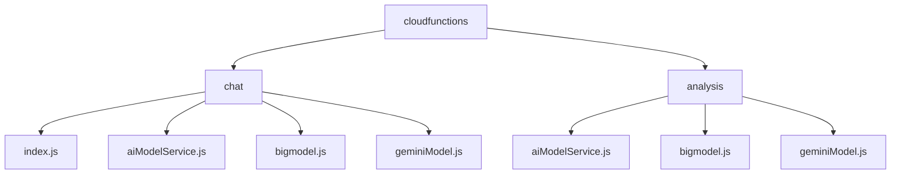
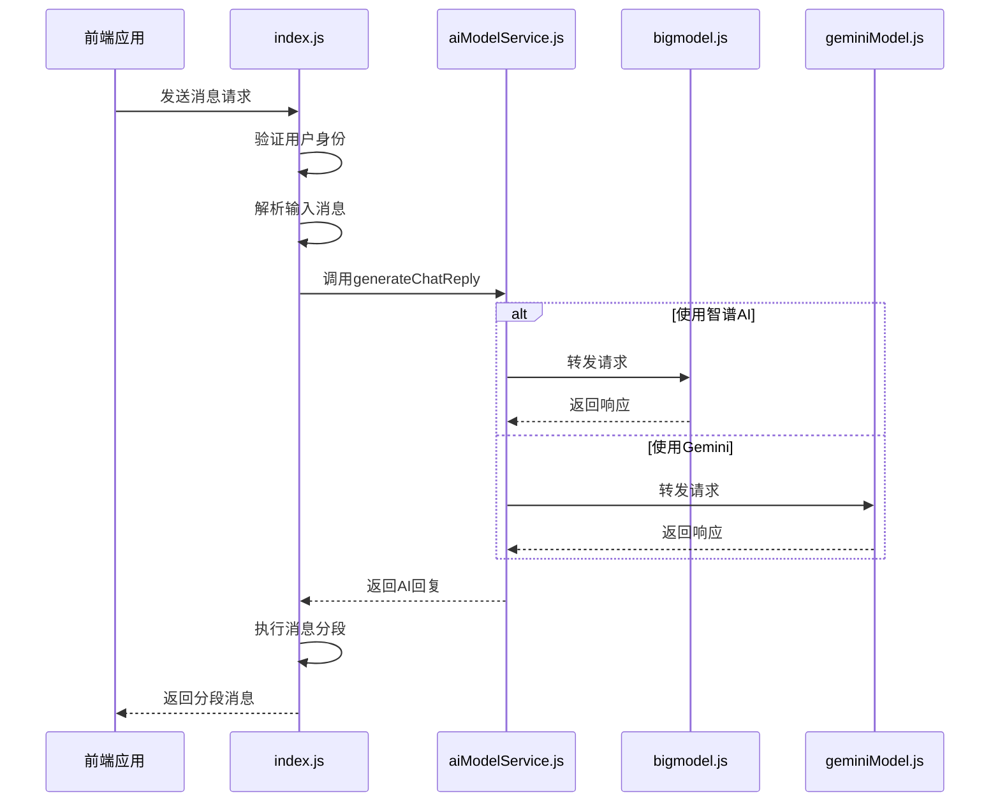
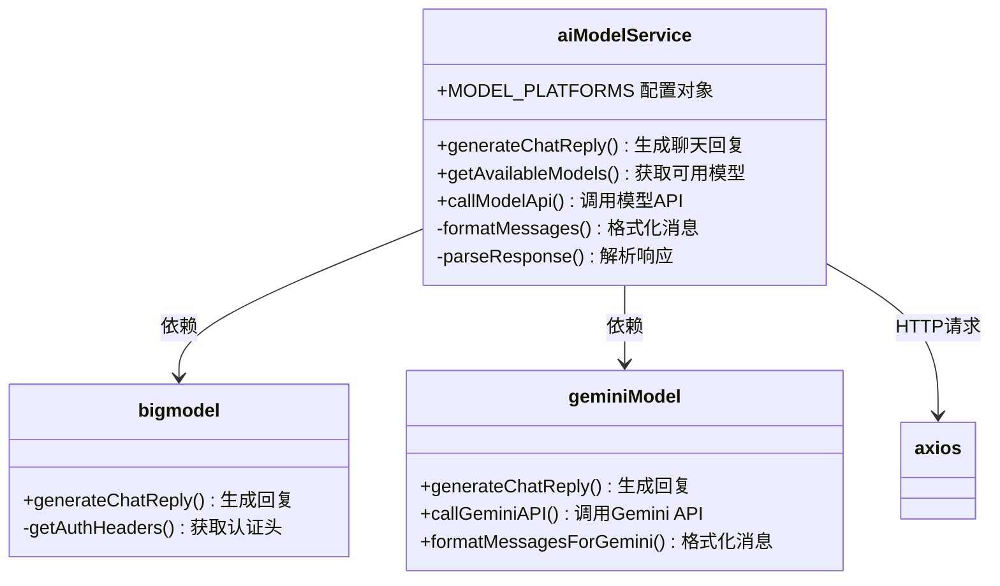
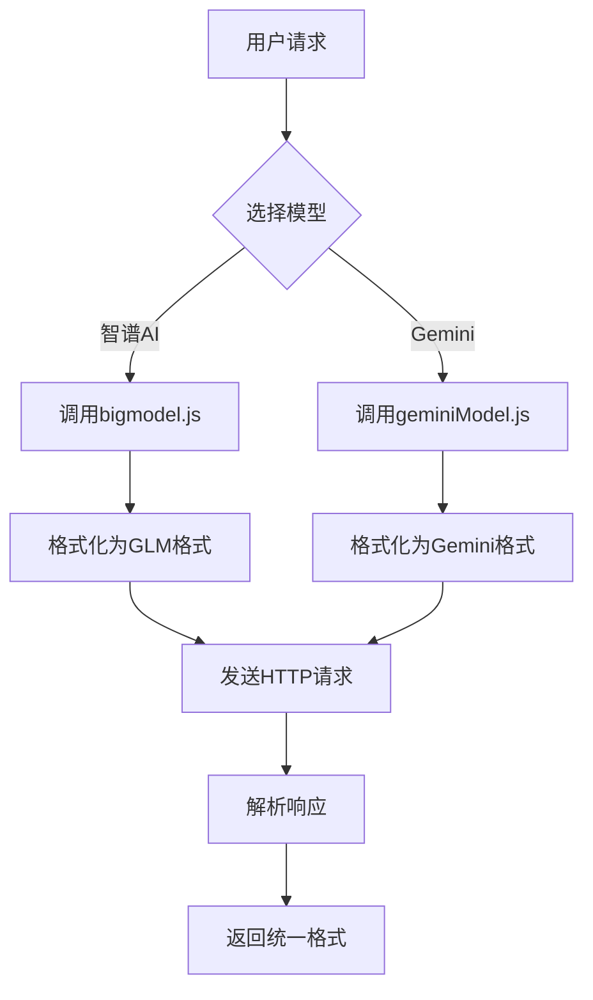
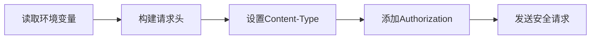
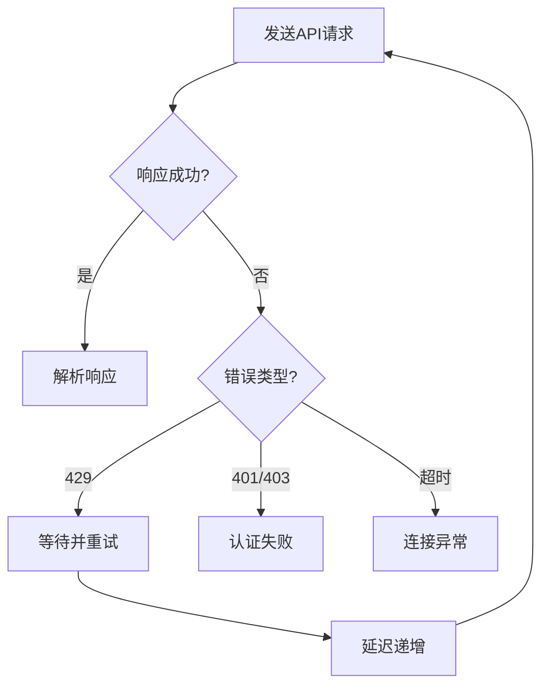
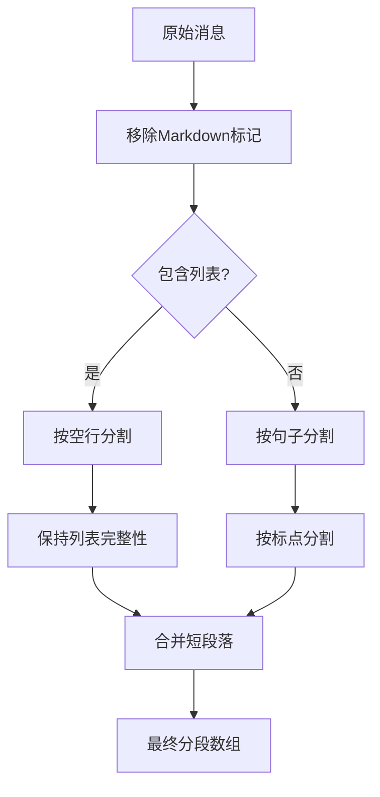
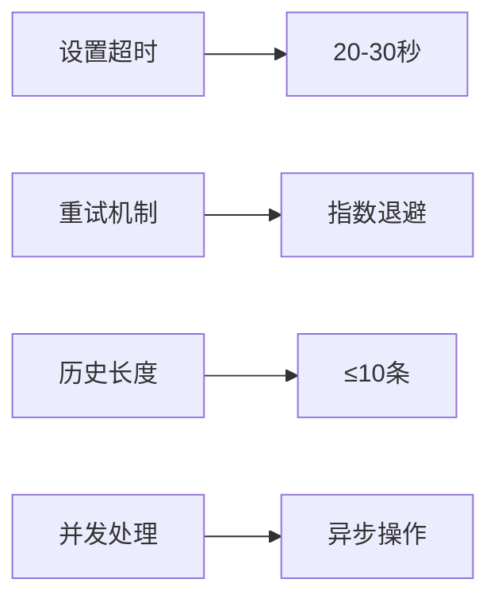
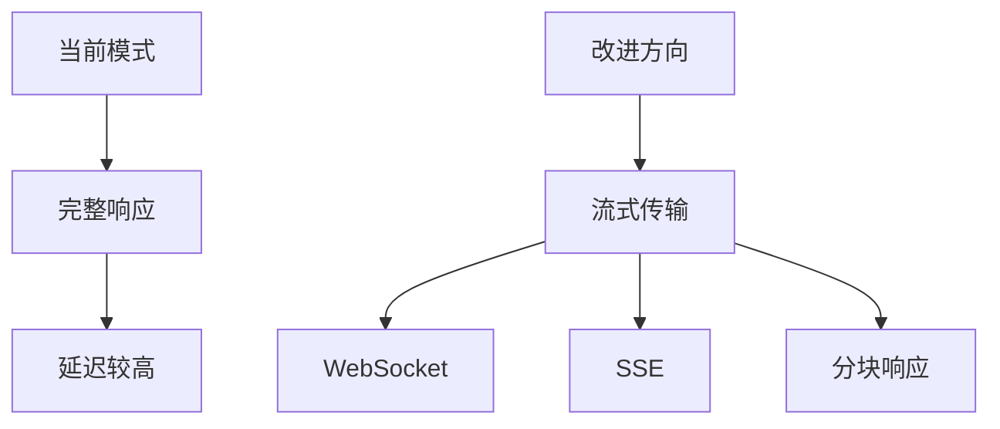

# 后端消息处理与AI响应生成

<cite>
**本文档引用文件**  
- [index.js](file://cloudfunctions/chat/index.js)
- [aiModelService.js](file://cloudfunctions/chat/aiModelService.js)
- [bigmodel.js](file://cloudfunctions/chat/bigmodel.js)
- [geminiModel.js](file://cloudfunctions/chat/geminiModel.js)
- [chat.md](file://doc/开发文档/cloudfunctions/chat.md)
- [analysis.md](file://doc/开发文档/cloudfunctions/analysis.md)
- [Gemini_API集成开发文档.md](file://doc/开发文档/Gemini_API集成开发文档.md)
- [统一AI模型服务设计文档.md](file://doc/开发文档/统一AI模型服务设计文档.md)
</cite>

## 目录
1. [项目结构](#项目结构)  
2. [核心组件](#核心组件)  
3. [消息处理流程](#消息处理流程)  
4. [AI模型服务架构](#ai模型服务架构)  
5. [第三方API调用机制](#第三方api调用机制)  
6. [安全过滤与格式化处理](#安全过滤与格式化处理)  
7. [性能优化与瓶颈分析](#性能优化与瓶颈分析)

## 项目结构

**图示来源**  
- [chat.md](file://doc/开发文档/cloudfunctions/chat.md)
- [analysis.md](file://doc/开发文档/cloudfunctions/analysis.md)

## 核心组件

本系统核心由四个主要模块构成：`index.js`作为请求入口，`aiModelService.js`提供统一模型服务，`bigmodel.js`集成智谱AI，`geminiModel.js`对接Google Gemini。这些组件共同实现了从用户请求接收到AI响应生成的完整闭环。

**组件来源**  
- [index.js](file://cloudfunctions/chat/index.js#L1-L1413)
- [aiModelService.js](file://cloudfunctions/chat/aiModelService.js#L1-L587)
- [bigmodel.js](file://cloudfunctions/chat/bigmodel.js#L1-L168)
- [geminiModel.js](file://cloudfunctions/chat/geminiModel.js#L1-L266)

## 消息处理流程

**图示来源**  
- [index.js](file://cloudfunctions/chat/index.js#L1000-L1200)
- [aiModelService.js](file://cloudfunctions/chat/aiModelService.js#L500-L550)

## AI模型服务架构

**图示来源**  
- [aiModelService.js](file://cloudfunctions/chat/aiModelService.js#L1-L587)
- [bigmodel.js](file://cloudfunctions/chat/bigmodel.js#L1-L168)
- [geminiModel.js](file://cloudfunctions/chat/geminiModel.js#L1-L266)

### 模型适配器模式

系统采用适配器模式实现多模型支持。`aiModelService.js`作为统一接口，将不同模型的调用方式标准化。通过`MODEL_PLATFORMS`配置对象定义各平台参数，`formatMessages`和`parseResponse`方法处理消息格式转换，实现了对智谱AI、Gemini等不同API的统一调用。

**图示来源**  
- [aiModelService.js](file://cloudfunctions/chat/aiModelService.js#L200-L400)
- [统一AI模型服务设计文档.md](file://doc/开发文档/统一AI模型服务设计文档.md)

## 第三方API调用机制

### 请求构造与认证

系统通过环境变量安全存储API密钥，避免硬编码风险。`getApiKey`函数从`process.env`读取密钥，`getAuthHeaders`方法构建认证头。所有请求均使用HTTPS协议，确保传输安全。

**代码来源**  
- [bigmodel.js](file://cloudfunctions/chat/bigmodel.js#L15-L30)
- [geminiModel.js](file://cloudfunctions/chat/geminiModel.js#L15-L30)

### 响应解析与错误重试

系统实现完善的错误处理机制。`callModelApi`函数捕获429（请求过多）等错误，采用指数退避策略自动重试。`parseResponse`方法统一解析不同平台的响应格式，确保上层业务逻辑的稳定性。

**代码来源**  
- [aiModelService.js](file://cloudfunctions/chat/aiModelService.js#L300-L400)
- [geminiModel.js](file://cloudfunctions/chat/geminiModel.js#L50-L100)

## 安全过滤与格式化处理

### 消息分段算法

系统采用多级分段策略，确保长回复的自然呈现。首先按空行分割自然段落，然后按句子分割，最后按次要标点分割。通过`splitMessage`函数实现智能分段，避免过度分割列表内容。

**代码来源**  
- [index.js](file://cloudfunctions/chat/index.js#L10-L100)

### 内容安全过滤

虽然当前文档未明确提及内容过滤机制，但系统通过以下方式保障内容安全：使用HTTPS加密传输、API密钥环境变量存储、输入参数验证、详细的错误日志记录。未来可扩展实现敏感词过滤、内容审核等功能。

## 性能优化与瓶颈分析

### 网络延迟优化

系统通过以下措施优化网络延迟：设置合理的API超时时间（20-30秒）、实现指数退避重试机制、使用axios进行HTTP请求、限制历史消息长度（最多10条）。这些策略有效应对了网络波动和API限流问题。

**代码来源**  
- [aiModelService.js](file://cloudfunctions/chat/aiModelService.js#L350-L380)
- [bigmodel.js](file://cloudfunctions/chat/bigmodel.js#L100-L120)

### 流式传输支持

当前系统暂未实现流式传输，所有响应均为完整接收后返回。这是主要的性能瓶颈点。未来可通过以下方式改进：使用WebSocket协议、实现SSE（Server-Sent Events）、在`callModelApi`中添加流式处理逻辑，从而支持打字机效果和实时响应。

**分析来源**  
- [统一AI模型服务设计文档.md](file://doc/开发文档/统一AI模型服务设计文档.md#未来扩展)
- [Gemini_API集成开发文档.md](file://doc/开发文档/Gemini_API集成开发文档.md)