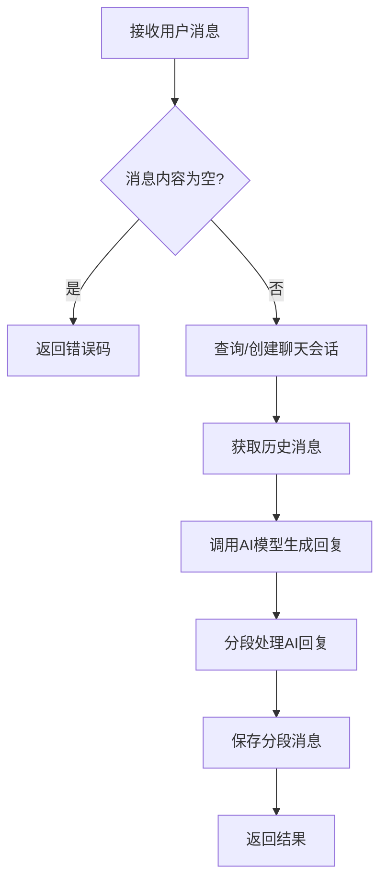
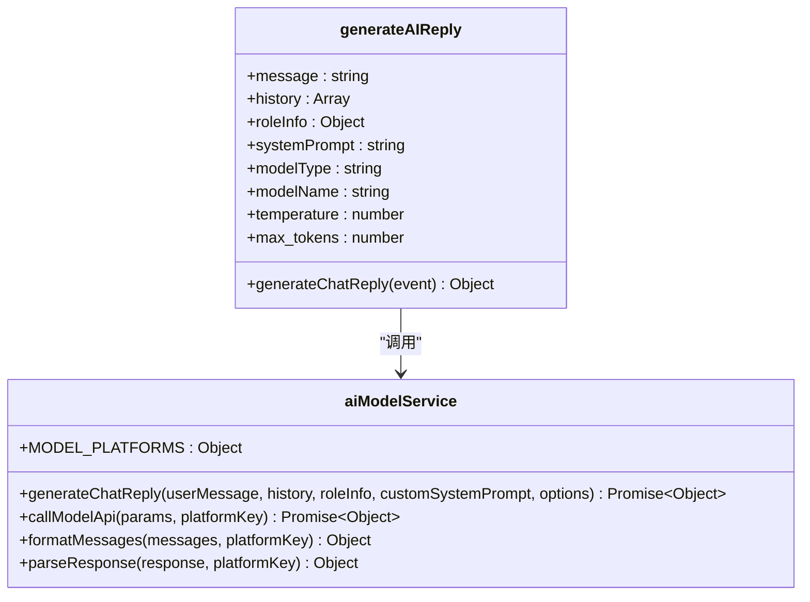

# 消息处理流程

<cite>
**本文档引用的文件**
- [index.js](file://cloudfunctions/chat/index.js)
- [aiModelService.js](file://cloudfunctions/chat/aiModelService.js)
- [roles/index.js](file://cloudfunctions/roles/index.js)
</cite>

## 目录
1. [消息处理流程](#消息处理流程)
2. [HTTP请求数据解析](#http请求数据解析)
3. [用户登录状态与权限验证](#用户登录状态与权限验证)
4. [聊天消息内容解析](#聊天消息内容解析)
5. [消息预处理流程](#消息预处理流程)
6. [AI模型服务参数组装](#ai模型服务参数组装)
7. [异常处理策略](#异常处理策略)
8. [性能监控埋点设计](#性能监控埋点设计)

## 消息处理流程

`chat`云函数是聊天功能的核心入口，负责处理用户发送的消息、生成AI回复、管理聊天会话和保存聊天记录。该函数通过`action`参数区分不同的子功能，主要包含`sendMessage`（发送消息）、`getChatHistory`（获取聊天历史）和`generateAIReply`（生成AI回复）三个核心功能。整个消息处理流程从接收前端HTTP请求开始，经过请求解析、安全校验、会话管理、AI回复生成、消息分段到最终的数据存储与返回，形成一个完整的闭环。

**Section sources**
- [index.js](file://cloudfunctions/chat/index.js#L0-L1413)

## HTTP请求数据解析

云函数通过`event`对象接收并解析来自前端的HTTP请求数据。`event`对象包含了所有前端传入的参数，云函数使用解构赋值的方式提取关键信息。在`sendMessage`子功能中，函数从`event`中提取`chatId`（聊天会话ID）、`roleId`（角色ID）、`content`（用户消息内容）、`modelType`（模型类型）、`modelName`（具体模型名称）和`modelParams`（模型参数）等核心参数。`modelParams`对象进一步解构出`temperature`（温度）、`maxTokens`（最大生成长度）等AI模型配置。云函数通过`cloud.getWXContext()`获取云开发上下文，从而获得用户的`OPENID`，这是识别用户身份的关键凭证。

**Section sources**
- [index.js](file://cloudfunctions/chat/index.js#L800-L879)

## 用户登录状态与权限验证

用户登录状态的验证通过微信云开发的`cloud.getWXContext()`方法实现。该方法返回的上下文对象包含`OPENID`字段，它是用户在当前小程序环境下的唯一身份标识。只要能成功获取`OPENID`，即认为用户已通过微信授权登录，处于已登录状态。权限验证主要体现在对聊天会话的访问控制上。当查询或创建聊天会话时，云函数会将`OPENID`作为查询条件之一，确保用户只能访问属于自己的聊天记录。例如，在查询现有会话时，会构建包含`roleId`和`OPENID`的查询条件，从而保证了数据的隔离性和安全性。

**Section sources**
- [index.js](file://cloudfunctions/chat/index.js#L800-L879)

## 聊天消息内容解析

前端传入的聊天消息内容、角色ID及会话上下文通过`event`对象进行解析。`content`字段是用户输入的原始文本内容。`roleId`用于标识用户正在与哪个AI角色对话，云函数会根据此ID调用`roles`云函数的`getRoleDetail`接口获取该角色的详细信息，特别是其`prompt`（系统提示词），这是AI角色人格和行为的基础。`chatId`代表当前的会话ID，如果为空，则表示这是一个新对话，云函数需要创建一个新的会话记录。会话上下文主要通过`history`参数传递，它是一个包含历史消息的数组，用于为AI模型提供对话背景，确保回复的连贯性。

**Section sources**
- [index.js](file://cloudfunctions/chat/index.js#L800-L879)
- [roles/index.js](file://cloudfunctions/roles/index.js#L200-L250)

## 消息预处理流程

消息预处理流程主要包含敏感词过滤、长度校验与格式标准化，但根据现有代码分析，这些功能的实现主要依赖于外部服务或在前端完成，云函数本身更侧重于业务逻辑。在`sendMessage`流程中，最直接的预处理是**长度校验**，通过检查`content`是否为空或仅包含空白字符来实现。**格式标准化**体现在对消息的处理上，例如在保存消息时，会自动添加`createTime`（创建时间）等标准化字段。虽然代码中没有直接的敏感词过滤逻辑，但`roles`云函数中的`promptGenerator`模块可能会在生成提示词时融入安全策略。消息的**分段处理**是另一个关键的预处理环节，`splitMessage`函数负责将AI生成的长回复拆分成多个自然的短消息，以模拟真实聊天的节奏。

**Diagram sources**
- [index.js](file://cloudfunctions/chat/index.js#L0-L1413)

**Section sources**
- [index.js](file://cloudfunctions/chat/index.js#L38-L164)

## AI模型服务参数组装

在消息转发至AI模型服务前，需要组装一系列参数。核心参数组装在`generateAIReply`函数中完成。首先，构建一个包含系统提示词（`systemPrompt`）的消息数组，该提示词优先使用角色的`prompt`，其次使用前端传入的`customSystemPrompt`。然后，将历史消息`history`和当前用户消息`message`按顺序添加到消息数组中，形成完整的对话上下文。模型参数方面，`platform`（平台）由`modelType`转换而来（如`gemini`转为`GEMINI`），`model`（模型名称）使用`modelName`或平台默认模型。温度`temperature`、最大生成长度`max_tokens`、`top_p`等参数均从`event`中获取并传递给`aiModelService.generateChatReply`方法。`aiModelService`模块负责将这些通用参数映射到不同AI平台（如Gemini、智谱AI）的特定API格式。

**Diagram sources**
- [index.js](file://cloudfunctions/chat/index.js#L589-L628)
- [aiModelService.js](file://cloudfunctions/chat/aiModelService.js#L458-L487)

**Section sources**
- [index.js](file://cloudfunctions/chat/index.js#L589-L628)
- [aiModelService.js](file://cloudfunctions/chat/aiModelService.js#L458-L487)

## 异常处理策略

云函数实现了全面的异常处理策略，确保系统的健壮性。**输入非法时的错误码返回**是第一道防线，例如，当`content`为空时，会立即返回`{ success: false, error: '消息内容不能为空' }`。**错误码规范**采用统一的JSON格式，包含`success`（布尔值）和`error`（错误信息字符串）字段。对于数据库操作，使用`.catch()`捕获查询和更新失败，并记录详细的错误日志。对于AI模型调用，`callModelApi`函数实现了重试机制，当遇到429错误（请求过多）时，会等待并指数级增加延迟后重试。同时，它还处理了超时、认证失败等网络异常，并将其转换为更友好的错误信息返回给前端。所有关键操作都包裹在`try...catch`块中，确保任何未捕获的异常都不会导致云函数崩溃。

**Section sources**
- [index.js](file://cloudfunctions/chat/index.js#L800-L1008)
- [aiModelService.js](file://cloudfunctions/chat/aiModelService.js#L300-L400)

## 性能监控埋点设计

性能监控埋点设计主要通过详细的日志输出来实现。在开发环境（`isDev = true`）下，云函数会在关键节点打印日志，形成一条清晰的调用链路。例如，在`sendMessage`函数开始时，会打印`执行 sendMessage 功能, 参数:`和`OPENID:`，这可以监控请求的入口。在查询数据库时，会打印`开始查询chats集合...`和`查询结果:`，用于监控数据库查询性能。在调用AI模型时，会打印`使用Google Gemini模型生成回复`和`发送请求到: ${url}`，用于监控外部API的调用情况。在消息分段后，会打印`分段后的AI回复:`，用于监控分段算法的输出。这些日志不仅用于调试，也可以通过云开发的日志服务进行收集和分析，从而评估系统的响应时间和性能瓶颈。

**Section sources**
- [index.js](file://cloudfunctions/chat/index.js#L800-L1008)
- [aiModelService.js](file://cloudfunctions/chat/aiModelService.js#L300-L400)