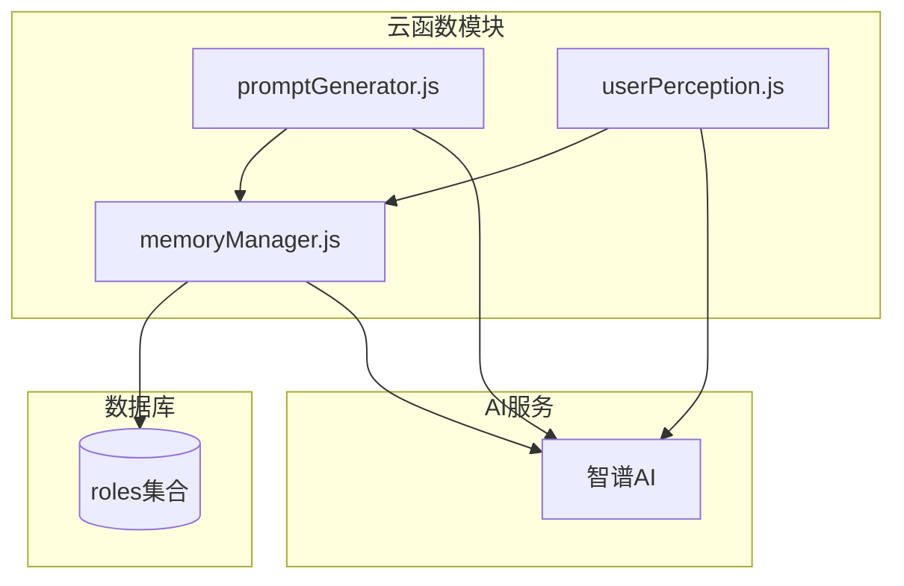
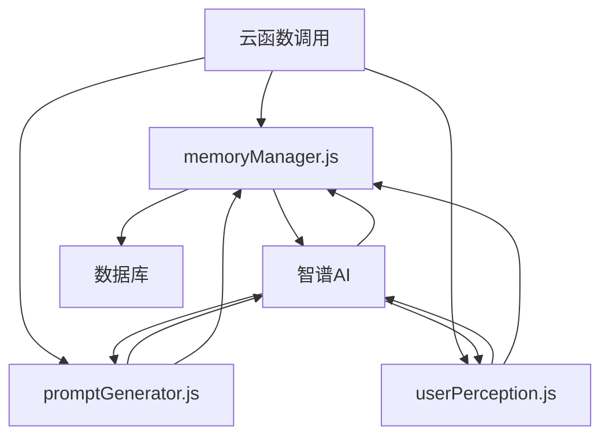
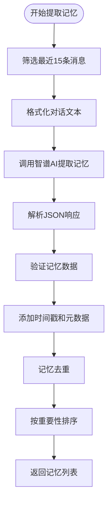
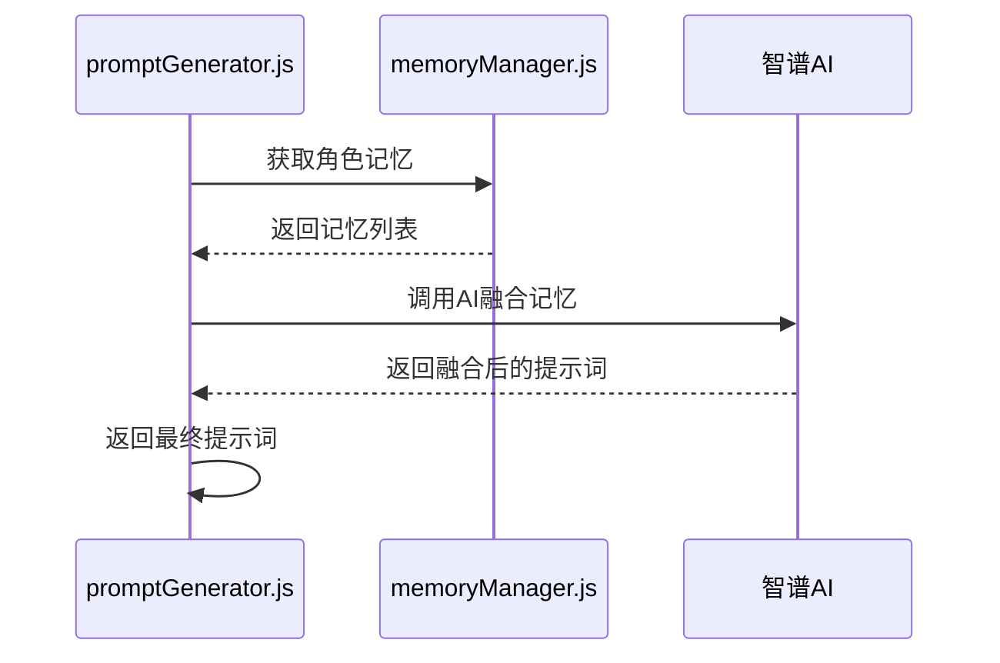
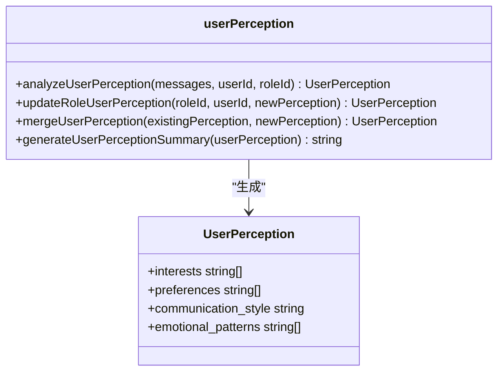
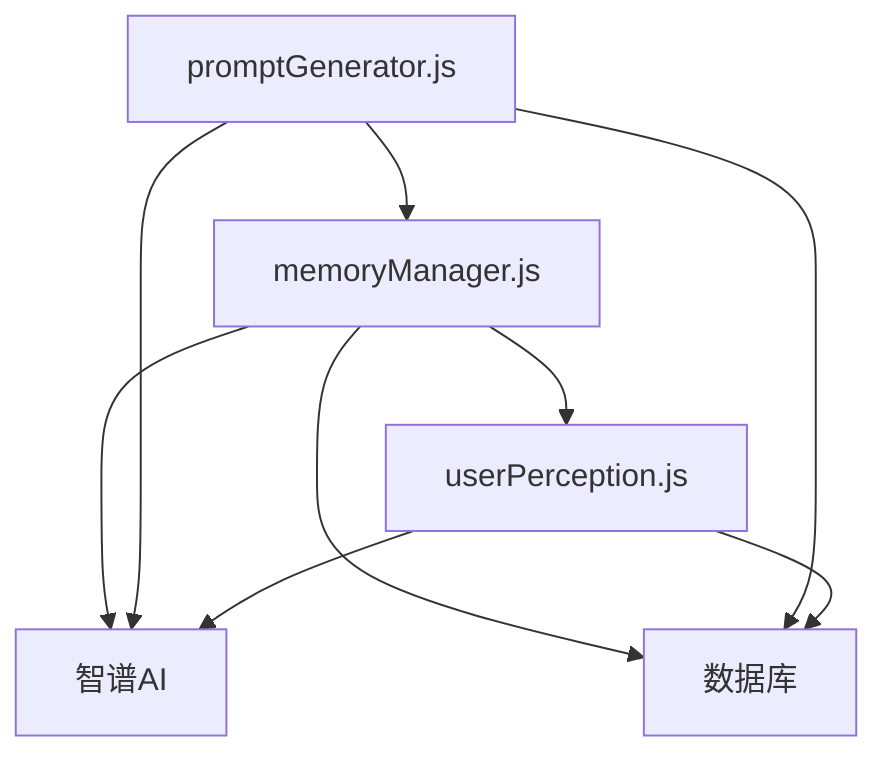

# 上下文记忆管理机制

<cite>
**本文档引用文件**  
- [memoryManager.js](file://cloudfunctions/roles/memoryManager.js)
- [promptGenerator.js](file://cloudfunctions/roles/promptGenerator.js)
- [userPerception.js](file://cloudfunctions/roles/userPerception.js)
</cite>

## 目录
1. [引言](#引言)
2. [项目结构](#项目结构)
3. [核心组件](#核心组件)
4. [架构概述](#架构概述)
5. [详细组件分析](#详细组件分析)
6. [依赖分析](#依赖分析)
7. [性能考虑](#性能考虑)
8. [故障排除指南](#故障排除指南)
9. [结论](#结论)

## 引言
本文档深入解析HeartChat项目中云函数端的上下文记忆管理机制。重点阐述`memoryManager.js`如何基于用户与角色维度维护长期对话记忆，包括记忆的存储结构设计、更新策略及上下文截断逻辑。同时说明其与`promptGenerator.js`的集成方式，以及`userPerception.js`如何从对话中提取用户性格特征并反馈至记忆系统。文档还涵盖记忆容量限制、性能优化与冷启动处理方案，并结合实际调用链路展示记忆读取与更新的完整流程。

## 项目结构
HeartChat项目的上下文记忆管理功能主要集中在`cloudfunctions/roles`目录下，由三个核心模块协同工作：`memoryManager.js`负责记忆的提取、存储与检索；`promptGenerator.js`负责将记忆信息注入提示词以实现个性化响应；`userPerception.js`负责从对话中提取用户画像并更新至角色记忆。

**图示来源**  
- [memoryManager.js](file://cloudfunctions/roles/memoryManager.js)
- [promptGenerator.js](file://cloudfunctions/roles/promptGenerator.js)
- [userPerception.js](file://cloudfunctions/roles/userPerception.js)

**本节来源**  
- [memoryManager.js](file://cloudfunctions/roles/memoryManager.js)
- [promptGenerator.js](file://cloudfunctions/roles/promptGenerator.js)
- [userPerception.js](file://cloudfunctions/roles/userPerception.js)

## 核心组件
`memoryManager.js`是上下文记忆管理的核心，负责从对话中提取重要信息作为记忆，并进行存储、更新和检索。`promptGenerator.js`负责生成角色提示词，并将记忆信息自然地融入其中。`userPerception.js`则专注于从用户对话中分析并提取用户画像，包括兴趣、偏好、沟通风格和情感模式。

**本节来源**  
- [memoryManager.js](file://cloudfunctions/roles/memoryManager.js#L1-L50)
- [promptGenerator.js](file://cloudfunctions/roles/promptGenerator.js#L1-L50)
- [userPerception.js](file://cloudfunctions/roles/userPerception.js#L1-L50)

## 架构概述
系统采用分层架构，上层为云函数接口，中层为业务逻辑处理，底层为数据库和AI服务。`memoryManager.js`作为核心协调者，调用`userPerception.js`获取用户画像，并将记忆信息提供给`promptGenerator.js`用于生成个性化提示词。所有模块均通过智谱AI进行自然语言处理，并将结果持久化到数据库中。

**图示来源**  
- [memoryManager.js](file://cloudfunctions/roles/memoryManager.js#L1-L20)
- [promptGenerator.js](file://cloudfunctions/roles/promptGenerator.js#L1-L20)
- [userPerception.js](file://cloudfunctions/roles/userPerception.js#L1-L20)

## 详细组件分析

### 记忆管理器分析
`memoryManager.js`模块实现了完整的记忆生命周期管理，包括提取、更新、合并和检索。

#### 记忆提取与更新
该模块通过`extractMemoriesFromChat`函数从最近的对话中提取重要信息。系统会分析最多15条最近的消息，重点关注用户个人信息、兴趣爱好、情感状态等，并通过智谱AI生成结构化的记忆条目，每条记忆包含内容、重要性评分、类别和上下文。

**图示来源**  
- [memoryManager.js](file://cloudfunctions/roles/memoryManager.js#L100-L250)

#### 记忆存储结构
记忆以数组形式存储在`roles`集合的`memories`字段中，每条记忆包含以下属性：
- `content`: 记忆内容（简洁的一句话）
- `importance`: 重要性评分（0-1）
- `category`: 类别（个人信息/兴趣爱好/情感状态等）
- `context`: 记忆的上下文或来源
- `timestamp`: 时间戳
- `created_at`: 创建时间
- `source`: 来源（chat/merged）

当记忆数量超过50条时，系统会自动进行合并处理，保留最重要的30条记忆，并对剩余记忆进行聚类合并。

**本节来源**  
- [memoryManager.js](file://cloudfunctions/roles/memoryManager.js#L300-L400)

### 提示词生成器分析
`promptGenerator.js`模块负责将角色信息和记忆融合成最终的AI提示词。

#### 记忆注入机制
该模块通过`generatePromptWithMemories`函数将记忆信息注入基础提示词。系统不会简单地在提示词末尾添加记忆列表，而是通过智谱AI将记忆内容自然地融入到提示词的相关部分，使角色能够在对话中自然地展现出对用户的了解。

**图示来源**  
- [promptGenerator.js](file://cloudfunctions/roles/promptGenerator.js#L150-L200)

### 用户感知分析
`userPerception.js`模块负责从对话中提取用户性格特征并反馈至记忆系统。

#### 用户画像提取
该模块通过`analyzeUserPerception`函数分析用户消息，提取用户的兴趣、偏好、沟通风格和情感模式。系统会过滤出用户发送的消息，合并成文本后调用智谱AI进行分析，返回结构化的用户画像数据。

**图示来源**  
- [userPerception.js](file://cloudfunctions/roles/userPerception.js#L50-L100)

## 依赖分析
各模块之间存在紧密的依赖关系。`promptGenerator.js`依赖`memoryManager.js`提供记忆信息，`memoryManager.js`依赖`userPerception.js`提供用户画像。所有模块都依赖智谱AI进行自然语言处理，并依赖数据库进行数据持久化。

**图示来源**  
- [memoryManager.js](file://cloudfunctions/roles/memoryManager.js)
- [promptGenerator.js](file://cloudfunctions/roles/promptGenerator.js)
- [userPerception.js](file://cloudfunctions/roles/userPerception.js)

**本节来源**  
- [memoryManager.js](file://cloudfunctions/roles/memoryManager.js#L1-L50)
- [promptGenerator.js](file://cloudfunctions/roles/promptGenerator.js#L1-L50)
- [userPerception.js](file://cloudfunctions/roles/userPerception.js#L1-L50)

## 性能考虑
系统在设计时充分考虑了性能优化。`memoryManager.js`在记忆检索时会先进行本地预过滤，减少需要评估的记忆数量。所有AI调用均使用`glm-4-flash`等快速模型，并设置了较低的温度值以获得更一致的结果。系统还实现了记忆合并机制，当记忆数量过多时自动进行聚类合并，保持记忆库的精简高效。

## 故障排除指南
当记忆管理功能出现问题时，可检查以下方面：
1. 确认`ZHIPU_API_KEY`环境变量已正确配置
2. 检查数据库连接是否正常
3. 查看云函数日志中的错误信息
4. 确认`roles`集合中存在对应角色数据
5. 检查AI调用的请求参数是否正确

**本节来源**  
- [memoryManager.js](file://cloudfunctions/roles/memoryManager.js#L800-L900)
- [promptGenerator.js](file://cloudfunctions/roles/promptGenerator.js#L300-L325)
- [userPerception.js](file://cloudfunctions/roles/userPerception.js#L250-L315)

## 结论
HeartChat的上下文记忆管理机制通过`memoryManager.js`、`promptGenerator.js`和`userPerception.js`三个模块的协同工作，实现了基于用户与角色维度的长期对话记忆管理。系统能够智能地提取、存储和利用对话记忆，通过将记忆信息自然地融入提示词，使角色能够展现出对用户的个性化了解，从而提供更加连贯和人性化的对话体验。