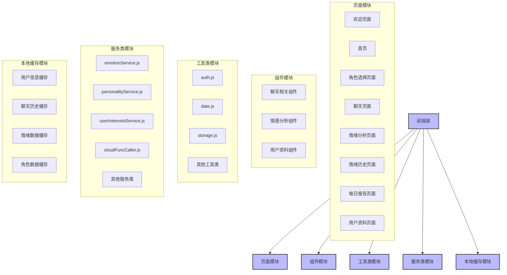
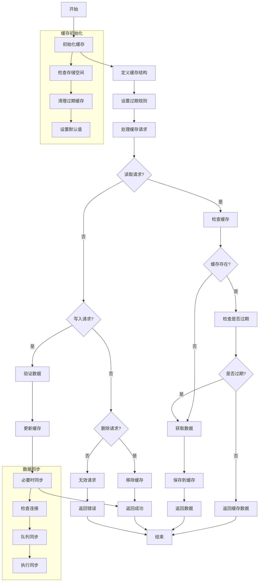
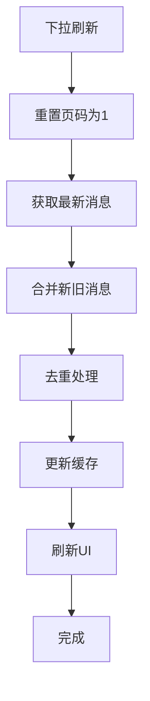
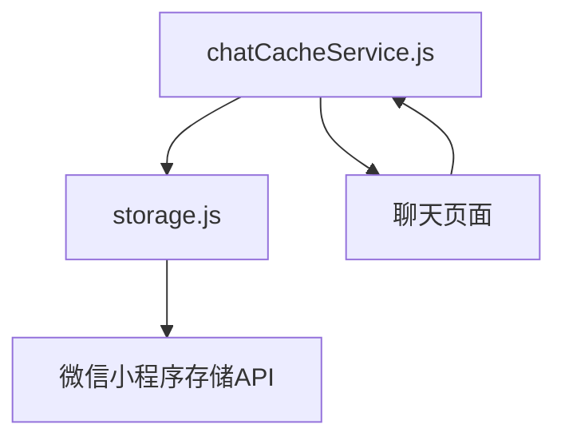

# 本地聊天缓存机制

<cite>
**本文档引用文件**  
- [chatCacheService.js](file://miniprogram/services/chatCacheService.js)
- [storage.js](file://miniprogram/utils/storage.js)
- [chat.js](file://miniprogram/packageChat/pages/chat/chat.js)
- [HeartChat技术实现流程图.md](file://doc/设计文档/流程图/HeartChat技术实现流程图.md)
- [聊天记录本地缓存与下拉加载功能说明.md](file://doc/使用文档/聊天记录本地缓存与下拉加载功能说明.md)
</cite>

## 目录
1. [引言](#引言)
2. [项目结构](#项目结构)
3. [核心组件](#核心组件)
4. [架构概述](#架构概述)
5. [详细组件分析](#详细组件分析)
6. [依赖分析](#依赖分析)
7. [性能考虑](#性能考虑)
8. [故障排除指南](#故障排除指南)
9. [结论](#结论)

## 引言
HeartChat微信小程序实现了高效的本地聊天缓存机制，支持离线访问、快速消息加载和下拉刷新功能。本系统通过`chatCacheService.js`封装缓存读写逻辑，利用`storage.js`进行数据序列化与持久化存储，确保用户在各种网络条件下都能获得流畅的聊天体验。

## 项目结构
HeartChat项目采用分层架构设计，将前端页面、组件、工具类和服务模块分离。聊天缓存功能主要位于`miniprogram/services`目录下的`chatCacheService.js`文件中，该服务依赖于`miniprogram/utils`目录下的`storage.js`工具类进行底层存储操作。



**图示来源**  
- [HeartChat系统架构图.md](file://doc/设计文档/流程图/HeartChat系统架构图.md)

**本节来源**  
- [HeartChat系统架构图.md](file://doc/设计文档/流程图/HeartChat系统架构图.md)

## 核心组件
本地聊天缓存机制的核心是`chatCacheService.js`，它提供了完整的缓存管理功能，包括消息保存、加载、更新和清理。该服务通过`storage.js`进行数据的序列化与持久化存储，实现了高效的数据访问和管理。

**本节来源**  
- [chatCacheService.js](file://miniprogram/services/chatCacheService.js)
- [storage.js](file://miniprogram/utils/storage.js)

## 架构概述
本地聊天缓存系统采用分层架构，上层为`chatCacheService.js`提供的业务逻辑封装，下层为`storage.js`提供的通用存储能力。这种设计实现了关注点分离，提高了代码的可维护性和可测试性。



**图示来源**  
- [HeartChat技术实现流程图.md](file://doc/设计文档/流程图/HeartChat技术实现流程图.md)

**本节来源**  
- [HeartChat技术实现流程图.md](file://doc/设计文档/流程图/HeartChat技术实现流程图.md)

## 详细组件分析
### chatCacheService.js 分析
`chatCacheService.js`是本地聊天缓存的核心服务，提供了完整的缓存管理功能。

#### 缓存结构设计
聊天记录缓存采用分层结构设计，包含基本信息和消息数据两部分：

```javascript
{
  "chat_记录ID": {
    "basic": {
      "roleId": "角色ID",
      "roleName": "角色名称",
      "lastUpdateTime": 1650000000000,
      "messageCount": 120
    },
    "messages": {
      "latest": [/* 最新的20条消息 */],
      "pages": {
        "page_1": [/* 第1页消息，按时间倒序 */],
        "page_2": [/* 第2页消息 */]
        // 更多页...
      }
    }
  }
  // 更多聊天记录...
}
```

#### 缓存键设计策略
缓存键采用`chat_`前缀加聊天ID的命名策略，确保键名的唯一性和可读性。这种设计便于缓存的管理和清理，同时也支持按用户ID和角色ID组织数据。

#### 消息分页与排序
系统采用分页机制管理历史消息，每页固定20条消息。消息按时间戳排序，确保最新的消息显示在最前面。对于分段消息，系统会根据分段索引进行排序，保证消息的完整性和顺序。

#### 下拉刷新处理流程
下拉刷新时，系统会执行以下流程：
1. 重置当前页码为1
2. 从服务器获取最新消息
3. 合并新旧消息，避免重复
4. 更新缓存
5. 刷新UI显示



**图示来源**  
- [聊天记录本地缓存与下拉加载功能说明.md](file://doc/使用文档/聊天记录本地缓存与下拉加载功能说明.md)

#### 核心操作示例
##### 缓存初始化
```javascript
// 初始化缓存服务
const chatCacheService = require('../../../services/chatCacheService');
```

##### 消息写入
```javascript
// 保存消息到缓存
chatCacheService.saveMessagesToCache(
  chatId, 
  messages, 
  true,  // 是否为最新消息
  null,  // 页码（可选）
  roleInfo // 角色信息（可选）
);
```

##### 批量读取
```javascript
// 从缓存加载最新消息
const cachedMessages = chatCacheService.loadMessagesFromCache(chatId);
if (cachedMessages && cachedMessages.length > 0) {
  this.setData({ 
    messages: cachedMessages,
    loading: false
  });
  this.scrollToBottom();
}
```

**本节来源**  
- [chatCacheService.js](file://miniprogram/services/chatCacheService.js)
- [聊天记录本地缓存与下拉加载功能说明.md](file://doc/使用文档/聊天记录本地缓存与下拉加载功能说明.md)

### storage.js 分析
`storage.js`提供了通用的存储能力，支持数据的序列化、反序列化和过期管理。

#### 数据序列化与持久化
`storage.js`通过`wx.setStorageSync`和`wx.getStorageSync`实现数据的持久化存储。存储的数据包含数据本身和过期时间，支持自动过期清理。

#### 过期策略
系统支持可配置的过期时间，数据在存储时可以指定过期时间（毫秒）。当获取数据时，系统会检查数据是否过期，如果过期则自动清理并返回默认值。

#### 异常处理
`storage.js`对所有存储操作进行了异常处理，确保在存储失败时不会导致应用崩溃。同时提供了存储信息查询功能，便于监控存储使用情况。

**本节来源**  
- [storage.js](file://miniprogram/utils/storage.js)

## 依赖分析
本地聊天缓存系统依赖于微信小程序的本地存储API，通过`wx.getStorageSync`和`wx.setStorageSync`进行数据的读写操作。`chatCacheService.js`依赖于`storage.js`提供的通用存储能力，实现了更高层次的业务逻辑封装。



**图示来源**  
- [chat.js](file://miniprogram/packageChat/pages/chat/chat.js)
- [chatCacheService.js](file://miniprogram/services/chatCacheService.js)
- [storage.js](file://miniprogram/utils/storage.js)

**本节来源**  
- [chat.js](file://miniprogram/packageChat/pages/chat/chat.js)
- [chatCacheService.js](file://miniprogram/services/chatCacheService.js)
- [storage.js](file://miniprogram/utils/storage.js)

## 性能考虑
### 缓存容量控制
系统设置了最大缓存聊天数限制（MAX_CACHED_CHATS = 10），当缓存的聊天记录超过限制时，会自动清理最旧的聊天记录，确保缓存不会无限增长。

### 内存优化
系统采用分页存储策略，只在内存中保留最新的20条消息，历史消息按页存储。这种设计有效控制了内存使用，避免了大量数据加载导致的性能问题。

### 数据一致性保障
系统通过以下措施保障数据一致性：
1. 所有缓存操作都包含异常处理
2. 在存储失败时尝试清理旧数据后重试
3. 提供数据去重机制，避免重复消息
4. 定期清理过期和无效数据

**本节来源**  
- [chatCacheService.js](file://miniprogram/services/chatCacheService.js)

## 故障排除指南
### 常见问题
1. **缓存保存失败**：可能是存储空间不足，系统会自动清理旧数据后重试。
2. **缓存读取为空**：检查聊天ID是否正确，确认缓存中是否存在对应数据。
3. **消息重复显示**：检查消息ID是否唯一，确认去重逻辑是否正确执行。

### 调试建议
1. 开启开发模式（isDev = true）查看详细日志
2. 使用`getAllCachedChats()`检查当前缓存状态
3. 通过`wx.getStorageInfoSync()`监控存储使用情况

**本节来源**  
- [chatCacheService.js](file://miniprogram/services/chatCacheService.js)

## 结论
HeartChat的本地聊天缓存机制通过`chatCacheService.js`和`storage.js`的协同工作，实现了高效、可靠的聊天记录管理。系统支持离线访问、快速加载和下拉刷新等功能，为用户提供了流畅的聊天体验。通过合理的缓存结构设计、分页机制和容量控制，系统在性能和用户体验之间取得了良好平衡。