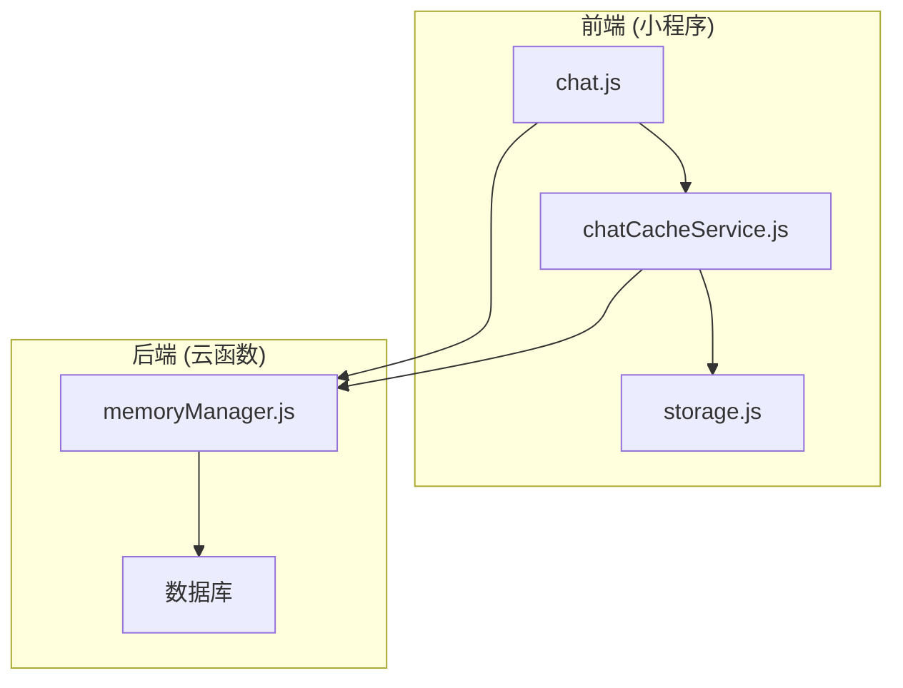
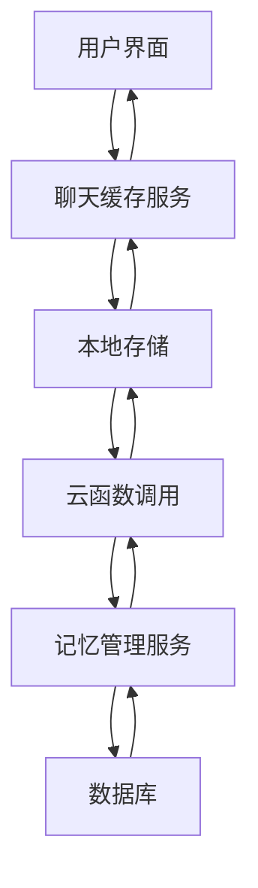
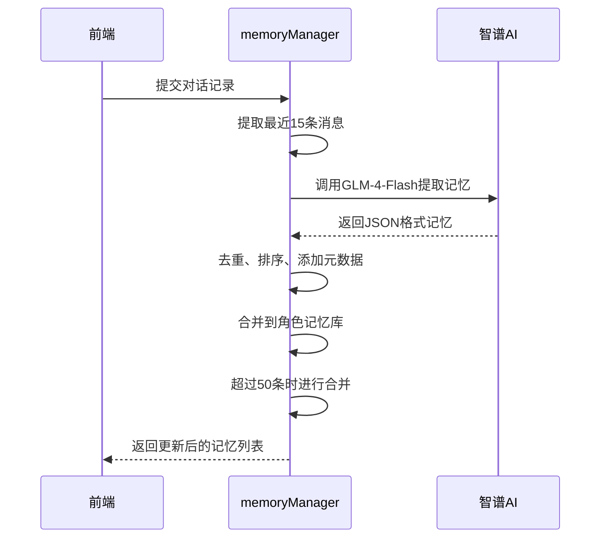
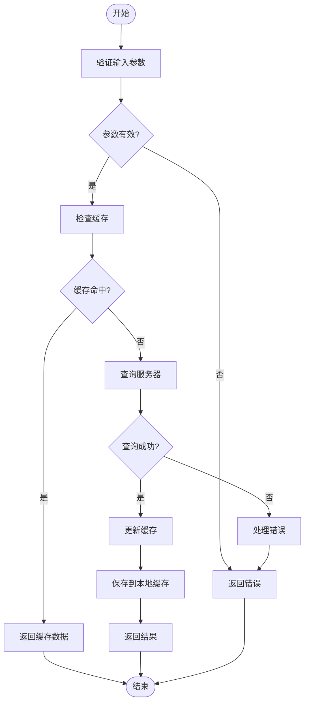
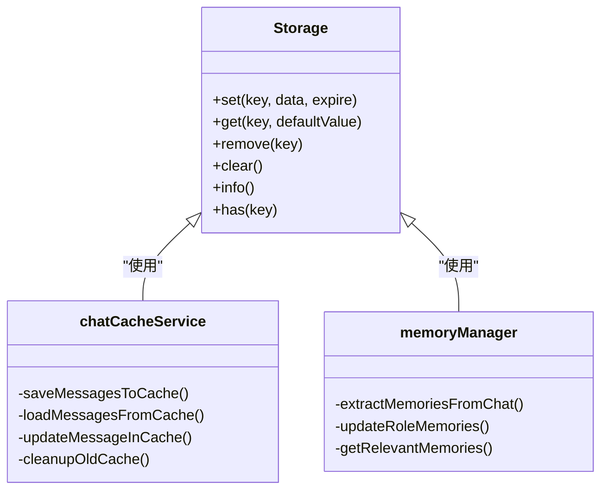
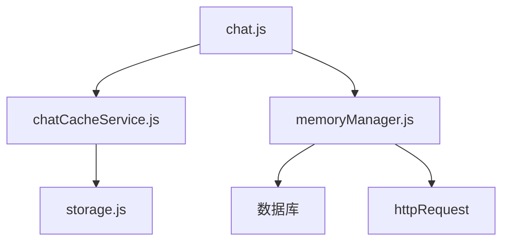

# 聊天状态与上下文管理

<cite>
**本文档引用的文件**
- [memoryManager.js](file://cloudfunctions/roles/memoryManager.js)
- [chatCacheService.js](file://miniprogram/services/chatCacheService.js)
- [storage.js](file://miniprogram/utils/storage.js)
- [chat.js](file://miniprogram/packageChat/pages/chat/chat.js)
</cite>

## 目录
1. [引言](#引言)
2. [项目结构](#项目结构)
3. [核心组件](#核心组件)
4. [架构概述](#架构概述)
5. [详细组件分析](#详细组件分析)
6. [依赖分析](#依赖分析)
7. [性能考虑](#性能考虑)
8. [故障排除指南](#故障排除指南)
9. [结论](#结论)

## 引言
本文档全面阐述了聊天过程中的状态管理机制，重点分析了如何在云函数端维护用户与角色的对话记忆以实现上下文连贯性，以及前端如何通过本地缓存支持离线访问和快速加载。文档详细说明了下拉刷新加载历史消息的实现逻辑，包括分页查询、时间戳排序与数据合并策略，并深入探讨了缓存失效策略、数据一致性保障及内存占用优化建议。

## 项目结构
本项目采用前后端分离架构，前端为微信小程序（miniprogram），后端为云函数（cloudfunctions）。聊天状态管理相关的核心文件分布在不同目录中：云函数端的记忆管理逻辑位于`cloudfunctions/roles/memoryManager.js`，前端的聊天缓存服务位于`miniprogram/services/chatCacheService.js`，通用的存储工具在`miniprogram/utils/storage.js`，而聊天页面的业务逻辑则在`miniprogram/packageChat/pages/chat/chat.js`中实现。

**图示来源**
- [memoryManager.js](file://cloudfunctions/roles/memoryManager.js#L1-L20)
- [chatCacheService.js](file://miniprogram/services/chatCacheService.js#L1-L20)
- [storage.js](file://miniprogram/utils/storage.js#L1-L20)
- [chat.js](file://miniprogram/packageChat/pages/chat/chat.js#L1-L20)

**章节来源**
- [memoryManager.js](file://cloudfunctions/roles/memoryManager.js#L1-L50)
- [chatCacheService.js](file://miniprogram/services/chatCacheService.js#L1-L50)
- [storage.js](file://miniprogram/utils/storage.js#L1-L50)
- [chat.js](file://miniprogram/packageChat/pages/chat/chat.js#L1-L50)

## 核心组件
系统的核心状态管理由三个关键组件构成：`memoryManager.js`负责在云端维护角色的长期记忆，`chatCacheService.js`在前端实现聊天记录的本地缓存，`storage.js`提供统一的缓存序列化与持久化接口。这些组件协同工作，确保了聊天体验的流畅性和上下文的连贯性。

**章节来源**
- [memoryManager.js](file://cloudfunctions/roles/memoryManager.js#L25-L100)
- [chatCacheService.js](file://miniprogram/services/chatCacheService.js#L15-L80)
- [storage.js](file://miniprogram/utils/storage.js#L10-L50)

## 架构概述
系统采用分层架构，前端负责用户交互和本地状态管理，后端负责业务逻辑和持久化存储。聊天状态管理贯穿整个架构：前端通过`chatCacheService`与`storage`实现快速响应和离线支持，后端通过`memoryManager`利用AI技术提取和维护对话记忆。两者通过云函数调用进行数据同步，形成了一个完整的状态管理闭环。

**图示来源**
- [memoryManager.js](file://cloudfunctions/roles/memoryManager.js#L10-L50)
- [chatCacheService.js](file://miniprogram/services/chatCacheService.js#L20-L40)
- [storage.js](file://miniprogram/utils/storage.js#L5-L15)
- [chat.js](file://miniprogram/packageChat/pages/chat/chat.js#L50-L100)

## 详细组件分析

### 记忆管理服务分析
`memoryManager.js`是云函数端的核心组件，负责维护角色的长期记忆。它通过调用智谱AI接口，从最近的对话中提取重要信息，形成结构化的记忆条目。这些记忆条目包含内容、重要性评分、类别和上下文等元数据，帮助角色在未来的对话中更好地理解和服务用户。

#### 记忆提取与更新流程

**图示来源**
- [memoryManager.js](file://cloudfunctions/roles/memoryManager.js#L15-L45)

**章节来源**
- [memoryManager.js](file://cloudfunctions/roles/memoryManager.js#L1-L100)

### 聊天缓存服务分析
`chatCacheService.js`是前端的核心服务，负责聊天记录的本地缓存管理。它实现了分页缓存策略，将最新消息和历史页面分开存储，支持快速加载和下拉刷新。服务还包含了缓存清理机制，当缓存数量超过限制时，会自动清理最旧的聊天记录。

#### 缓存读写操作流程

**图示来源**
- [chatCacheService.js](file://miniprogram/services/chatCacheService.js#L45-L120)

**章节来源**
- [chatCacheService.js](file://miniprogram/services/chatCacheService.js#L1-L100)

### 存储工具分析
`storage.js`提供了一个封装的本地存储类，支持带过期时间的缓存。它在微信小程序的`wx.setStorageSync`和`wx.getStorageSync`基础上增加了过期检查和异常处理，为上层服务提供了更可靠的存储接口。

#### 缓存序列化与持久化

**图示来源**
- [storage.js](file://miniprogram/utils/storage.js#L5-L20)
- [chatCacheService.js](file://miniprogram/services/chatCacheService.js#L10-L30)

**章节来源**
- [storage.js](file://miniprogram/utils/storage.js#L1-L50)

## 依赖分析
各组件之间存在明确的依赖关系：`chat.js`页面直接依赖`chatCacheService`和`memoryManager`；`chatCacheService`依赖`storage.js`提供的基础存储能力；`memoryManager`依赖云数据库和HTTP请求服务。这种分层依赖结构确保了代码的可维护性和可测试性。

**图示来源**
- [chat.js](file://miniprogram/packageChat/pages/chat/chat.js#L10-L30)
- [chatCacheService.js](file://miniprogram/services/chatCacheService.js#L5-L15)
- [memoryManager.js](file://cloudfunctions/roles/memoryManager.js#L5-L15)

**章节来源**
- [chat.js](file://miniprogram/packageChat/pages/chat/chat.js#L1-L50)
- [chatCacheService.js](file://miniprogram/services/chatCacheService.js#L1-L50)
- [memoryManager.js](file://cloudfunctions/roles/memoryManager.js#L1-L50)

## 性能考虑
系统在性能方面进行了多项优化：使用`glm-4-flash`模型进行快速记忆提取，减少AI调用延迟；前端缓存采用分页策略，避免一次性加载过多数据；缓存清理机制防止本地存储溢出。此外，记忆提取设置了定时器，避免过于频繁的AI调用，平衡了性能和功能需求。

## 故障排除指南
常见问题包括缓存读取失败、记忆提取超时和下拉刷新无响应。对于缓存问题，可检查`storage.js`的异常处理日志；对于AI调用问题，需确认环境变量`ZHIPU_API_KEY`是否正确配置；对于刷新问题，应检查`chat.js`中的分页逻辑和服务器响应。

**章节来源**
- [storage.js](file://miniprogram/utils/storage.js#L10-L50)
- [memoryManager.js](file://cloudfunctions/roles/memoryManager.js#L10-L50)
- [chat.js](file://miniprogram/packageChat/pages/chat/chat.js#L10-L50)

## 结论
本文档详细分析了聊天状态与上下文管理的实现机制。通过前后端协同工作，系统实现了高效的记忆管理和流畅的用户体验。`memoryManager.js`利用AI技术维护长期记忆，`chatCacheService.js`确保了前端的快速响应，`storage.js`提供了可靠的持久化支持。这些组件共同构成了一个健壮的状态管理系统，为智能聊天应用提供了坚实的基础。