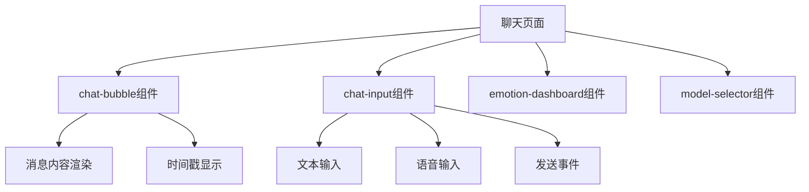
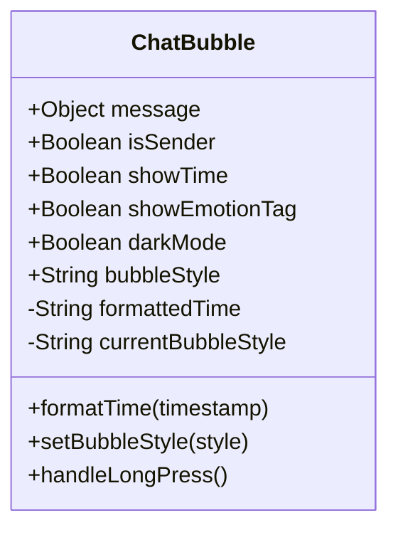
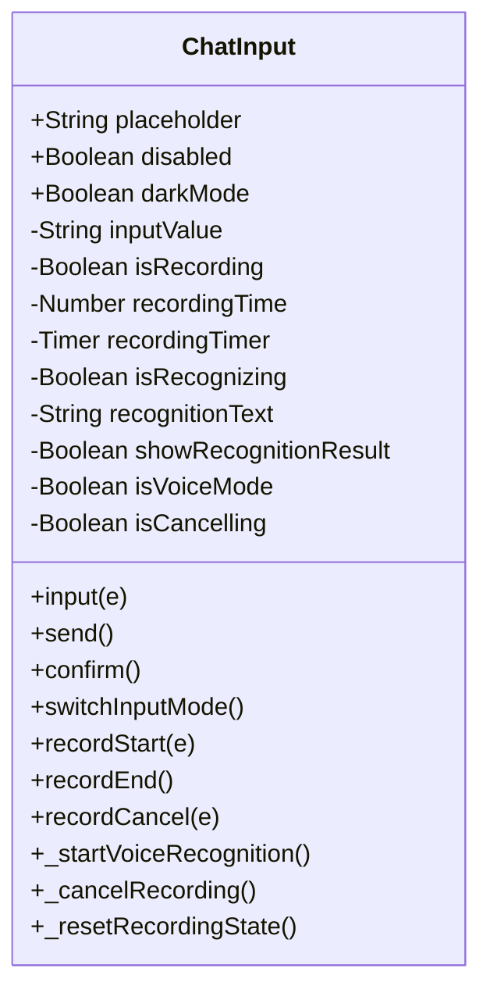

# 聊天界面与用户交互

<cite>
**本文档引用文件**  
- [chat.js](file://miniprogram/packageChat/pages/chat/chat.js)
- [chat.json](file://miniprogram/packageChat/pages/chat/chat.json)
- [chat-bubble/index.js](file://miniprogram/packageChat/components/chat-bubble/index.js)
- [chat-bubble/index.json](file://miniprogram/packageChat/components/chat-bubble/index.json)
- [chat-input/index.js](file://miniprogram/packageChat/components/chat-input/index.js)
- [chat-input/index.json](file://miniprogram/packageChat/components/chat-input/index.json)
</cite>

## 目录
1. [简介](#简介)
2. [页面结构与组件布局](#页面结构与组件布局)
3. [核心组件分析](#核心组件分析)
4. [消息分段输出机制](#消息分段输出机制)
5. [键盘与输入优化](#键盘与输入优化)
6. [用户体验改进措施](#用户体验改进措施)
7. [与后端服务的交互](#与后端服务的交互)
8. [结论](#结论)

## 简介
本项目中的聊天界面采用微信小程序原生框架实现，通过WXML、WXSS与JavaScript三者协同工作，构建了一个支持文本输入、语音识别、情绪分析与模型切换的智能对话系统。该界面以模块化组件设计为核心，分离了消息气泡(chat-bubble)与输入框(chat-input)的功能逻辑，提升了代码可维护性与复用性。

## 页面结构与组件布局

**图示来源**  
- [chat.json](file://miniprogram/packageChat/pages/chat/chat.json#L1-L11)

**本节来源**  
- [chat.json](file://miniprogram/packageChat/pages/chat/chat.json#L1-L11)

## 核心组件分析

### chat-bubble 消息气泡组件

该组件负责渲染单条消息内容，支持区分发送者类型、显示时间戳、情绪标签及暗夜模式适配。

**图示来源**  
- [chat-bubble/index.js](file://miniprogram/packageChat/components/chat-bubble/index.js#L1-L147)

**本节来源**  
- [chat-bubble/index.js](file://miniprogram/packageChat/components/chat-bubble/index.js#L1-L147)

### chat-input 输入组件

该组件封装了文本与语音双模式输入功能，提供输入监听、发送触发、语音录制与取消逻辑。

**图示来源**  
- [chat-input/index.js](file://miniprogram/packageChat/components/chat-input/index.js#L1-L591)

**本节来源**  
- [chat-input/index.js](file://miniprogram/packageChat/components/chat-input/index.js#L1-L591)

## 消息分段输出机制

为实现长回复内容的流畅加载与显示，系统在前端采用分段消息处理机制。当AI返回长文本时，后端将其切分为多个`segment`片段，每个片段作为独立消息存储，并标记`isSegment: true`和`originalMessageId`。

前端在加载历史消息时，通过`processMessages`方法对消息进行预处理：

1. 按时间戳排序所有消息
2. 将具有相同`originalMessageId`的分段消息归组
3. 按`segmentIndex`重新排序各组内消息
4. 合并为完整语义内容并渲染

此机制确保即使网络延迟或AI响应缓慢，用户也能逐步看到回复内容，提升交互感知流畅度。

**本节来源**  
- [chat.js](file://miniprogram/packageChat/pages/chat/chat.js#L700-L799)

## 键盘与输入优化

### 键盘高度监听
页面在`onLoad`阶段调用`watchKeyboard()`方法监听键盘状态变化，实时获取`keyboardHeight`并更新UI布局，避免输入框被遮挡。

### 输入框聚焦行为
`chat-input`组件通过`onFocus`与`onBlur`事件向父页面传递焦点状态，触发页面滚动调整。结合`wx.nextTick`与`scrollTo`方法，在输入框聚焦后自动滚动至可视区域。

### 语音输入滑动取消
语音录制支持两种取消方式：
- **上滑取消**：触摸移动距离超过阈值（默认30px）进入取消状态
- **滑出按钮区域取消**：手指滑出语音按钮范围即标记为取消

取消时提供震动反馈(`vibrateShort`)，增强操作确认感。

**本节来源**  
- [chat-input/index.js](file://miniprogram/packageChat/components/chat-input/index.js#L300-L500)
- [chat.js](file://miniprogram/packageChat/pages/chat/chat.js#L100-L150)

## 用户体验改进措施

### 消息长按操作
用户可长按任意消息气泡，弹出操作菜单支持“复制”与“删除”功能：
- 复制：调用`wx.setClipboardData`将内容写入剪贴板
- 删除：触发`delete`事件，由父页面处理删除逻辑

### 自动滚动与位置恢复
- 新消息发送或接收后自动调用`scrollToBottom()`滚动到底部
- 加载更多历史消息时，先记录当前滚动位置，加载完成后调用`restoreScrollPosition()`恢复，保证阅读连续性

### 输入模式切换
支持文本与语音双模式切换，通过`switchInputMode()`方法控制`isVoiceMode`状态，动态调整UI布局。

### 暗夜模式适配
组件接收`darkMode`属性，结合全局`app.globalData.darkMode`实现主题同步，确保视觉一致性。

**本节来源**  
- [chat-bubble/index.js](file://miniprogram/packageChat/components/chat-bubble/index.js#L120-L140)
- [chat-input/index.js](file://miniprogram/packageChat/components/chat-input/index.js#L200-L250)
- [chat.js](file://miniprogram/packageChat/pages/chat/chat.js#L500-L600)

## 与后端服务的交互

### 页面加载时
1. 调用`loadRoleInfo()` → `roles`云函数获取角色详情
2. 调用`checkChatExists()` → `chat`云函数检查是否存在历史会话
3. 若存在，则调用`getChatHistory()`加载消息历史

### 发送消息时
1. 用户点击发送 → 触发`send`事件
2. 页面调用`sendMessage()` → `chat`云函数
3. 云函数调用AI模型（Gemini/BigModel）生成回复
4. 回复分段返回 → 前端逐步渲染

### 情绪分析
根据`autoEmotionAnalysis`设置，每次对话后可自动调用`emotion`云函数进行情绪分析，并展示`emotion-dashboard`。

**本节来源**  
- [chat.js](file://miniprogram/packageChat/pages/chat/chat.js#L200-L400)

## 结论
本聊天界面通过组件化设计实现了高内聚、低耦合的UI结构。`chat-bubble`与`chat-input`组件职责清晰，易于维护与扩展。消息分段机制有效提升了长内容加载体验，键盘监听与滚动控制保障了输入流畅性。整体交互设计充分考虑用户操作习惯，结合语音、文本、情绪分析等多模态能力，构建了自然、智能的对话体验。