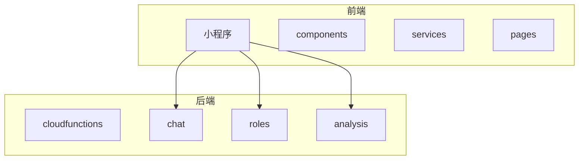
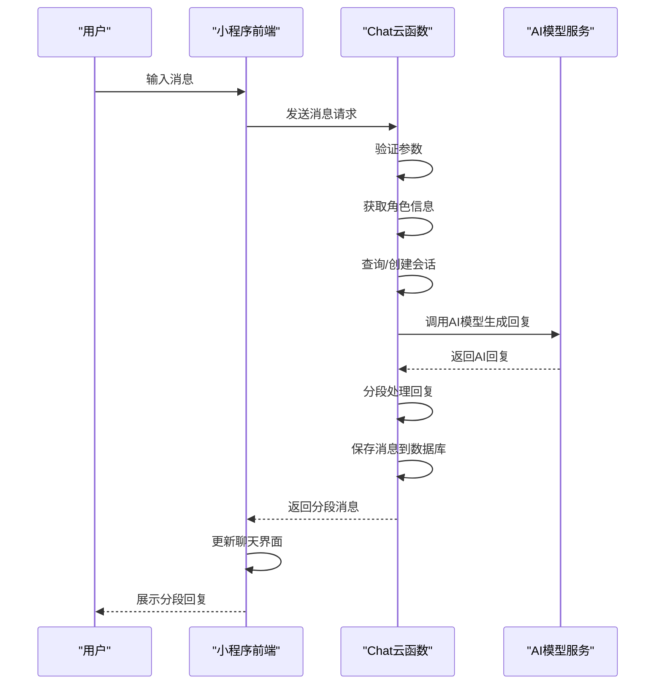
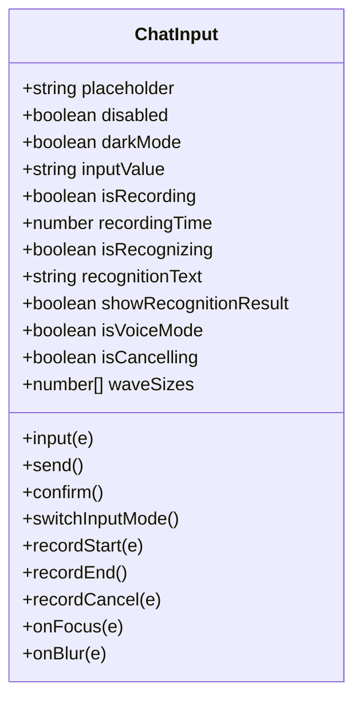
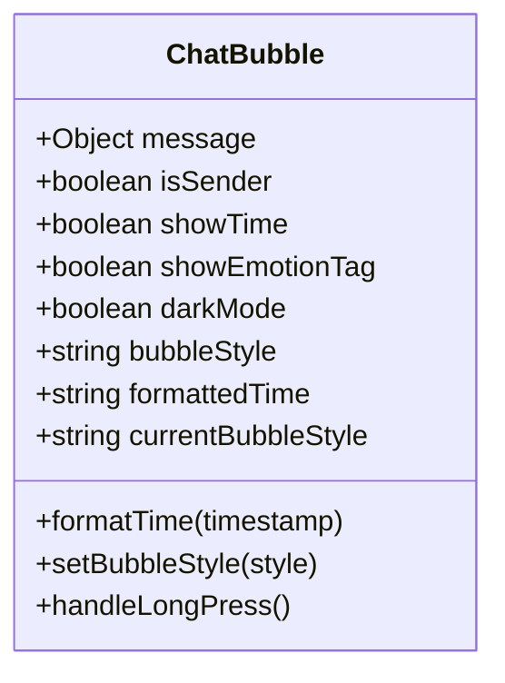
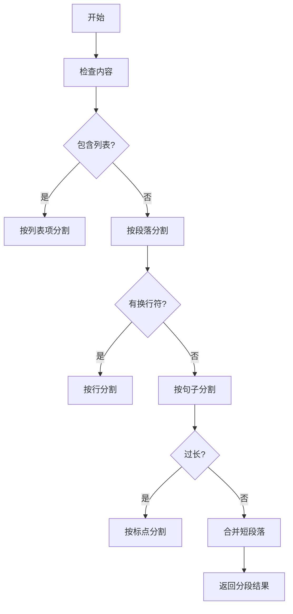
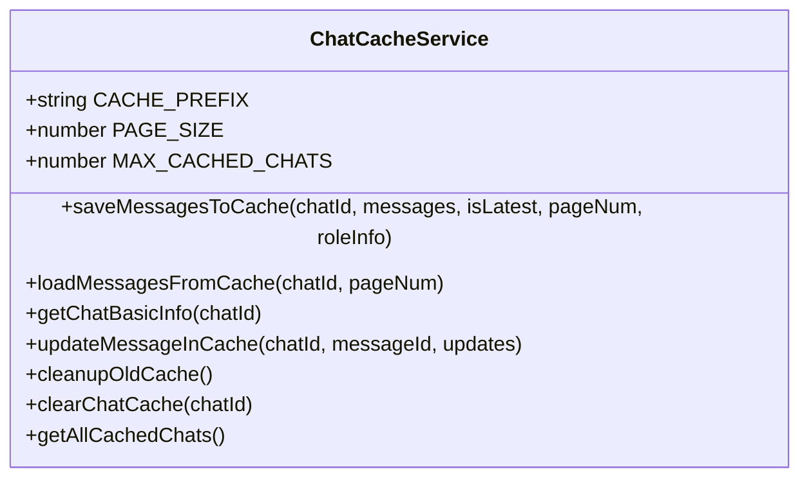
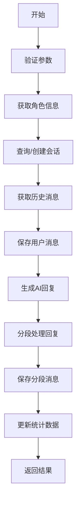
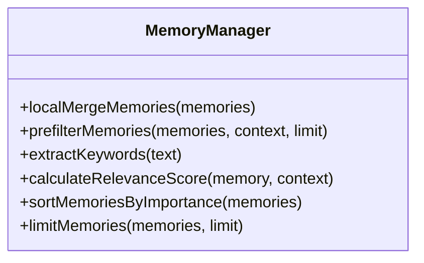
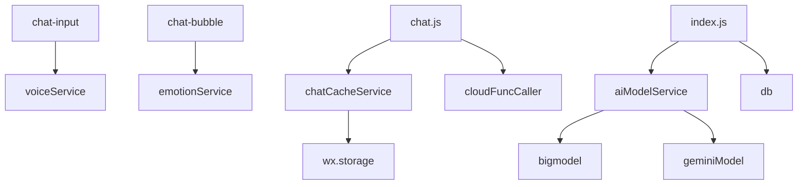

# 聊天系统功能

<cite>
**本文档引用的文件**
- [chat-input/index.js](file://miniprogram/packageChat/components/chat-input/index.js)
- [chat-bubble/index.js](file://miniprogram/packageChat/components/chat-bubble/index.js)
- [chat.js](file://miniprogram/packageChat/pages/chat/chat.js)
- [chatCacheService.js](file://miniprogram/services/chatCacheService.js)
- [index.js](file://cloudfunctions/chat/index.js)
- [memoryManager.js](file://cloudfunctions/roles/memoryManager.js)
</cite>

## 目录
1. [介绍](#介绍)
2. [项目结构](#项目结构)
3. [核心组件](#核心组件)
4. [架构概述](#架构概述)
5. [详细组件分析](#详细组件分析)
6. [依赖分析](#依赖分析)
7. [性能考虑](#性能考虑)
8. [故障排除指南](#故障排除指南)
9. [结论](#结论)

## 介绍
本项目实现了一个完整的聊天系统，支持用户与AI角色的实时对话。系统采用前后端分离架构，前端通过微信小程序实现用户界面，后端通过云函数处理业务逻辑。系统支持消息分段输出、本地缓存、下拉加载等功能，提供流畅的聊天体验。角色记忆机制确保对话上下文连贯性，多模型支持提供灵活的AI回复生成能力。

## 项目结构
项目采用模块化设计，分为前端小程序和后端云函数两大部分。前端包含聊天页面、组件和服务模块，后端包含多个云函数处理不同业务逻辑。

**图表来源**
- [miniprogram](file://miniprogram)
- [cloudfunctions](file://cloudfunctions)

## 核心组件
系统核心组件包括聊天输入组件、聊天气泡组件、聊天缓存服务和云函数。聊天输入组件负责接收用户输入，聊天气泡组件展示对话历史，聊天缓存服务管理本地消息存储，云函数处理消息路由和AI回复生成。

**章节来源**
- [chat-input/index.js](file://miniprogram/packageChat/components/chat-input/index.js)
- [chat-bubble/index.js](file://miniprogram/packageChat/components/chat-bubble/index.js)
- [chatCacheService.js](file://miniprogram/services/chatCacheService.js)
- [index.js](file://cloudfunctions/chat/index.js)

## 架构概述
系统采用典型的客户端-服务器架构，前端小程序作为客户端，云函数作为服务器端。用户通过聊天输入组件发送消息，消息通过云函数路由到AI模型生成回复，回复通过分段策略处理后返回前端展示。

**图表来源**
- [index.js](file://cloudfunctions/chat/index.js)
- [chat.js](file://miniprogram/packageChat/pages/chat/chat.js)

## 详细组件分析

### 聊天输入组件分析
聊天输入组件提供文本和语音两种输入模式，支持实时消息发送。组件包含输入框、发送按钮和语音输入功能，通过事件触发机制与父组件通信。

**图表来源**
- [chat-input/index.js](file://miniprogram/packageChat/components/chat-input/index.js)

### 聊天气泡组件分析
聊天气泡组件负责展示单条消息内容，支持时间戳显示、情绪标签和不同样式。组件根据消息发送者类型区分用户和AI消息，提供长按复制和删除功能。

**图表来源**
- [chat-bubble/index.js](file://miniprogram/packageChat/components/chat-bubble/index.js)

### 消息分段输出分析
消息分段输出功能将AI的长回复拆分为多个短消息，模拟真实聊天节奏。分段策略优先按自然段落分割，其次按句子分割，最后按次要标点分割。

**图表来源**
- [index.js](file://cloudfunctions/chat/index.js#L62-L250)

### 聊天记录本地缓存分析
聊天记录本地缓存服务提供消息的本地存储和读取功能，支持分页加载和缓存清理。缓存结构包含基本信息和消息列表，支持最新消息和历史页面的分别存储。

**图表来源**
- [chatCacheService.js](file://miniprogram/services/chatCacheService.js)

### 云函数处理流程分析
聊天云函数处理用户消息的核心流程，包括参数验证、角色信息获取、会话管理、AI回复生成和消息持久化。函数支持多种AI模型和自定义系统提示词。

**图表来源**
- [index.js](file://cloudfunctions/chat/index.js)

### 角色记忆机制分析
角色记忆管理器通过提取和合并记忆来维持对话上下文连贯性。记忆按重要性排序，支持本地合并和预过滤，确保最重要的记忆被优先使用。

**图表来源**
- [memoryManager.js](file://cloudfunctions/roles/memoryManager.js)

## 依赖分析
系统各组件之间存在明确的依赖关系，前端组件依赖服务模块，服务模块依赖云函数，云函数依赖数据库和AI模型服务。

**图表来源**
- [chat-input/index.js](file://miniprogram/packageChat/components/chat-input/index.js)
- [chat-bubble/index.js](file://miniprogram/packageChat/components/chat-bubble/index.js)
- [chat.js](file://miniprogram/packageChat/pages/chat/chat.js)
- [chatCacheService.js](file://miniprogram/services/chatCacheService.js)
- [index.js](file://cloudfunctions/chat/index.js)

## 性能考虑
为优化系统性能，建议采取以下措施：减少云函数调用延迟、优化数据库查询、合理设置消息分段策略、控制本地缓存大小。通过异步处理和批量操作提高响应速度，使用缓存策略减少重复请求。

**章节来源**
- [index.js](file://cloudfunctions/chat/index.js#L201-L207)
- [chatCacheService.js](file://miniprogram/services/chatCacheService.js#L10-L15)

## 故障排除指南
常见问题包括消息发送失败、AI回复延迟、缓存数据不一致等。检查网络连接、验证云函数配置、清理本地缓存通常可以解决大部分问题。对于AI回复问题，检查模型API密钥和配额限制。

**章节来源**
- [index.js](file://cloudfunctions/chat/index.js#L38-L70)
- [chat.js](file://miniprogram/packageChat/pages/chat/chat.js#L866-L915)

## 结论
本聊天系统实现了完整的对话功能，通过消息分段输出和本地缓存提供流畅的用户体验。角色记忆机制确保了对话的上下文连贯性，多模型支持提供了灵活的AI回复能力。系统架构清晰，组件职责明确，便于维护和扩展。