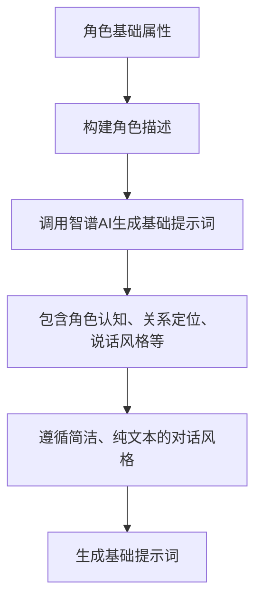
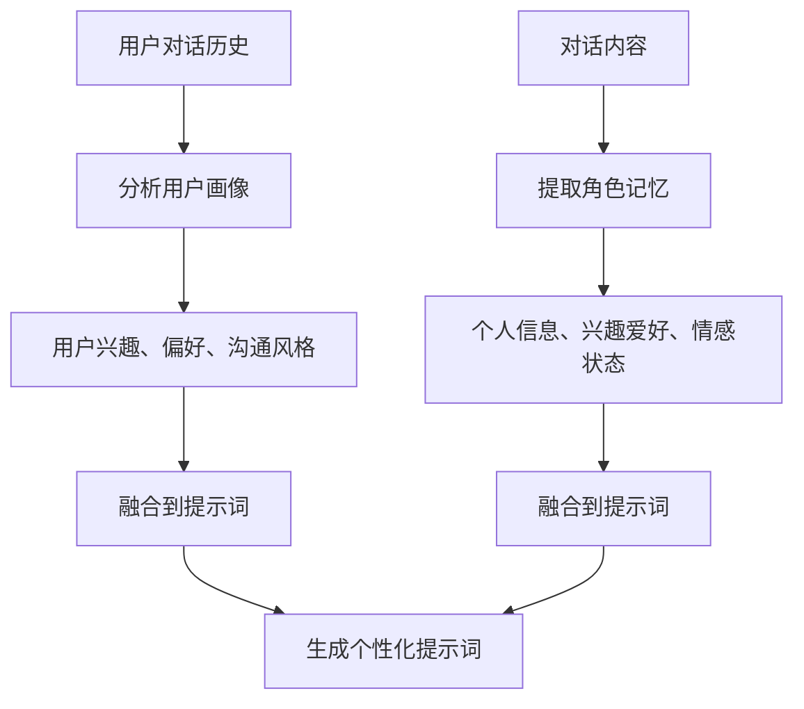
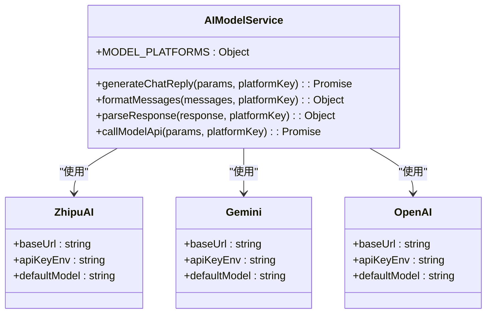

# 提示词生成

<cite>
**本文档引用的文件**   
- [promptGenerator.js](file://cloudfunctions/roles/promptGenerator.js)
- [userPerception.js](file://cloudfunctions/roles/userPerception.js)
- [memoryManager.js](file://cloudfunctions/roles/memoryManager.js)
- [aiModelService.js](file://cloudfunctions/chat/aiModelService.js)
- [geminiModel.js](file://cloudfunctions/chat/geminiModel.js)
- [bigmodel.js](file://cloudfunctions/analysis/bigmodel.js)
- [index.js](file://cloudfunctions/roles/index.js)
</cite>

## 目录
1. [引言](#引言)
2. [核心组件](#核心组件)
3. [提示词结构设计原则](#提示词结构设计原则)
4. [用户感知数据融合](#用户感知数据融合)
5. [AI模型适配处理](#ai模型适配处理)
6. [提示词优化技巧与调试方法](#提示词优化技巧与调试方法)
7. [结论](#结论)

## 引言
本项目中的提示词生成系统是实现个性化AI对话的核心机制。该系统通过`promptGenerator.js`模块，基于角色基础属性、用户交互历史和用户画像数据，动态构建高质量的AI提示词模板。系统采用分层构建策略，首先生成基础角色提示词，然后逐步融合记忆信息和用户感知数据，最终形成能够体现角色个性、记忆能力和用户理解的完整提示词。该机制支持多种AI模型（Gemini、智谱AI等），并通过统一的AI模型服务接口进行调用，确保了系统的灵活性和可扩展性。

## 核心组件

`promptGenerator.js`模块是提示词生成系统的核心，它通过调用智谱AI（Zhipu AI）的GLM-4模型，根据角色信息动态生成基础提示词，并支持将角色记忆和用户画像信息融合到提示词中。该模块提供了三个主要功能：`generateBasePrompt`用于生成基础角色提示词，`generatePromptWithMemories`用于将角色记忆融入提示词，`generatePromptWithUserPerception`用于将用户画像信息融入提示词。这些功能共同构成了一个分层的提示词构建流程，确保生成的提示词既符合角色设定，又能体现个性化交互特征。

**Section sources**
- [promptGenerator.js](file://cloudfunctions/roles/promptGenerator.js#L1-L325)

## 提示词结构设计原则

提示词的结构设计遵循一系列核心原则，以确保生成的AI回复既符合角色设定，又能实现自然流畅的对话。首先，系统通过`generateBasePrompt`函数，根据角色的姓名、关系、年龄、性别、背景故事、教育背景、职业、爱好、性格特点、说话方式和情感倾向等属性，构建一个详细的角色描述。然后，该描述被作为输入，通过智谱AI的GLM-4模型生成一个结构化的提示词。这个提示词包含了角色的自我认知、与用户的关系定位、说话风格指导、应避免的行为、情感回应策略、了解用户兴趣的方法以及对话风格指导。特别地，对话风格被设计为模仿真实手机聊天，要求每条消息简短（1-2句话），避免长句和复杂句式，并且绝对不使用Markdown语法，从而营造出自然、即时的聊天体验。

**Diagram sources **
- [promptGenerator.js](file://cloudfunctions/roles/promptGenerator.js#L50-L100)

**Section sources**
- [promptGenerator.js](file://cloudfunctions/roles/promptGenerator.js#L50-L150)

## 用户感知数据融合

系统通过`userPerception`模块和`memoryManager`模块，实现了对用户感知数据的深度融合。`userPerception`模块负责从用户的对话历史中分析并提取用户的兴趣、偏好、沟通风格和情感模式，形成用户画像。当`generatePromptWithUserPerception`函数被调用时，它会将当前的用户画像信息与基础提示词结合，通过智谱AI的GLM-4-Flash模型，将这些信息自然地融入到角色的提示词中，使角色能够根据用户的兴趣和偏好进行互动。同时，`memoryManager`模块负责从对话中提取重要信息作为角色记忆，并通过`generatePromptWithMemories`函数将这些记忆融入提示词。该过程不仅将记忆简单地添加到提示词末尾，而是通过AI分析，将记忆内容自然地整合到提示词的相关部分，例如添加“当用户提到X时，你应该记得Y并做出相应回应”的行为指导，从而使角色表现得更加个性化和连贯。

**Diagram sources **
- [userPerception.js](file://cloudfunctions/roles/userPerception.js#L1-L315)
- [memoryManager.js](file://cloudfunctions/roles/memoryManager.js#L1-L799)

**Section sources**
- [promptGenerator.js](file://cloudfunctions/roles/promptGenerator.js#L150-L325)
- [userPerception.js](file://cloudfunctions/roles/userPerception.js#L1-L315)
- [memoryManager.js](file://cloudfunctions/roles/memoryManager.js#L1-L799)

## AI模型适配处理

为了支持多种AI模型，系统设计了统一的AI模型服务接口。`aiModelService.js`模块定义了`MODEL_PLATFORMS`配置对象，包含了智谱AI、Google Gemini、OpenAI、Crond API、DeepSeek AI、Grok和Claude等多个平台的配置信息，如API基础URL、环境变量名、默认模型和认证方式。该模块提供了`formatMessages`和`parseResponse`函数，用于将消息格式化为特定平台所需的格式，并解析不同平台返回的响应。例如，Gemini模型需要将消息转换为包含`role`和`parts`的特殊格式，而其他模型则使用标准的OpenAI格式。`chatCompletion`函数作为统一的调用入口，根据指定的平台键名，自动选择正确的配置、格式化消息并解析响应，从而实现了对不同AI模型的无缝适配。

**Diagram sources **
- [aiModelService.js](file://cloudfunctions/chat/aiModelService.js#L1-L587)
- [geminiModel.js](file://cloudfunctions/chat/geminiModel.js#L1-L266)
- [bigmodel.js](file://cloudfunctions/analysis/bigmodel.js#L1-L705)

**Section sources**
- [aiModelService.js](file://cloudfunctions/chat/aiModelService.js#L1-L587)
- [geminiModel.js](file://cloudfunctions/chat/geminiModel.js#L1-L266)
- [bigmodel.js](file://cloudfunctions/analysis/bigmodel.js#L1-L705)

## 提示词优化技巧与调试方法

在提示词生成和系统调试过程中，可以采用以下技巧来优化效果和排查问题。首先，确保所有环境变量（如`ZHIPU_API_KEY`、`GEMINI_API_KEY`）都已正确配置，这是调用AI模型的前提。其次，可以通过调整`temperature`参数来控制AI回复的创造性，较低的值（如0.3）会产生更确定和一致的回复，而较高的值（如0.7）则会产生更多样化和创造性的回复。在调试时，应检查日志输出，特别是`console.log`语句，以跟踪提示词生成、记忆提取和用户画像分析的每一步。如果AI调用失败，系统提供了后备方案，例如在`generatePromptWithMemories`函数中，如果AI调用失败，会尝试使用`localMergeMemoriesWithPrompt`进行本地融合。此外，可以通过`index.js`中的`generateRolePrompt`入口函数，传入`roleId`和`currentContext`来测试整个提示词生成流程，观察最终生成的提示词是否符合预期。

**Section sources**
- [promptGenerator.js](file://cloudfunctions/roles/promptGenerator.js#L1-L325)
- [index.js](file://cloudfunctions/roles/index.js#L1-L759)

## 结论
本提示词生成系统通过一个分层、动态的构建流程，成功实现了高度个性化的AI角色对话。系统以角色基础属性为核心，通过调用智谱AI等大模型，生成符合角色设定的基础提示词。在此基础上，系统创新性地融合了从用户交互历史中提取的角色记忆和用户画像信息，使AI角色能够展现出对用户的了解和记忆能力，极大地提升了对话的真实感和连贯性。通过统一的AI模型服务接口，系统灵活地支持了Gemini、智谱AI等多种模型，展现了良好的可扩展性。未来，可以进一步优化记忆提取和用户画像分析的算法，引入更多维度的用户数据，使AI角色的个性化程度达到新的高度。