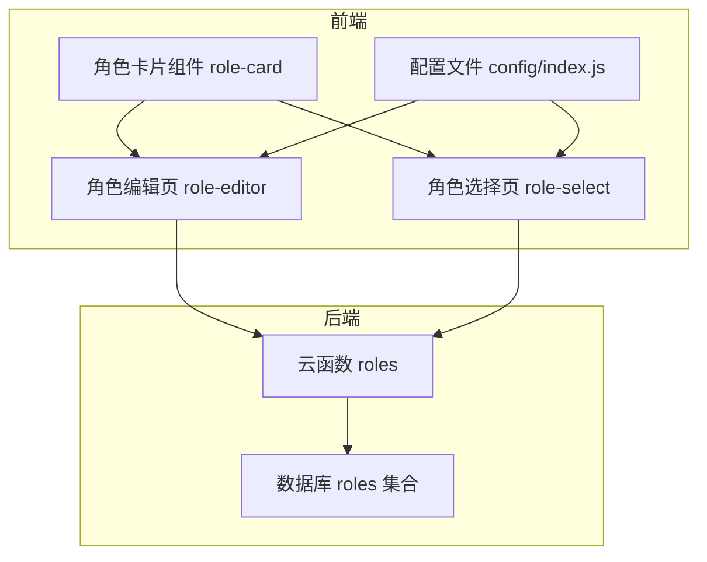
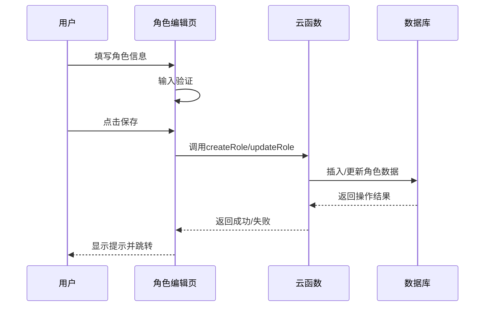
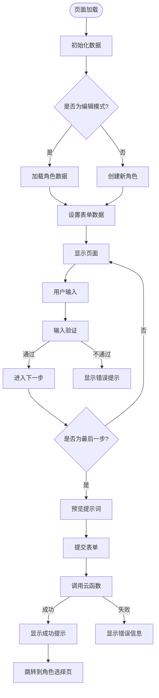
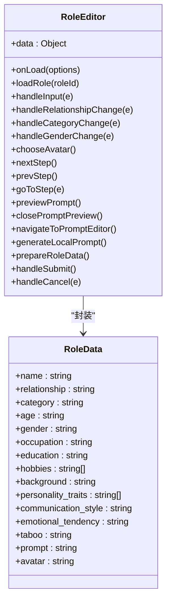
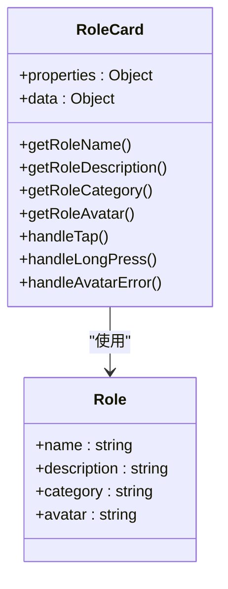
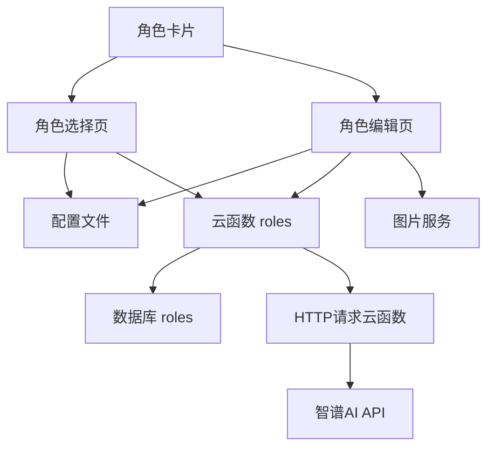

# 角色创建与编辑

<cite>
**本文档引用的文件**  
- [role-editor/index.js](file://miniprogram/pages/role-editor/index.js)
- [role-card.js](file://miniprogram/components/role-card/role-card.js)
- [role-select.js](file://miniprogram/pages/role-select/role-select.js)
- [index.js](file://cloudfunctions/roles/index.js)
- [promptGenerator.js](file://cloudfunctions/roles/promptGenerator.js)
- [index.js](file://miniprogram/config/index.js)
- [新角色编辑页面使用文档_更新版.md](file://doc/使用文档/新角色编辑页面使用文档_更新版.md)
</cite>

## 目录
1. [简介](#简介)
2. [项目结构](#项目结构)
3. [核心组件](#核心组件)
4. [架构概述](#架构概述)
5. [详细组件分析](#详细组件分析)
6. [依赖分析](#依赖分析)
7. [性能考虑](#性能考虑)
8. [故障排除指南](#故障排除指南)
9. [结论](#结论)

## 简介
本文档详细说明了自定义角色的创建与编辑流程，涵盖角色编辑页面（role-editor）的UI结构、交互逻辑、数据验证机制以及角色卡片组件（role-card）的复用设计。文档还介绍了前端如何将用户输入封装为标准角色对象并通过云函数保存，同时提供表单提交错误处理、数据校验规则和用户体验优化建议，确保新角色数据的完整性与可用性。

## 项目结构
角色管理功能主要由前端页面、组件、云函数和配置文件构成。前端部分包括角色编辑页（role-editor）、角色选择页（role-select）和角色卡片组件（role-card）。后端通过云函数（roles）实现角色的增删改查、提示词生成等核心功能。配置文件（config/index.js）统一管理角色相关的分类、关系选项等静态数据。

**图示来源**  
- [role-editor/index.js](file://miniprogram/pages/role-editor/index.js)
- [role-select.js](file://miniprogram/pages/role-select/role-select.js)
- [role-card.js](file://miniprogram/components/role-card/role-card.js)
- [index.js](file://cloudfunctions/roles/index.js)
- [index.js](file://miniprogram/config/index.js)

**本节来源**  
- [role-editor/index.js](file://miniprogram/pages/role-editor/index.js)
- [role-select.js](file://miniprogram/pages/role-select/role-select.js)
- [role-card.js](file://miniprogram/components/role-card/role-card.js)
- [index.js](file://cloudfunctions/roles/index.js)
- [index.js](file://miniprogram/config/index.js)

## 核心组件
核心组件包括角色编辑页面（role-editor）、角色选择页面（role-select）和角色卡片组件（role-card）。角色编辑页面提供分步表单引导用户完成角色创建，支持头像上传、字段输入、提示词预览等功能。角色选择页面展示用户已创建的角色列表，支持分类筛选、搜索和角色管理操作。角色卡片组件作为复用UI元素，在两个页面中一致展示角色信息。

**本节来源**  
- [role-editor/index.js](file://miniprogram/pages/role-editor/index.js)
- [role-select.js](file://miniprogram/pages/role-select/role-select.js)
- [role-card.js](file://miniprogram/components/role-card/role-card.js)

## 架构概述
系统采用前后端分离架构，前端负责用户界面展示和交互逻辑，后端通过云函数提供API接口。角色数据存储在云数据库的roles集合中，包含角色基本信息、提示词、头像等字段。前端通过wx.cloud.callFunction调用云函数实现数据的增删改查。角色卡片组件通过属性传递角色数据，实现UI复用。

**图示来源**  
- [role-editor/index.js](file://miniprogram/pages/role-editor/index.js)
- [index.js](file://cloudfunctions/roles/index.js)

## 详细组件分析

### 角色编辑页面分析
角色编辑页面采用分步表单设计，引导用户完成角色创建。页面包含三个步骤：基本信息、详细背景和性格特点。每个步骤对应不同的表单字段，用户可以通过底部导航或顶部步骤指示器切换。

#### UI结构与交互逻辑
页面UI结构包括状态栏、步骤指示器、表单区域和操作按钮。表单字段包括名称、头像、关系、分类、年龄、性别、职业、教育背景、爱好、背景、性格特点、说话风格、情感倾向、禁忌话题和提示词模板。用户可以通过点击头像区域上传自定义头像，通过选择器选择关系和分类。

**图示来源**  
- [role-editor/index.js](file://miniprogram/pages/role-editor/index.js)

#### 输入验证与实时预览
表单提交前进行严格的输入验证。必填字段包括角色名称和与用户的关系。如果关系选择"其他"，则必须填写自定义关系名称。验证通过后，用户可以点击"预览提示词"按钮，系统会根据填写的信息生成提示词预览。

**图示来源**  
- [role-editor/index.js](file://miniprogram/pages/role-editor/index.js)

**本节来源**  
- [role-editor/index.js](file://miniprogram/pages/role-editor/index.js)
- [新角色编辑页面使用文档_更新版.md](file://doc/使用文档/新角色编辑页面使用文档_更新版.md)

### 角色卡片组件分析
角色卡片组件是一个可复用的UI组件，用于在角色选择页和编辑页一致展示角色信息。组件通过属性接收角色数据，根据角色名称、描述、分类和头像等信息渲染卡片。

#### 复用设计
组件设计遵循单一职责原则，只负责角色信息的展示。通过属性传递角色对象和选中状态，组件内部根据这些属性决定渲染样式。这种设计使得组件可以在不同页面中复用，保持UI一致性。

**图示来源**  
- [role-card.js](file://miniprogram/components/role-card/role-card.js)

**本节来源**  
- [role-card.js](file://miniprogram/components/role-card/role-card.js)

## 依赖分析
角色管理功能依赖多个组件和云函数。前端页面依赖配置文件获取静态数据，依赖云函数实现数据持久化。云函数依赖数据库存储角色数据，依赖HTTP请求云函数调用第三方AI服务生成提示词。

**图示来源**  
- [role-editor/index.js](file://miniprogram/pages/role-editor/index.js)
- [role-select.js](file://miniprogram/pages/role-select/role-select.js)
- [role-card.js](file://miniprogram/components/role-card/role-card.js)
- [index.js](file://cloudfunctions/roles/index.js)
- [promptGenerator.js](file://cloudfunctions/roles/promptGenerator.js)

**本节来源**  
- [role-editor/index.js](file://miniprogram/pages/role-editor/index.js)
- [role-select.js](file://miniprogram/pages/role-select/role-select.js)
- [role-card.js](file://miniprogram/components/role-card/role-card.js)
- [index.js](file://cloudfunctions/roles/index.js)
- [promptGenerator.js](file://cloudfunctions/roles/promptGenerator.js)

## 性能考虑
为提升性能，系统在多个层面进行了优化。前端对角色列表进行本地缓存，设置30分钟过期时间，减少云函数调用频率。云函数对数据库查询结果进行合理排序和限制，避免返回过多数据。图片上传采用压缩处理，减少网络传输量。

## 故障排除指南
常见问题包括角色创建失败、头像上传失败和提示词生成失败。角色创建失败通常是因为名称重复或必填字段未填写。头像上传失败可能是网络问题或图片过大。提示词生成失败可能是云函数调用超时或第三方API服务异常。

**本节来源**  
- [role-editor/index.js](file://miniprogram/pages/role-editor/index.js)
- [index.js](file://cloudfunctions/roles/index.js)

## 结论
本文档详细说明了自定义角色的创建与编辑流程，涵盖了从UI设计到数据存储的完整技术实现。通过分步表单、输入验证、实时预览和组件复用等设计，系统提供了良好的用户体验和代码可维护性。建议在实际使用中注意必填字段的验证，合理使用缓存机制提升性能，并及时处理各种异常情况。