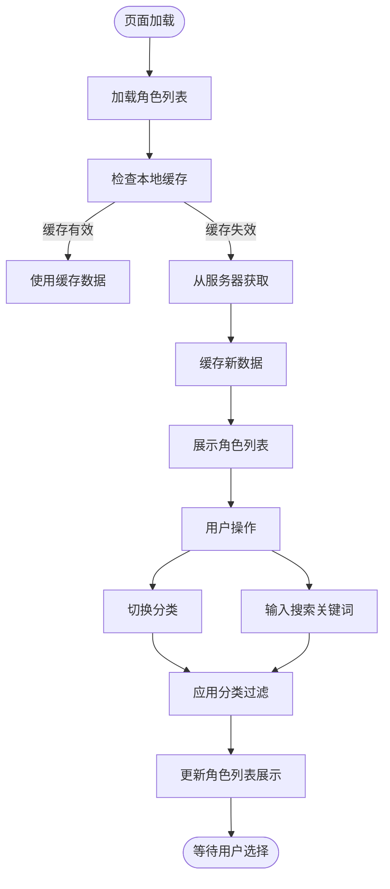

# 角色管理

<cite>
**本文档引用文件**  
- [getRoleInfo/index.js](file://cloudfunctions/getRoleInfo/index.js)
- [roles/init-roles.js](file://cloudfunctions/roles/init-roles.js)
- [roles/index.js](file://cloudfunctions/roles/index.js)
- [miniprogram/pages/role-select/role-select.js](file://miniprogram/pages/role-select/role-select.js)
- [miniprogram/config/index.js](file://miniprogram/config/index.js)
- [doc/开发文档/cloudfunctions/getRoleInfo.md](file://doc/开发文档/cloudfunctions/getRoleInfo.md)
- [doc/使用文档/角色选择页面优化.md](file://doc/使用文档/角色选择页面优化.md)
- [doc/使用文档/角色分类方案.md](file://doc/使用文档/角色分类方案.md)
</cite>

## 目录
1. [角色信息查询](#角色信息查询)  
2. [预设角色初始化](#预设角色初始化)  
3. [前端角色选择页面](#前端角色选择页面)  
4. [角色分类与筛选机制](#角色分类与筛选机制)  
5. [角色数据维护最佳实践](#角色数据维护最佳实践)

## 角色信息查询

`getRoleInfo` 云函数用于根据角色ID查询角色的详细信息。该函数接收 `roleId` 参数，验证其存在性后，从数据库 `roles` 集合中查询对应角色数据。若角色存在，则返回包含角色名称、头像、描述、提示词、性格特征、背景故事等完整信息的响应；若角色不存在或参数缺失，则返回相应的错误信息。

该函数具备完善的错误处理机制，涵盖参数验证、数据库查询失败及系统异常等场景。返回数据中包含 `personality`（性格特征）、`avatar`（头像）、`name`（名称）等关键字段，支持前端进行角色详情展示与AI对话初始化。

**Section sources**  
- [getRoleInfo/index.js](file://cloudfunctions/getRoleInfo/index.js#L1-L50)
- [doc/开发文档/cloudfunctions/getRoleInfo.md](file://doc/开发文档/cloudfunctions/getRoleInfo.md#L0-L142)

## 预设角色初始化

`init-roles.js` 脚本负责系统预设角色的初始化。脚本中定义了如“心理咨询师”、“生活伴侣”、“职场导师”、“情感支持者”等初始角色数据，包含名称、头像、分类、描述、性格特征及提示词等字段。

初始化流程首先检查 `roles` 集合中是否已存在角色数据，若存在则跳过初始化以避免重复插入；若集合为空，则通过批量 `add` 操作将预设角色写入数据库。该策略确保系统在首次部署时能自动填充基础角色，提升用户体验。

角色数据中的 `creator` 字段设为 `"system"`，用于标识系统预设角色，便于后续在前端进行分类展示。

**Section sources**  
- [roles/init-roles.js](file://cloudfunctions/roles/init-roles.js#L0-L103)
- [doc/开发文档/cloudfunctions/getRoleInfo.md](file://doc/开发文档/cloudfunctions/getRoleInfo.md#L72-L135)

## 前端角色选择页面

角色选择页面（`role-select`）负责展示所有可用角色并支持用户选择。页面加载时，通过调用 `roles` 云函数的 `getRoles` 动作获取角色列表。为提升性能，页面实现了本地缓存机制：首次加载从服务器获取数据并缓存，后续加载优先使用缓存，缓存有效期为30分钟。用户可通过下拉刷新强制更新数据。

角色列表分为系统角色（`creator` 为 `"system"`）和用户自定义角色，并分别展示。页面支持通过点击角色卡片进行选择，并通过“开始对话”按钮跳转至聊天页面，传递所选角色ID。

**Section sources**  
- [miniprogram/pages/role-select/role-select.js](file://miniprogram/pages/role-select/role-select.js#L0-L666)
- [doc/使用文档/角色选择页面优化.md](file://doc/使用文档/角色选择页面优化.md#L0-L164)

## 角色分类与筛选机制

系统通过 `category` 字段对角色进行分类管理。前端配置文件 `config/index.js` 中定义了角色分类选项，包括“情感支持”、“心理咨询”、“生活伙伴”、“职场导师”和“其他”等。

在角色选择页面，用户可通过顶部分类标签筛选角色。筛选逻辑由 `filterRoles` 函数实现，支持按分类和关键词双重过滤。搜索功能覆盖角色名称、描述、关系和职业等字段，提升查找效率。特殊处理如将“work”与“career”视为同一分类，增强了筛选的灵活性。

**Diagram sources**  
- [miniprogram/pages/role-select/role-select.js](file://miniprogram/pages/role-select/role-select.js#L335-L377)
- [miniprogram/config/index.js](file://miniprogram/config/index.js#L0-L166)

**Section sources**  
- [miniprogram/pages/role-select/role-select.js](file://miniprogram/pages/role-select/role-select.js#L371-L411)
- [miniprogram/config/index.js](file://miniprogram/config/index.js#L0-L166)
- [doc/使用文档/角色分类方案.md](file://doc/使用文档/角色分类方案.md#L139-L164)

## 角色数据维护最佳实践

### 新增角色
通过角色编辑页面创建新角色，调用 `roles` 云函数的 `createRole` 动作。系统会校验角色名称的唯一性（基于用户 `openid`），防止重复创建。新角色的 `creator` 字段自动设为当前用户的 `openid`。

### 修改角色
编辑角色时调用 `updateRole` 动作。修改后，系统会自动清除本地缓存并刷新角色列表，确保数据一致性。

### 版本控制与数据安全
- **索引优化**：数据库 `roles` 集合已为 `creator`、`category`、`isSystem` 等字段创建索引，提升查询效率。
- **数据同步**：当角色的 `prompt` 字段更新时，系统会自动同步至 `system_prompt` 字段，保证字段一致性。
- **缓存策略**：采用30分钟过期的本地缓存，平衡性能与数据新鲜度。关键操作（如删除、编辑）后强制刷新，避免陈旧数据。
- **推荐机制**：结合聊天记录统计，优先推荐消息交互频繁的角色，提升用户粘性。

**Section sources**  
- [roles/index.js](file://cloudfunctions/roles/index.js#L140-L183)
- [miniprogram/pages/role-select/role-select.js](file://miniprogram/pages/role-select/role-select.js#L335-L377)
- [cloudfunctions/user/createIndexes.js](file://cloudfunctions/user/createIndexes.js#L52-L108)