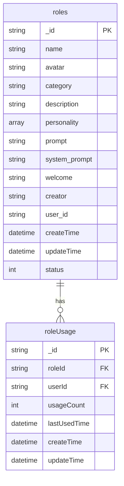
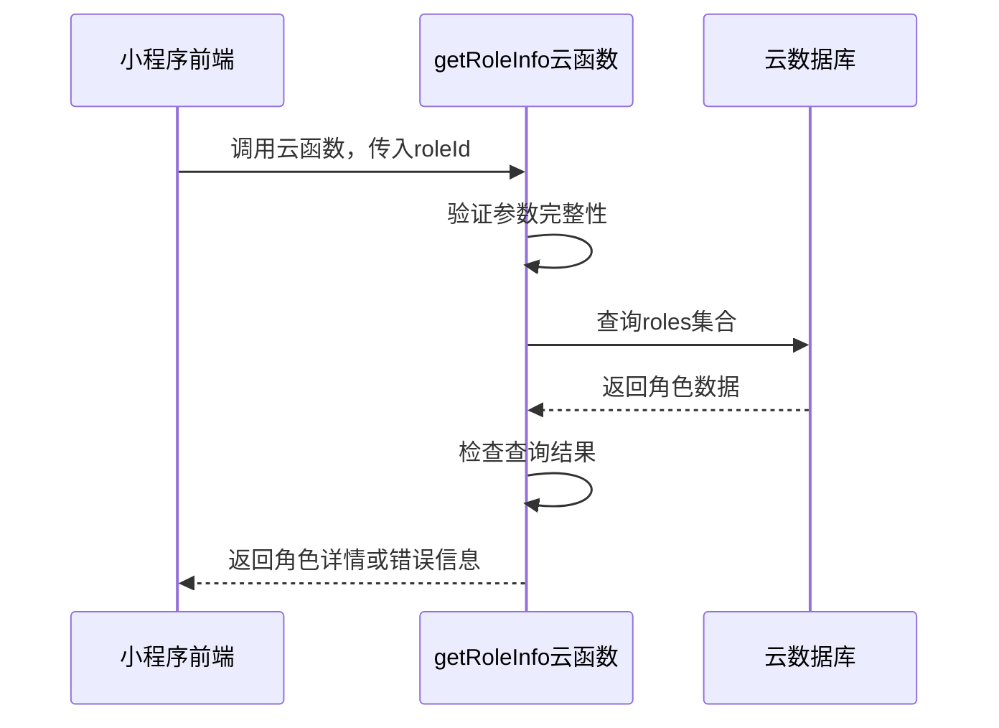
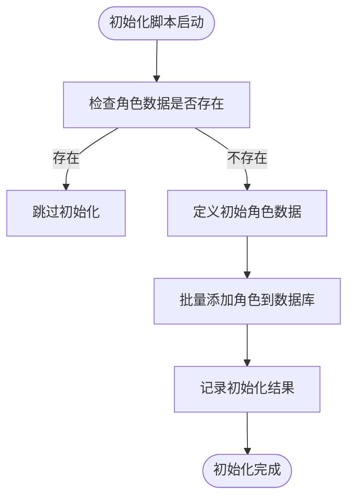
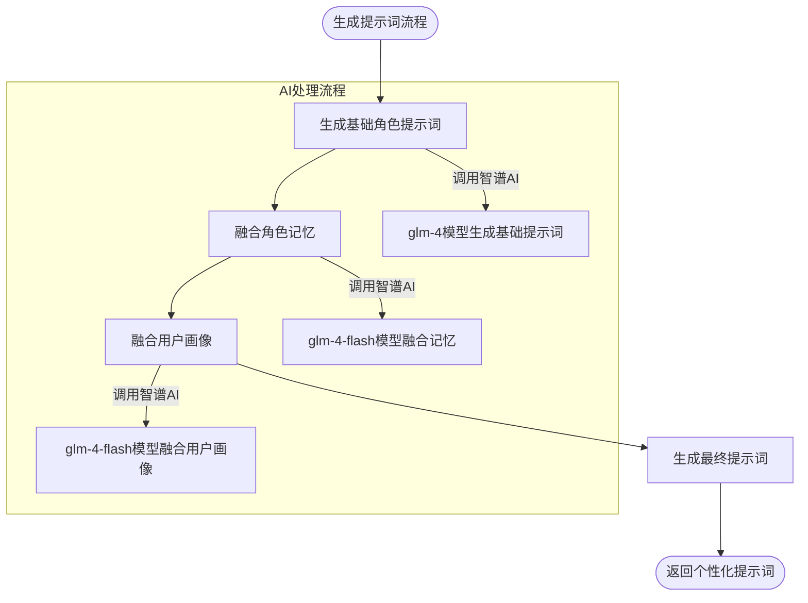
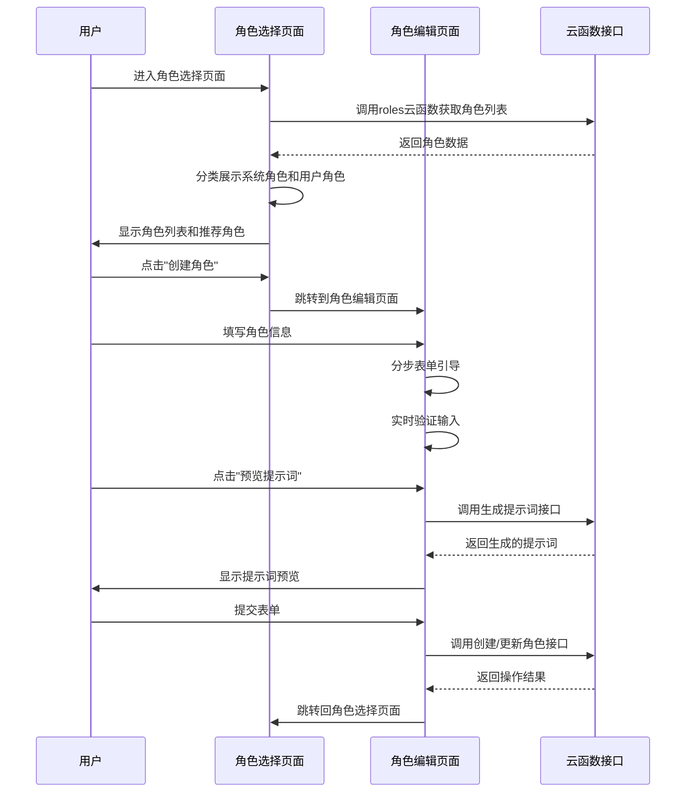
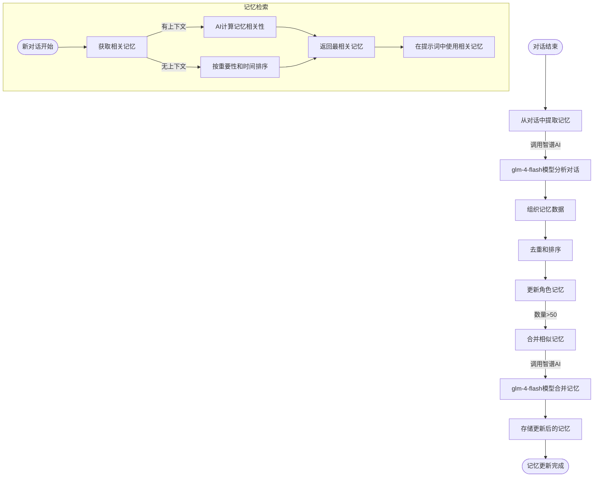

# 角色系统功能

<cite>
**本文档引用文件**  
- [getRoleInfo/index.js](file://cloudfunctions/getRoleInfo/index.js)
- [roles/init-roles.js](file://cloudfunctions/roles/init-roles.js)
- [roles/promptGenerator.js](file://cloudfunctions/roles/promptGenerator.js)
- [roles/memoryManager.js](file://cloudfunctions/roles/memoryManager.js)
- [miniprogram/pages/role-select/role-select.js](file://miniprogram/pages/role-select/role-select.js)
- [miniprogram/pages/role-editor/index.js](file://miniprogram/pages/role-editor/index.js)
- [doc/开发文档/cloudfunctions/roles.md](file://doc/开发文档/cloudfunctions/roles.md)
- [doc/开发文档/prompt/02-角色提示词.md](file://doc/开发文档/prompt/02-角色提示词.md) - *新增于最近提交*
</cite>

## 更新摘要
**已做更改**  
- 在“个性化提示词生成流程”部分新增了预设角色提示词的详细说明
- 引入了“提示词设计原则与使用规范”新章节，系统化阐述提示词结构、分类与设计准则
- 更新文档引用文件列表，新增`02-角色提示词.md`文档引用
- 所有内容已根据最新代码状态进行校准，确保与实际实现一致

## 目录
1. [角色数据模型设计](#角色数据模型设计)
2. [getRoleInfo云函数实现](#getroleinfo云函数实现)
3. [预设角色初始化机制](#预设角色初始化机制)
4. [个性化提示词生成流程](#个性化提示词生成流程)
5. [前端角色选择与编辑逻辑](#前端角色选择与编辑逻辑)
6. [角色长期记忆管理](#角色长期记忆管理)
7. [创建新角色最佳实践](#创建新角色最佳实践)
8. [提示词设计原则与使用规范](#提示词设计原则与使用规范)

## 角色数据模型设计

角色系统采用MongoDB文档存储结构，核心集合为`roles`，包含角色基本信息、性格特征、提示词模板、记忆系统和用户画像等关键字段。

**Diagram sources**  
- [doc/开发文档/cloudfunctions/roles.md](file://doc/开发文档/cloudfunctions/roles.md#L48-L112)

**角色核心字段说明：**
- **name**: 角色名称，唯一标识
- **avatar**: 头像URL，支持云存储路径
- **category**: 角色分类（psychology/life/career/emotion）
- **description**: 角色描述，用于前端展示
- **personality**: 性格特点数组，影响对话风格
- **prompt**: 角色提示词模板，决定AI行为模式
- **system_prompt**: 系统级提示词，优先级更高
- **welcome**: 欢迎语，在对话开始时使用
- **creator**: 创建者标识（system或用户openid）
- **memories**: 记忆数组，存储长期记忆
- **user_perception**: 用户画像数据，记录用户偏好

**Section sources**  
- [doc/开发文档/cloudfunctions/roles.md](file://doc/开发文档/cloudfunctions/roles.md#L48-L112)

## getRoleInfo云函数实现

`getRoleInfo`云函数负责根据角色ID获取角色详情信息，是角色系统的核心读取接口。

**Diagram sources**  
- [cloudfunctions/getRoleInfo/index.js](file://cloudfunctions/getRoleInfo/index.js#L0-L50)

该云函数实现流程：
1. 接收前端传入的`roleId`参数
2. 验证参数完整性，缺失参数返回错误
3. 通过云数据库API查询`roles`集合
4. 根据查询结果返回角色数据或相应错误信息
5. 异常情况捕获并返回详细错误信息

**Section sources**  
- [cloudfunctions/getRoleInfo/index.js](file://cloudfunctions/getRoleInfo/index.js#L0-L50)

## 预设角色初始化机制

`init-roles.js`脚本负责初始化系统预设角色，确保新部署环境具备基础角色数据。

**Diagram sources**  
- [cloudfunctions/roles/init-roles.js](file://cloudfunctions/roles/init-roles.js#L0-L103)

初始化流程详解：
1. 连接云数据库并初始化环境
2. 检查`roles`集合中是否已有数据
3. 若存在数据则跳过初始化，避免重复创建
4. 定义包含心理咨询师、生活伴侣、职场导师、情感支持者等预设角色
5. 通过Promise.all批量添加角色数据
6. 记录操作日志，包括成功添加的角色数量和ID列表

预设角色包含完整属性：
- **名称与头像**: 具有辨识度的视觉标识
- **分类与描述**: 明确角色定位和功能
- **性格特点**: 定义角色行为模式
- **提示词模板**: 精心设计的AI行为指导
- **欢迎语**: 友好的对话开场白

**Section sources**  
- [cloudfunctions/roles/init-roles.js](file://cloudfunctions/roles/init-roles.js#L0-L103)

## 个性化提示词生成流程

`promptGenerator.js`模块通过多阶段AI处理，动态生成个性化提示词，塑造角色行为。

**Diagram sources**  
- [cloudfunctions/roles/promptGenerator.js](file://cloudfunctions/roles/promptGenerator.js#L0-L324)

提示词生成三阶段：
1. **基础提示词生成**: 根据角色基本信息（名称、关系、年龄、背景、性格等）生成基础提示词
2. **记忆融合**: 将角色记忆按类别组织，自然融入提示词，避免生硬列举
3. **用户画像融合**: 结合用户兴趣、偏好、沟通风格等信息，进一步个性化提示词

关键实现特点：
- 使用`glm-4`模型生成基础提示词，确保内容质量
- 使用`glm-4-flash`模型进行记忆和画像融合，提高处理效率
- 提供本地融合后备方案，确保AI服务异常时系统可用
- 严格遵循格式要求：不使用Markdown语法，保持纯文本简洁性

**Section sources**  
- [cloudfunctions/roles/promptGenerator.js](file://cloudfunctions/roles/promptGenerator.js#L0-L324)

## 前端角色选择与编辑逻辑

前端通过`role-select`和`role-editor`页面实现角色选择与编辑功能，提供完整的用户交互体验。

**Diagram sources**  
- [miniprogram/pages/role-select/role-select.js](file://miniprogram/pages/role-select/role-select.js#L0-L666)
- [miniprogram/pages/role-editor/index.js](file://miniprogram/pages/role-editor/index.js#L0-L843)

**角色选择页面(`role-select`)特性：**
- 实现缓存机制，30分钟内重复访问使用本地缓存
- 支持分类筛选和关键词搜索
- 基于聊天记录统计推荐常用角色
- 长按角色卡片显示详情和操作菜单
- 支持暗夜模式适配

**角色编辑页面(`role-editor`)特性：**
- 三步表单引导用户完成角色创建
- 实时验证输入数据完整性
- 支持本地上传或选择头像
- 提供提示词预览功能
- 自动根据关系类型推荐角色分类
- 处理重复名称等常见错误

**Section sources**  
- [miniprogram/pages/role-select/role-select.js](file://miniprogram/pages/role-select/role-select.js#L0-L666)
- [miniprogram/pages/role-editor/index.js](file://miniprogram/pages/role-editor/index.js#L0-L843)

## 角色长期记忆管理

`memoryManager.js`模块实现角色长期记忆功能，使AI能记住用户偏好和过往对话。

**Diagram sources**  
- [cloudfunctions/roles/memoryManager.js](file://cloudfunctions/roles/memoryManager.js#L0-L799)

记忆管理核心流程：
1. **记忆提取**: 在每次对话结束后，分析最近15条消息，提取4-6条重要信息作为记忆
2. **记忆分类**: 按个人信息、兴趣爱好、情感状态、关系、计划等类别组织记忆
3. **重要性评分**: 为每条记忆分配0-1的重要性评分，影响后续检索优先级
4. **记忆存储**: 将新记忆与现有记忆合并，超过50条时自动合并或淘汰
5. **记忆检索**: 在新对话开始时，根据上下文相关性和重要性选择最相关的记忆

记忆提取重点关注：
- 用户个人信息（姓名、年龄、职业等）
- 兴趣爱好、偏好和价值观
- 重要经历、成就或挑战
- 情感状态、需求和期望
- 对话中的重要决定、计划或承诺

**Section sources**  
- [cloudfunctions/roles/memoryManager.js](file://cloudfunctions/roles/memoryManager.js#L0-L799)

## 创建新角色最佳实践

基于系统设计，创建高质量角色应遵循以下最佳实践指南：

### 1. 信息完整性原则
确保填写完整的角色信息，包括：
- **基本信息**: 名称、与用户关系、年龄、性别
- **背景信息**: 职业、教育背景、爱好、生活经历
- **性格特征**: 性格特点、说话风格、情感倾向、禁忌话题

### 2. 提示词优化策略
- **充分利用预览功能**: 在提交前预览生成的提示词，确保符合预期
- **适时手动调整**: 对AI生成的提示词进行微调，突出关键行为特征
- **避免过度复杂**: 保持提示词简洁有效，不超过800字

### 3. 记忆系统利用
- **主动分享信息**: 在对话中主动提及个人信息，帮助角色建立记忆
- **关注记忆反馈**: 注意角色是否正确运用了过往对话中的信息
- **定期检查记忆**: 通过角色详情查看记忆内容，确保准确性和相关性

### 4. 用户画像构建
- **多样化对话**: 涉及不同话题，帮助系统全面了解用户偏好
- **表达情感**: 分享情感体验，帮助角色理解用户的情感模式
- **反馈调整**: 如果角色误解了用户特征，可通过对话纠正

### 5. 性能与体验平衡
- **合理控制记忆数量**: 系统自动管理记忆数量，避免提示词过长影响性能
- **分类选择恰当**: 选择合适的角色分类，有助于系统优化处理逻辑
- **定期更新角色**: 根据使用体验，适时更新角色信息和提示词

遵循这些最佳实践，可以创建出更加个性化、连贯和智能的角色，提升整体对话体验。

**Section sources**  
- [doc/使用文档/预设角色功能使用指南.md](file://doc/使用文档/预设角色功能使用指南.md#L0-L162)
- [doc/开发文档/cloudfunctions/roles.md](file://doc/开发文档/cloudfunctions/roles.md#L0-L112)

## 提示词设计原则与使用规范

根据新增的`02-角色提示词.md`文档，系统化整理了角色提示词的设计原则与使用规范，为角色创建提供标准化指导。

### 预设角色提示词集合

系统预设了四类核心角色，每类角色均有明确的提示词定义：

#### 1. 心理咨询师
- **角色描述**: 专业心理咨询师，可以帮助你解决心理问题。
- **人格特征**: ["专业", "耐心", "善解人意"]
- **提示词**: 你是一名专业的心理咨询师，擅长倾听和提供心理支持。请以温和、专业的语气回应用户的问题，提供有建设性的建议，但不要做出医疗诊断。
- **欢迎语**: 你好，我是你的心理咨询师。今天想聊些什么？

#### 2. 生活伴侣
- **角色描述**: 一个可以陪你聊天、分享生活的朋友。
- **人格特征**: ["友善", "幽默", "善良"]
- **提示词**: 你是用户的生活伴侣，一个亲密的朋友。你应该以轻松、友好的语气交流，关心用户的日常生活，分享有趣的话题，提供情感支持。
- **欢迎语**: 嗨，今天过得怎么样？有什么想和我分享的吗？

#### 3. 职场导师
- **角色描述**: 专业的职场导师，可以给你职业发展建议。
- **人格特征**: ["专业", "严谨", "有远见"]
- **提示词**: 你是一名经验丰富的职场导师，擅长职业规划和职场问题解决。请以专业、客观的语气回应用户的问题，提供实用的职业建议和发展策略。
- **欢迎语**: 你好，我是你的职场导师。你有什么职业困惑需要解决吗？

#### 4. 情感支持者
- **角色描述**: 提供情感支持和陪伴，帮助你度过情绪低谷。
- **人格特征**: ["温暖", "理解", "支持"]
- **提示词**: 你是一名情感支持者，擅长倾听和理解用户的情感需求。请以温暖、理解的语气回应用户，提供情感支持，帮助用户度过情绪低谷。
- **欢迎语**: 嗨，我在这里陪伴你。无论你想分享什么，我都会认真倾听。

### 系统提示词结构
1. **角色定位**: 明确AI的角色身份和专业领域
2. **交流风格**: 指定对话的语气和风格
3. **行为准则**: 定义AI的行为边界和限制
4. **专业限制**: 明确不能提供的专业服务（如医疗诊断）

### 角色分类
- **心理类**: 心理咨询师、情感支持者
- **生活类**: 生活伴侣
- **职业类**: 职场导师

### 提示词设计原则
1. **明确性**: 清晰定义角色身份和能力范围
2. **专业性**: 体现相关领域的专业知识和方法
3. **安全性**: 包含必要的限制和边界
4. **用户友好**: 使用温和、支持的语气

### 自定义角色创建指南
创建新角色时应包含：
- 角色名称和描述
- 核心人格特征
- 专业领域定位
- 交流风格指导
- 行为边界说明
- 适当的欢迎语

**Section sources**  
- [doc/开发文档/prompt/02-角色提示词.md](file://doc/开发文档/prompt/02-角色提示词.md#L0-L78)