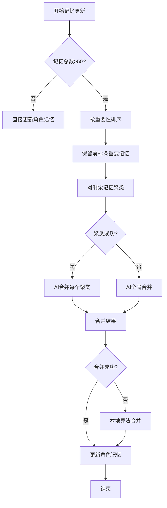
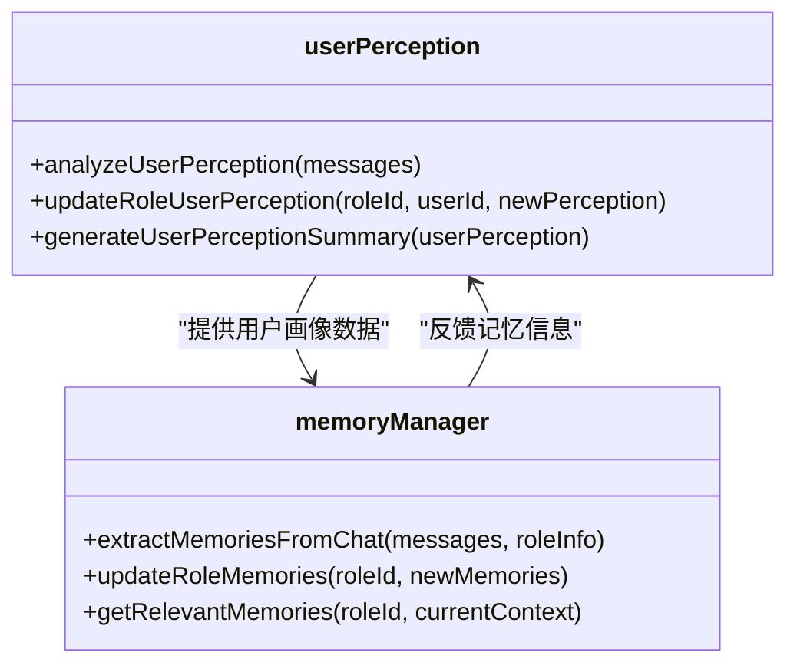
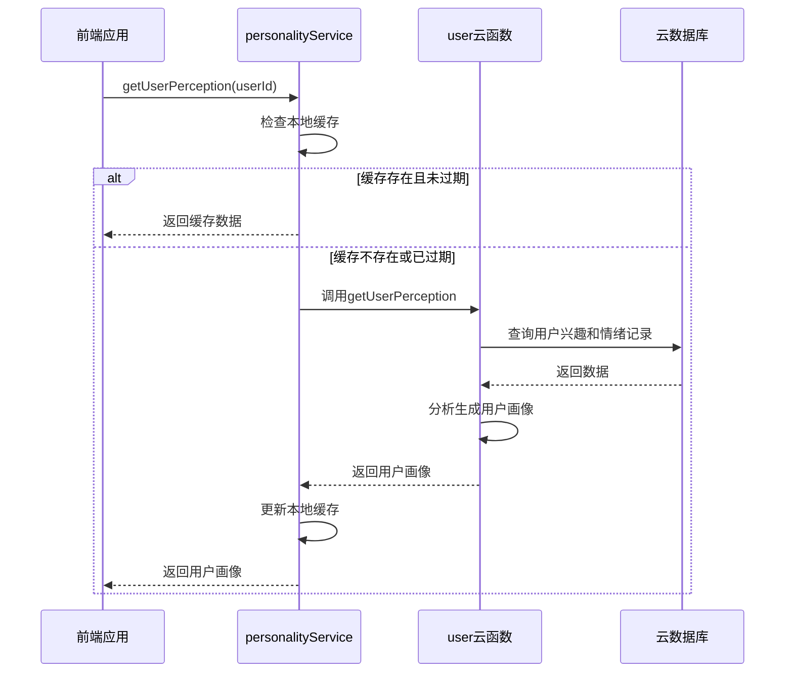

# 角色记忆机制

<cite>
**本文档引用文件**  
- [memoryManager.js](file://cloudfunctions/roles/memoryManager.js)
- [userPerception.js](file://cloudfunctions/roles/userPerception.js)
- [personalityService.js](file://miniprogram/services/personalityService.js)
- [userPerception模块使用文档.md](file://doc/使用文档/userPerception模块使用文档.md)
- [角色记忆机制优化.md](file://doc/使用文档/角色记忆机制优化.md)
</cite>

## 目录
1. [引言](#引言)
2. [记忆数据存储结构设计](#记忆数据存储结构设计)
3. [记忆提取与更新策略](#记忆提取与更新策略)
4. [用户画像分析与集成](#用户画像分析与集成)
5. [前端个性化响应实现](#前端个性化响应实现)
6. [记忆精度优化与性能调优](#记忆精度优化与性能调优)
7. [结论](#结论)

## 引言
本系统通过memoryManager模块实现角色的长期记忆能力，结合userPerception用户画像分析和前端personalityService服务，构建了完整的个性化对话体系。系统利用智谱AI技术从对话中自动提取关键信息，形成结构化记忆，并通过智能检索机制在后续对话中激活相关记忆，实现真正意义上的个性化交互体验。

## 记忆数据存储结构设计

角色记忆系统采用结构化JSON格式存储，每条记忆包含多个维度的元数据，确保信息的完整性和可检索性。核心字段包括：

- **content**：记忆内容，简洁的一句话描述，不超过30个字
- **importance**：重要性评分，范围0-1，由AI根据信息价值自动评估
- **category**：记忆类别，包括"个人信息"、"兴趣爱好"、"情感状态"、"关系"、"计划"等
- **context**：记忆的上下文或来源描述
- **timestamp**：时间戳，记录记忆创建时间
- **created_at**：ISO格式的创建时间
- **source**：记忆来源，如"chat"（对话提取）或"merged"（合并生成）

记忆数据持久化存储在云数据库的roles集合中，作为角色文档的memories数组字段。系统对单个角色的记忆数量进行智能管理，当记忆总数超过50条时，自动触发合并机制，确保数据质量和检索效率。

**Section sources**
- [memoryManager.js](file://cloudfunctions/roles/memoryManager.js#L100-L150)
- [memoryManager.js](file://cloudfunctions/roles/memoryManager.js#L300-L350)

## 记忆提取与更新策略

### 记忆提取机制
系统采用基于智谱AI的记忆提取算法，从最近15条对话消息中识别重要信息。提取过程遵循严格的优先级排序：

1. 用户个人信息（姓名、年龄、职业等）
2. 用户兴趣爱好、偏好和价值观
3. 用户的重要经历、成就或挑战
4. 用户的情感状态、需求和期望
5. 用户与角色的关系动态
6. 对话中的重要决定、计划或承诺

提取过程使用glm-4-flash快速模型，通过结构化提示词引导AI生成JSON格式的记忆数据。系统对提取结果进行去重处理，使用简化内容（去除标点和空格）进行相似度比较，避免重复记忆。

### 记忆更新流程
记忆更新采用增量合并策略，确保新旧记忆的有机整合：

1. 获取角色当前所有记忆
2. 将新提取的记忆与现有记忆合并
3. 当总记忆数超过50条时，执行智能合并：
   - 保留前30条高重要性记忆
   - 对剩余记忆按类别聚类
   - 使用AI将每个聚类合并为1-2条概括性记忆

系统还实现了本地合并算法作为AI合并失败时的后备方案，确保记忆更新的可靠性。

**Diagram sources**
- [memoryManager.js](file://cloudfunctions/roles/memoryManager.js#L400-L500)
- [memoryManager.js](file://cloudfunctions/roles/memoryManager.js#L500-L600)

**Section sources**
- [memoryManager.js](file://cloudfunctions/roles/memoryManager.js#L200-L400)
- [memoryManager.js](file://cloudfunctions/roles/memoryManager.js#L400-L700)

## 用户画像分析与集成

### userPerception.js模块功能
userPerception.js模块负责从用户对话中分析和构建用户画像，其核心功能包括：

- **用户画像分析**：从用户消息中提取兴趣、偏好、沟通风格和情感模式
- **用户画像更新**：将新分析结果与现有画像合并，形成更完整的用户认知
- **用户画像摘要生成**：将结构化画像转化为自然、友好的描述文本

用户画像数据结构包含四个主要维度：
- **interests**：用户兴趣列表
- **preferences**：用户偏好列表
- **communication_style**：沟通风格描述
- **emotional_patterns**：情感模式列表

### 与角色记忆系统的集成
用户画像系统与角色记忆系统深度集成，形成协同效应：

1. 用户画像分析结果作为角色记忆的重要来源
2. 记忆提取过程中参考已知用户信息，提高提取准确性
3. 用户画像的更新触发角色记忆的相应调整
4. 两者共同为个性化响应提供数据支持

系统通过定期分析用户对话内容，持续优化用户画像，确保角色对用户的理解与时俱进。

**Diagram sources**
- [userPerception.js](file://cloudfunctions/roles/userPerception.js#L50-L150)
- [memoryManager.js](file://cloudfunctions/roles/memoryManager.js#L100-L200)

**Section sources**
- [userPerception.js](file://cloudfunctions/roles/userPerception.js#L1-L200)
- [memoryManager.js](file://cloudfunctions/roles/memoryManager.js#L1-L100)

## 前端个性化响应实现

### personalityService服务架构
前端personalityService.js模块作为用户画像的客户端接口，提供以下核心功能：

- **getUserPerception**：获取用户画像数据，支持缓存机制
- **generateUserPerception**：生成用户画像，调用后端云函数
- **getPersonalityTraits**：获取用户个性特征
- **getUserInterests**：获取用户兴趣标签
- **getEmotionPatterns**：获取用户情感模式
- **getPersonalitySummary**：获取用户个性总结
- **generateUserSystemPrompt**：生成用户画像系统提示词

### 缓存机制
系统实现了本地缓存机制，提升用户体验和性能：

- 缓存键名为"user_perception_cache_" + 用户ID
- 缓存有效期为1小时
- 支持强制刷新选项，绕过缓存获取最新数据
- 提供清除缓存接口，支持清除单个或全部用户缓存

### 个性化响应流程
前端通过以下流程实现个性化响应：

1. 调用personalityService获取用户画像
2. 生成包含用户特征的系统提示词
3. 将提示词与对话上下文结合发送给AI模型
4. AI模型基于用户特征生成个性化回复

系统提示词包含用户个性总结、个性特征、兴趣标签和情感模式等信息，确保AI在回复时充分考虑用户特点。

**Diagram sources**
- [personalityService.js](file://miniprogram/services/personalityService.js#L1-L100)
- [personalityService.js](file://miniprogram/services/personalityService.js#L100-L200)

**Section sources**
- [personalityService.js](file://miniprogram/services/personalityService.js#L1-L300)

## 记忆精度优化与性能调优

### 记忆精度优化策略
为提高记忆系统的精度和实用性，系统采用了多项优化措施：

1. **多维度相关性评估**：在记忆检索时考虑语义相关性、主题匹配度、情感一致性和时间相关性
2. **组合评分机制**：结合重要性和时间因素计算记忆分数，公式为(重要性×0.7)+(时间得分×0.3)
3. **预过滤机制**：在AI评估前使用本地算法预筛选，减少需要评估的记忆数量
4. **指数衰减函数**：30天后记忆时间权重减半，确保新记忆优先

### 性能调优方案
为避免上下文过长导致的推理延迟，系统实施了以下性能优化：

1. **使用快速模型**：记忆提取和合并使用glm-4-flash模型，响应更快
2. **限制对话上下文**：提取记忆时仅使用最近15条消息，控制输入长度
3. **分批处理机制**：当记忆数量过多时，先进行本地聚类再调用AI合并
4. **缓存检索结果**：可选的检索结果缓存，避免重复计算

### 未来优化方向
根据系统设计文档，未来可进一步优化：

1. 实现记忆优先级排序，确保最重要的记忆被优先使用
2. 添加记忆过期机制，自动清理过时的记忆
3. 实现记忆冲突解决机制，处理矛盾的记忆
4. 提供记忆管理界面，允许用户查看和编辑角色记忆
5. 实现记忆分类，将记忆按主题或重要性分类

**Section sources**
- [memoryManager.js](file://cloudfunctions/roles/memoryManager.js#L700-L800)
- [角色记忆机制优化.md](file://doc/使用文档/角色记忆机制优化.md#L75-L105)

## 结论
HeartChat的角色记忆机制通过memoryManager、userPerception和personalityService三个核心模块的协同工作，实现了完整的长期记忆能力。系统采用AI驱动的记忆提取和更新策略，结合结构化的数据存储设计，确保了记忆的准确性和实用性。前端通过智能缓存和提示词生成机制，实现了高效的个性化响应。整体架构兼顾了记忆精度和系统性能，为用户提供自然、连贯的个性化对话体验。