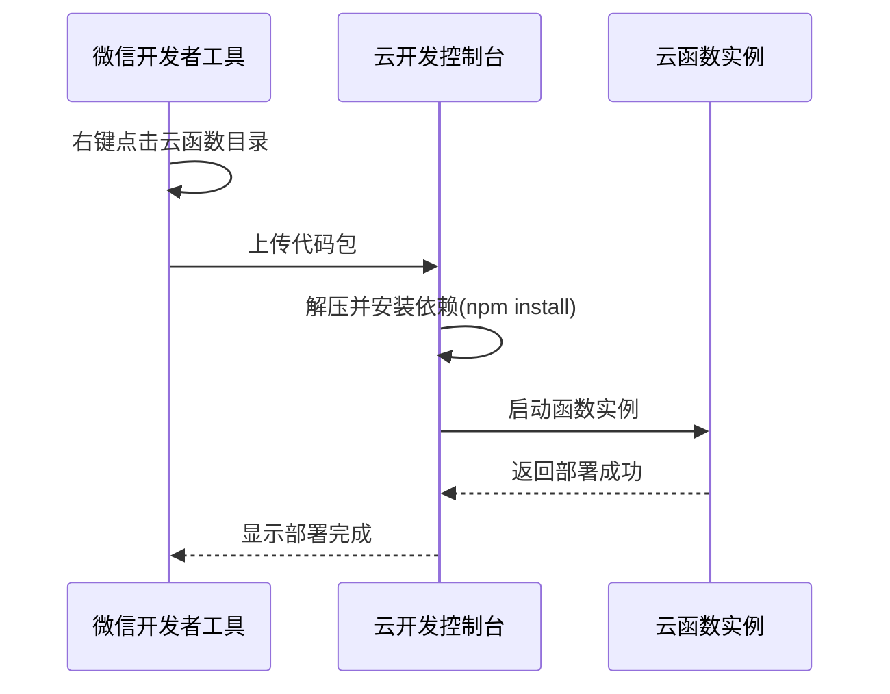
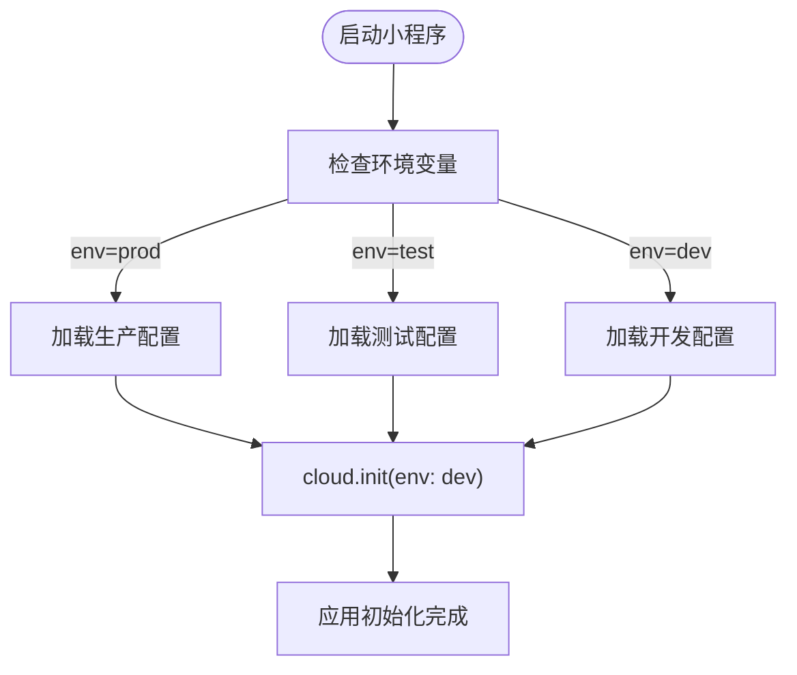

# 部署指南

<cite>
**本文档引用文件**  
- [project.config.json](file://project.config.json)
- [cloudfunctions/README.md](file://cloudfunctions/README.md)
- [miniprogram/app.js](file://miniprogram/app.js)
- [cloudfunctions/login/index.js](file://cloudfunctions/login/index.js)
- [cloudfunctions/roles/index.js](file://cloudfunctions/roles/index.js)
- [miniprogram/utils/auth.js](file://miniprogram/utils/auth.js)
- [miniprogram/services/cloudFuncCaller.js](file://miniprogram/services/cloudFuncCaller.js)
</cite>

## 目录
1. [引言](#引言)
2. [微信云开发环境配置](#微信云开发环境配置)
3. [云函数上传与部署流程](#云函数上传与部署流程)
4. [依赖管理与版本控制](#依赖管理与版本控制)
5. [小程序版本提交与发布流程](#小程序版本提交与发布流程)
6. [多环境配置与切换机制](#多环境配置与切换机制)
7. [常见问题与排查建议](#常见问题与排查建议)
8. [附录](#附录)

## 引言
本部署指南旨在为HeartChat项目提供完整的生产环境部署操作手册。文档详细说明了从云环境创建、云函数部署、依赖管理到小程序版本发布的全流程，确保团队成员能够高效、准确地完成系统上线工作。通过结合项目配置文件与实际代码结构，本文档提供了可执行的部署策略与最佳实践。

## 微信云开发环境配置

### 环境创建与资源分配
1. **登录微信开发者平台**：使用项目管理员账号登录[微信公众平台](https://mp.weixin.qq.com)。
2. **开通云开发服务**：
   - 进入小程序管理后台，选择“开发” -> “开发管理” -> “云开发”。
   - 点击“开通”，选择计费模式（推荐按量计费），确认开通。
3. **创建独立环境**：
   - 建议为不同阶段创建独立环境，如：
     - `heartchat-prod`：生产环境
     - `heartchat-test`：测试环境
     - `heartchat-dev`：开发环境
   - 每个环境拥有独立的数据库、存储空间和云函数运行实例。

### 域名绑定与安全配置
1. **配置业务域名**：
   - 在“开发” -> “开发设置” -> “服务器域名”中，添加合法的HTTPS请求域名。
   - 本项目涉及的外部API需添加至request合法域名列表，如Gemini、智谱AI等服务地址。
2. **云调用权限配置**：
   - 在“云开发控制台”中，确保已启用`wx.cloud.callFunction`、`wx.cloud.uploadFile`等API权限。
   - 配置数据库读写权限策略，生产环境建议设置为“仅云函数可读写”。

**Section sources**
- [project.config.json](file://project.config.json#L1-L70)
- [cloudfunctions/README.md](file://cloudfunctions/README.md#L50-L71)

## 云函数上传与部署流程

### 单个云函数部署
1. **选择目标函数**：
   - 在微信开发者工具中，展开`cloudfunctions`目录。
   - 右键点击目标云函数文件夹（如`login`、`roles`、`analysis`）。
2. **上传并部署**：
   - 选择“上传并部署：云端安装依赖”。
   - 开发者工具将自动压缩代码包并上传至云端，随后在服务器端执行`npm install`安装`package.json`中声明的依赖。
3. **验证部署状态**：
   - 在“云开发控制台” -> “云函数”列表中查看函数状态。
   - 检查日志输出，确认无报错信息。

### 批量部署策略
1. **同步所有云函数**：
   - 右键点击`cloudfunctions`根目录。
   - 选择“同步所有云函数列表”，确保本地与云端函数定义一致。
2. **批量上传**：
   - 使用“上传并部署：所有文件”或“上传并部署：云端安装依赖”进行整体部署。
   - 推荐在版本发布前执行全量部署，确保所有函数版本同步。



**Diagram sources**
- [cloudfunctions/README.md](file://cloudfunctions/README.md#L50-L71)
- [cloudfunctions/login/index.js](file://cloudfunctions/login/index.js)
- [cloudfunctions/roles/index.js](file://cloudfunctions/roles/index.js)

**Section sources**
- [cloudfunctions/README.md](file://cloudfunctions/README.md#L50-L71)

## 依赖管理与版本控制

### 依赖安装机制
- 所有云函数的依赖均通过其目录下的`package.json`文件管理。
- 部署时选择“云端安装依赖”，开发者工具会自动在云端执行`npm install --production`，仅安装生产依赖。
- 示例：`analysis`云函数依赖`@google/generative-ai`用于AI模型调用，需确保版本兼容性。

### 版本管理最佳实践
1. **锁定依赖版本**：
   - 在`package.json`中使用精确版本号（如`"1.2.3"`）而非`^`或`~`，避免意外升级。
2. **云函数版本与别名**：
   - 部署后可在云开发控制台为函数设置别名（如`prod`、`v1.0`），便于灰度发布。
   - 生产环境前端调用应使用别名而非默认版本。
3. **回滚机制**：
   - 若新版本出现问题，可在控制台快速切换至历史版本。

**Section sources**
- [cloudfunctions/analysis/package.json](file://cloudfunctions/analysis/package.json)
- [cloudfunctions/chat/package.json](file://cloudfunctions/chat/package.json)

## 小程序版本提交与发布流程

### 提交审核前准备
1. **版本号更新**：
   - 在`project.config.json`中更新版本信息（`projectname`可包含版本号）。
2. **测试验证**：
   - 在真机上完成全流程测试，包括登录、聊天、情绪分析、报告生成等核心功能。
3. **填写版本信息**：
   - 在开发者工具中填写版本备注（如“v1.2.0-生产发布”）和测试账号。

### 提交审核与发布
1. **上传代码**：
   - 点击“上传”按钮，将代码包上传至微信平台。
2. **提交审核**：
   - 登录小程序管理后台，进入“版本管理”页面。
   - 选择刚上传的版本，填写审核信息（类目、标签、截图等），提交审核。
3. **发布上线**：
   - 审核通过后，点击“发布”按钮，全量推送给所有用户。
   - 可选择“分阶段发布”以控制流量。

**Section sources**
- [project.config.json](file://project.config.json#L1-L70)

## 多环境配置与切换机制

### project.config.json 配置解析
`project.config.json`是项目核心配置文件，关键配置项如下：

| 配置项 | 说明 | 生产环境建议值 |
|-------|------|---------------|
| `appid` | 小程序唯一标识 | `wx3b23ed9a8ff5f5c6` |
| `envId` | 云开发环境ID | `cloud1-9gpfk3ie94d8630a`（生产环境ID） |
| `cloud` | 是否启用云开发 | `true` |
| `cloudfunctionRoot` | 云函数本地目录 | `cloudfunctions/` |
| `setting.packNpmManually` | 手动打包npm | `true` |
| `setting.packNpmRelationList` | npm包映射关系 | 指向`./package.json` |

### 环境切换策略
1. **动态环境ID**：
   - 在云函数初始化时使用`cloud.init({ env: cloud.DYNAMIC_CURRENT_ENV })`，使云函数自动匹配当前小程序所处的云环境。
   ```javascript
   const cloud = require('wx-server-sdk')
   cloud.init({ env: cloud.DYNAMIC_CURRENT_ENV })
   ```
2. **多环境配置文件**：
   - 建议创建`config/prod.js`、`config/test.js`等环境专属配置文件。
   - 在`app.js`中根据构建参数或全局变量加载对应配置。
3. **开发者工具切换**：
   - 在开发者工具右上角“云开发”面板中，可手动切换当前操作的云环境。



**Diagram sources**
- [project.config.json](file://project.config.json#L1-L70)
- [miniprogram/app.js](file://miniprogram/app.js)
- [miniprogram/utils/auth.js](file://miniprogram/utils/auth.js)

**Section sources**
- [project.config.json](file://project.config.json#L1-L70)
- [miniprogram/app.js](file://miniprogram/app.js)
- [miniprogram/utils/auth.js](file://miniprogram/utils/auth.js)

## 常见问题与排查建议

### 部署失败
- **现象**：上传云函数时报错“依赖安装失败”。
- **解决方案**：
  1. 检查`package.json`中的依赖是否为Node.js兼容版本。
  2. 移除不必要的开发依赖（devDependencies）。
  3. 尝试在本地执行`npm install --production`验证依赖可安装性。

### 函数调用超时
- **现象**：`wx.cloud.callFunction`返回超时错误。
- **解决方案**：
  1. 检查云函数执行逻辑，避免长时间同步操作。
  2. 优化数据库查询，添加索引（如`user.createIndexes.js`）。
  3. 考虑拆分复杂函数为多个轻量级函数。

### 权限错误
- **现象**：数据库操作返回“权限拒绝”。
- **解决方案**：
  1. 检查云函数内`cloud.init`是否正确指定环境。
  2. 确认云数据库集合的权限策略是否允许云函数读写。

**Section sources**
- [cloudfunctions/README.md](file://cloudfunctions/README.md#L50-L71)
- [miniprogram/services/cloudFuncCaller.js](file://miniprogram/services/cloudFuncCaller.js)
- [cloudfunctions/user/createIndexes.js](file://cloudfunctions/user/createIndexes.js)

## 附录
- **云开发官方文档**：[https://developers.weixin.qq.com/miniprogram/dev/wxcloud/basis/getting-started.html](https://developers.weixin.qq.com/miniprogram/dev/wxcloud/basis/getting-started.html)
- **微信小程序审核指南**：[https://developers.weixin.qq.com/miniprogram/product/audit.html](https://developers.weixin.qq.com/miniprogram/product/audit.html)