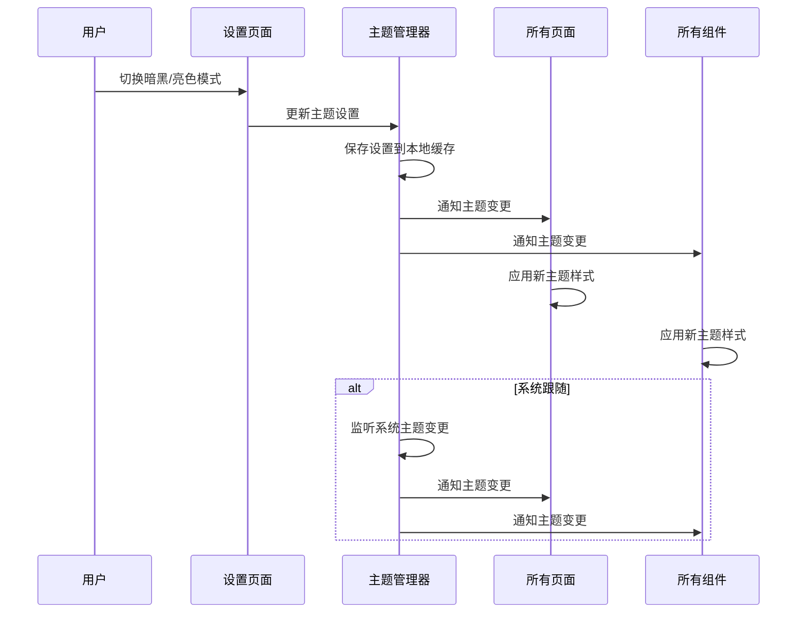
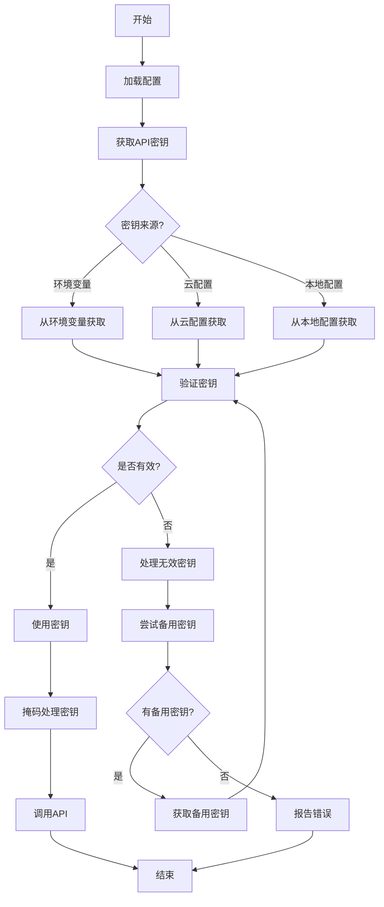
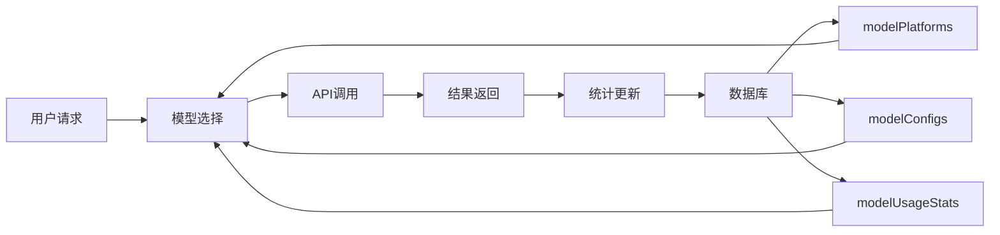

# 配置管理

<cite>
**本文档引用的文件**   
- [index.js](file://miniprogram/config/index.js) - *前端配置中心*
- [theme.json](file://miniprogram/theme.json) - *主题样式定义*
- [config.json](file://cloudfunctions/generateDailyReports/config.json) - *报告生成定时任务配置*
- [model-config.md](file://doc/开发文档/database/model-config.md) - *新增：AI模型配置数据库设计*
- [aiModelService.js](file://cloudfunctions/analysis/aiModelService.js) - *AI模型服务实现*
- [modelService.js](file://miniprogram/services/modelService.js) - *前端模型选择服务*
</cite>

## 更新摘要
**已做更改**   
- 在“配置项对系统行为的影响”章节中新增了关于AI模型动态配置的详细说明
- 新增了“AI模型动态配置”章节，系统阐述了基于数据库的模型管理机制
- 更新了“敏感信息安全管理”章节，补充了数据库配置与环境变量的协同工作方式
- 更新了文档引用文件列表，新增了数据库设计文档和相关服务文件

## 目录
1. [前端配置管理](#前端配置管理)
2. [主题样式配置](#主题样式配置)
3. [报告生成配置](#报告生成配置)
4. [配置项对系统行为的影响](#配置项对系统行为的影响)
5. [敏感信息安全管理](#敏感信息安全管理)
6. [环境区分策略](#环境区分策略)
7. [AI模型动态配置](#ai模型动态配置)

## 前端配置管理

前端配置文件 `miniprogram/config/index.js` 作为应用的全局配置中心，集中管理了API地址、功能开关和第三方服务密钥等核心参数。该文件通过模块化的方式组织配置，分为云环境、用户、角色和主题四大配置模块。

云环境配置（`cloudConfig`）定义了云开发环境的ID、云函数调用的超时时间（30000毫秒）和最大重试次数（3次），确保了与后端服务通信的稳定性和容错能力。用户配置（`userConfig`）则包含了应用的默认状态，如游客用户的默认头像和用户名，以及情绪分析和个性分析的默认数据模型，为新用户提供了一致的初始体验。

角色配置（`roleConfig`）管理着应用内角色的分类体系，包括家庭、朋友、工作、恋爱等类别，以及父母、子女、同事等具体关系选项。这些配置不仅用于角色选择和编辑界面，还通过`RELATIONSHIP_TO_CATEGORY_MAP`映射，实现了关系与角色功能类别的自动关联，简化了用户操作。

**Section sources**
- [index.js](file://miniprogram/config/index.js#L1-L166)

## 主题样式配置

小程序的主题样式由 `miniprogram/theme.json` 文件统一定义，该文件为亮色模式（light）和暗黑模式（dark）提供了两套完整的视觉设计系统。每套主题都包含背景色、文本色、边框色、主色调以及阴影效果等详细的CSS变量，确保了UI在不同模式下的一致性和美观性。

主题的动态切换机制由应用的全局状态管理。当用户在设置中更改主题偏好时，系统会通过`app.js`中的`updateTheme`方法更新全局的`darkMode`状态，并通知所有页面和组件进行更新。页面和组件通过监听此状态，在其根元素上设置`data-theme="dark"`属性，从而应用暗黑模式下的CSS变量。

此外，系统支持“跟随系统”设置，通过`wx.onThemeChange` API监听微信客户端的系统主题变化，并自动同步应用的主题，为用户提供无缝的体验。

**Diagram sources**
- [theme.json](file://miniprogram/theme.json#L1-L76)
- [app.js](file://miniprogram/app.js#L244-L292)

**Section sources**
- [theme.json](file://miniprogram/theme.json#L1-L76)
- [app.js](file://miniprogram/app.js#L244-L292)

## 报告生成配置

每日心情报告的生成由云函数 `generateDailyReports` 负责，其触发机制在 `cloudfunctions/generateDailyReports/config.json` 中通过定时器（timer）触发器进行配置。该配置文件定义了一个名为`dailyReportTrigger`的触发器，其执行计划（`config`）遵循Cron表达式，设置为`0 0 2 * * * *`。

此Cron表达式表示云函数将在每天凌晨2点（UTC+8时区）准时执行，负责收集用户当天的情绪数据、聊天记录和兴趣标签，生成一份详细的每日心情报告，并通过消息推送或邮件等方式发送给用户。这种基于配置的定时任务管理方式，使得报告生成的时间策略可以灵活调整，而无需修改任何代码。

**Section sources**
- [config.json](file://cloudfunctions/generateDailyReports/config.json#L1-L9)

## 配置项对系统行为的影响

系统的各项配置项直接决定了其核心功能的行为。例如，在`miniprogram/config/index.js`中，`roleConfig`的`CATEGORIES`和`RELATIONSHIPS`数组定义了用户可以选择的角色范围，从而影响了聊天功能的交互场景。`userConfig`中的`DEFAULT_EMOTION_DATA`则预设了情绪分析的初始数据模型，影响了情绪仪表盘的展示效果。

在后端云函数中，配置项对AI模型的启用和行为有更直接的影响。云函数`aiModelService.js`通过读取环境变量中的配置来决定启用哪个AI模型。例如，`GEMINI_API_KEY`环境变量的存在与否，直接决定了Gemini模型服务是否可用。同时，模型的敏感度等参数也通过配置文件进行调整，如`emotion`云函数中可能存在的分析阈值，可以控制情绪识别的严格程度，从而影响分析结果的精确性。

**Section sources**
- [aiModelService.js](file://cloudfunctions/analysis/aiModelService.js#L88-L143)

## 敏感信息安全管理

为避免API密钥等敏感信息在代码中硬编码导致泄露，项目采用了环境变量（Environment Variables）作为安全存储的最佳实践。所有第三方服务的密钥，如Gemini、智谱AI、讯飞语音等的API密钥，均不直接写入源代码，而是存储在云开发平台的环境变量中。

云函数通过`process.env[platform.apiKeyEnv]`的方式从运行时环境中读取这些密钥。例如，在`analysis/aiModelService.js`中，系统会检查`GEMINI_API_KEY`等环境变量是否已设置，若未设置则抛出错误提示。这种机制确保了即使源代码仓库被公开，敏感信息也不会暴露。同时，文档中明确指出，密钥信息必须存储在环境变量中，避免硬编码。

**Diagram sources**
- [aiModelService.js](file://cloudfunctions/analysis/aiModelService.js#L88-L143)
- [HeartChat外部API调用流程图.md](file://doc/设计文档/流程图/HeartChat外部API调用流程图.md#L235-L267)

## 环境区分策略

项目的配置管理支持开发（development）和生产（production）环境的区分。核心策略是利用云开发平台提供的环境变量功能，为不同环境设置不同的变量值。

在开发环境中，可以使用测试用的API密钥和云环境ID，以便于调试和避免消耗生产环境的资源或产生费用。当代码部署到生产环境时，只需在云开发控制台中更新环境变量为正式的密钥和ID，应用即可无缝切换到生产模式。这种方式实现了“一次代码，多环境部署”，保证了代码的一致性，同时通过配置隔离了环境差异，是安全且高效的环境管理策略。

## AI模型动态配置

为实现AI模型的灵活管理和智能选择，系统引入了基于数据库的动态配置机制。该机制通过三个核心数据库集合（`modelPlatforms`、`modelConfigs`、`modelUsageStats`）来存储和管理AI模型的全部信息。

`modelPlatforms`集合存储AI模型提供商的基础信息，包括API地址、认证方式和API密钥对应的环境变量名（`apiKeyEnv`）。`modelConfigs`集合则存储具体模型的详细配置，如模型能力、定价、最大token数等。`modelUsageStats`集合记录每个模型的使用统计，包括调用次数、成功率和平均响应时间，为智能模型选择提供数据支持。

前端通过`modelService.js`服务与后端交互，获取可用的模型类型列表和具体模型列表。用户可以在模型选择器组件中切换不同的AI平台（如智谱AI、Gemini、ChatGPT等），系统会根据数据库中的配置动态加载相应的模型选项。这种设计使得添加新AI模型无需修改代码，只需在数据库中添加配置即可生效，极大地提高了系统的可扩展性和运维效率。

**Diagram sources**
- [model-config.md](file://doc/开发文档/database/model-config.md#L1-L195)
- [modelService.js](file://miniprogram/services/modelService.js#L1-L335)

**Section sources**
- [model-config.md](file://doc/开发文档/database/model-config.md#L1-L195)
- [aiModelService.js](file://cloudfunctions/analysis/aiModelService.js#L1-L662)
- [modelService.js](file://miniprogram/services/modelService.js#L1-L335)