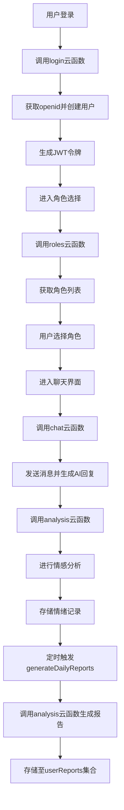

# 项目概述

<cite>
**本文档引用的文件**  
- [README.md](file://README.md)
- [login/index.js](file://cloudfunctions/login/index.js)
- [roles/index.js](file://cloudfunctions/roles/index.js)
- [chat/index.js](file://cloudfunctions/chat/index.js)
- [analysis/index.js](file://cloudfunctions/analysis/index.js)
- [generateDailyReports/index.js](file://cloudfunctions/generateDailyReports/index.js)
- [cloudFuncCaller.js](file://miniprogram/services/cloudFuncCaller.js)
- [userService.js](file://miniprogram/services/userService.js)
- [emotionService.js](file://miniprogram/services/emotionService.js)
- [reportService.js](file://miniprogram/services/reportService.js)
</cite>

## 目录
1. [项目愿景与核心价值](#项目愿景与核心价值)
2. [主要用户场景](#主要用户场景)
3. [技术架构优势](#技术架构优势)
4. [系统工作流程](#系统工作流程)
5. [学习路径指引](#学习路径指引)
6. [系统边界与扩展潜力](#系统边界与扩展潜力)

## 项目愿景与核心价值

心语精灵是一款基于微信小程序云开发的情感陪伴与情商提升应用，致力于为用户提供一个安全、私密且富有同理心的倾诉空间。其核心价值在于通过AI角色互动、情绪分析和每日心情报告等功能，帮助用户整理思绪、识别情绪模式，并逐步提升自我认知与人际交往能力。项目旨在成为用户日常心理支持的可靠伙伴，不仅提供即时的情感反馈，还通过长期的数据积累与分析，为用户提供个性化的成长建议。

**Section sources**
- [README.md](file://README.md#L1-L100)

## 主要用户场景

本应用服务于多种情感需求场景。对于需要情感倾诉的用户，他们可以通过与定制化的AI角色进行对话，安全地表达内心感受；寻求心理支持的用户可以获得基于情绪分析的即时反馈与建议；希望记录心情变化的用户能够通过情绪历史功能追踪自己的情绪轨迹；而关注个人成长的用户则能通过每日心情报告深入了解自己的兴趣领域与情绪波动规律。此外，用户中心提供了全面的个人数据视图，帮助用户更好地认识自己。

**Section sources**
- [README.md](file://README.md#L101-L150)

## 技术架构优势

项目采用微信小程序云开发架构，实现了前后端分离，极大地提升了开发效率与系统可维护性。后端利用云函数（Node.js）处理核心业务逻辑，如用户登录、角色管理、聊天交互和情感分析，所有业务逻辑均封装在`cloudfunctions`目录下。云数据库（MongoDB风格）用于存储用户信息、聊天记录、情绪分析数据和每日报告，确保数据的持久化与高效查询。云存储则用于管理用户头像等静态资源。这种架构免去了传统服务器的运维成本，开发者可以专注于业务逻辑的实现。

**Section sources**
- [README.md](file://README.md#L151-L250)

## 系统工作流程

系统的工作流程始于用户登录。当用户首次使用时，`login`云函数会通过微信的`wx.login()`获取用户的`openid`，并创建或更新用户在`user_base`和`user_stats`集合中的信息，同时生成JWT令牌用于后续的身份验证。



**Diagram sources**
- [login/index.js](file://cloudfunctions/login/index.js#L1-L268)
- [roles/index.js](file://cloudfunctions/roles/index.js#L1-L759)
- [chat/index.js](file://cloudfunctions/chat/index.js#L1-L1413)
- [analysis/index.js](file://cloudfunctions/analysis/index.js#L1-L1117)
- [generateDailyReports/index.js](file://cloudfunctions/generateDailyReports/index.js#L1-L201)

**Section sources**
- [login/index.js](file://cloudfunctions/login/index.js#L1-L268)
- [roles/index.js](file://cloudfunctions/roles/index.js#L1-L759)
- [chat/index.js](file://cloudfunctions/chat/index.js#L1-L1413)
- [analysis/index.js](file://cloudfunctions/analysis/index.js#L1-L1117)
- [generateDailyReports/index.js](file://cloudfunctions/generateDailyReports/index.js#L1-L201)

用户登录后进入角色选择界面，`roles`云函数负责提供预设和用户自定义的角色列表。选定角色后，用户进入聊天界面，`chat`云函数处理消息的发送与接收。在此过程中，`analysis`云函数被调用，利用智谱AI或Google Gemini等大模型对用户的输入进行实时情感分析，并将结果（如情绪类型、强度、关键词）存储到`emotionRecords`集合中。

最终，一个定时触发器每天调用`generateDailyReports`云函数，该函数会遍历活跃用户，调用`analysis`云函数的`daily_report`功能，整合用户当天的对话内容和情绪记录，生成一份包含情绪总结、关注点分析、今日运势和小建议的个性化每日心情报告，并将其存储在`userReports`集合中。

## 学习路径指引

对于初学者，建议从`miniprogram/services`目录下的业务服务模块入手，如`cloudFuncCaller.js`、`userService.js`、`emotionService.js`和`reportService.js`。这些文件封装了对云函数的调用，是理解前端如何与后端交互的最佳起点。例如，`cloudFuncCaller.js`提供了统一的云函数调用接口，而`emotionService.js`则清晰地展示了如何发起情感分析请求。

```mermaid
classDiagram
class CloudFuncCaller {
+callCloudFunc(name, data, options)
+batchCallCloudFunc(calls, options)
}
class UserService {
+getUserProfile(userId, forceRefresh)
+saveUserProfile(userId, profileData)
+buildUserQuery(userInfo)
}
class EmotionService {
+analyzeEmotion(text, options)
+getEmotionHistory(userId, roleId, limit)
+matchRoleByEmotion(emotion, roleList)
}
class ReportService {
+getDailyReport(date, forceRegenerate)
+getReportList(limit, skip)
+getUserInterests()
}
CloudFuncCaller <|-- UserService : "uses"
CloudFuncCaller <|-- EmotionService : "uses"
CloudFuncCaller <|-- ReportService : "uses"
UserService --> "user_base" : "reads/writes"
EmotionService --> "emotionRecords" : "reads/writes"
ReportService --> "userReports" : "reads"
```

**Diagram sources**
- [cloudFuncCaller.js](file://miniprogram/services/cloudFuncCaller.js#L1-L180)
- [userService.js](file://miniprogram/services/userService.js#L1-L369)
- [emotionService.js](file://miniprogram/services/emotionService.js#L1-L1214)
- [reportService.js](file://miniprogram/services/reportService.js#L1-L149)

**Section sources**
- [cloudFuncCaller.js](file://miniprogram/services/cloudFuncCaller.js#L1-L180)
- [userService.js](file://miniprogram/services/userService.js#L1-L369)
- [emotionService.js](file://miniprogram/services/emotionService.js#L1-L1214)
- [reportService.js](file://miniprogram/services/reportService.js#L1-L149)

掌握前端服务后，可以深入`cloudfunctions`目录，研究`login`、`roles`、`chat`和`analysis`等云函数的实现细节，理解其如何与云数据库交互并调用第三方AI API。

## 系统边界与扩展潜力

当前系统边界清晰，核心功能围绕用户、角色、聊天、情感分析和报告生成展开。其扩展潜力巨大。在AI模型方面，系统已设计为支持多模型（智谱AI、Gemini、OpenAI等），未来可轻松集成更多大模型。在功能上，可基于现有的用户画像和兴趣分析，开发更高级的“AI心理咨询师”角色，提供更专业的心理疏导。此外，系统可扩展为支持用户间的情感互助社区，或与可穿戴设备集成，将生理数据（如心率）与情绪分析结合，提供更全面的心理健康洞察。

**Section sources**
- [README.md](file://README.md#L251-L300)