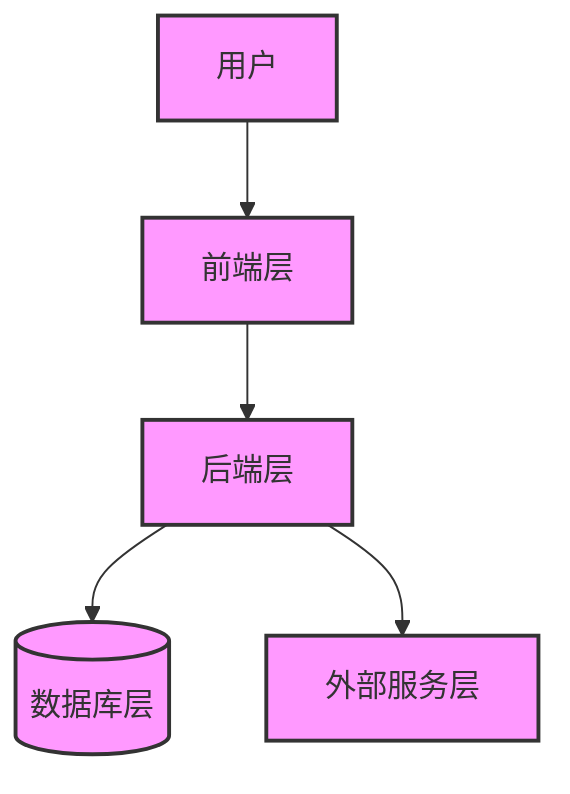
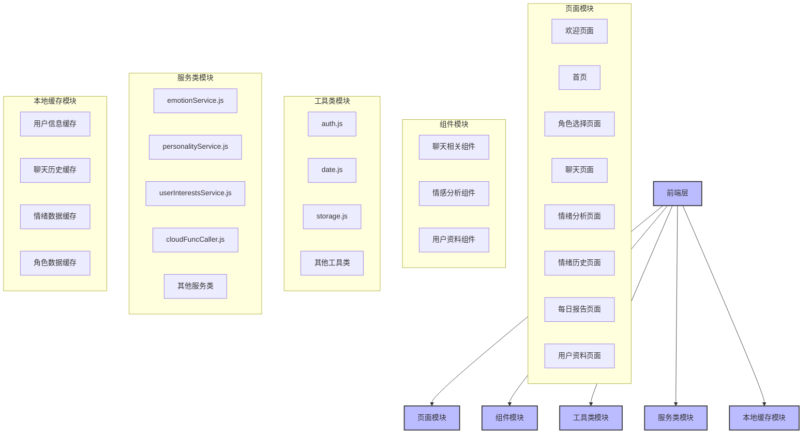
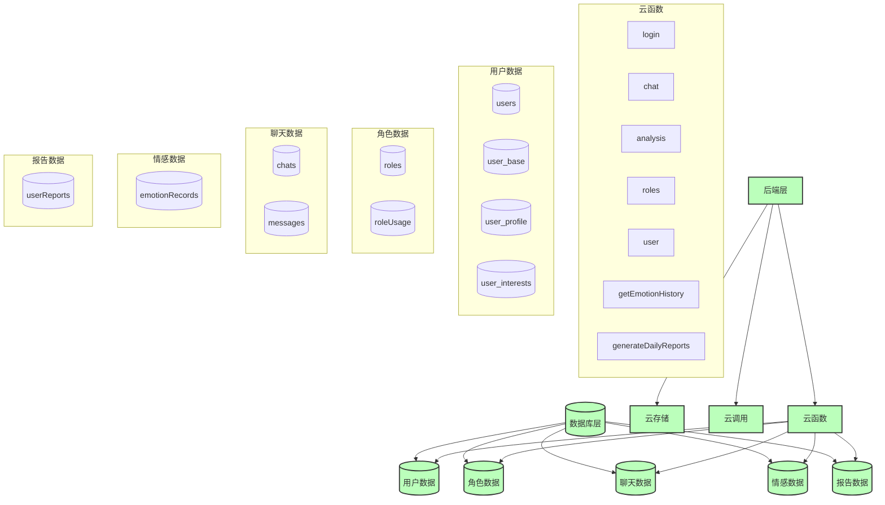
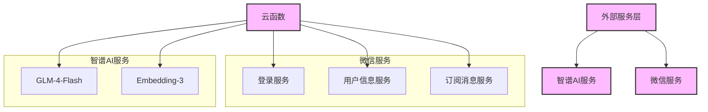
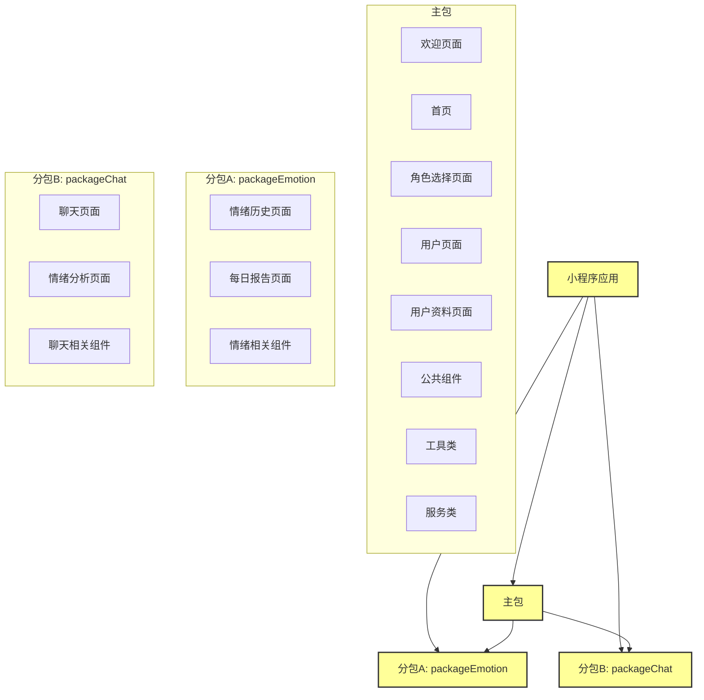
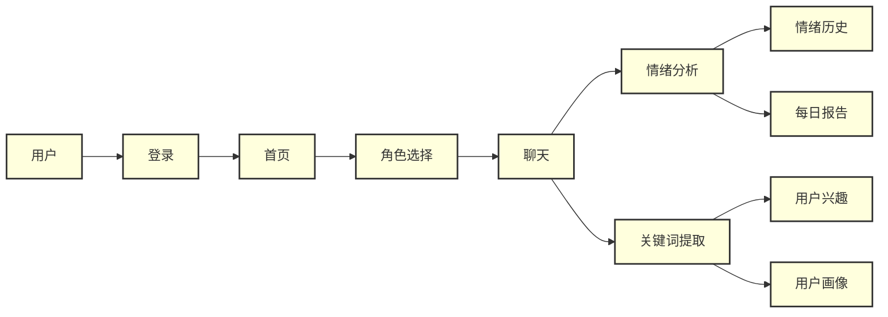

# HeartChat系统架构图

本文档展示了HeartChat项目的系统架构，包括前端、后端、数据库和外部服务的组织结构。为了提高可读性，系统架构被拆分为多个图表展示。

## 1. 整体系统架构

```mermaid
graph TB
    User[用户] --> Frontend[前端层]
    Frontend --> Backend[后端层]
    Backend --> Database[(数据库层)]
    Backend --> ExternalServices[外部服务层]

    classDef mainNode fill:#f9f,stroke:#333,stroke-width:2px;
    class User,Frontend,Backend,Database,ExternalServices mainNode;
```

## 2. 前端架构

```mermaid
graph TB
    Frontend[前端层] --> Pages[页面模块]
    Frontend --> Components[组件模块]
    Frontend --> Utils[工具类模块]
    Frontend --> Services[服务类模块]
    Frontend --> LocalCache[本地缓存模块]

    subgraph 页面模块
        P1[欢迎页面]
        P2[首页]
        P3[角色选择页面]
        P4[聊天页面]
        P5[情绪分析页面]
        P6[情绪历史页面]
        P7[每日报告页面]
        P8[用户资料页面]
    end

    subgraph 组件模块
        C1[聊天相关组件]
        C2[情感分析组件]
        C3[用户资料组件]
    end

    subgraph 工具类模块
        U1[auth.js]
        U2[date.js]
        U3[storage.js]
        U4[其他工具类]
    end

    subgraph 服务类模块
        S1[emotionService.js]
        S2[personalityService.js]
        S3[userInterestsService.js]
        S4[cloudFuncCaller.js]
        S5[其他服务类]
    end

    subgraph 本地缓存模块
        L1[用户信息缓存]
        L2[聊天历史缓存]
        L3[情绪数据缓存]
        L4[角色数据缓存]
    end

    classDef mainNode fill:#bbf,stroke:#333,stroke-width:2px;
    class Frontend,Pages,Components,Utils,Services,LocalCache mainNode;
```

## 3. 后端和数据库架构

```mermaid
graph TB
    Backend[后端层] --> CloudFunctions[云函数]
    Backend --> CloudStorage[云存储]
    Backend --> CloudCalls[云调用]

    Database[(数据库层)] --> UserData[(用户数据)]
    Database --> RoleData[(角色数据)]
    Database --> ChatData[(聊天数据)]
    Database --> EmotionData[(情感数据)]
    Database --> ReportData[(报告数据)]

    subgraph 云函数
        CF1[login]
        CF2[chat]
        CF3[analysis]
        CF4[roles]
        CF5[user]
        CF6[getEmotionHistory]
        CF7[generateDailyReports]
    end

    subgraph 用户数据
        UD1[(users)]
        UD2[(user_base)]
        UD3[(user_profile)]
        UD4[(user_interests)]
    end

    subgraph 角色数据
        RD1[(roles)]
        RD2[(roleUsage)]
    end

    subgraph 聊天数据
        CD1[(chats)]
        CD2[(messages)]
    end

    subgraph 情感数据
        ED1[(emotionRecords)]
    end

    subgraph 报告数据
        RPD1[(userReports)]
    end

    %% 主要连接
    CloudFunctions --> UserData
    CloudFunctions --> RoleData
    CloudFunctions --> ChatData
    CloudFunctions --> EmotionData
    CloudFunctions --> ReportData

    classDef mainNode fill:#bfb,stroke:#333,stroke-width:2px;
    class Backend,Database,CloudFunctions,CloudStorage,CloudCalls,UserData,RoleData,ChatData,EmotionData,ReportData mainNode;
```

## 4. 外部服务集成

```mermaid
graph TB
    ExternalServices[外部服务层] --> ZhipuAI[智谱AI服务]
    ExternalServices --> WeChatServices[微信服务]

    subgraph 智谱AI服务
        AI1[GLM-4-Flash]
        AI2[Embedding-3]
    end

    subgraph 微信服务
        WX1[登录服务]
        WX2[用户信息服务]
        WX3[订阅消息服务]
    end

    %% 云函数与外部服务的关系
    CF[云函数] --> AI1
    CF --> AI2
    CF --> WX1
    CF --> WX2
    CF --> WX3

    classDef mainNode fill:#fbf,stroke:#333,stroke-width:2px;
    class ExternalServices,ZhipuAI,WeChatServices,CF mainNode;
```

## 5. 微信小程序分包结构

```mermaid
graph TB
    App[小程序应用] --> MainPackage[主包]
    App --> SubPackageA[分包A: packageEmotion]
    App --> SubPackageB[分包B: packageChat]

    subgraph 主包
        MP1[欢迎页面]
        MP2[首页]
        MP3[角色选择页面]
        MP4[用户页面]
        MP5[用户资料页面]
        MP6[公共组件]
        MP7[工具类]
        MP8[服务类]
    end

    subgraph 分包A: packageEmotion
        SPA1[情绪历史页面]
        SPA2[每日报告页面]
        SPA3[情绪相关组件]
    end

    subgraph 分包B: packageChat
        SPB1[聊天页面]
        SPB2[情绪分析页面]
        SPB3[聊天相关组件]
    end

    %% 主要连接
    MainPackage --> SubPackageA
    MainPackage --> SubPackageB

    classDef mainNode fill:#ff9,stroke:#333,stroke-width:2px;
    class App,MainPackage,SubPackageA,SubPackageB mainNode;
```

## 6. 核心功能流程

```mermaid
graph LR
    User[用户] --> Login[登录]
    Login --> Home[首页]

    Home --> RoleSelect[角色选择]
    RoleSelect --> Chat[聊天]

    Chat --> EmotionAnalysis[情绪分析]
    Chat --> KeywordExtraction[关键词提取]

    EmotionAnalysis --> EmotionHistory[情绪历史]
    EmotionAnalysis --> DailyReport[每日报告]

    KeywordExtraction --> UserInterests[用户兴趣]
    KeywordExtraction --> UserProfile[用户画像]

    classDef processNode fill:#ffd,stroke:#333,stroke-width:2px;
    class User,Login,Home,RoleSelect,Chat,EmotionAnalysis,KeywordExtraction,EmotionHistory,DailyReport,UserInterests,UserProfile processNode;
```
