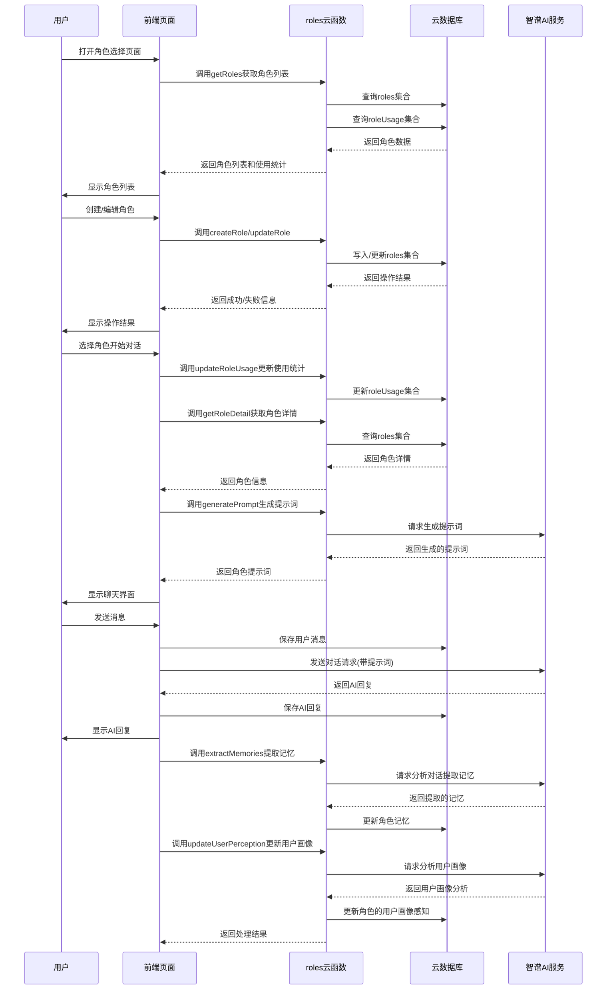
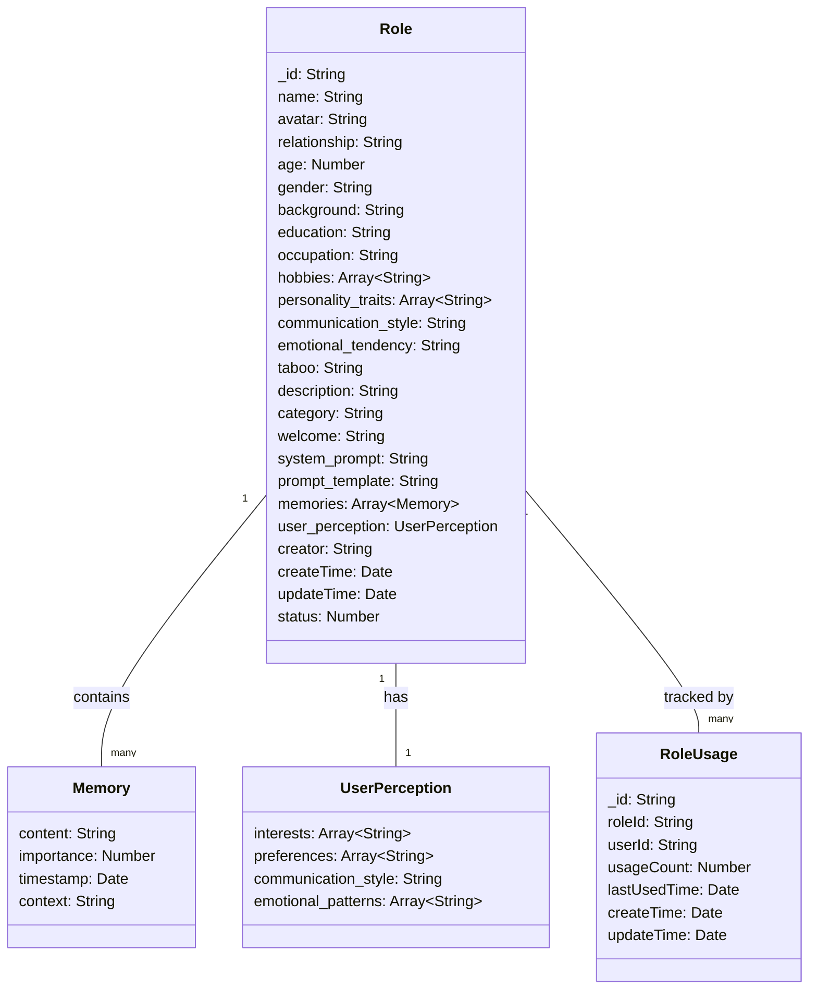

# HeartChat 角色系统架构图

```mermaid
graph TB
    %% 前端部分
    subgraph 前端["前端 (miniprogram)"]
        RoleSelect["角色选择页面\n(pages/role-select/role-select.js)"]
        RoleEditor["角色编辑页面\n(pages/role-editor/index.js)"]
        RoleCard["角色卡片组件\n(components/role-card/)"]
        ChatPage["聊天页面\n(packageChat/pages/chat/chat.js)"]
        ImageService["图片服务\n(services/imageService.js)"]
    end

    %% 云函数部分
    subgraph 云函数["云函数 (cloudfunctions)"]
        RolesMain["roles 云函数入口\n(roles/index.js)"]
        
        subgraph 角色管理["角色基础管理"]
            GetRoles["获取角色列表\n(getRoles)"]
            GetRoleDetail["获取角色详情\n(getRoleDetail)"]
            CreateRole["创建角色\n(createRole)"]
            UpdateRole["更新角色\n(updateRole)"]
            DeleteRole["删除角色\n(deleteRole)"]
            UpdateUsage["更新使用统计\n(updateRoleUsage)"]
            GetStats["获取消息统计\n(getRoleMessageStats)"]
            InitRoles["初始化角色数据\n(init-roles.js)"]
        end
        
        subgraph 提示词生成["提示词生成"]
            PromptGenerator["提示词生成器\n(promptGenerator.js)"]
            GeneratePrompt["生成角色提示词\n(generatePrompt)"]
        end
        
        subgraph 记忆管理["记忆管理"]
            MemoryManager["记忆管理器\n(memoryManager.js)"]
            ExtractMemories["提取对话记忆\n(extractMemories)"]
            GetRelevantMemories["获取相关记忆\n(getRelevantMemories)"]
        end
        
        subgraph 用户画像["用户画像"]
            UserPerception["用户画像管理\n(userPerception.js)"]
            UpdatePerception["更新用户画像\n(updateUserPerception)"]
            GetPerceptionSummary["获取画像摘要\n(getUserPerceptionSummary)"]
        end
        
        HttpRequest["HTTP请求云函数\n(httpRequest)"]
    end
    
    %% 外部服务
    subgraph 外部服务["外部AI服务"]
        ZhipuAI["智谱AI\n(GLM-4/GLM-4-Flash)"]
    end
    
    %% 数据库
    subgraph 数据库["云数据库"]
        RolesCollection["roles 集合"]
        RoleUsageCollection["roleUsage 集合"]
        MessagesCollection["messages 集合"]
    end
    
    %% 前端与云函数的关系
    RoleSelect -- "调用getRoles" --> GetRoles
    RoleSelect -- "调用getRoleDetail" --> GetRoleDetail
    RoleSelect -- "调用deleteRole" --> DeleteRole
    RoleSelect -- "调用updateRoleUsage" --> UpdateUsage
    RoleSelect -- "使用" --> RoleCard
    
    RoleEditor -- "调用getRoleDetail" --> GetRoleDetail
    RoleEditor -- "调用createRole" --> CreateRole
    RoleEditor -- "调用updateRole" --> UpdateRole
    
    ChatPage -- "调用getRoleDetail" --> GetRoleDetail
    ChatPage -- "调用generatePrompt" --> GeneratePrompt
    ChatPage -- "调用extractMemories" --> ExtractMemories
    ChatPage -- "调用updateUserPerception" --> UpdatePerception
    ChatPage -- "使用" --> ImageService
    
    %% 云函数内部关系
    RolesMain --> GetRoles
    RolesMain --> GetRoleDetail
    RolesMain --> CreateRole
    RolesMain --> UpdateRole
    RolesMain --> DeleteRole
    RolesMain --> UpdateUsage
    RolesMain --> GetStats
    RolesMain --> InitRoles
    RolesMain --> GeneratePrompt
    RolesMain --> ExtractMemories
    RolesMain --> GetRelevantMemories
    RolesMain --> UpdatePerception
    RolesMain --> GetPerceptionSummary
    
    GeneratePrompt --> PromptGenerator
    ExtractMemories --> MemoryManager
    GetRelevantMemories --> MemoryManager
    UpdatePerception --> UserPerception
    GetPerceptionSummary --> UserPerception
    
    PromptGenerator -- "调用" --> HttpRequest
    MemoryManager -- "调用" --> HttpRequest
    UserPerception -- "调用" --> HttpRequest
    
    %% 云函数与外部服务的关系
    HttpRequest -- "请求" --> ZhipuAI
    
    %% 云函数与数据库的关系
    GetRoles -- "查询" --> RolesCollection
    GetRoles -- "查询" --> RoleUsageCollection
    GetRoleDetail -- "查询" --> RolesCollection
    CreateRole -- "写入" --> RolesCollection
    UpdateRole -- "更新" --> RolesCollection
    DeleteRole -- "删除" --> RolesCollection
    UpdateUsage -- "更新" --> RoleUsageCollection
    GetStats -- "查询" --> MessagesCollection
    InitRoles -- "写入" --> RolesCollection
    
    MemoryManager -- "更新" --> RolesCollection
    UserPerception -- "更新" --> RolesCollection
    
    %% 数据流向
    ZhipuAI -- "返回AI生成内容" --> HttpRequest
    
    %% 样式
    classDef frontend fill:#d4f1f9,stroke:#05a,stroke-width:1px;
    classDef cloudfunction fill:#ffe6cc,stroke:#d79b00,stroke-width:1px;
    classDef database fill:#e1d5e7,stroke:#9673a6,stroke-width:1px;
    classDef external fill:#d5e8d4,stroke:#82b366,stroke-width:1px;
    classDef module fill:#fff2cc,stroke:#d6b656,stroke-width:1px;
    
    class 前端 frontend;
    class RoleSelect,RoleEditor,RoleCard,ChatPage,ImageService frontend;
    
    class 云函数 cloudfunction;
    class RolesMain,GetRoles,GetRoleDetail,CreateRole,UpdateRole,DeleteRole,UpdateUsage,GetStats,InitRoles,GeneratePrompt,ExtractMemories,GetRelevantMemories,UpdatePerception,GetPerceptionSummary,HttpRequest cloudfunction;
    
    class 角色管理,提示词生成,记忆管理,用户画像 module;
    class PromptGenerator,MemoryManager,UserPerception module;
    
    class 数据库 database;
    class RolesCollection,RoleUsageCollection,MessagesCollection database;
    
    class 外部服务 external;
    class ZhipuAI external;
```

## 角色系统数据流程

```mermaid
sequenceDiagram
    participant User as 用户
    participant Frontend as 前端页面
    participant RolesCloud as roles云函数
    participant Database as 云数据库
    participant ZhipuAI as 智谱AI服务
    
    %% 角色选择流程
    User->>Frontend: 打开角色选择页面
    Frontend->>RolesCloud: 调用getRoles获取角色列表
    RolesCloud->>Database: 查询roles集合
    RolesCloud->>Database: 查询roleUsage集合
    Database-->>RolesCloud: 返回角色数据
    RolesCloud-->>Frontend: 返回角色列表和使用统计
    Frontend->>User: 显示角色列表
    
    %% 角色创建/编辑流程
    User->>Frontend: 创建/编辑角色
    Frontend->>RolesCloud: 调用createRole/updateRole
    RolesCloud->>Database: 写入/更新roles集合
    Database-->>RolesCloud: 返回操作结果
    RolesCloud-->>Frontend: 返回成功/失败信息
    Frontend->>User: 显示操作结果
    
    %% 聊天开始流程
    User->>Frontend: 选择角色开始对话
    Frontend->>RolesCloud: 调用updateRoleUsage更新使用统计
    RolesCloud->>Database: 更新roleUsage集合
    Frontend->>RolesCloud: 调用getRoleDetail获取角色详情
    RolesCloud->>Database: 查询roles集合
    Database-->>RolesCloud: 返回角色详情
    RolesCloud-->>Frontend: 返回角色信息
    Frontend->>RolesCloud: 调用generatePrompt生成提示词
    RolesCloud->>ZhipuAI: 请求生成提示词
    ZhipuAI-->>RolesCloud: 返回生成的提示词
    RolesCloud-->>Frontend: 返回角色提示词
    Frontend->>User: 显示聊天界面
    
    %% 对话过程
    User->>Frontend: 发送消息
    Frontend->>Database: 保存用户消息
    Frontend->>ZhipuAI: 发送对话请求(带提示词)
    ZhipuAI-->>Frontend: 返回AI回复
    Frontend->>Database: 保存AI回复
    Frontend->>User: 显示AI回复
    
    %% 对话结束后的处理
    Frontend->>RolesCloud: 调用extractMemories提取记忆
    RolesCloud->>ZhipuAI: 请求分析对话提取记忆
    ZhipuAI-->>RolesCloud: 返回提取的记忆
    RolesCloud->>Database: 更新角色记忆
    Frontend->>RolesCloud: 调用updateUserPerception更新用户画像
    RolesCloud->>ZhipuAI: 请求分析用户画像
    ZhipuAI-->>RolesCloud: 返回用户画像分析
    RolesCloud->>Database: 更新角色的用户画像感知
    RolesCloud-->>Frontend: 返回处理结果
```

## 角色数据结构

```mermaid
classDiagram
    class Role {
        _id: String
        name: String
        avatar: String
        relationship: String
        age: Number
        gender: String
        background: String
        education: String
        occupation: String
        hobbies: Array~String~
        personality_traits: Array~String~
        communication_style: String
        emotional_tendency: String
        taboo: String
        description: String
        category: String
        welcome: String
        system_prompt: String
        prompt_template: String
        memories: Array~Memory~
        user_perception: UserPerception
        creator: String
        createTime: Date
        updateTime: Date
        status: Number
    }
    
    class Memory {
        content: String
        importance: Number
        timestamp: Date
        context: String
    }
    
    class UserPerception {
        interests: Array~String~
        preferences: Array~String~
        communication_style: String
        emotional_patterns: Array~String~
    }
    
    class RoleUsage {
        _id: String
        roleId: String
        userId: String
        usageCount: Number
        lastUsedTime: Date
        createTime: Date
        updateTime: Date
    }
    
    Role "1" -- "many" Memory : contains
    Role "1" -- "1" UserPerception : has
    Role "1" -- "many" RoleUsage : tracked by
```
