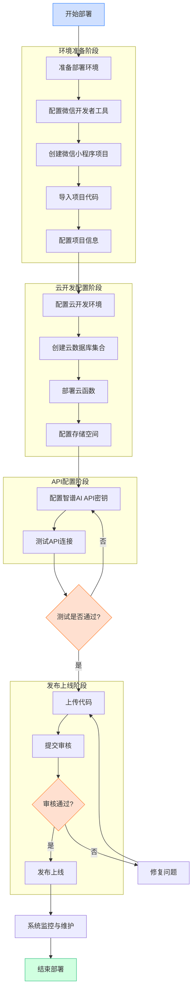

好的，我已经根据你提供的 `作品报告/第4章系统实现.md` 文件内容，并结合之前讨论的结构和插入图片/流程图的需求，重新生成了一份更完善、完整的第4章内容。我在相应位置添加了注释，指明了可以插入原型图和流程图的地方，并引用了你提供的流程图文件。

---

# 第4章 系统实现

本章将从工程实现的角度，详细阐述第3章所提出的“心语精灵”技术方案的具体落地过程。内容涵盖前端用户界面设计与交互、组件化开发实践、后端云函数逻辑、AI模型集成、数据处理与存储机制、系统部署方法，并分享在开发过程中遇到的主要挑战及其解决方案。

## 4.1 前端实现：微信小程序

前端采用微信小程序原生框架进行开发，负责用户界面的呈现、用户交互的响应以及与云端服务的通信。

### 4.1.1 页面设计与交互

**整体UI设计风格与原则**

心语精灵的UI设计遵循"简约、温暖、专业"的设计理念，采用了符合iOS设计规范(Human Interface Guidelines)的卡片式布局、圆角元素和适当的投影效果，确保视觉体验现代简洁。整体设计风格基于以下原则：

*   **简约清晰**：界面元素精简，避免视觉干扰，让用户专注于情感表达和交流。采用留白设计，增强内容的可读性和重要性。
*   **情感温暖**：使用柔和的色彩和圆润的形状，创造温馨舒适的视觉感受。主色调采用淡蓝色(#4A90E2)，辅以柔和的粉色(#F8BBD0)和薄荷绿(#B2DFDB)，传达平静、信任和希望的情感。
*   **一致性**：在整个应用中保持设计元素的一致性，包括颜色、字体、图标和交互方式，降低用户的认知负担。
*   **可访问性**：确保文本对比度符合WCAG 2.0 AA标准，支持系统字体大小调整，并为交互元素提供足够大的点击区域。
*   **暗夜模式支持**：全面支持暗夜模式（详见4.1.3节），所有界面元素都有明暗两套配色方案，减轻用户在夜间使用时的视觉疲劳。

用户界面的整体流程可以参考《HeartChat用户界面流程图》。

<!-- 在此插入 [HeartChat用户界面流程图] (可引用 docs/流程图/html/HeartChat用户界面流程图.html 或截图) -->

**关键页面实现**

*   **欢迎页 (`/miniprogram/pages/welcome/`)**
    *   **设计实现**：作为用户首次进入的界面，设计简洁。顶部展示应用Logo和标语，中部介绍核心功能，底部提供"开始体验"按钮。首次使用会展示简短的功能引导轮播（通过`swiper`组件实现）。
        <!-- 在此插入 [欢迎页原型图] -->
    *   **技术实现**：使用WXML和WXSS构建布局与样式。通过`wx.getUserProfile`获取用户信息（需用户授权），调用`login`云函数完成登录/注册。使用`wx.setStorageSync`存储登录凭证（如token），后续通过`App.js`中的`checkLoginStatus`实现自动登录。

*   **首页 (`/miniprogram/pages/home/`)**
    *   **设计实现**：作为应用主入口，采用卡片式布局展示核心信息：顶部问候语（可根据时间、用户状态动态变化）、最近对话摘要、当前情绪状态概览（饼图）、每日心情报告入口。底部使用自定义TabBar导航。
        <!-- 在此插入 [首页原型图] -->
    *   **技术实现**：页面大量使用自定义组件（如`emotion-card`, `chat-preview-card`）。通过调用`getRecentChats`、`getEmotionStats`等云函数获取动态数据。使用`onPullDownRefresh`实现下拉刷新，`onReachBottom`实现触底加载更多历史数据。情绪饼图通过集成的ECharts组件（`ec-canvas`）渲染。

*   **角色选择页 (`/miniprogram/pages/role-select/`)**
    *   **设计实现**：提供预设和用户自定义AI角色的选择。顶部设有搜索框和横向滚动的分类标签。角色以卡片（`role-card`组件）形式展示，包含头像、名称、简介和标签。点击卡片弹出详情模态框。底部固定“创建新角色”按钮。
        <!-- 在此插入 [角色选择页原型图] -->
    *   **技术实现**：分类标签使用`scroll-view`实现横向滚动。角色列表数据通过调用`roles`云函数的`getRoleList`动作获取，支持分页和按分类、关键词搜索。角色详情弹窗使用`popup`组件。本地缓存（`wx.getStorageSync`）用于存储用户常用或收藏的角色，加速加载。

*   **聊天页 (`/miniprogram/packageChat/pages/chat/`)**
    *   **设计实现**：核心交互界面。顶部导航栏显示当前AI角色信息。对话区域采用气泡（`chat-bubble`组件）布局，区分用户和AI消息。AI回复支持打字机流式输出效果。底部为输入区域（`chat-input`组件），支持文本和表情输入。
        <!-- 在此插入 [聊天页原型图] -->
    *   **技术实现**：消息列表使用`scroll-view`，并设置`scroll-into-view`属性实现自动滚动到最新消息。`chat-bubble`组件根据消息来源（`isSelf`属性）应用不同样式。流式输出通过WebSocket或轮询云函数实现，前端逐步更新消息内容。消息发送调用`chat`云函数的`sendMessage`动作。集成实时情感分析，结果展示在消息气泡下方。聊天功能的详细流程可参考《HeartChat功能实现流程图》中的聊天部分。
        <!-- 在此插入 [HeartChat功能实现流程图 - 聊天部分截图] (可引用 docs/流程图/html/HeartChat功能实现流程图.html) -->

*   **情感分析页 (`/miniprogram/pages/emotionAnalysis/` 或分包内)**
    *   **设计实现**：可视化展示情绪数据。顶部显示主要情绪及强度。中部使用ECharts图表（饼图、折线图、雷达图）展示情绪分布、变化趋势和关键词云。底部提供AI生成的个性化建议和情绪洞察。
        <!-- 在此插入 [情感分析页原型图 或 每日报告页原型图] -->
    *   **技术实现**：图表使用`ec-canvas`组件和ECharts库渲染。数据通过调用`emotion`或`analysis`云函数的`getEmotionAnalysis`等动作获取。支持时间范围选择，动态更新图表数据。关键词云组件（`interest-tag-cloud`）根据词频和情绪关联度调整标签大小和颜色。情感分析及报告生成的流程见《HeartChat功能实现流程图》。
        <!-- 在此插入 [HeartChat功能实现流程图 - 情感分析/报告部分截图] (可引用 docs/流程图/html/HeartChat功能实现流程图.html) -->

*   **每日报告页 (`/miniprogram/pages/dailyReport/`)**
    *   **设计实现**：展示用户每日情绪报告。顶部显示日期和情绪概览。中部使用ECharts图表（饼图、折线图、雷达图）展示情绪分布、变化趋势和关键词云。底部提供AI生成的个性化建议和情绪洞察。
        <!-- 在此插入 [每日报告页原型图] -->
    *   **技术实现**：图表使用`ec-canvas`组件和ECharts库渲染。数据通过调用`emotion`或`analysis`云函数的`getEmotionAnalysis`等动作获取。支持时间范围选择，动态更新图表数据。关键词云组件（`interest-tag-cloud`）根据词频和情绪关联度调整标签大小和颜色。情感分析及报告生成的流程见《HeartChat功能实现流程图》。
        <!-- 在此插入 [HeartChat功能实现流程图 - 情感分析/报告部分截图] (可引用 docs/流程图/html/HeartChat功能实现流程图.html) -->

*   **情绪历史页 (`/miniprogram/pages/emotionHistory/`)**
    *   **设计实现**：展示用户情绪历史记录。顶部显示日期和情绪概览。中部使用ECharts图表（饼图、折线图、雷达图）展示情绪分布、变化趋势和关键词云。底部提供AI生成的个性化建议和情绪洞察。
        <!-- 在此插入 [情绪历史页原型图] -->
    *   **技术实现**：图表使用`ec-canvas`组件和ECharts库渲染。数据通过调用`emotion`或`analysis`云函数的`getEmotionAnalysis`等动作获取。支持时间范围选择，动态更新图表数据。关键词云组件（`interest-tag-cloud`）根据词频和情绪关联度调整标签大小和颜色。情感分析及报告生成的流程见《HeartChat功能实现流程图》。
        <!-- 在此插入 [HeartChat功能实现流程图 - 情感分析/报告部分截图] (可引用 docs/流程图/html/HeartChat功能实现流程图.html) -->

*   **个人中心页 (`/miniprogram/pages/profile/`)**
    *   **设计实现**：展示用户信息和设置。顶部显示用户头像和昵称。中部使用列表展示用户信息和设置选项。底部提供退出登录按钮。
        <!-- 在此插入 [个人中心页原型图] -->
    *   **技术实现**：使用`wx.getUserProfile`获取用户信息。通过`wx.getStorageSync`读取本地缓存的用户设置。提供退出登录功能，调用`login`云函数的`logout`动作。
  
*   **角色编辑页 (`/miniprogram/pages/role-editor`)**
    *   **设计实现**：提供创建和编辑AI角色的界面。分步骤引导用户填写角色信息：基本信息（名称、头像、性别）、角色分类、个性设定（性格、说话风格）、专业领域等。使用表单验证确保必填项完整。
        <!-- 在此插入 [角色编辑页原型图] -->
    *   **技术实现**：使用`form`组件管理表单数据。头像上传通过`wx.chooseImage`和云存储实现。表单验证使用自定义的`validator`工具类。角色信息通过调用`roles`云函数的`createRole`或`updateRole`动作保存。使用`wx.showLoading`和`wx.hideLoading`优化保存过程的用户体验。支持草稿功能，通过本地存储（`wx.setStorageSync`）自动保存编辑进度。
    


**用户交互流程优化**

为提升体验，交互流程经过精心设计：
*   **首次引导**：简洁、分步介绍核心功能。
*   **聊天优化**：输入框自动调整、消息自动滚动、AI回复“正在输入”状态、长按操作菜单。
*   **情感分析触发**：消息发送后自动分析，结果非干扰式展示，重要变化主动提示。
*   **角色切换**：支持从聊天页直接切换，保留上下文，提供“新对话”选项。
*   **错误处理**：网络请求失败、AI生成失败等情况提供友好提示、重试或备选方案。

**响应式布局适配**

*   **尺寸**：主要使用`rpx`单位，结合`flex`布局实现自适应。关键元素设置`min/max-width/height`。
*   **安全区域**：适配顶部状态栏和底部安全区，自定义导航栏和底部输入框均考虑安全边距。
*   **横屏**：关键页面（如图表页）支持横屏，布局动态调整。
*   **设备能力**：检测设备性能，对低端机减少动画；根据网络状况调整图片加载策略。

### 4.1.2 组件化开发

心语精灵广泛采用组件化开发模式，提高了代码的复用性和可维护性。组件设计遵循单一职责、高内聚低耦合的原则。

**公共组件设计**

*   **聊天气泡组件 (`/miniprogram/components/chat-bubble/`)**
    *   **设计**：区分用户/AI样式，圆角矩形+指示三角，支持文本自动换行，集成情绪标签，支持长按菜单。
        <!-- 在此插入 [聊天气泡组件截图/设计图] -->
    *   **实现**：通过`properties`接收消息对象(`message`)和发送者标识(`isSelf`)。使用WXS模块处理文本内容。内部管理消息状态（发送中/成功/失败）。

*   **情感分析卡片组件 (`/miniprogram/components/emotion-card/`)**
    *   **设计**：展示主要情绪、情绪分布饼图、关键词和简析。支持点击展开详情。适配不同尺寸场景。
        <!-- 在此插入 [情感分析卡片组件截图/设计图] -->
    *   **实现**：内嵌`ec-canvas`组件渲染饼图。根据传入数据动态生成ECharts `option`。包含情绪图标和颜色映射。

*   **角色卡片组件 (`/miniprogram/components/role-card/`)**
    *   **设计**：展示角色头像、名称、简介、标签。支持多种尺寸。区分系统/用户角色。集成操作按钮。支持点击展开详情。
        <!-- 在此插入 [角色卡片组件截图/设计图] -->
    *   **实现**：通过`properties`接收角色对象(`role`)和尺寸(`size`)。根据`size`调整内部布局和显示内容。使用`popup`组件展示详情。

**业务组件封装**

*   **情绪历史图表组件 (`/miniprogram/components/emotion-history/`)**
    *   **设计**：可视化情绪变化趋势。支持折线图、雷达图、柱状图等。支持时间范围选择和图表交互。
    *   **实现**：封装`ec-canvas`组件。内部实现数据预处理逻辑，将情绪记录转换为图表所需格式。支持按类型、时间段过滤和聚合数据。

*   **兴趣标签云组件 (`/miniprogram/components/interest-tag-cloud/`)**
    *   **设计**：可视化用户兴趣关键词。标签大小根据权重调整，颜色根据类别区分。支持点击交互。布局自适应。
    *   **实现**：使用自定义算法或引入第三方库计算标签布局。根据标签权重和类别动态设置样式。

**组件通信与状态管理**

*   **属性传递 (Properties)**：父向子传递数据，用于简单单向数据流。
*   **事件通信 (Events)**：子向父传递消息，子组件`this.triggerEvent()`，父组件`bind:eventName`监听。
*   **全局状态管理**：使用自定义事件总线(EventBus)或App全局数据(`globalData`)管理跨组件状态（如用户信息、主题设置）。组件通过`app.watchTheme`等方式订阅全局状态变更。
*   **组件实例引用**：父组件`this.selectComponent()`获取子组件实例，用于直接调用子组件方法（如图表更新）。

**组件复用策略**

*   **抽象基础组件**：设计通用、可配置的基础UI组件（按钮、卡片等）。
*   **组合模式**：将大组件拆分为小组件，通过组合构建复杂界面。
*   **插槽 (Slot)**：使用默认插槽和具名插槽实现内容的灵活定制。
*   **行为混入 (Behaviors)**：将通用逻辑（如分页加载、主题切换）封装为`Behavior`，组件通过`behaviors`数组引入。

通过以上组件化实践，项目结构清晰，代码复用率高，开发和维护效率得到显著提升。

### 4.1.3 暗夜模式适配

心语精灵全面支持暗夜模式，旨在提升弱光环境下的用户体验。

**设计原则**

*   **对比度与可读性**：确保文本与背景对比度达标(WCAG 2.1 AA)。使用深灰色背景(#121212)而非纯黑，文本采用浅灰色(#E0E0E0, #AAAAAA)。
*   **色彩调和**：降低色彩饱和度，保持品牌色调但调整亮度和饱和度（如主色#4A90E2 -> #3A7BC8）。
*   **层次与深度**：使用不同深度的背景色（#1E1E1E, #2D2D2D）和细微阴影区分层次。
*   **状态反馈**：交互元素状态清晰，错误、成功等状态使用柔和色调。

**实现机制**

*   **全局主题状态管理**：
    *   在`app.js`的`globalData`中维护`darkMode`状态。
    *   提供`setDarkMode(darkMode)`方法更新状态并通知订阅者。
    *   提供`watchTheme(callback)`方法供页面和组件订阅主题变化。
    *   应用启动时通过`initThemeSettings`从本地存储(`wx.getStorageSync('themeSettings')`)读取用户偏好，并支持“跟随系统”设置。
    *   监听系统主题变化(`wx.onThemeChange`)，当设置为“跟随系统”时自动切换。

*   **CSS变量与动态样式**：
    *   在`app.wxss`中定义两套CSS变量（亮色/暗色），包含背景色、文本色、边框色、主色等。
    *   `page`选择器根据`data-theme`属性应用不同的变量集。
    ```css
    /* app.wxss */
    page {
      --bg-color: #ffffff; /* 亮色默认 */
      /* ...其他亮色变量 */
      background-color: var(--bg-color);
    }
    page[data-theme="dark"] {
      --bg-color: #121212; /* 暗色 */
      /* ...其他暗色变量 */
    }
    ```
    *   页面或组件的JS文件中，根据全局`darkMode`状态，在其根元素上设置`data-theme="dark"`属性。

*   **主题切换器组件 (`/miniprogram/components/theme-switcher/`)**：
    *   提供UI让用户选择“亮色”、“暗色”或“跟随系统”。
    *   切换时调用`app.setDarkMode()`并更新本地存储的用户偏好。

*   **页面和组件适配**：
    *   页面`onLoad`时获取全局主题状态，设置`data`中的`darkMode`，并在WXML根元素绑定`data-theme`。
    *   监听全局主题变化，实时更新页面的`darkMode`状态。
    *   组件通过`properties`接收`darkMode`状态或使用`behaviors`混入主题监听逻辑。
    *   WXSS样式统一使用CSS变量（如`color: var(--text-color);`），实现自动切换。

**图表与图像优化**

*   **ECharts图表**：
    *   为ECharts准备明暗两套主题配置（`getChartTheme(darkMode)`函数），调整背景色、文字色、坐标轴、图例、提示框及系列颜色。
    *   图表组件监听主题变化，调用`chart.setOption()`应用新主题配置。

*   **图标与图片**：
    *   为关键图标（如情绪图标）准备明暗两套资源，根据主题动态选择路径。
    *   对一般图片（如背景图、装饰图），在暗模式下可使用CSS `filter`属性（如`brightness(0.8) contrast(1.1)`）进行调整。
    *   角色头像等图片在暗模式下可添加微光边框或调整对比度以提升可见性。

**用户偏好持久化**

*   用户的主题设置（`darkMode`, `followSystem`）存储在本地`wx.getStorageSync('themeSettings')`。
*   （可选）为实现多端同步，可将设置存储在云数据库`user_settings`集合中，登录时同步云端设置到本地，修改时同步本地到云端。

通过上述实现，心语精灵提供了无缝且视觉舒适的暗夜模式体验。

## 4.2 后端实现：云函数

后端逻辑完全基于微信小程序云开发平台，利用云函数处理业务逻辑、数据库操作和外部API调用。详细的技术实现流程可参考《HeartChat技术实现流程图》。

<!-- 在此插入 [HeartChat技术实现流程图] (可引用 docs/流程图/html/HeartChat技术实现流程图.html 或截图) -->

*   **架构优势**：Serverless架构，免运维，弹性伸缩，按需付费，与前端集成度高，开发效率高。详细架构见《HeartChat系统架构图》。
    <!-- 在此插入 [HeartChat系统架构图] (可引用 docs/流程图/html/HeartChat系统架构图.html 或截图) -->
*   **核心云函数**：
    *   **`login`**：处理用户登录和认证。接收前端传来的`code`，调用`code2Session`接口获取`openid`，查询或创建用户记录（`users`集合），生成并返回自定义登录态。
    *   **`chat`**：处理聊天逻辑。包括`sendMessage`, `getHistoryMessages`, `createChat`, `getChatList`等动作，负责消息存储、上下文构建、调用AI、触发情感分析、返回回复（支持流式）。
    *   **`emotion` / `analysis`**：处理情感分析。包括`analyzeEmotion`, `getEmotionHistory`等动作，负责调用AI分析情绪、存储结果、提供历史查询。
    *   **`roles`**：管理AI角色。包括`getRoleList`, `getRoleDetail`, `createRole`, `updateRole`, `deleteRole`等动作，负责角色数据的增删改查。
    *   **`user`**：管理用户信息和画像。包括`getUserProfile`, `updateUserProfile`, `getUserPortrait`（用户画像生成）等动作，处理用户基本信息和基于用户数据的画像构建。
    *   **`generateDailyReports`**：通过云函数**定时触发器**自动执行，聚合用户情绪数据，调用AI生成报告，并存入`daily_reports`集合。
    *   **`httpRequest`**：作为统一的HTTP请求代理，封装对智谱AI等第三方API的调用逻辑，处理认证、参数、响应、错误和日志。

*   **错误处理**：云函数内部使用`try-catch`捕获异常，返回统一格式的错误响应（包含`success: false`, `errCode`, `errMsg`）。
*   **权限控制**：在云函数入口处验证用户登录状态和操作权限。数据库访问也配置了相应的读写权限规则。

## 4.3 AI集成实现

核心是与智谱AI GLM-4-Flash大型语言模型的集成。外部API调用的通用流程参见《HeartChat外部API调用流程图》。

<!-- 在此插入 [HeartChat外部API调用流程图] (可引用 docs/流程图/html/HeartChat外部API调用流程图.html 或截图) -->

*   **调用方式**：通过云函数发起HTTPS POST请求到智谱AI的API端点。
*   **认证**：使用API Key安全地存储在云函数环境变量中，并在请求头中添加认证信息。
*   **提示词工程 (Prompt Engineering)**：这是应用层创新的关键。
    *   **对话生成 (`chat`云函数)**：动态构建包含角色定义、对话历史、用户输入、用户画像摘要、角色记忆和实时情感感知的系统提示词。
    *   **情感分析 (`emotion`云函数)**：设计专门提示词，要求模型以JSON格式返回结构化的情感分析结果（情绪类别、强度、关键词等）。
    *   **关键词提取与分类 (`emotion`或`user`云函数)**：设计提示词提取文本关键词并归类。
    *   **用户画像生成 (`user`云函数)**：设计提示词让AI根据用户数据生成性格分析和兴趣总结。
*   **流式输出 (Streaming)**：后端解析SSE流，通过WebSocket或实时数据推送将内容块转发给前端，前端逐步渲染实现打字机效果。
*   **词向量 (Embedding)**：在用户画像构建中，调用Embedding-3模型API获取关键词向量，用于K-means聚类。
*   **错误处理与重试**：实现对API调用错误的捕获、日志记录和简单的重试机制。

## 4.4 数据处理与存储

数据的流动方向和处理节点参见《HeartChat数据流向图》。

<!-- 在此插入 [HeartChat数据流向图] (可引用 docs/流程图/html/HeartChat数据流向图.html 或截图) -->

*   **数据来源**：用户输入、系统生成、AI服务返回、微信平台。
*   **数据处理**：
    *   **情感分析**：通过调用AI模型实现。
    *   **关键词提取与分类**：通过调用AI模型实现。
    *   **用户兴趣聚类 (K-means)**：在`user`云函数中使用词向量进行聚类，生成兴趣标签。
    *   **性格特征推断**：基于规则或统计分析用户消息和情感数据。

*   **数据存储**：
    *   **云数据库 (NoSQL)**：按照《HeartChat数据库结构图》设计集合（`users`, `chats`, `messages`, `roles`, `emotions`等）和字段，并创建索引。
        <!-- 在此插入 [HeartChat数据库结构图] (可引用 docs/流程图/html/HeartChat数据库结构图.html 或截图) -->
    *   **本地缓存 (wx.setStorageSync/wx.getStorageSync)**：存储登录凭证、用户信息、主题设置、部分聊天记录等。

*   **数据训练**：本项目不涉及对LLM本身的训练，核心在于应用层的算法设计和提示词工程。

## 4.5 系统部署方法

*   **部署工具**：微信开发者工具。
*   **前端部署**：通过开发者工具上传代码包至微信后台，提交审核后发布。
*   **云函数部署**：通过开发者工具将代码和依赖上传并部署至云端。
*   **云数据库部署**：通过云开发控制台或初始化脚本创建集合、设置权限和索引。
*   **环境管理**：使用开发(`dev`)和生产(`prod`)环境。
*   **版本管理**：结合Git进行代码版本控制，云函数支持版本切换和灰度发布。

<!-- 在此插入 [系统部署流程图] (可根据实际情况绘制或描述) -->

## 4.6 遇到的挑战与解决方案

*   **挑战1：提示词效果不稳定，AI角色扮演一致性不足**
    *   **解决方案**：迭代优化提示词结构与内容，强化关键信息，优化上下文管理，调整模型参数。

*   **挑战2：AI接口响应延迟影响用户体验**
    *   **解决方案**：全面采用流式输出，前端显示加载状态，选择速度优化模型，有限应用缓存。

*   **挑战3：情感分析的准确度和细粒度不足**
    *   **解决方案**：优化分析提示词（要求多维度输出、考虑上下文），引入强度等级，建立用户反馈机制。

*   **挑战4：用户画像冷启动和准确性**
    *   **解决方案**：制定冷启动策略，持续迭代画像算法，引入更多特征维度，允许用户反馈修正。

*   **挑战5：暗夜模式适配工作量大且易出错**
    *   **解决方案**：强制使用CSS变量，建立设计规范，封装主题切换逻辑，充分测试。

通过解决这些挑战，系统的稳定性、用户体验和核心功能的有效性得到了保障和提升。项目的开发进度和关键里程碑可参考《HeartChat项目开发进度图》。

<!-- 在此插入 [HeartChat项目开发进度图] (可引用 docs/流程图/html/HeartChat项目开发进度图.html 或截图) -->

---
