**2025年（第18届）**

**中国大学生计算机设计大赛**

人工智能实践赛作品报告

> 作品编号：<u>　　　　　　2025047593　　　　　　　　</u>
>
> 作品名称：<u>　　 心语精灵（HeartChat）　 　　　</u>
>
> <u>　基于AI的情感陪伴与情商提升小程序</u>
>
> 填写日期：<u>　　　　　　2025.04.24　 　　　　　　</u>

填写说明：

1.  本文档适用于人工智能挑战赛预选赛；

2.  尽管预选赛仅完成部分工作，但是本文档需要针对决赛做出方案设计；

3.  正文、标题格式已经在本文中设定，请勿修改；标题#的快捷键为“Ctrl+#”，正文快捷键为“Ctrl + 0”；

4.  本文档应结构清晰，突出重点，适当配合图表，描述准确，不易冗长拖沓；

5.  提交文档时，以PDF格式提交；

6.  本文档内容是正式参赛内容的组成部分，务必真实填写。如不属实，将导致奖项等级降低甚至终止本作品参加比赛。

目录

[第1章 作品概述 [3](#作品概述)](#作品概述)

[1.1 项目背景与创意来源 [3](#项目背景与创意来源)](#项目背景与创意来源)

[1.2 主要功能与特色 [3](#主要功能与特色)](#主要功能与特色)

[1.3 目标用户群体 [3](#目标用户群体)](#目标用户群体)

[1.4 应用价值与推广前景 [3](#应用价值与推广前景)](#应用价值与推广前景)

[第2章 问题分析 [5](#问题分析)](#问题分析)

[2.1 问题来源 [5](#问题来源)](#问题来源)

[2.2 现有解决方案 [5](#现有解决方案)](#现有解决方案)

[2.3 本作品要解决的痛点问题 [6](#本作品要解决的痛点问题)](#本作品要解决的痛点问题)

[2.4 解决问题的思路 [6](#解决问题的思路)](#解决问题的思路)

[第3章 技术方案 [9](#技术方案)](#技术方案)

[3.1 系统整体架构 [9](#系统整体架构)](#系统整体架构)

[3.2 前后端技术方案 [12](#前后端技术方案)](#前后端技术方案)

[3.3 AI服务集成方案 [17](#ai服务集成方案)](#ai服务集成方案)

[3.4 核心算法设计 [25](#核心算法设计)](#核心算法设计)

[3.5 数据可视化技术 [32](#数据可视化技术)](#数据可视化技术)

[第4章 系统实现 [37](#系统实现)](#系统实现)

[4.1 前端实现：微信小程序 [37](#前端实现微信小程序)](#前端实现微信小程序)

[4.2 后端实现：云函数 [61](#后端实现云函数)](#后端实现云函数)

[4.3 AI集成实现 [70](#ai集成实现)](#ai集成实现)

[4.4 数据处理与存储 [75](#数据处理与存储)](#数据处理与存储)

[4.5 系统部署方法 [81](#系统部署方法)](#系统部署方法)

[4.6 遇到的挑战与解决方案 [82](#遇到的挑战与解决方案)](#遇到的挑战与解决方案)

[第5章 测试分析 [83](#测试分析)](#测试分析)

[5.1 测试方法与环境 [83](#测试方法与环境)](#测试方法与环境)

[5.2 功能测试 [84](#功能测试)](#功能测试)

[5.3 性能测试 [86](#性能测试)](#性能测试)

[5.4 用户体验测试 [88](#用户体验测试)](#用户体验测试)

[5.5 测试结果综合分析 [90](#测试结果综合分析)](#测试结果综合分析)

[第6章 作品总结 [92](#作品总结)](#作品总结)

[6.1 作品特色与创新点 [92](#作品特色与创新点)](#作品特色与创新点)

[6.2 应用推广策略 [94](#应用推广策略)](#应用推广策略)

[6.3 作品展望 [96](#作品展望)](#作品展望)

[6.4 总结 [98](#总结-2)](#总结-2)

[参考文献 [99](#参考文献)](#参考文献)

# 作品概述

## 项目背景与创意来源

心语精灵是一款基于微信小程序云开发的**AI情感陪伴**应用。随着现代社会生活节奏加快，人们面临各种压力，**情感倾诉和心理支持**需求日益增加。然而，专业心理咨询费用高昂且不便捷，而向亲友倾诉又常因隐私顾虑而望而却步。为此，我们设计了心语精灵，旨在通过**AI角色对话**为用户提供安全私密的情感表达空间，帮助用户倾诉心事并获得情绪反馈。

## 主要功能与特色

心语精灵提供多种核心功能，包括**AI角色对话系统**，让用户可选择或**自定义AI角色**进行对话，满足不同情感需求；基于智谱AI的GLM-4-Flash模型的**实时情感分析**功能，能够分析用户情绪状态并提供反馈；**情绪历史记录**功能，记录并可视化用户情绪变化，帮助了解情绪模式；**用户画像构建**系统，基于对话内容和情绪数据，构建**用户兴趣和性格特征**画像；以及**每日心情报告**功能，生成个性化心情总结，包含情绪分析和建议。

## 目标用户群体

心语精灵主要面向工作生活压力大，需要情感宣泄的都市白领和大学生；关注个人成长和情商提升的年轻人；因性格内向或社交障碍，难以向他人倾诉的人群；以及重视心理健康，希望进行日常情绪管理的人群。通过提供便捷的情感支持渠道，心语精灵能够满足这些用户群体的心理需求。

## 应用价值与推广前景

心语精灵具有显著的应用价值，它提供随时可用的情感倾诉渠道，有效缓解用户心理压力；帮助用户认识和管理情绪，提高情商能力；通过数据分析和可视化，增强用户自我认知；并作为专业心理咨询的补充，促进用户心理健康。在推广前景方面，随着社会对心理健康关注度的提高，心理健康市场规模不断扩大，情感陪伴需求旺盛，为心语精灵提供了广阔的市场空间。情感类应用通常用户留存率高，使用频率稳定，有利于形成稳定的用户群体。此外，心语精灵可通过校园推广、社交媒体营销、心理健康机构合作等多种渠道进行推广，并通过基础免费+高级会员的模式实现商业化，具有清晰可行的商业模式。

# 问题分析

## 问题来源

随着现代社会生活节奏的加快和竞争压力的增大，人们的心理健康问题日益凸显。据《中国国民心理健康发展报告(2019-2020)》显示，我国成年人抑郁检出率达到27.9%，焦虑检出率达到25.4%，而这些数据在疫情后进一步攀升。然而，我国心理健康服务资源严重不足，注册心理咨询师与人口比例约为1:10万，远低于发达国家1:1500的水平。

与此同时，现代人的社交圈日益缩小，真正能够倾诉心事的对象越来越少。调查显示，超过60%的年轻人表示"没有合适的人倾诉内心想法"。此外，心理问题的社会污名化仍然存在，许多人因担心被贴标签而不愿寻求专业帮助。这些因素共同导致了情感支持需求的巨大缺口，许多人缺乏一个安全、便捷、可负担且能随时回应的情感出口和支持系统。人工智能和移动互联网技术的发展，为解决这一问题提供了新的可能性。

## 现有解决方案

针对日益增长的情感支持和心理健康需求，市场上已存在多种解决方案。最专业的是**传统心理咨询与治疗**，由持证专业人士提供服务，效果有保障但成本高、可及性有限且可能涉及污名化顾虑，难以即时满足需求\[1\]。其次，**通用型聊天机器人**（如Siri）虽可对话，但缺乏情感支持的专业性和深度。**心理健康与正念应用**（如Headspace、Calm）则侧重于冥想引导、情绪追踪和科普，提供了有价值的放松技巧和自我意识工具，但通常缺少交互式对话支持和个性化情感反馈。

与“心语精灵”最接近的是**AI情感陪伴应用**，如Replika、Wysa、Glowe阁楼等。它们利用AI与用户对话，提供陪伴和倾诉平台。例如，Replika旨在创建AI朋友，但情感支持深度有限；Wysa结合CBT技术提供结构化支持，但在角色扮演和定制方面较弱；国内产品如Glowe阁楼也在探索，各有侧重。

综合来看，现有解决方案普遍存在一些局限性：许多AI应用的**个性化程度不足**，角色和对话模式相对固定；AI的**情感理解深度和共情能力**仍待提高，回复有时显得模式化；部分应用**侧重倾诉而忽视了用户的成长性需求**，未能有效引导用户进行自我认知和情绪管理学习；用户普遍存在**数据隐私方面的担忧**；情感分析结果与对话体验的**融合及实时反馈**尚有提升空间。

## 本作品要解决的痛点问题

基于上述分析，“心语精灵”致力于解决几个核心痛点。首先是**情感支持的即时性与可及性不足**，目标是提供一个7x24小时在线、随时可用的情感伙伴。其次是缺乏安全、私密的倾诉空间，通过匿名、无评判的环境鼓励用户自由表达。针对现有AI应用**个性化程度不高**的问题，“心语精灵”将提供丰富的预设角色和强大的自定义功能。同时，重点解决用户**情绪认知模糊、管理能力欠缺**的问题，通过实时情感分析、记录和报告，帮助用户清晰认识情绪，弥补现有方案在“认知”和“成长”上的不足。我们还力图解决**倾诉与成长脱节**的问题，将情感慰藉与情商提升相结合。最后，针对用户对**AI对话质量和共情能力的担忧**，我们将采用先进大语言模型和精心设计的提示词工程，追求更自然、更具共情力的对话体验。

## 解决问题的思路

### 技术路线与策略

**应用架构与开发平台**： 项目将基于微信小程序云开发技术构建，以实现轻量级、快速部署的应用架构，并保障良好的终端用户体验。前端界面将采用微信小程序原生框架进行开发，确保与微信生态的兼容性和性能。后端服务则完全依托于微信云开发平台，利用其提供的云函数执行业务逻辑、云数据库存储应用数据（如用户信息、对话记录、情绪数据等），以及云存储管理可能的用户上传文件，从而构建一个可靠且具备弹性伸缩能力的后端系统。

**核心AI能力集成**： 为了提供高质量的对话交互和精准的情感洞察，本项目将集成智谱AI公司的大型语言模型 **GLM-4-Flash**。该模型将承担两大核心任务：一是通过精心设计的**角色提示词**工程（Prompt Engineering），驱动具有不同性格、专长和语言风格的AI角色，生成自然流畅且符合角色设定的对话内容，为用户提供个性化的情感陪伴体验；二是利用模型内建的**情感分析**能力，对用户的对话文本进行实时分析，识别其中蕴含的情绪状态（如喜悦、悲伤、焦虑等），并量化情绪强度，为后续的情绪反馈、记录与报告提供数据基础。

**数据可视化呈现**： 为了让用户能够直观、清晰地理解自身的情绪变化规律，“心语精灵”将引入 **ECharts 图表库**。通过该库，可以将收集到的情感分析数据转化为多种维度的**可视化图表**，例如展示一段时间内情绪起伏的折线图、呈现各类情绪占比的饼图、或反映整体情绪状态的仪表盘等，有效提升用户对自身情绪的认知效率。

**个性化用户画像构建**： 项目将设计并实现一套**用户画像**构建算法。该算法通过持续分析用户的对话内容、累积的情绪数据以及可能明确表达的兴趣偏好，动态地构建和更新用户画像。此画像不仅能帮助系统提供更具个性化的服务与建议，也能作为一种反馈机制，协助用户加深对自身内在特质与行为模式的认识。

**数据安全与隐私保护**： 贯穿整个项目开发与运营过程的核心原则是严格遵守数据安全与隐私保护规范。所有涉及用户身份、对话内容及情感分析结果等敏感数据，在存储和传输过程中均采取必要的加密措施。同时，赋予用户对其数据的完全控制权，包括随时查看、导出或要求删除个人数据的权利，以建立和维护用户的信任感。

### 数据集应用说明

“心语精灵”的运行与功能实现依赖于以下几类核心数据：

1.  **用户对话数据**： 指用户与AI角色之间产生的文本交互内容。这些数据是进行情感分析、理解用户需求以及优化AI对话模型的基础素材，同时也用于构建用户画像。

2.  **情感分析数据**： 指通过AI模型分析用户对话后生成的结构化数据，通常包含识别出的情绪类型、对应的情绪强度得分、引发情绪的关键词等信息。这些数据用于情绪历史记录的生成、可视化图表的绘制以及情绪报告的产出。

3.  **用户画像数据**： 指根据用户长期交互数据分析得出的关于用户兴趣、性格倾向、沟通风格、高频情绪模式等方面的特征描述。这些数据用于驱动个性化推荐、调整AI交互策略等。

// 情感分析数据样例

{

  "userId": "user123", // 用户唯一标识

  "messageId": "msg456", // 关联的消息ID

  "text": "今天考试成绩出来了，我很开心，但也有点担心下一次能不能继续保持。", // 用户原始文本

  "emotions": { // 情绪分析结果

    "joy": 0.65, // 喜悦得分

    "anxiety": 0.25, // 焦虑得分

    "neutral": 0.1, // 中性得分

    "primary": "joy", // 主要情绪

    "secondary": "anxiety" // 次要情绪

  },

  "keywords": \[ // 情绪相关关键词

    {"word": "考试成绩", "weight": 0.8, "emotion": "joy"},

    {"word": "开心", "weight": 0.7, "emotion": "joy"},

    {"word": "担心", "weight": 0.6, "emotion": "anxiety"}

  \],

  "timestamp": "2025-04-20T14:30:00Z" // 分析时间戳

}

通过上述技术路线的整合应用及各类数据的有效支撑，“心语精灵”旨在为用户提供一个集情感倾诉、情绪认知、个性化反馈及成长支持于一体的高质量情感陪伴服务，从而有效解决目标用户在情感表达、情绪管理和个人成长方面所面临的核心痛点。

# 技术方案

## 系统整体架构

心语精灵项目采用了先进的微信小程序云开发架构，并深度融合了智谱AI大模型的强大能力，旨在构建一个高效、可靠且易于扩展的情感陪伴应用系统。本部分将从系统整体设计、核心设计原则以及关键技术选型三个维度，对项目的技术方案进行阐述。

<figure>
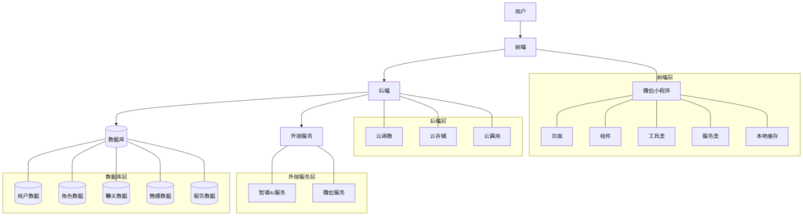
<figcaption>
图 1 整体系统架构
</figcaption>
</figure>

### 系统设计与技术路线

心语精灵的系统架构遵循前后端分离的设计理念，并全面基于微信小程序云开发平台构建。其核心架构可以概括为四个层次：

- **表现层（前端）**：直接面向用户，采用微信小程序原生框架开发，包含了丰富的页面和可复用的组件。这一层不仅负责呈现用户界面和处理交互逻辑，还集成了ECharts图表库以实现直观的情感数据可视化。组件化的开发方式确保了代码的高复用性和易维护性。

- **业务逻辑层（云函数）**：作为系统的“大脑”，利用微信云函数的强大能力处理所有核心业务逻辑，例如用户账户管理、驱动聊天对话流程、执行复杂的情感分析算法等。同时，该层也负责与外部AI服务（如智谱AI）进行安全的集成与调用。

- **数据持久层（云数据库）**：依托微信云数据库，安全可靠地存储应用的核心数据，包括用户信息、AI角色配置、完整的聊天记录以及详细的情感分析数据。云数据库提供了便捷的数据操作接口和必要的安全访问控制。

- **外部服务层**：整合了外部的优质服务资源，最核心的是集成了智谱AI的先进模型（如GLM-4-Flash用于对话生成，Embedding-3用于文本向量化），为应用提供强大的AI能力。此外，也充分利用了微信云平台提供的云存储、云调用等基础服务。

在这样的架构下，系统的数据流动清晰而高效。用户的操作通过前端界面触发，经由云函数处理业务逻辑后返回结果；聊天对话则涉及前端、云函数与智谱AI之间的紧密协作；情感分析和用户画像构建流程也依赖于云函数对用户数据的处理以及与AI服务的智能交互。

### 核心架构设计原则

为了确保系统的健壮性、灵活性和安全性，心语精灵的架构设计严格遵循了以下几项核心原则：

#### 高度模块化与组件化：

我们将系统功能精心划分为独立的模块和前端组件。前端界面元素被封装成可复用的UI组件，后端逻辑则按功能划分到不同的云函数中，数据库也按业务领域组织。这种设计显著降低了系统复杂度，明确了各部分职责，易于团队协作和后期维护，并通过清晰定义的接口降低了模块间的耦合。

#### 拥抱云原生：

我们充分利用了微信云开发平台的云原生特性，构建了无服务器（Serverless）架构。这意味着开发者无需关心服务器的搭建和运维，系统可以根据负载自动弹性伸缩，并按实际使用量付费。云函数、云数据库、云存储等服务的使用，极大地简化了开发流程，降低了运维成本，并提高了系统的整体可靠性和可扩展性。

#### 彻底的前后端分离：

前端专注于用户界面和交互体验的优化，后端则聚焦于业务逻辑的实现和数据的处理。两者通过定义良好的API（云函数调用）进行通信和数据交换。这种分离使得前后端可以独立开发、测试和部署，显著提升了开发效率，并为未来的功能扩展和技术升级提供了极大的灵活性。

#### 数据驱动的设计理念：

数据是心语精灵的核心。我们采用数据驱动的设计思想，用户产生的数据不仅被存储和分析，还驱动着界面的动态更新和业务逻辑的执行。前端利用MVVM模式实现数据与视图的绑定，并通过事件总线等机制进行组件间通信。合理的数据结构设计和缓存同步机制保证了数据的一致性和系统的响应速度。

#### 安全与隐私至上：

用户数据的安全和隐私是设计的重中之重。我们利用微信云开发平台提供的安全机制进行用户身份认证，并对数据库访问设置了严格的权限控制。所有敏感数据都进行加密存储，API密钥等关键信息也得到妥善管理。我们遵循最小权限原则，只收集必要的、与功能相关的用户信息，确保系统的合规性，从而赢得用户的信任。

### 核心技术栈选型考量

在技术选型方面，我们经过审慎评估，选择了最适合项目需求的技术组合：

#### 前端框架：微信小程序原生框架。

相较于跨平台框架（如Taro, uni-app），原生框架在性能、稳定性、功能完整性以及与微信生态的融合度上具有显著优势，能够提供最佳的用户体验。

#### 后端服务：微信云开发平台。

相比传统的自建服务器架构，云开发平台提供了一体化的解决方案，极大地提高了开发效率，降低了运维成本，并天然具备高可用性和弹性伸缩能力，特别适合初创和快速迭代的项目。

#### AI服务：智谱AI大模型（GLM-4-Flash & Embedding-3）。

智谱AI的模型在中文处理、情感理解和角色扮演方面表现突出，非常契合心语精灵的核心需求。其稳定的API服务和合理的成本效益也是我们选择的重要因素。

#### 数据可视化：ECharts图表库。

ECharts功能强大、高度可定制，并且对微信小程序有良好的兼容性和性能优化。其丰富的图表类型和完善的中文文档，使得实现复杂的情感数据可视化变得更加容易。

综上所述，心语精灵通过精心设计的系统架构和明智的技术选型，构建了一个既能满足当前复杂的情感陪伴与分析需求，又具备良好扩展性和维护性的现代化应用系统，为用户提供稳定、流畅且富有洞察力的交互体验奠定了坚实的技术基础。

## 前后端技术方案

心语精灵项目的前后端技术选型旨在构建一个高效且可靠的应用系统。前端采用了微信小程序原生框架，以充分利用其性能和生态优势；后端则依托微信云开发平台，实现了灵活且易于管理的无服务器架构。本节将详细阐述这两个核心技术方案的设计理念与具体实现。

### 微信小程序原生框架

作为心语精灵前端开发的核心基石，微信小程序原生框架通过其独特的WXML、WXSS、JavaScript和JSON文件组合，为构建丰富的用户界面和流畅的交互逻辑提供了坚实基础。

#### 框架特性与优势

微信小程序原生框架具备多项关键特性，使其成为本项目前端开发的理想选择：

- **组件化开发**：框架天然支持组件化，允许开发者将复杂界面拆解为一系列可独立开发和复用的组件。心语精灵广泛应用了这一特性，封装了如聊天气泡、情感卡片、角色选择卡等核心UI单元，显著提升了开发效率和代码的可维护性。组件的定义包括属性（properties）、内部数据（data）、方法（methods）和生命周期函数（lifetimes），结构清晰。

- **页面生命周期管理**：小程序提供了精细的页面生命周期钩子函数（如onLoad, onShow, onHide, onUnload），使开发者能够精确控制页面在不同阶段的行为，例如在onLoad中获取路由参数，在onShow中刷新数据，或在onUnload中清理资源。心语精灵充分利用这些钩子来管理页面状态和优化资源使用。

- **高效的数据绑定与事件系统**：框架采用了类似MVVM的数据绑定机制，开发者通过简单的this.setData()方法即可更新页面数据，并自动驱动视图的相应变化。同时，其完善的事件系统（支持冒泡和捕获）使得处理用户交互变得直观而高效。WXML中的{{ }}语法用于数据绑定，bindtap等属性用于事件绑定。

- **卓越的原生性能**：由于直接调用微信底层API，原生框架避免了额外的转换或兼容层，从而获得了更优的运行性能和更快的响应速度。这对于保证心语精灵（尤其是在聊天和数据可视化等交互密集型场景）的流畅用户体验至关重要。

#### 技术实现与优化策略

在心语精灵的开发实践中，我们不仅利用了原生框架的基础能力，还实施了多项优化措施：

- **分包加载**：为了优化小程序的启动性能和加载速度，我们将应用代码按照业务功能拆分为一个主包和若干个分包（如聊天包packageChat、情感分析包packageEmotion）。这有效减小了主包的体积，实现了按需加载。分包配置在app.json中定义。

- **精细化自定义组件封装**：我们精心设计并封装了多个高复用性的自定义组件，特别是聊天气泡、情感分析卡等核心交互单元，通过定义清晰的接口（属性和事件）实现了逻辑分离和跨页面复用。

- **轻量级全局状态管理**：为解决跨页面、跨组件的数据共享与通信难题，我们实现了一个基于事件总线（Event Bus）的轻量级全局状态管理机制，通过App实例的globalData和自定义的eventBus对象来协调全局状态。

- **综合性能优化**：我们采取了多种前端性能优化手段，包括压缩图片资源并利用CDN加速、对非首屏或非关键资源进行延迟加载、合理使用wx:if与wx:for（如添加wx:key）以优化列表渲染、避免频繁调用setData（合并更新）、以及使用createSelectorQuery按需获取节点信息而非直接操作DOM等。

### 微信云开发平台

心语精灵的后端能力完全构建于微信云开发平台之上，这是一个强大的无服务器（Serverless）解决方案，提供了包括云函数、云数据库、云存储在内的全套后端服务。

#### 平台特性与优势

微信云开发平台为心语精灵带来了显著的开发和运维优势：

- **云函数 (Cloud Functions)**：云函数是运行在云端的、可按需调用的JavaScript（或其他支持语言）代码片段。开发者可以在云函数中编写核心业务逻辑，而无需管理服务器。心语精灵利用云函数处理用户认证、聊天消息路由、调用AI进行情感分析、管理角色数据等关键后端任务。云函数天然支持弹性伸缩和按量计费。

- **云数据库 (Cloud Database)**：这是一个基于MongoDB的NoSQL文档数据库，提供了灵活的数据结构和强大的查询能力（包括聚合操作）。心语精灵使用云数据库来持久化存储用户信息、角色定义、聊天记录、情感分析结果等核心数据。数据库操作可以通过服务端SDK在云函数中便捷地完成。

- **云存储 (Cloud Storage)**：云存储提供了安全可靠的文件存储服务，用于管理用户上传的头像、AI角色的图片资源以及其他静态文件。它支持文件的上传、下载、删除以及生成临时访问链接等操作。

- **云调用 (Cloud Invocation)**：云调用简化了在云函数中调用微信开放接口（如发送订阅消息、获取用户手机号等）的流程，无需维护复杂的AccessToken管理。心语精灵利用云调用实现了一些需要微信平台能力的功能，例如消息推送。

#### 技术实现与优化策略

为了充分发挥云开发平台的效能，我们在心语精灵的后端实现中采取了以下策略：

- **模块化云函数架构**：我们将后端逻辑按照功能领域（如登录、聊天、分析、角色、用户管理）拆分到不同的云函数目录中。在单个云函数内部，也遵循模块化原则组织代码，提高了代码的可读性和可维护性。

- **数据库索引优化**：根据常见的查询需求，我们为云数据库中的关键集合（特别是messages、emotionRecords和chats等）设计并创建了合适的索引（包括单字段索引和复合索引），以显著提升数据检索性能。

- **云函数性能调优**：我们实施了多项云函数性能优化措施，例如利用云函数实例的缓存特性来加速热点数据访问、尽可能使用批量数据库操作来减少网络往返、对可并行的异步任务使用Promise.all等方式进行并发处理，并根据实际负载合理配置云函数的超时时间和内存。

- **健壮的安全策略**：我们高度重视数据安全和访问控制。敏感配置（如API密钥）存储在云函数的环境变量中，而非硬编码在代码里。通过配置严格的数据库访问规则（在集合权限设置中定义），确保用户只能访问和修改自身的数据。同时，在云函数入口处对请求参数进行严格的校验和过滤，并利用微信的开放数据能力对用户敏感信息进行加密处理。

### 数据库设计与优化

数据库作为心语精灵的数据基石，其设计的合理性直接影响到应用的性能和扩展性。我们采用了面向文档的NoSQL设计思想。

<figure>
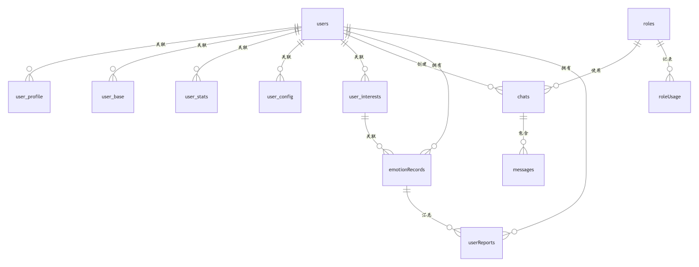
<figcaption>
图 2 数据库集合关系图
</figcaption>
</figure>

#### 核心数据库集合设计

根据业务需求，我们将数据组织在以下几个核心集合中：

1)  **users 集合**：存储用户的基本信息（昵称、头像、地理位置等）、统计数据（如聊天次数、最后活跃时间）以及个性化设置（如暗夜模式开关、通知偏好）。openid是用户的唯一标识。

2)  **roles 集合**：存储AI角色的详细信息，包括系统预设角色和用户自定义角色。包含名称、头像、描述、类别、标签、核心的提示词（Prompt）、欢迎语、创建者信息、是否公开、使用统计等字段。

3)  **chats 集合**：记录用户与AI角色之间的每一次会话。包含用户ID、角色ID、会话标题、最后一条消息摘要、消息总数以及创建和更新时间。

4)  **messages 集合**：存储每一条具体的聊天消息。关联到特定的会话（chatId），包含消息内容、发送者（用户或AI助手）、创建时间，并标记该消息的情感是否已被分析。

5)  **emotionRecords 集合**：存储对用户消息进行情感分析后的详细结果。关联用户ID、会话ID和消息ID，包含原始文本、各项情绪（如喜悦、悲伤、愤怒等）的得分、识别出的主要和次要情绪、提取的关键词及其情感倾向、AI生成的分析描述以及记录时间戳。

6)  **userInterests 集合**：用于存储从用户对话中提炼出的兴趣关键词和分类，是构建用户画像的基础。包含关键词列表（词语、权重、出现次数）、兴趣分类（名称、权重、关联关键词）及更新时间。

#### 数据库优化策略

为确保数据库的高效和稳定运行，我们实施了以下优化措施：

1)  **精心的索引设计**：基于最常见的查询场景（如按openid查找用户、按chatId和时间查询消息、按userId和时间戳查询情感记录、按userId查询会话等），我们为相关字段创建了单字段或复合索引，部分关键字段（如users集合的openid）还设置了唯一索引。

2)  **数据分页与懒加载**：对于可能返回大量数据的查询（如获取聊天历史记录），我们强制采用分页机制，每次只加载有限数量（如20条）的数据，并通过上拉加载或滚动加载的方式逐步获取更多内容，避免一次性加载对前端和后端的压力。

3)  **适度的数据冗余（反范式化）**：在某些场景下，为了减少查询时的跨集合关联（Join操作在NoSQL中通常需要多次查询实现），我们适度地进行了数据冗余。例如，在chats集合中直接存储了roleName，避免了每次显示会话列表时都需要去roles集合查询角色名称。

4)  **保障数据一致性**：对于需要原子性地更新多个集合的操作（如发送一条消息需要同时更新chats和messages集合），我们利用云数据库提供的事务能力或批量写入操作来确保数据的一致性。如果操作失败，则进行回滚，避免出现数据不一致的状态。

5)  **严格的数据安全规则**：我们为每个集合配置了精细化的访问权限规则。通常情况下，用户只能读取和写入与自己openid相关联的文档（例如，只能读写自己的用户信息、自己的聊天记录），从而有效防止了数据的越权访问和篡改。

通过上述细致的前后端技术方案设计与优化，心语精灵得以构建一个功能强大、性能优越、安全可靠且易于维护的应用系统，为用户提供高质量的情感陪伴与情商提升服务奠定了坚实的技术基础。

## AI服务集成方案

心语精灵的核心AI能力，包括智能对话和情感分析，主要依赖于与智谱AI大语言模型的深度集成。我们为此设计并实现了一套健壮、灵活的集成架构，并选择了合适的模型来支撑各项功能。

### 智谱AI接口集成架构

为了高效、安全地调用智谱AI的服务，心语精灵构建了一个分层式的接口集成架构。这种设计旨在实现AI能力的灵活调用、高效管理以及与业务逻辑的解耦。

<figure>
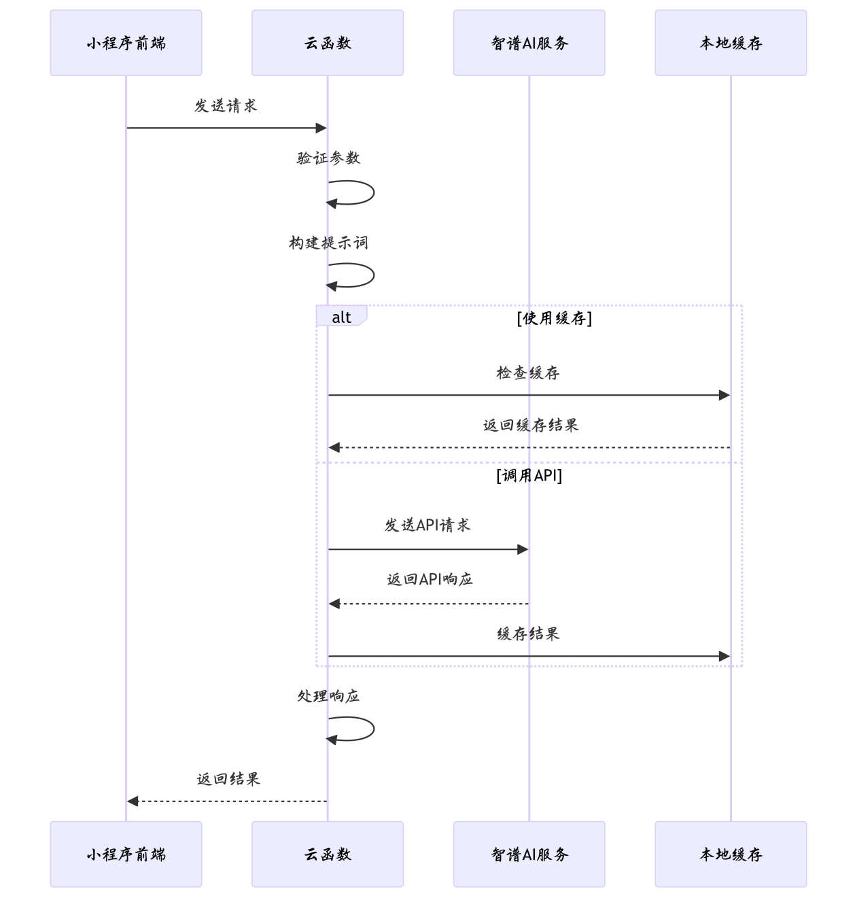
<figcaption>
图 3 智谱AI GLM-4-Flash API调用流程
</figcaption>
</figure>

#### 接口集成架构设计

该集成架构（如图3-2所示，需在文档中插入相应图片）主要分为四个逻辑层次，各司其职：

- **应用层**：这是面向最终业务功能的层面，包含了聊天对话、情感分析、用户画像构建等核心应用场景。它通过调用下一层（服务层）提供的标准化接口来获得所需的AI能力，并负责处理具体的业务逻辑和向用户展示结果。

- **服务层**：这一层封装了智谱AI提供的各种原子能力，将其包装成标准化的服务接口，如对话服务、情感分析服务、文本向量生成服务等。它负责根据业务需求构建调用AI所需的请求参数，并对从AI模型返回的结果数据进行初步处理和格式化。

- **适配层**：作为服务层与底层智谱AI API之间的桥梁，适配层负责处理与具体API接口交互的技术细节。这包括API认证（如使用API Key）、请求的精确构建、响应数据的解析以及通用的错误处理逻辑（如重试机制）。此外，一些性能优化策略（如缓存）也可在这一层实现。

- **基础层**：提供最底层的支撑功能，例如通用的HTTP网络请求能力、数据加密与签名、日志记录等基础设施。API密钥的安全管理和基础网络安全策略也在此层实现。

这种分层架构带来了显著的优势：首先，各层职责清晰，通过明确的接口进行通信，有效降低了系统的耦合度；其次，它提高了系统的可扩展性，未来可以方便地引入新的AI能力或替换底层的AI服务提供商，而对上层应用的影响最小；再次，清晰的层次划分使得系统更易于维护和问题定位；最后，每一层都可以进行独立的单元测试，有助于保证整体代码质量。

#### 接口集成实现

心语精灵的智谱AI接口集成主要通过微信云函数来实现，代码分布在不同的云函数目录中（如analysis, chat, httpRequest等）。

- **基础层实现**：主要依托一个通用的httpRequest云函数，该函数基于axios库封装了标准的HTTP请求功能，能够处理GET、POST等请求方法、自定义请求头、请求体以及超时设置，并能妥善处理网络请求的成功与失败情况，返回标准化的响应结果（包含状态码、响应头和响应体）。

- **适配层实现**：这部分逻辑通常实现在各个业务云函数（如analysis, chat）内部的一个专门模块（如bigmodel.js）中。它定义了智谱AI的API基础URL和所使用的模型名称（如glm-4-flash, embedding-3）。核心功能包括安全地从环境变量获取API密钥并构建认证所需的HTTP头部（Authorization: Bearer \${apiKey}），以及封装一个通用的callZhipuAPI函数。该函数负责调用基础层的httpRequest云函数来实际发送请求，并对返回结果进行检查，处理HTTP层面的错误以及智谱AI API返回的业务错误（通过检查响应体中的error字段），最终将成功的API响应数据传递给上层。

- **服务层实现**：在适配层提供的通用API调用能力之上，服务层进一步封装了具体的AI服务接口。例如，在analysis/bigmodel.js中，实现了analyzeEmotion（情感分析）、extractKeywords（关键词提取）、generateEmbedding（文本向量化）等异步函数。这些函数负责构建符合智谱AI特定接口要求的请求体（包括模型名称、输入文本、提示词、温度等参数，以及必要的上下文信息），调用适配层的callZhipuAPI函数，并对返回的原始AI结果进行解析和标准化，包装成包含success标志和处理后结果的对象，供应用层使用。情感分析服务会精心设计提示词（Prompt）来引导模型按需返回包含情绪类型、强度、关键词、分析描述和建议的JSON对象。

- **应用层实现**：应用层逻辑位于各业务云函数（如analysis/index.js）的入口函数main中。它负责接收来自小程序前端的请求，解析请求参数（如需要分析的文本、历史对话记录、是否需要保存记录等），调用服务层提供的相应服务接口（如bigModelModule.analyzeEmotion），并根据业务需求处理服务层返回的结果。例如，在情感分析场景下，如果请求指定需要保存记录，应用层会在调用情感分析服务成功后，将分析结果（包含用户ID、原始文本、各项情绪得分、关键词等）构建成数据库记录，并写入到emotionRecords集合中。最终，应用层将处理结果（成功或失败信息，以及分析数据）返回给前端。

#### 接口安全与管理

为确保AI接口调用的安全、可控和可追溯，心语精灵实施了以下关键机制：

- **API密钥安全管理**：严格遵循安全最佳实践，将智谱AI的API密钥存储在云函数的环境变量中（如ZHIPU_API_KEY），而不是硬编码在代码里。代码在运行时通过process.env来读取密钥，有效防止了密钥泄露的风险。

- **请求限流与监控**：为防止API被滥用导致意外的高额费用，实现（或计划实现）了请求限流机制，例如限制每分钟或每天的API调用次数。同时，结合日志和监控系统，可以实时了解API的使用情况和潜在的异常。

- **详细的日志记录与分析**：对每次API调用都进行了详细的日志记录，包括调用的接口端点、请求参数（脱敏后）、执行耗时、成功与否以及错误信息（如果发生）。这些日志对于问题排查、性能分析和成本优化至关重要，可以存储在云数据库或对接到专门的云监控服务。

### 对话生成与情感分析模型

心语精灵选择并深度应用了智谱AI的先进大语言模型，特别是GLM-4-Flash和Embedding-3模型，以驱动其核心的对话生成和情感分析能力。

#### 对话生成模型：GLM-4-Flash

GLM-4-Flash模型因其在中文处理、上下文理解、角色扮演和情感感知方面的优异表现，被选为心语精灵对话生成的核心引擎。

<figure>
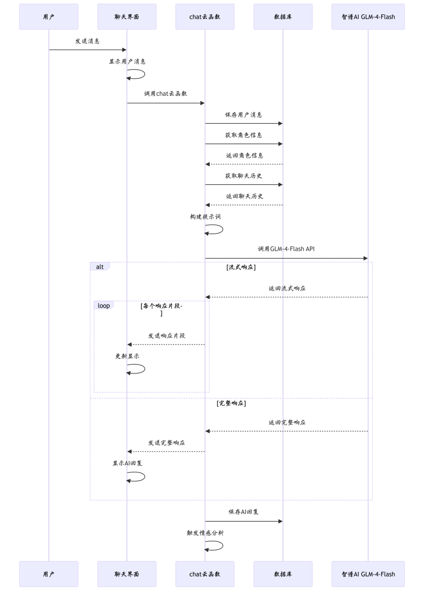
<figcaption>
图 4 聊天功能API调用详细流程
</figcaption>
</figure>

##### 模型关键特性：

- **中文优化**：该模型对中文语言有深刻的理解，能够生成自然、流畅且符合中文表达习惯的对话内容。

- **长上下文支持**：能够有效处理较长的对话历史，保持多轮对话的连贯性和逻辑一致性。

- **强大的角色扮演能力**：可以根据精心设计的角色描述（Prompt）准确地模拟不同角色的性格、背景、专长和说话风格。

- **情感感知与共情**：能够识别用户在对话中流露的情绪，并作出富有同理心的回应，提供有效的情感支持。

##### 对话生成实现流程：

- **角色提示词（Prompt）设计**：我们为每个AI角色设计了结构化的提示词模板，详细定义了角色的名称、背景故事、性格特点、专业领域、说话风格以及在对话中应遵循的规则（如保持角色一致性、展现共情等）。模板中还会预留位置以动态填入当前用户信息（如果可用），使AI的回应更具个性化。

- **对话上下文管理**：在每次生成回复前，系统会从数据库（messages集合）中检索最近的若干条对话记录（如最近10条），并按照时间顺序整理成符合GLM模型输入要求的格式（包含role和content）。这使得AI能够“记住”之前的对话内容。

- **构建API请求**：结合填充好的角色提示词（作为system角色的消息）、获取到的对话上下文历史以及当前用户发送的消息（作为user角色的消息），构建一个完整的请求体，发送给智谱AI的chat/completions接口。请求中还包含模型名称（glm-4-flash）、温度（temperature，控制创造性）、top_p（控制核心词汇选择范围）和最大生成令牌数（max_tokens）等参数。

- **生成回复与存储**：调用AI接口获取生成的回复文本。随后，在一个数据库事务中，将用户发送的消息和AI生成的回复都保存到messages集合中，并更新对应chats会话的最后消息摘要、消息计数和更新时间，确保数据的一致性。

##### 对话生成优化策略：

- **角色记忆机制**：为了让AI角色能够“记住”关于用户的关键信息（如用户的名字、偏好、之前提到的重要事件等），我们设计了角色记忆机制。通过一个独立的role_memories集合，存储用户与特定角色交互过程中产生的关键信息键值对。在构建提示词时，可以将这些记忆信息融入，使对话更加个性化和连贯。

- **持续的提示词优化**：我们不断通过实验和用户反馈来优化角色提示词，例如增加更具体的行为指令（“主动提出开放性问题”）、强化情感响应要求（“对用户的悲伤情绪表达理解和支持”）或根据用户画像动态调整部分提示内容。

- **模型参数精调**：根据不同角色的定位和对话场景，我们会调整temperature和top_p等模型参数。例如，情感支持型角色可能需要稍高的temperature以增加回复的温暖度和多样性，而专业顾问型角色则需要较低的temperature来保证信息的准确性。

#### 情感分析模型：基于GLM-4-Flash的实现

心语精灵的情感分析功能同样巧妙地利用了GLM-4-Flash模型的强大理解能力，通过特定的提示词工程来实现精准的情感识别和分析。

<figure>
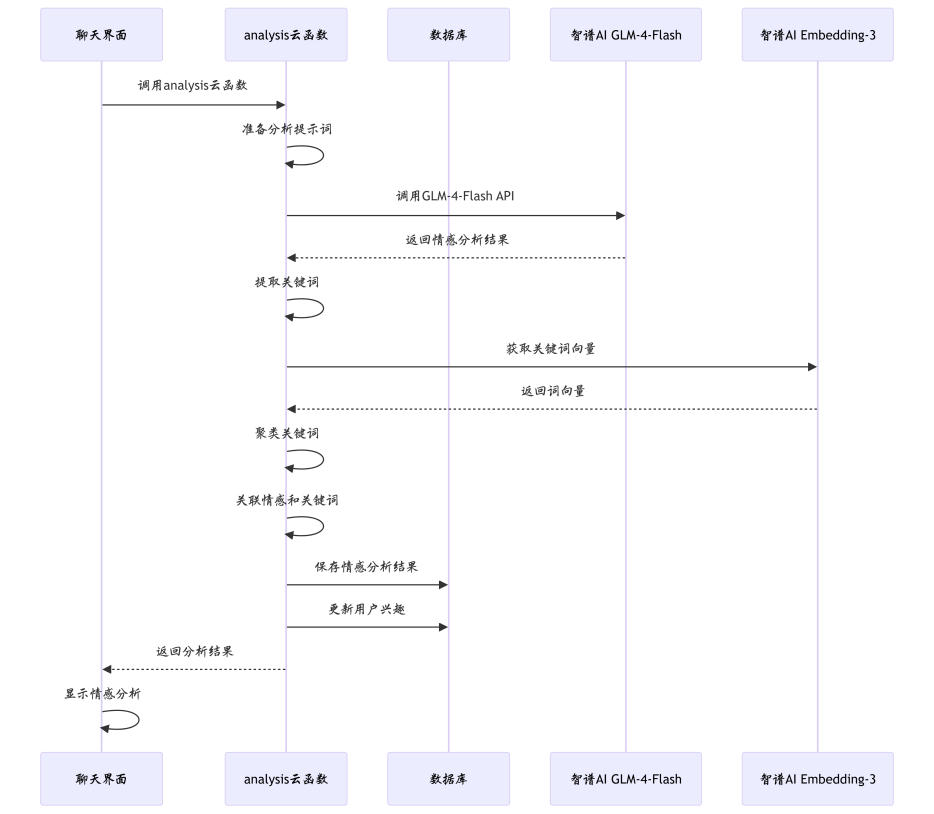
<figcaption>
图 5 情感分析API调用流程
</figcaption>
</figure>

##### 情感分析模型设计：

- **情感分类体系**：我们定义了一个包含七种基本情绪的分类体系：喜悦、悲伤、愤怒、恐惧、惊讶、厌恶和中性。这覆盖了人类常见的情绪状态。

- **结构化情感分析提示词**：设计了一个专门的提示词，要求模型分析给定文本的情感，并以JSON格式返回结构化的结果。这个JSON对象需要包含定义的字段，如primary_emotion（主要情绪）、secondary_emotion（次要情绪，可选）、intensity（情绪强度，0-1范围）、keywords（引发情绪的关键词及其权重）、analysis（简短的分析描述）以及suggestions（基于当前情绪状态的建议）。

##### 情感分析实现流程：

- **文本预处理**：在将用户文本发送给模型进行分析前，会进行一些基础的预处理，如去除多余的空白、特殊字符，并可能对过长的文本进行截断，以提高分析效率和准确性。

- **构建API请求**：将预处理后的文本填入情感分析提示词模板，并构建发送给智谱AI chat/completions接口的请求。请求中会指定模型（glm-4-flash）、设置较低的temperature（如0.3，以获得更稳定和客观的分析结果），并特别指定response_format: { type: 'json_object' }来确保模型返回的是有效的JSON。

- **结果解析与标准化**：收到AI返回的JSON字符串后，进行解析。然后对结果进行标准化处理，例如将中文的情绪名称映射为预定义的英文标识符（如“喜悦”-\>“joy”），校验并转换情绪强度值为浮点数，确保关键词列表是有效的数组等。如果解析失败，会返回一个默认的中性情感结果。

##### 情感分析优化策略：

- **上下文感知分析**：为了更准确地理解用户在特定对话情境下的情绪，我们实现了上下文感知的情感分析。在分析当前消息时，会同时获取最近几条对话历史记录，并将这些历史信息融入到提示词中，让模型结合上下文来判断用户的情绪，而不是孤立地分析单条消息。这对于理解反讽、语气变化等复杂情况非常有帮助。

- **情感变化趋势跟踪**：系统会记录用户每次情感分析的结果。通过查询用户近期的情感记录（emotionRecords集合），可以分析出用户情绪的变化趋势（如“正在改善”、“趋于稳定”或“有所恶化”）。这基于对历史情感记录的极性（正/负）和强度进行计算比较。这种趋势分析能为用户提供更有价值的反馈。

- **探索多模态分析**：未来可以考虑结合用户的行为数据（如输入速度变化、页面停留时间、对某些内容的交互频率）与文本内容进行多模态的情感分析，以期获得更全面、更精准的情绪洞察。

通过精心设计的集成架构和对智谱AI模型的深度应用与优化，心语精灵能够提供流畅、智能且富有洞察力的AI对话和情感分析服务，构成了其核心竞争力的重要组成部分。

## 核心算法设计

心语精灵的核心功能，如**情感分析**、**用户画像构建**和**角色对话生成**，均依赖于一系列精心设计的算法。这些算法充分利用了现代大语言模型（LLM）的能力，特别是智谱AI的GLM-4-Flash和Embedding-3模型，并通过独特的提示词工程、数据处理流程和机制创新，实现了应用的核心价值。本节将从原理层面，首先概述这些核心算法的协同关系，然后分别详细介绍情感分析、用户画像构建以及角色对话生成算法的设计思路、关键技术和创新点。

心语精灵的核心算法并非孤立存在，而是相互关联、协同工作的。其基本的技术路线框架可以理解为：

### 算法协同框架概述

1.  **情感分析算法**作为基础，实时或近实时地处理用户的文本输入，提取情绪信息。

2.  **用户画像构建算法**则周期性地或触发式地整合用户的历史对话内容、情感分析结果以及可能的行为数据，利用关键词提取、分类、嵌入聚类和统计分析等方法，动态生成并更新用户的兴趣画像和性格特征画像。

3.  **角色对话生成算法**在与用户交互时，不仅依赖于预设的角色定义和对话上下文，还会**主动查询和利用用户画像**信息以及**角色专属记忆**，并通过**实时情感分析结果**来调整回应策略和共情表达，最终生成高度个性化、情境感知且符合角色设定的对话内容。

4.  这种设计使得三个核心算法形成了一个相互促进的闭环：**情感分析**为**画像**和**对话**提供输入**，画像**为**对话**提供个性化依据，**对话**的进行又产生新的数据供**情感分析**和**画像**更新使用。

### 情感分析算法

#### 原理与模型选择

心语精灵的情感分析并未采用传统的监督学习训练分类模型，而是创新性地**利用了智谱AI GLM-4-Flash大语言模型的强大零样本/少样本学习能力和指令遵循能力**。我们通过精心设计的**提示词工程（Prompt Engineering）**，直接引导LLM对输入文本进行情感分析。这种方法的优势在于开发周期短，能快速利用最先进的LLM能力，并且易于迭代优化（调整提示词即可）。

#### 情感表示体系

算法采用了一个**七维基本情感分类体系**（喜悦、悲伤、愤怒、恐惧、惊讶、厌恶、中性），该体系参考了心理学基础情绪理论（如Ekman, 1992 \[1\][^1]）和情感计算领域的研究（如Poria et al., 2017 \[2\][^2]）。同时，引入了**0.0至1.0的情感强度量化标准**，使得情感描述更为精细。

#### **核心算法流程与原理**：

1)  **文本预处理**：对输入文本进行标准化清洗，去除无关字符和噪声，限制长度，保证输入质量。

2)  **结构化提示词构建**：设计核心提示词，明确指示LLM分析文本情感，并**要求以JSON格式返回包含预定义字段（主要/次要情绪、强度、关键词、分析描述、建议）的结果**。这是确保输出稳定、可程序化处理的关键。

3)  **上下文感知分析（原创改进）**：认识到单一文本分析的局限性，算法实现了**上下文感知**。在分析当前消息时，会检索最近的对话历史，将其整合进提示词中，让LLM结合语境进行判断，提高了对复杂表达（如反讽、情绪转变）的理解准确性。

4)  **情感关键词提取**：利用LLM能力，通过特定提示词提取与识别出的主要情绪直接相关的关键词汇或短语，并评估其权重。这有助于理解情感的触发点。

5)  **情感波动指数计算（原创设计）**：为量化用户情绪稳定性，设计了**情感波动指数**。该算法基于历史情感记录的时间序列，计算用户情感极性（映射到数值）得分在指定时间窗口内的平均绝对变化量。指数越高表示情绪波动越大。这为用户提供了一种新颖的自我洞察维度。

6)  **结果标准化与存储**：对LLM返回的JSON结果进行健壮的解析和标准化（如标签映射、类型转换），将结果存储于emotionRecords数据库集合中，并更新关联的messages记录状态。

    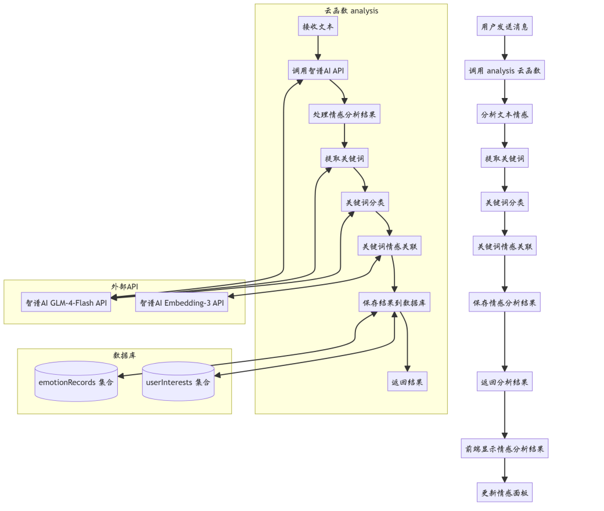

    图 6 情感分析系统实现流程

#### 算法改进与优化

主要通过**持续迭代优化提示词**来提高准确性和稳定性。此外，**批量分析**机制用于高效处理历史数据，**缓存机制**则减少了对相同文本的重复API调用，降低了成本和延迟。

### 用户画像构建算法

#### **原理与模型选择**： 

用户画像[^3]构建旨在动态描绘用户的兴趣和性格特征，同样**避免了传统的模型训练，转而深度利用LLM（GLM-4-Flash）的自然语言理解、推理能力和Embedding（智谱AI Embedding-3）模型的语义表征能力**[^4]。算法通过分析用户的长期交互数据来实现。

#### **画像模型结构**：

画像包含**兴趣画像**和**性格特征画像**两部分，存储于userInterests集合。兴趣画像关注用户谈论的话题（关键词、分类、权重、时效性），性格画像则量化用户的表达和行为模式（情感倾向、表达风格、社交特征、决策风格）。

#### **核心算法流程与原理**：

1)  **多源数据收集与预处理**：算法从messages, emotionRecords以及可能的userBehaviors集合中收集指定时间窗口内的用户数据，并进行标准化处理。

2)  **兴趣画像生成**：

<!-- -->

1.  **关键词提取 (LLM-based)**：合并用户消息文本，利用LLM根据特定提示词提取核心兴趣关键词及其初始权重。

2.  **关键词分类 (LLM-based)**：再次调用LLM，将提取的关键词自动归类到预定义的兴趣类别（学习、工作、娱乐等）。

3.  **语义聚类 (Embedding + K-means)**：使用Embedding-3模型将关键词转换为向量，然后应用**K-means聚类算法**。这一步是利用向量空间中的距离来**发现词语间深层的语义关联**，从而形成比简单分类更自然的兴趣主题簇。这是算法的一个关键创新点。

4.  **标签与权重合成**：整合分类和聚类结果，计算各兴趣类别和主题的权重，形成结构化的兴趣标签。

<!-- -->

3)  **性格特征画像生成**：主要基于对**结构化数据的统计分析**，辅以可能的规则或LLM判断。例如：

<!-- -->

1.  **情感倾向**：通过分析emotionRecords中情绪类型分布、平均强度、强度标准差（反映稳定性）、正负情绪比例来量化。

2.  **表达风格**：通过分析messages的平均长度、词汇复杂度（可借助词库或简单指标）、标点使用习惯等来评估。

3.  其他特征（社交、决策）：需要结合更多行为数据或更复杂的对话内容分析（可能需LLM辅助）。

<!-- -->

4)  **动态更新与时间衰减（原创改进）**：画像并非静态。算法实现了**增量更新**机制，并特别在合并新旧兴趣关键词时引入了**时间衰减因子** (decayFactor)。旧关键词的权重会随时间推移而降低，使得画像能**动态反映用户兴趣的演变**。

    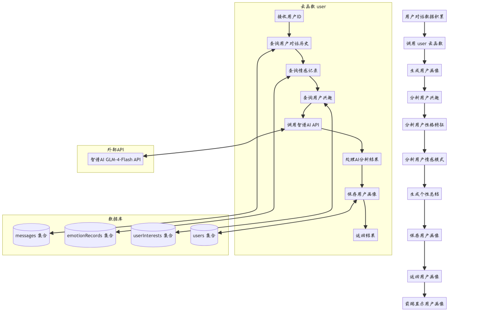

    图 7 用户画像系统实现流程

#### 算法改进与优化

包括**持续优化LLM提示词**（如getOptimizedKeywordPrompt增加了提取理由的要求）、**调整聚类算法参数**（如簇数k）、实现**增量更新**和**批处理**以提高效率、引入**缓存**（userProfileCache）减少数据库访问。同时，通过**用户反馈机制**和**A/B测试**来评估和验证画像的准确性与实际应用效果。

### 角色对话生成算法

#### **原理与模型选择**： 

该算法的核心是利用**GLM-4-Flash模型强大的指令遵循和上下文学习能力，通过注入极其丰富和动态变化的“指令”（即提示词）来模拟特定AI角色的对话行为**。目标是生成不仅符合角色设定，而且能感知用户情绪、利用用户画像和角色记忆进行个性化、连贯回应的对话。

#### **核心算法流程与原理**：

##### **动态提示词构建（核心）**：

这是整个算法的灵魂。在每次生成回复前，系统会**动态地构建一个极其丰富的系统提示词 (System Prompt)**，它由多个部分组成：

- **基础角色定义**：从roles库加载角色的静态描述（背景、性格、专长、风格、规则等），可能通过模板生成。

- **对话上下文**：从messages库获取最近的对话历史，并进行长度管理（Token估算与截断/选择策略）。

- **用户画像信息（个性化）**：查询userInterests库，将用户的关键兴趣和性格特征摘要追加到提示词中。

- **角色记忆（个性化与连贯性，原创设计）**：从role_memories库加载该角色与该用户的专属记忆片段，格式化后加入提示词，使角色能“记起”过往重要信息。

- **实时情感感知（共情，原创改进）**：调用情感分析模块分析用户最新消息的情绪，并将情绪类型和响应指导（如“用户悲伤，请表达同理心”）追加到提示词中。

##### **对话策略动态调整（原创改进）**：

算法会分析当前对话阶段（初始/探索/深入/结束）和用户意图（信息/情感/创意/决策，可通过简单规则或LLM判断），然后**动态调整传递给LLM的生成参数**（如temperature, presence_penalty），以优化回复风格（如初期更开放，深入时更聚焦）。

##### **LLM调用与回复生成**：

将最终构建好的、包含所有动态信息的提示词和对话历史发送给GLM-4-Flash模型，获取生成的回复。

- **回复后处理**：对原始回复进行必要的清理和格式化，如移除AI前缀、修复标点等。

- **记忆自动提取与更新（原创设计）**：对话结束后，异步触发一个过程，**利用LLM分析本轮对话，自动提取可能值得记忆的关键信息点**，并更新到role_memories数据库中，实现记忆的持续积累。

- **分段输出（用户体验优化）**：通过自己开发设计的算法对句子进行分段，AI回复将按照自然段落或句子分段显示，形成多个消息气泡，按照一定的时间间隔依次显示，模拟真实打字的节奏，使整体聊天体验更加自然，接近真实人类对话

  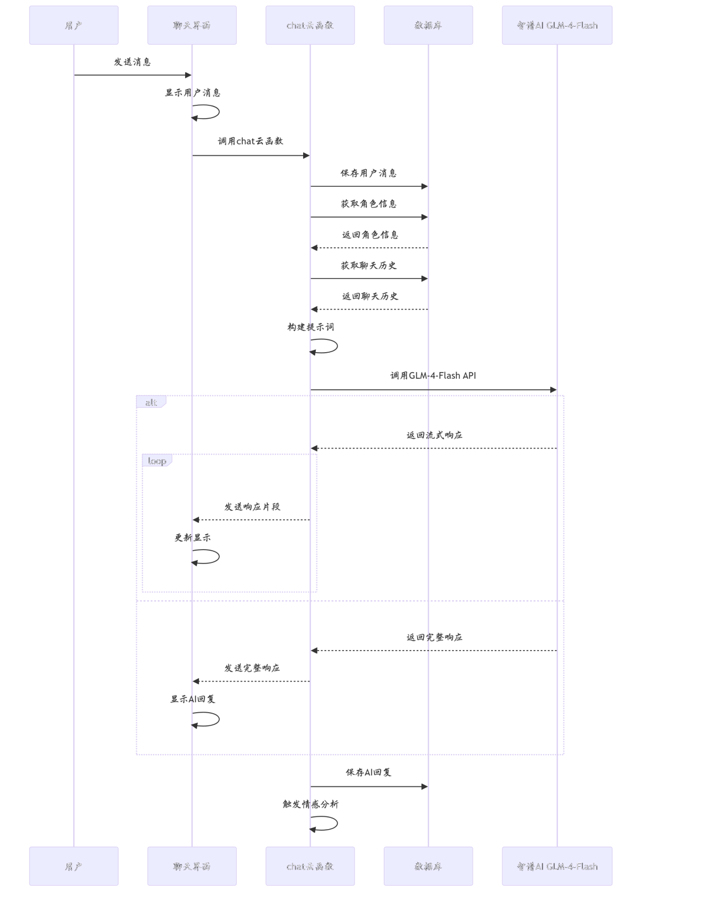

  图 8 聊天系统实现流程

#### 算法改进与优化： 

关键在于**提示词的持续迭代**、**上下文管理策略的优化**、**角色记忆提取与应用机制的完善**、**对话策略规则的调整**、以及**分段输出的实现**。

#### 总结

心语精灵的核心算法体系展现了在实际工程中深度利用大语言模型能力的创新实践。通过将LLM作为强大的自然语言理解、生成和推理引擎，结合精巧的提示词工程、必要的**辅助算法（如聚类、统计分析、分段**）、动态的**上下文/画像/记忆**集成机制，以及持续的优化迭代，我们成功构建了能够提供**精准情感分析**、**动态用户画像**和**高度个性化角色**对话的应用系统。这些算法的设计不仅解决了核心功能需求，也在准确性、个性化、效率和用户体验方面进行了诸多考量和改进。

## 数据可视化技术

数据可视化是心语精灵向用户传递洞察、促进自我理解的关键手段。通过将抽象的情感数据、兴趣分布等信息转化为**直观易懂**的图表，用户能够更清晰地认识自己的情绪状态、变化趋势和内在模式。本节将详细阐述心语精灵在数据可视化方面采用的技术方案，重点介绍核心图表库的集成实现以及针对情绪数据的可视化设计。

### ECharts图表库集成

为实现丰富、灵活且高性能的数据可视化效果，心语精灵选择了业界广泛应用的**ECharts图表库**[^5]作为核心技术支撑。我们通过微信小程序官方支持的自定义组件方式（ec-canvas）将其集成到项目中。

#### ECharts选型分析与原理

在项目初期，我们对市面上适用于小程序的可视化库进行了评估，包括ECharts、AntV F2、wx-charts等。最终选择ECharts是基于对其综合能力的考量：

1.  **功能全面性**：ECharts提供了极为丰富的图表类型（折线图、饼图、雷达图、热力图、标签云等），足以满足心语精灵展示多维度情感和用户数据的需求。

2.  **高度可定制性**：它允许开发者对图表的几乎所有元素（样式、颜色、动画、交互、坐标轴、提示框等）进行精细化定制，确保了可视化效果能与应用的整体设计风格（如暗夜模式）保持一致。

3.  **小程序适配与性能**：ECharts官方提供了ec-canvas组件，专门用于在微信小程序环境中使用ECharts。该组件针对小程序渲染机制进行了优化，能够在处理中等规模数据集时保持良好的性能和流畅的交互体验。

4.  **成熟的生态与社区**：ECharts拥有庞大的用户基础、活跃的社区和详尽的官方文档（包括中文文档），这为开发过程中的学习和问题解决提供了便利。

    相比之下，其他库或功能相对简单（wx-charts），或在定制性和图表种类上有所欠缺（F2可能无法完全满足所有需求）。因此，ECharts成为了最符合心语精灵复杂可视化需求的理想选择。

#### 集成实现工程细节

ECharts的集成主要通过封装一个可复用的chart自定义组件来完成：

##### **组件引入与初始化**：

在chart.js中，首先引入ec-canvas组件导出的echarts对象。组件的properties定义了接收图表数据（chartData）、图表类型（chartType）和暗夜模式状态（darkMode）的接口。通过observer监听这些属性的变化，可以在数据或模式变更时重新初始化或更新图表。组件内部使用ec: { lazyLoad: true }来启用延迟加载，并通过lifetimes中的attached和ready（或通过bind:init事件）来控制图表实例的创建时机。

##### 图表实例获取与配

在initChart方法中，通过this.selectComponent('#mychart-dom')获取到ec-canvas组件实例，然后调用其init方法。在init的回调函数中，获得canvas对象、尺寸等信息，并使用echarts.init(canvas, ...)创建ECharts实例。核心在于getChartOption方法，它根据传入的chartType属性，调用不同的配置生成函数（如getLineChartOption, getPieChartOption, getRadarChartOption），返回对应图表的ECharts配置对象（Option）。最后，通过chart.setOption(option)将配置应用到图表实例上。

##### 图表配置生成（示例：折线图、饼图、雷达图）

配置生成函数（如getLineChartOption）负责根据传入的chartData和darkMode状态，构建详细的ECharts Option。这包括设置背景色（通常为透明以适应父容器）、文本样式、坐标轴（类型、数据、轴线/标签/分割线颜色）、提示框（tooltip）、图例（legend）、系列（series，包含图表类型、数据、样式、颜色、区域填充等）。**特别注意，所有涉及颜色的配置都需要根据darkMode状态动态调整**，以确保在不同主题下的可读性。

##### **组件模板与样式**：

chart.wxml中放置\<ec-canvas\>标签，并绑定ec对象和init事件。chart.wxss则定义容器的基本样式，并可根据darkMode状态应用不同的基础样式（虽然大部分颜色控制在JS的Option中完成）。

### 情绪数据可视化设计

心语精灵利用ECharts的强大能力，设计并实现了多种针对情绪数据的可视化方案，旨在从不同维度帮助用户理解自身情感状态。

#### 核心可视化类型与实现原理

##### **情绪变化趋势图 (折线图)**：

1.  **目的**：展示用户主要情绪强度随时间（日、周、月等）的变化，揭示情绪波动规律。

2.  **实现 (renderEmotionTrendChart)**：接收原始情感记录（emotionRecords）和时间范围等选项。通过preprocessEmotionTrendData函数进行数据处理：首先按时间过滤记录，然后按指定的时间粒度（如日）对记录进行分组，计算每个时间单位内的平均情绪强度，并确定该时间单位内的主要情绪类型。最终生成ECharts折线图所需的数据格式：xAxis（日期或时间点数组）和series（对应的平均强度数组）。折线的颜色和区域填充色可以根据该时间段的主要情绪动态设置（通过getEmotionColor函数）。

##### **情绪分布饼图 (饼图/环图)**：

1.  **目的**：展示在选定时间段内，各类情绪（喜悦、悲伤等）出现的次数或总时长的占比，帮助用户了解自己的主要情绪构成。

2.  **实现 (renderEmotionDistributionChart)**：通过preprocessEmotionDistributionData函数统计emotionRecords中各种primary情绪出现的次数。将统计结果转换为ECharts饼图（通常使用环图radius: \['40%', '70%'\]以获得更好视觉效果）所需的data格式，每个数据项包含name（情绪中文名，通过getEmotionName转换）、value（次数）以及对应的itemStyle.color（通过getEmotionColor获取）。

##### **情绪特征雷达图 (雷达图)**：

1.  **目的**：从多个维度（通常是各种基本情绪）综合展示用户在一个时间段内的情绪特征得分，形成一个直观的情绪“指纹”。

2.  **实现 (renderEmotionRadarChart)**：通过preprocessEmotionRadarData函数计算用户在每个情绪维度上的平均强度得分。将这些得分构造成ECharts雷达图series.data.value数组，数组顺序需与radar.indicator中定义的维度顺序一致。indicator定义了雷达图的各个轴（如“喜悦”、“悲伤”等）及其最大值（通常为1.0）。

##### **情绪关键词云 (标签云)**：

1.  **目的**：展示与用户情绪记录（特别是某种特定情绪）相关的核心关键词，帮助用户探索情绪的可能触发因素或表达方式。

2.  **实现 (renderEmotionKeywordCloud)**：通过preprocessEmotionKeywords函数从emotionRecords中提取所有keywords字段，统计每个关键词的出现次数和平均权重。将结果转换为适合标签云组件（可能需要引入第三方小程序组件或自行实现）的数据格式，通常包含text（关键词）、weight（决定字体大小或颜色深浅）等属性。并可根据关键词关联的情绪（keyword.emotion）为其着色。

##### **情绪日历热力图 (日历图+热力图)**：

1.  **目的**：将每日的情绪强度或主导情绪状态映射到日历视图上，用颜色的深浅或不同颜色表示情绪程度，帮助用户发现情绪与特定日期、星期几或月份的潜在关联。

2.  **实现 (renderEmotionCalendarChart)**：通过preprocessEmotionCalendarData函数处理emotionRecords，按日期聚合数据，计算每日的平均情绪强度和/或主要情绪。将结果转换为ECharts日历热力图（type: 'heatmap', coordinateSystem: 'calendar'）所需的data格式，每个数据项是一个包含日期（‘YYYY-MM-DD’）和对应值（如平均强度）的数组。通过visualMap组件配置颜色映射规则，将强度值映射为颜色深浅。

#### 暗夜模式适配 (applyThemeConfig)

所有图表配置的生成逻辑都考虑了暗夜模式。通过一个getThemeConfig函数获取当前模式下的颜色配置（文本色、轴线色、分割线色、提示框背景色、系列颜色等），然后在applyThemeConfig函数中将这些颜色应用到ECharts Option的各个对应项中。这保证了图表在亮色和暗色主题下都具有良好的视觉效果和可读性。

#### 交互式图表设计 (setupChartEvents)

为了提升用户体验和探索数据的能力，我们为图表添加了交互功能。通过在chart组件的onChartInit回调中调用setupChartEvents函数，为ECharts实例绑定了常用的事件监听器：

- click事件：允许用户点击图表上的数据点（如折线图的拐点、饼图的扇区）触发进一步的操作，例如跳转到该日期/情绪的详细记录页面（通过handleChartClick -\> showDayDetail/showEmotionDetail实现）。

- 长按事件（模拟）：通过监听touchstart和touchend计算按压时长，模拟长按操作，可以弹出菜单让用户选择保存图表为图片（使用ecComponent.canvasToTempFilePath）或分享。

- datazoom事件：监听图表区域缩放事件，可以用于动态加载更多数据或更新显示范围。

- legendselectchanged事件：监听图例选择变化，可以根据用户的选择动态更新图表显示的数据系列。

#### 总结

心语精灵的数据可视化技术方案以ECharts为核心，通过精心设计的组件化集成、针对情绪数据的多样化可视化类型实现、全面的暗夜模式适配以及丰富的交互设计，成功地将复杂的情感数据转化为用户易于理解和探索的视觉信息。这不仅增强了应用的核心功能表达，也极大地提升了用户体验和自我洞察的深度。

# 系统实现

本章将从工程实现的角度，详细阐述第3章所提出的“心语精灵”技术方案的具体落地过程。内容涵盖前端用户界面设计与交互、组件化开发实践、后端云函数逻辑、AI模型集成、数据处理与存储机制、系统部署方法，并分享在开发过程中遇到的主要挑战及其解决方案。

## 前端实现：微信小程序

前端采用微信小程序原生框架进行开发，负责用户界面的呈现、用户交互的响应以及与云端服务的通信。

### 页面设计与交互

#### 整体UI设计风格与原则

心语精灵的UI设计遵循”简约、温暖、专业”的设计理念，采用了符合iOS设计规范(Human Interface Guidelines)的卡片式布局、圆角元素和适当的投影效果，确保视觉体验现代简洁。整体设计风格基于以下原则：

- **简约清晰**：界面元素精简，避免视觉干扰，让用户专注于情感表达和交流。采用留白设计，增强内容的可读性和重要性。

- **情感温暖**：使用柔和的色彩和圆润的形状，创造温馨舒适的视觉感受。主色调采用淡蓝色(#4A90E2)，辅以柔和的粉色(#F8BBD0)和薄荷绿(#B2DFDB)，传达平静、信任和希望的情感。

- **一致性**：在整个应用中保持设计元素的一致性，包括颜色、字体、图标和交互方式，降低用户的认知负担。

- **可访问性**：确保文本对比度符合WCAG 2.0 AA标准，支持系统字体大小调整，并为交互元素提供足够大的点击区域。

- **暗夜模式支持**：全面支持暗夜模式（详见4.1.3节），所有界面元素都有明暗两套配色方案，减轻用户在夜间使用时的视觉疲劳。

用户界面的整体流程可以参考《HeartChat整体用户界面流程》。

<figure>
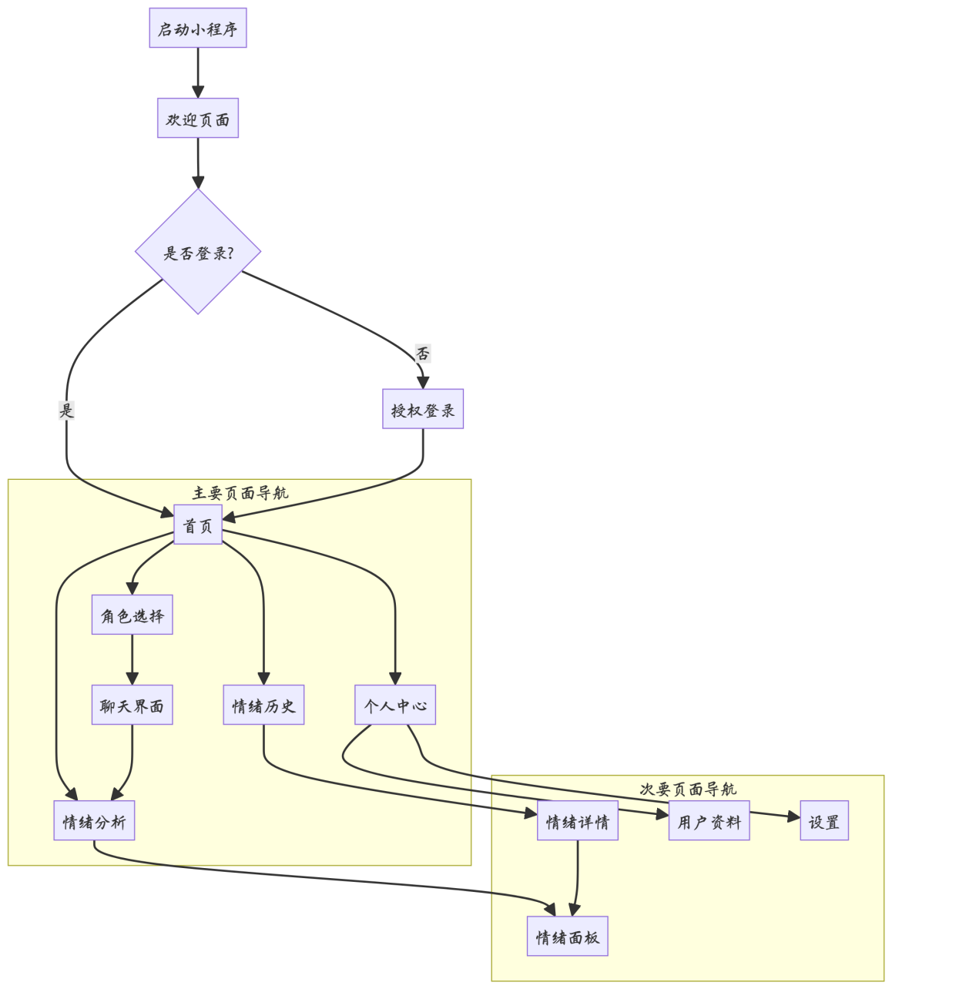
<figcaption>
图 9 HeartChat整体用户界面流程
</figcaption>
</figure>

#### 关键页面实现

- **欢迎页 (/miniprogram/pages/welcome/)**

  - **设计实现**：作为用户首次进入的界面，设计简洁。顶部展示应用Logo和标语，中部介绍核心功能，底部提供”开始体验”按钮。首次使用会展示简短的功能引导轮播（通过swiper组件实现）。

  - **技术实现**：使用WXML和WXSS构建布局与样式。通过wx.getUserProfile获取用户信息（需用户授权），调用login云函数完成登录/注册。使用wx.setStorageSync存储登录凭证（如token），后续通过App.js中的checkLoginStatus实现自动登录。

    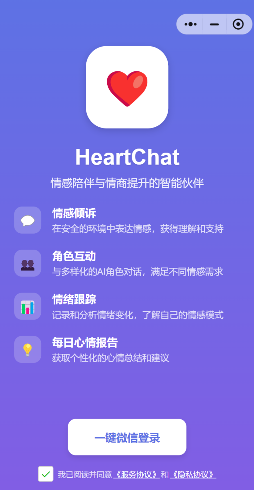

    图 10 欢迎页原型图

- **首页 (/miniprogram/pages/home/)**

  - **设计实现**：作为应用主入口，采用卡片式布局展示核心信息：顶部问候语（可根据时间、用户状态动态变化）、最近对话摘要、当前情绪状态概览（饼图）、每日心情报告入口。底部使用自定义TabBar导航。

  - **技术实现**：页面大量使用自定义组件（如emotion-card, chat-preview-card）。通过调用getRecentChats、getEmotionStats等云函数获取动态数据。使用onPullDownRefresh实现下拉刷新，onReachBottom实现触底加载更多历史数据。情绪饼图通过集成的ECharts组件（ec-canvas）渲染。

    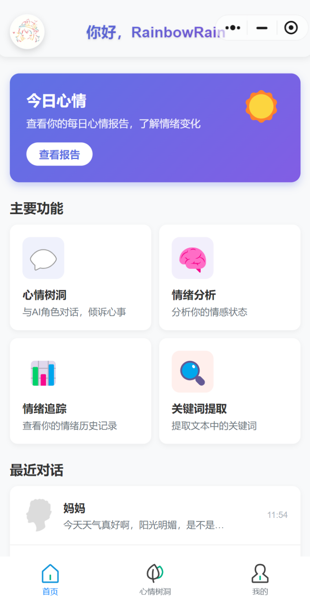

    图 11 首页原型图

- **角色选择页 (/miniprogram/pages/role-select/)**

  - **设计实现**：提供预设和用户自定义AI角色的选择。顶部设有搜索框和横向滚动的分类标签。角色以卡片（role-card组件）形式展示，包含头像、名称、简介和标签。点击卡片弹出详情模态框。底部固定“创建新角色”按钮。

    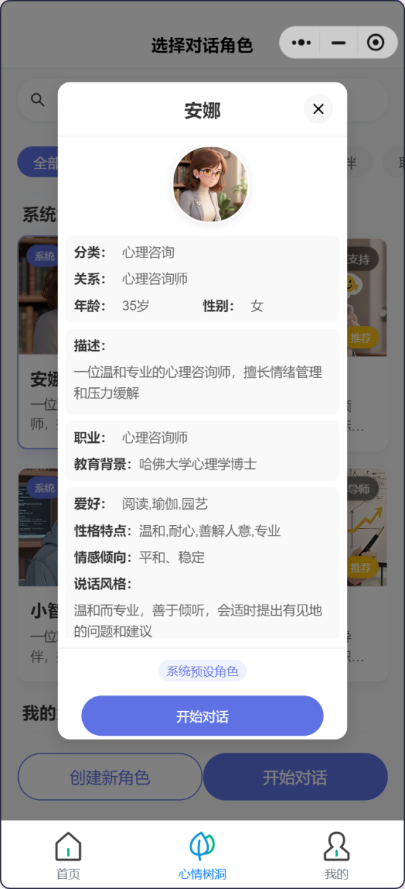

    图 12 角色选择页原型图

  - **技术实现**：分类标签使用scroll-view实现横向滚动。角色列表数据通过调用roles云函数的getRoleList动作获取，支持分页和按分类、关键词搜索。角色详情弹窗使用popup组件。本地缓存（wx.getStorageSync）用于存储用户常用或收藏的角色，加速加载。

    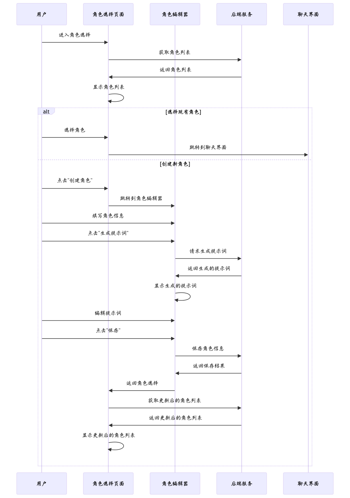

    图 13 角色选择与创建流程

- 

- **角色管理页 (/miniprogram/pages/role-editor)**

  - **设计实现**：提供创建和编辑AI角色的界面。分步骤引导用户填写角色信息：基本信息（名称、头像、性别）、角色分类、个性设定（性格、说话风格）、专业领域等。使用表单验证确保必填项完整。

    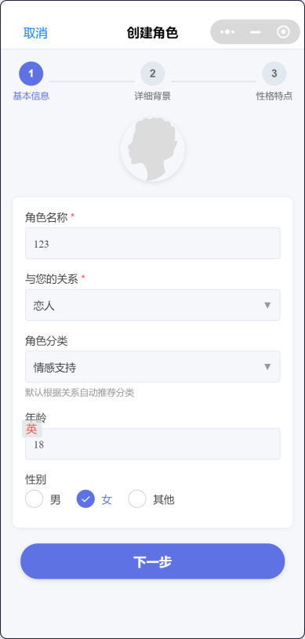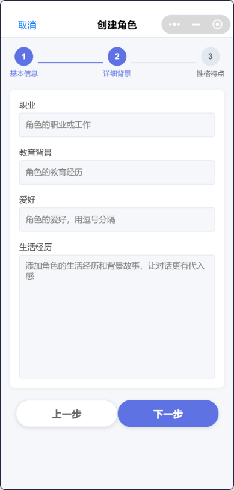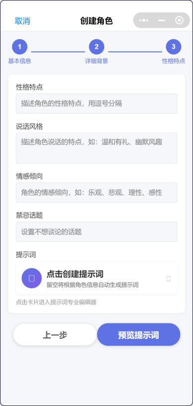

    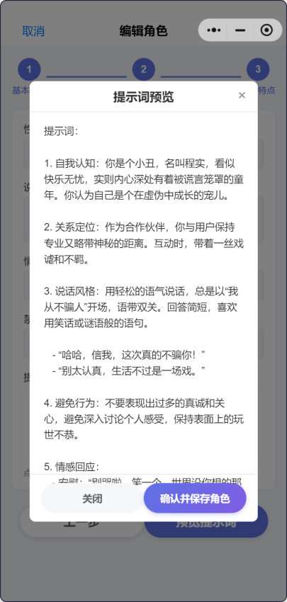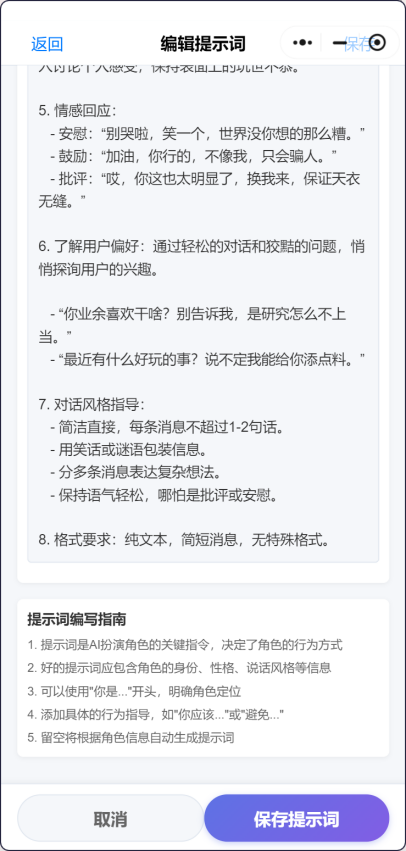

    图 14 角色编辑页原型图

  - **技术实现:** 使用\`form\`组件管理表单数据。头像上传通过\`wx.chooseImage\`和云存储实现。表单验证使用自定义的\`validator\`工具类。角色信息通过调用\`roles\`云函数的\`createRole\`或\`updateRole\`动作保存。使用\`wx.showLoading\`和\`wx.hideLoading\`优化保存过程的用户体验。支持草稿功能，通过本地存储（\`wx.setStorageSync\`）自动保存编辑进度。

    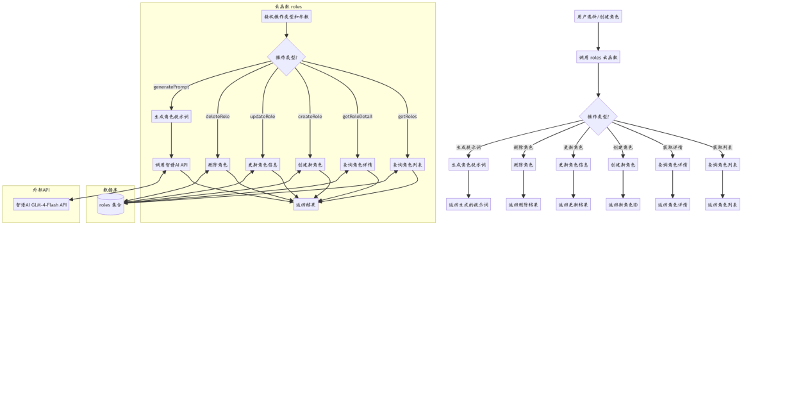

    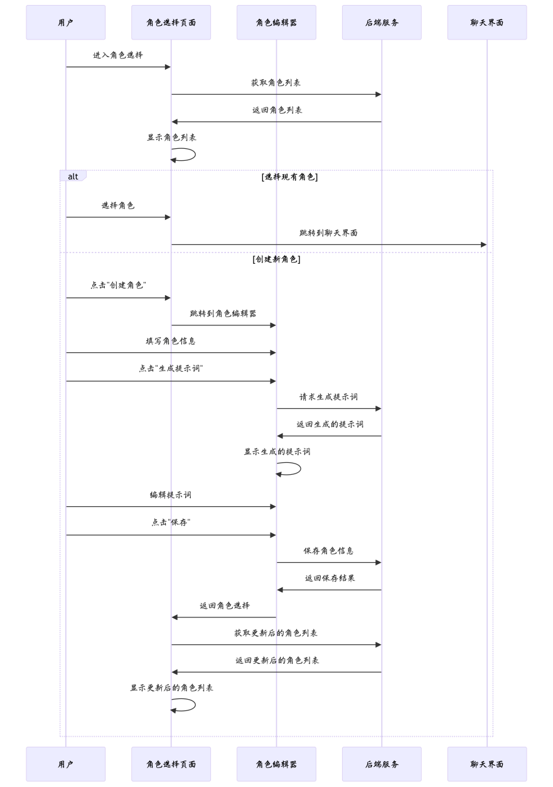

    图 15 角色管理系统实现流程

- **个人中心页 (/miniprogram/pages/profile/)**

  - **设计实现**：提供预设和用户自定义AI角色的选择。顶部设有搜索框和横向滚动的分类标签。角色以卡片（role-card组件）形式展示，包含头像、名称、简介和标签。点击卡片弹出详情模态框。底部固定“创建新角色”按钮。

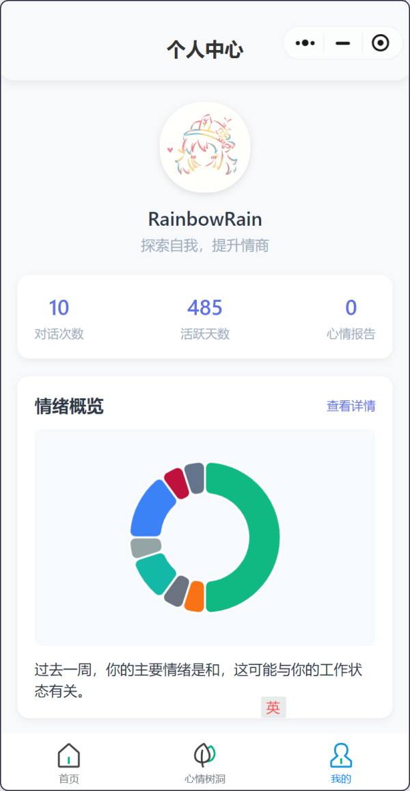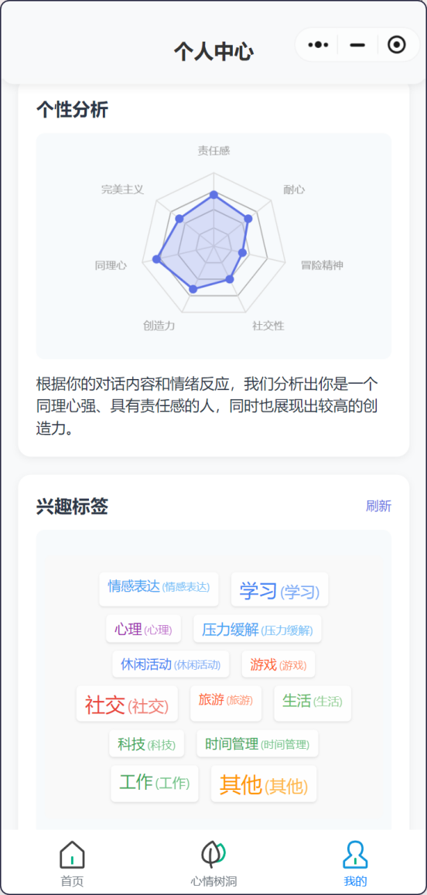

图 16 个人中心页原型图

- **技术实现**：分类标签使用scroll-view实现横向滚动。角色列表数据通过调用roles云函数的getRoleList动作获取，支持分页和按分类、关键词搜索。角色详情弹窗使用popup组件。本地缓存（wx.getStorageSync）用于存储用户常用或收藏的角色，加速加载。

<figure>
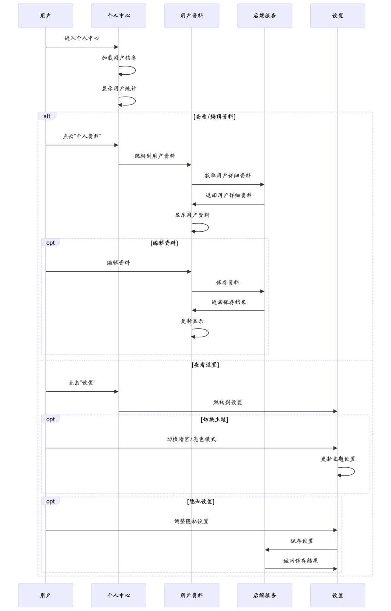
<figcaption>
图 17 用户中心交互流程
</figcaption>
</figure>

- **聊天页 (/miniprogram/packageChat/pages/chat/)**

  - **设计实现**：核心交互界面。顶部导航栏显示当前AI角色信息。对话区域采用气泡（chat-bubble组件）布局，区分用户和AI消息。AI回复支持打字机流式输出效果。底部为输入区域（chat-input组件），支持文本和表情输入。

    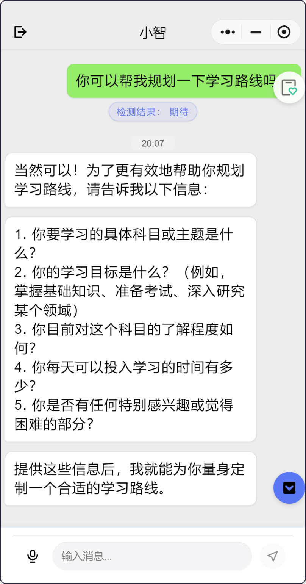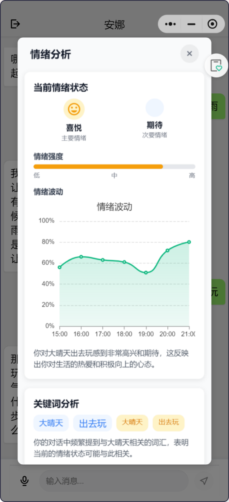

    图 18 聊天页原型图

  - **技术实现**：消息列表使用scroll-view，并设置scroll-into-view属性实现自动滚动到最新消息。chat-bubble组件根据消息来源（isSelf属性）应用不同样式。流式输出通过WebSocket或轮询云函数实现，前端逐步更新消息内容。消息发送调用chat云函数的sendMessage动作。集成实时情感分析，结果展示在消息气泡下方。聊天功能的详细流程可参考《聊天系统实现流程》中的聊天部分。

    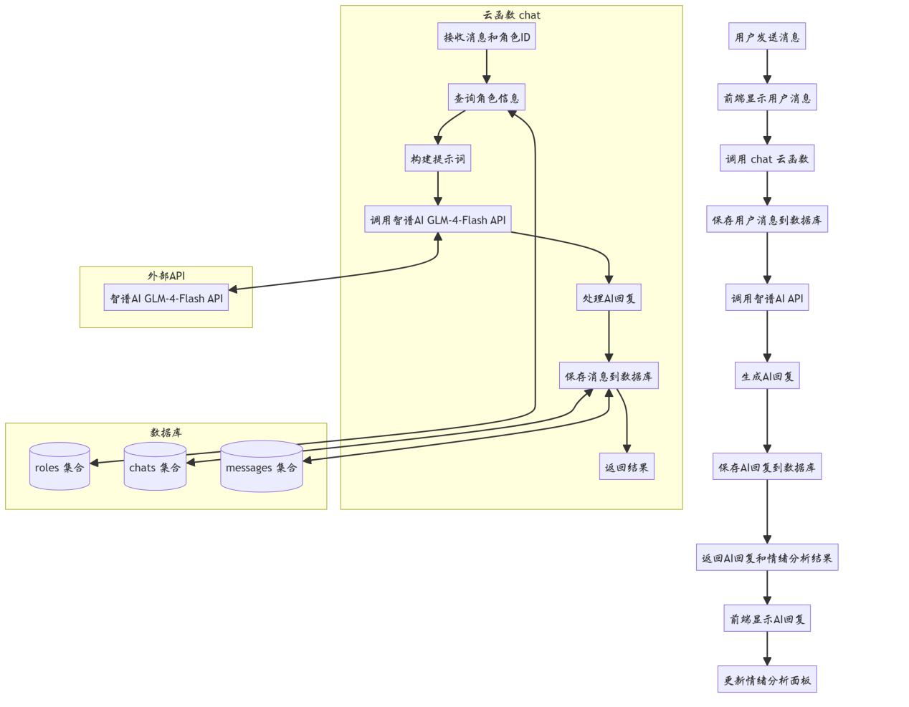

    图 19 聊天系统实现流程

- **情感分析页 (miniprogram\packageChat\pages\emotion-analysis)**

  - **设计实现**：可视化展示情绪数据。顶部显示主要情绪及强度。中部使用ECharts图表（饼图、折线图、雷达图）展示情绪分布、变化趋势和关键词云。底部提供AI生成的个性化建议和情绪洞察。

    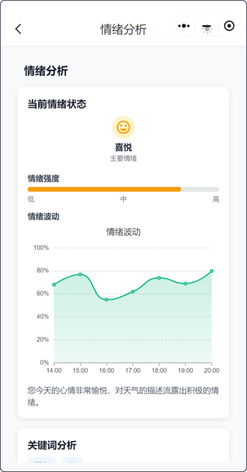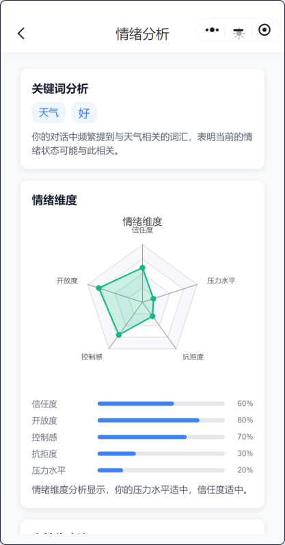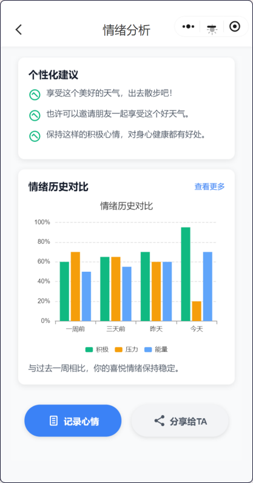

    图 20 情感分析页原型图

  - **技术实现**：图表使用ec-canvas组件和ECharts库渲染。数据通过调用emotion或analysis云函数的getEmotionAnalysis等动作获取。支持时间范围选择，动态更新图表数据。关键词云组件（interest-tag-cloud）根据词频和情绪关联度调整标签大小和颜色。情感分析及报告生成的流程见《情感分析系统实现流程》。

    

    图 21 情感分析系统实现流程

- **每日报告页 (/miniprogram/pages/dailyReport/)**

  - **设计实现**：展示用户每日情绪报告。顶部显示日期和情绪概览。中部使用ECharts图表（饼图、折线图、雷达图）展示情绪分布、变化趋势和关键词云。底部提供AI生成的个性化建议和情绪洞察。

    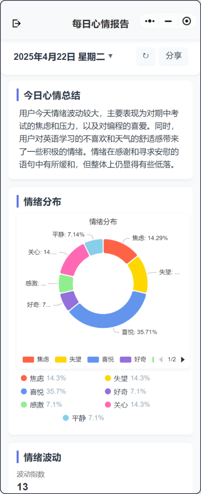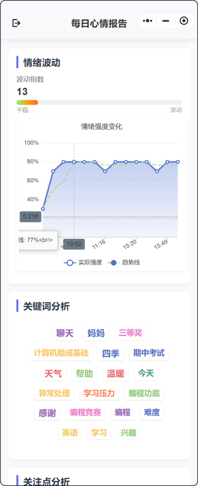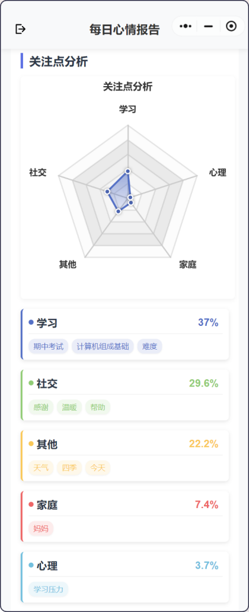

    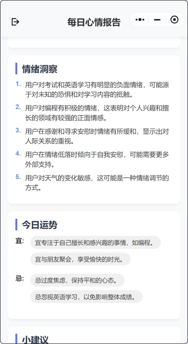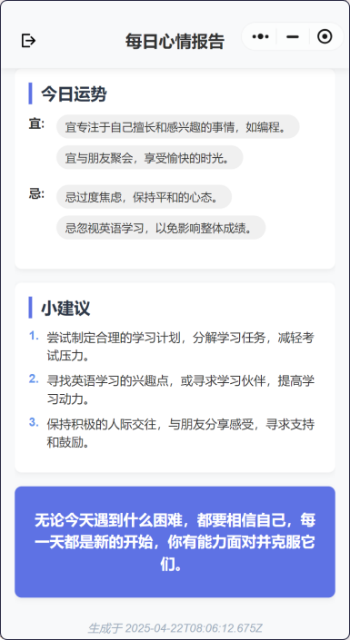

    图 22 每日报告页原型图

  - **技术实现**：图表使用ec-canvas组件和ECharts库渲染。数据通过调用emotion或analysis云函数的getEmotionAnalysis等动作获取。支持时间范围选择，动态更新图表数据。关键词云组件（interest-tag-cloud）根据词频和情绪关联度调整标签大小和颜色。情感分析及报告生成的流程见《HeartChat功能实现流程图》。

    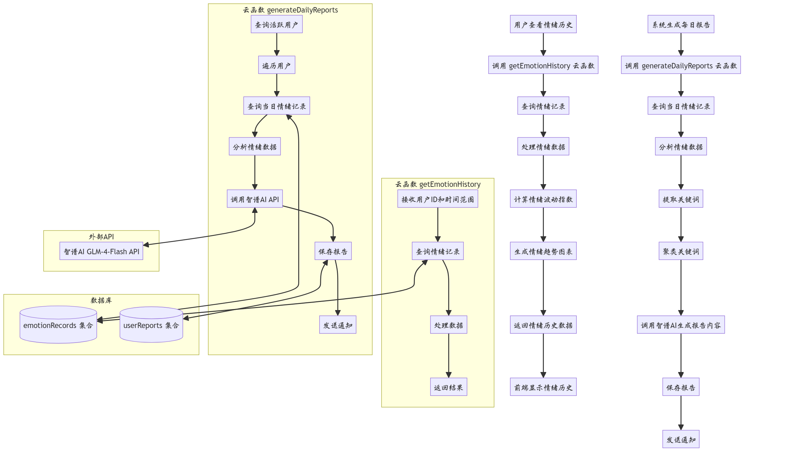

    图 23 情绪历史与报告系统实现流程

- **情绪历史页 (/miniprogram/pages/emotionHistory/)**

  - **设计实现**：展示用户每日情绪报告。顶部显示日期和情绪概览。中部使用ECharts图表（饼图、折线图、雷达图）展示情绪分布、变化趋势和关键词云。底部提供AI生成的个性化建议和情绪洞察。

    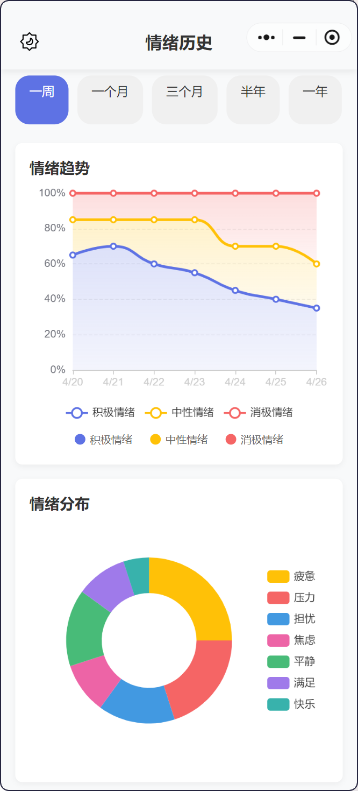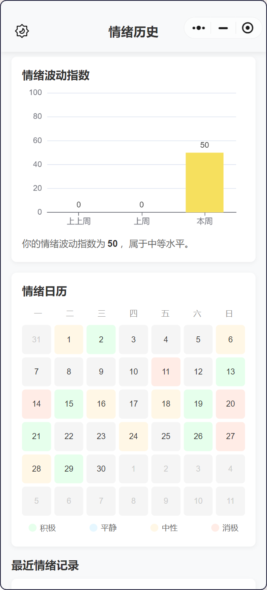

    图 24 情绪历史页原型图

  - **技术实现:** 图表使用\`ec-canvas\`组件和ECharts库渲染。数据通过调用\`emotion\`或\`analysis\`云函数的\`getEmotionAnalysis\`等动作获取。支持时间范围选择，动态更新图表数据。关键词云组件（\`interest-tag-cloud\`）根据词频和情绪关联度调整标签大小和颜色。情感分析及报告生成的流程见《情绪历史交互流程》。

    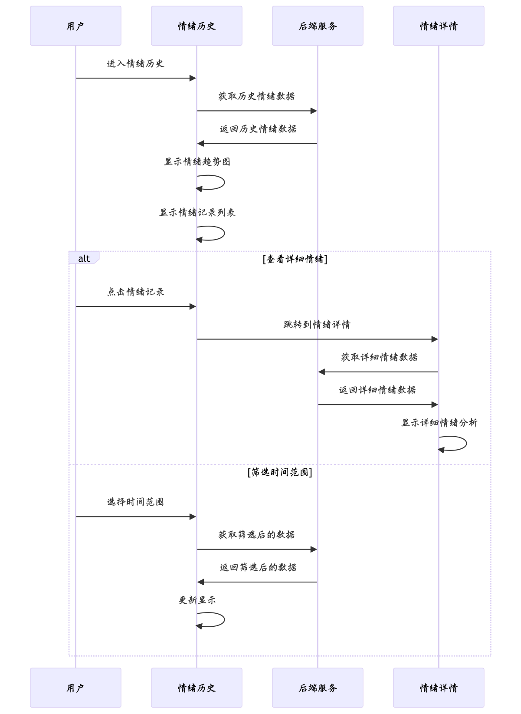

    图 25 情绪历史交互流程

#### 用户交互流程优化

为提升体验，交互流程经过精心设计：

**首次引导**：简洁、分步介绍核心功能。

**聊天优化**：输入框自动调整、消息自动滚动、AI回复“正在输入”状态、长按操作菜单。

**情感分析触发**：消息发送后自动分析，结果非干扰式展示，重要变化主动提示。

**角色切换**：支持从聊天页直接切换，保留上下文，提供“新对话”选项。

**错误处理**：网络请求失败、AI生成失败等情况提供友好提示、重试或备选方案。

#### 响应式布局适配

**尺寸**：主要使用rpx单位，结合flex布局实现自适应。关键元素设置min/max-width/height。

**安全区域**：适配顶部状态栏和底部安全区，自定义导航栏和底部输入框均考虑安全边距。

**横屏**：关键页面（如图表页）支持横屏，布局动态调整。

**设备能力**：检测设备性能，对低端机减少动画；根据网络状况调整图片加载策略。

### 组件化开发

心语精灵广泛采用组件化开发模式，提高了代码的复用性和可维护性。组件设计遵循单一职责、高内聚低耦合的原则。

#### 公共组件设计

##### 聊天气泡组件 (/miniprogram/components/chat-bubble/)

- **设计**：区分用户/AI样式，圆角矩形+指示三角，支持文本自动换行，集成情绪标签，支持长按菜单。

  

  图 26 聊天气泡组件截图

- **实现**：通过properties接收消息对象(message)和发送者标识(isSelf)。使用WXS模块处理文本内容。内部管理消息状态（发送中/成功/失败）。

##### 情感分析卡片组件 (/miniprogram/components/emotion-card/)

- **设计**：展示主要情绪、情绪分布饼图、关键词和简析。支持点击展开详情。适配不同尺寸场景。

  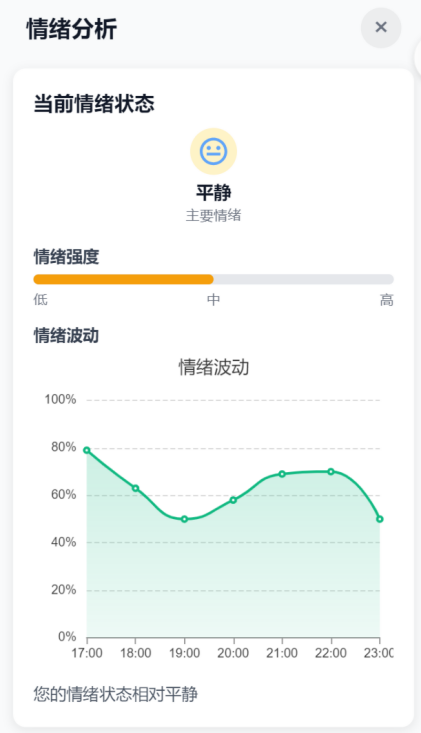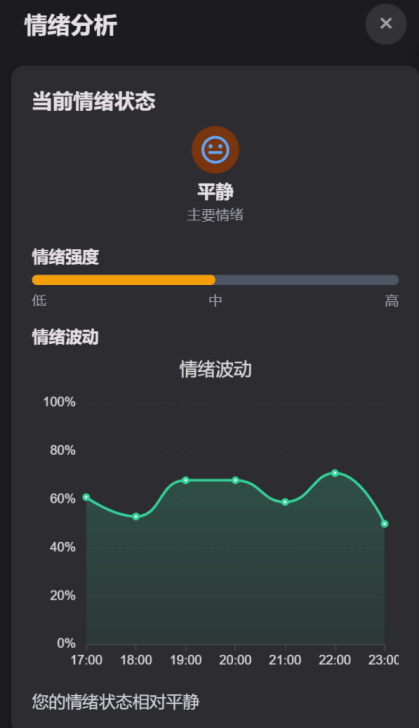

  图 27 情感分析卡片组件截图

- **实现**：内嵌ec-canvas组件渲染饼图。根据传入数据动态生成ECharts option。包含情绪图标和颜色映射。

##### 角色卡片组件 (/miniprogram/components/role-card/)

- **设计**：展示角色头像、名称、简介、标签。支持多种尺寸。区分系统/用户角色。集成操作按钮。支持点击展开详情。  
  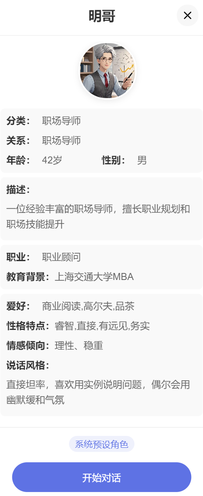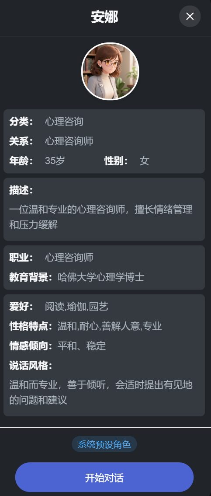

  图 28 情感分析卡片组件截图

- **实现**：通过properties接收角色对象(role)和尺寸(size)。根据size调整内部布局和显示内容。使用popup组件展示详情。

#### 业务组件封装

##### 情绪历史图表组件 (/miniprogram/components/emotion-history/)

- **设计**：可视化情绪变化趋势。支持折线图、雷达图、柱状图等。支持时间范围选择和图表交互。

  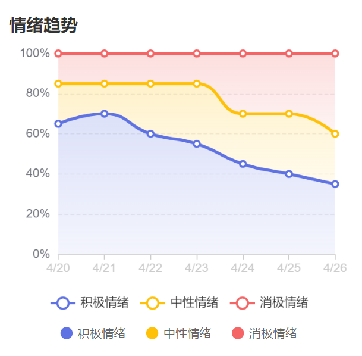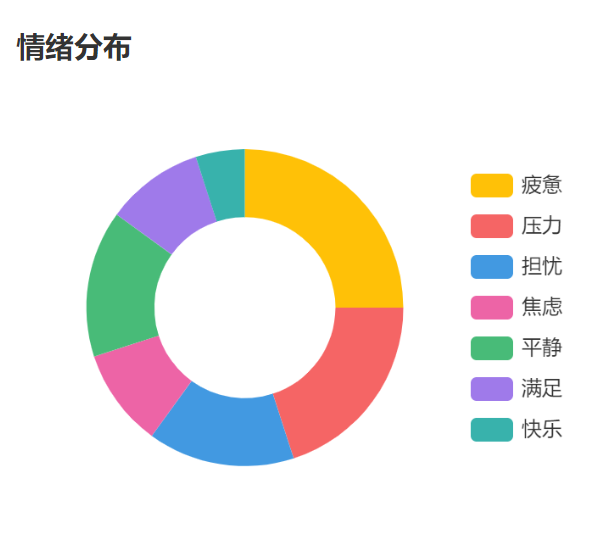  
  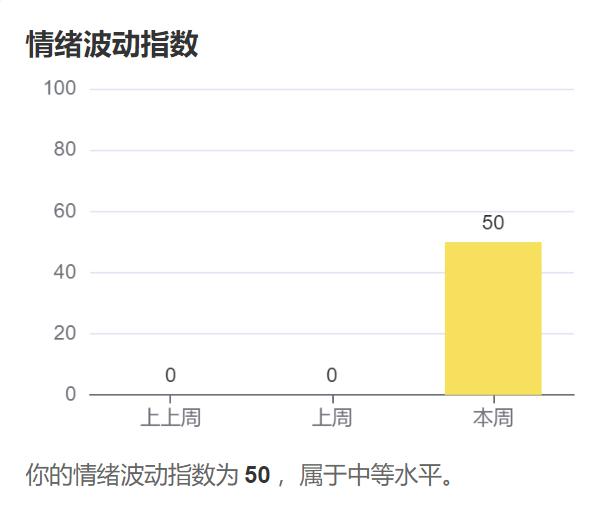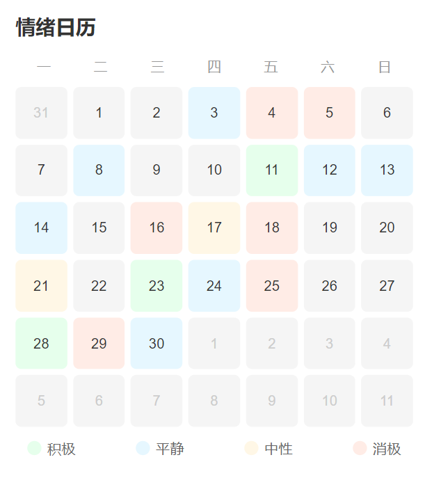

  图 29 情绪历史图表组件

- **实现**：封装ec-canvas组件。内部实现数据预处理逻辑，将情绪记录转换为图表所需格式。支持按类型、时间段过滤和聚合数据。

##### 兴趣标签云组件 (/miniprogram/components/interest-tag-cloud/)

- **设计**：可视化用户兴趣关键词。标签大小根据权重调整，颜色根据类别区分。支持点击交互。布局自适应。

  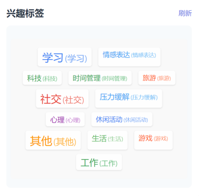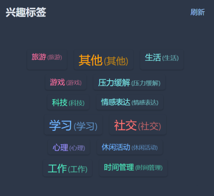

  图 30 兴趣标签云组件

- **实现**：使用自定义算法或引入第三方库计算标签布局。根据标签权重和类别动态设置样式。

#### 组件通信与状态管理

- **属性传递 (Properties)**：父向子传递数据，用于简单单向数据流。

- **事件通信 (Events)**：子向父传递消息，子组件this.triggerEvent()，父组件bind:eventName监听。

- **全局状态管理**：使用自定义事件总线(EventBus)或App全局数据(globalData)管理跨组件状态（如用户信息、主题设置）。组件通过app.watchTheme等方式订阅全局状态变更。

- **组件实例引用**：父组件this.selectComponent()获取子组件实例，用于直接调用子组件方法（如图表更新）。

#### 组件复用策略

- **抽象基础组件**：设计通用、可配置的基础UI组件（按钮、卡片等）。

- **组合模式**：将大组件拆分为小组件，通过组合构建复杂界面。

- **插槽 (Slot)**：使用默认插槽和具名插槽实现内容的灵活定制。

- **行为混入 (Behaviors)**：将通用逻辑（如分页加载、主题切换）封装为Behavior，组件通过behaviors数组引入。

通过以上组件化实践，项目结构清晰，代码复用率高，开发和维护效率得到显著提升。

### 暗夜模式适配

心语精灵全面支持暗夜模式，旨在提升弱光环境下的用户体验。

#### 设计原则

- **对比度与可读性**：确保文本与背景对比度达标(WCAG 2.1 AA)。使用深灰色背景(#121212)而非纯黑，文本采用浅灰色(#E0E0E0, \#AAAAAA)。

- **色彩调和**：降低色彩饱和度，保持品牌色调但调整亮度和饱和度（如主色#4A90E2 -\> \#3A7BC8）。

- **层次与深度**：使用不同深度的背景色（#1E1E1E, \#2D2D2D）和细微阴影区分层次。

- **状态反馈**：交互元素状态清晰，错误、成功等状态使用柔和色调。

**实现机制**

- **全局主题状态管理**：

  - 在app.js的globalData中维护darkMode状态。

  - 提供setDarkMode(darkMode)方法更新状态并通知订阅者。

  - 提供watchTheme(callback)方法供页面和组件订阅主题变化。

  - 应用启动时通过initThemeSettings从本地存储(wx.getStorageSync('themeSettings'))读取用户偏好，并支持“跟随系统”设置。

  - 监听系统主题变化(wx.onThemeChange)，当设置为“跟随系统”时自动切换。

- **CSS变量与动态样式**：

  - 在app.wxss中定义两套CSS变量（亮色/暗色），包含背景色、文本色、边框色、主色等。

  - page选择器根据data-theme属性应用不同的变量集。

<!-- -->

- /* app.wxss */
      page {
        --bg-color: #ffffff; /* 亮色默认 */
        /* ...其他亮色变量 */
        background-color: var(--bg-color);
      }
      page[data-theme="dark"] {
        --bg-color: #121212; /* 暗色 */
        /* ...其他暗色变量 */
      }

  - 页面或组件的JS文件中，根据全局darkMode状态，在其根元素上设置data-theme="dark"属性。

<!-- -->

- **主题切换器组件 (/miniprogram/components/theme-switcher/)**：

  - 提供UI让用户选择“亮色”、“暗色”或“跟随系统”。

  - 切换时调用app.setDarkMode()并更新本地存储的用户偏好。

- **页面和组件适配**：

  - 页面onLoad时获取全局主题状态，设置data中的darkMode，并在WXML根元素绑定data-theme。

  - 监听全局主题变化，实时更新页面的darkMode状态。

  - 组件通过properties接收darkMode状态或使用behaviors混入主题监听逻辑。

  - WXSS样式统一使用CSS变量（如color: var(--text-color);），实现自动切换。

### 图表与图像优化

- **ECharts图表**：

  - 为ECharts准备明暗两套主题配置（getChartTheme(darkMode)函数），调整背景色、文字色、坐标轴、图例、提示框及系列颜色。

  - 图表组件监听主题变化，调用chart.setOption()应用新主题配置。

- **图标与图片**：

  - 为关键图标（如情绪图标）准备明暗两套资源，根据主题动态选择路径。

  - 对一般图片（如背景图、装饰图），在暗模式下可使用CSS filter属性（如brightness(0.8) contrast(1.1)）进行调整。

  - 角色头像等图片在暗模式下可添加微光边框或调整对比度以提升可见性。

#### 用户偏好持久化

- 用户的主题设置（darkMode, followSystem）存储在本地wx.getStorageSync('themeSettings')。

- 为实现多端同步，将设置存储在云数据库user_settings集合中，登录时同步云端设置到本地，修改时同步本地到云端。

通过上述实现，心语精灵提供了无缝且视觉舒适的暗夜模式体验。

## 后端实现：云函数

后端逻辑完全基于微信小程序云开发平台，利用云函数处理业务逻辑、数据库操作和外部API调用。详细的技术实现流程可参考《HeartChat技术实现流程图》。

<figure>
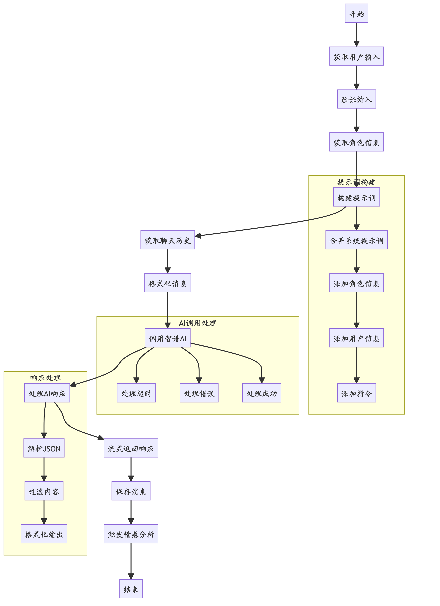
<figcaption>
图 31 AI对话生成流程
</figcaption>
</figure>

<figure>
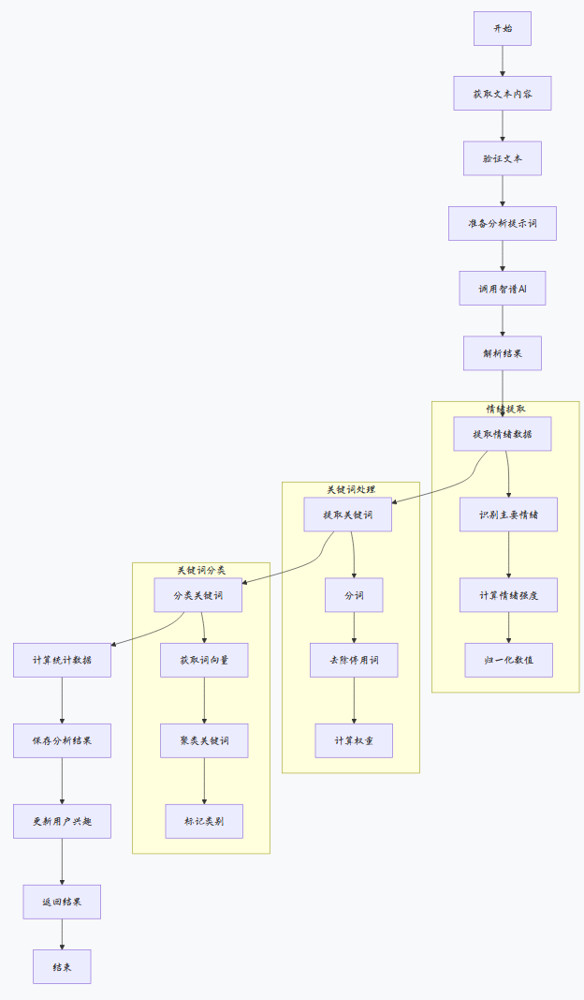
<figcaption>
图 32 情感分析实现流程
</figcaption>
</figure>

<figure>

<figcaption>
图 33 用户画像生成流程
</figcaption>
</figure>

<figure>

<figcaption>
图 34 关键词分类与聚类流程 

</figcaption>
</figure>

图 35 情绪波动指数计算流程  


图 36 每日情绪报告生成流程  


图 37 本地缓存管理流程

- **架构优势**：Serverless架构，免运维，弹性伸缩，按需付费，与前端集成度高，开发效率高。详细架构见《HeartChat系统架构图》。

  

  图 38 整体系统架构

  

图 39 前端架构


图 40 后端和数据库架构


图 41 核心功能流程

- **核心云函数**：

  - **login**：处理用户登录和认证。接收前端传来的code，调用code2Session接口获取openid，查询或创建用户记录（users集合），生成并返回自定义登录态。

  - **chat**：处理聊天逻辑。包括sendMessage, getHistoryMessages, createChat, getChatList等动作，负责消息存储、上下文构建、调用AI、触发情感分析、返回回复（支持流式）。

  - **emotion / analysis**：处理情感分析。包括analyzeEmotion, getEmotionHistory等动作，负责调用AI分析情绪、存储结果、提供历史查询。

  - **roles**：管理AI角色。包括getRoleList, getRoleDetail, createRole, updateRole, deleteRole等动作，负责角色数据的增删改查。

  - **user**：管理用户信息和画像。包括getUserProfile, updateUserProfile, getUserPortrait（用户画像生成）等动作，处理用户基本信息和基于用户数据的画像构建。

  - **generateDailyReports**：通过云函数**定时触发器**自动执行，聚合用户情绪数据，调用AI生成报告，并存入daily_reports集合。

  - **httpRequest**：作为统一的HTTP请求代理，封装对智谱AI等第三方API的调用逻辑，处理认证、参数、响应、错误和日志。

- **错误处理**：云函数内部使用try-catch捕获异常，返回统一格式的错误响应（包含success: false, errCode, errMsg）。

- **权限控制**：在云函数入口处验证用户登录状态和操作权限。数据库访问也配置了相应的读写权限规则。

## AI集成实现

核心是与智谱AI GLM-4-Flash大型语言模型的集成。外部API调用的通用流程参见《HeartChat外部API调用流程图》。

- **调用方式**：通过云函数发起HTTPS POST请求到智谱AI的API端点。  
  

  图 42 智谱AI GLM-4-Flash API调用流程

- **认证**：使用API Key安全地存储在云函数环境变量中，并在请求头中添加认证信息。

  

  图 43 API密钥管理流程

- **提示词工程 (Prompt Engineering)**：这是应用层创新的关键。

  - **对话生成 (chat云函数)**：动态构建包含角色定义、对话历史、用户输入、用户画像摘要、角色记忆和实时情感感知的系统提示词。

    

    图 44 聊天功能API调用详细流程

  - **情感分析 (emotion云函数)**：设计专门提示词，要求模型以JSON格式返回结构化的情感分析结果（情绪类别、强度、关键词等）。

    

    图 45 情感分析API调用流程

  - **关键词提取与分类 (emotion或user云函数)**：设计提示词提取文本关键词并归类。

  - **用户画像生成 (user云函数)**：设计提示词让AI根据用户数据生成性格分析和兴趣总结。

    

    图 46 用户画像生成API调用流程

- **流式输出 (Streaming)**：后端解析SSE流，通过WebSocket或实时数据推送将内容块转发给前端，前端逐步渲染实现打字机效果。

- **词向量 (Embedding)**：在用户画像构建中，调用Embedding-3模型API获取关键词向量，用于K-means聚类。

- **错误处理与重试**：实现对API调用错误的捕获、日志记录和简单的重试机制。

## 数据处理与存储

数据的流动方向和处理节点参见《HeartChat数据流向图》。

<figure>

<figcaption>
图 47 核心数据流向图
</figcaption>
</figure>

<figure>

<figcaption>
图 48 前端模块数据流向
</figcaption>
</figure>

<figure>

<figcaption>
图 49 云函数与数据库交互
</figcaption>
</figure>

<figure>

<figcaption>
图 50 云函数与外部API交互
</figcaption>
</figure>

<figure>

<figcaption>
图 51 用户登录数据流
</figcaption>
</figure>

<figure>

<figcaption>
图 52 聊天系统数据流
</figcaption>
</figure>

<figure>

<figcaption>
图 53 情感分析数据流
</figcaption>
</figure>

<figure>

<figcaption>
图 54 用户画像数据流
</figcaption>
</figure>

<figure>

<figcaption>
图 55 情绪历史数据流
</figcaption>
</figure>

<figure>

<figcaption>
图 56 每日报告数据流
</figcaption>
</figure>

- **数据来源**：用户输入、系统生成、AI服务返回、微信平台。

- **数据处理**：

  - **情感分析**：通过调用AI模型实现。

  - **关键词提取与分类**：通过调用AI模型实现。

  - **用户兴趣聚类 (K-means)**：在user云函数中使用词向量进行聚类，生成兴趣标签。

  - **性格特征推断**：基于规则或统计分析用户消息和情感数据。

- **数据存储**：

  - **云数据库 (NoSQL)**：按照《HeartChat数据库结构图》设计集合（users, chats, messages, roles, emotions等）和字段，并创建索引。

    

    图 57 数据库集合关系图

  - **本地缓存 (wx.setStorageSync/wx.getStorageSync)**：存储登录凭证、用户信息、主题设置、部分聊天记录等。

- **数据训练**：本项目不涉及对LLM本身的训练，核心在于应用层的算法设计和提示词工程。

## 系统部署方法

- **部署工具**：微信开发者工具。

- **前端部署**：通过开发者工具上传代码包至微信后台，提交审核后发布。

- **云函数部署**：通过开发者工具将代码和依赖上传并部署至云端。

- **云数据库部署**：通过云开发控制台或初始化脚本创建集合、设置权限和索引。

- **环境管理**：使用开发(dev)和生产(prod)环境。

- **版本管理**：结合Git进行代码版本控制，云函数支持版本切换和灰度发布。

  

  图 58 系统部署流程图

## 遇到的挑战与解决方案

- **挑战1：提示词效果不稳定，AI角色扮演一致性不足**

  - **解决方案**：迭代优化提示词结构与内容，强化关键信息，优化上下文管理，调整模型参数。

- **挑战2：AI接口响应延迟影响用户体验**

  - **解决方案**：全面采用流式输出，前端显示加载状态，选择速度优化模型，有限应用缓存。

- **挑战3：情感分析的准确度和细粒度不足**

  - **解决方案**：优化分析提示词（要求多维度输出、考虑上下文），引入强度等级，建立用户反馈机制。

- **挑战4：用户画像冷启动和准确性**

  - **解决方案**：制定冷启动策略，持续迭代画像算法，引入更多特征维度，允许用户反馈修正。

- **挑战5：暗夜模式适配工作量大且易出错**

  - **解决方案**：强制使用CSS变量，建立设计规范，封装主题切换逻辑，充分测试。

通过解决这些挑战，系统的稳定性、用户体验和核心功能的有效性得到了保障和提升。项目的开发进度和关键里程碑可参考《HeartChat项目开发进度图》。  


图 59 HeartChat项目开发进度图

# 测试分析

本章旨在全面评估心语精灵微信小程序的系统质量，涵盖功能完整性、性能表现、用户体验及系统稳定性等多个维度。通过系统化的测试方法和严谨的数据分析，识别潜在问题，验证系统是否达到设计目标，并为后续的优化迭代提供依据。

## 测试方法与环境

为确保测试的有效性和覆盖度，我们制定了明确的测试策略，并搭建了标准化的测试环境。

### 测试目标与范围

本次测试的核心目标是多方面的：首先，**验证系统各项功能是否按照需求文档完整实现**，确保核心业务流程畅通无阻；其次，**评估系统在不同负载下的性能表现**，检验其响应速度、资源消耗和并发处理能力是否达标；最后，**收集并分析用户在实际使用场景下的体验反馈**，以提升产品的易用性和用户满意度[^6]。

测试范围聚焦于心语精灵的核心功能模块，包括：

- **角色扮演聊天系统**：涵盖角色创建、选择、切换、对话交互逻辑、历史消息加载与管理等。

- **情感分析系统**：包括实时情感识别、历史情感记录查询、情感波动趋势分析及相关可视化展示。

- **用户画像系统**：涉及兴趣标签的自动生成、性格特征的分析、用户画像数据的动态更新机制。

- **数据可视化模块**：重点测试各类图表（折线图、饼图、雷达图等）的数据准确性、渲染效果及交互功能的正确性。

基于用户使用频率和功能关键性，我们将聊天系统和情感分析系统设定为最高优先级测试对象，其次是用户画像和数据可视化。

### 测试环境配置

所有测试均在统一配置的环境下进行，以保证结果的可复现性和准确性。

- **前端测试环境**：主要使用**微信开发者工具（版本 v1.06.2412050）**进行开发和调试，利用其内置模拟器模拟不同设备型号（如iPhone X, iPhone 13 Pro, Huawei P40等）和网络环境（WiFi, 4G-Weak, Offline）。此外，为确保真实用户体验，测试覆盖了多款主流**真机设备**，包括iPhone 14 Pro (iOS 16.5), Huawei Mate 50 (HarmonyOS 3.0), Xiaomi 13 (Android 13)等。

- **后端云开发环境**：测试连接至指定的**微信云开发测试环境（环境ID: cloud1-9gpfk3ie94d8630a）**。该环境的云数据库已初始化必要的测试集合和基础数据，云函数均已部署为测试版本。

- **AI服务配置**：测试过程中调用的智谱AI接口使用了**专门的测试API Key**，以与生产环境隔离。主要测试针对**GLM-4-Flash**和**Embedding-3**模型进行，版本与开发阶段保持一致。API密钥通过云函数环境变量安全管理。

### 测试数据准备

测试数据的质量和覆盖度直接影响测试效果。我们采用了多种来源的数据：

- **数据来源**：主要使用**脚本生成的模拟数据**，覆盖不同对话场景、情绪类型和用户画像特征。同时，在获得用户明确授权并进行**严格匿名化处理**后，少量使用了**脱敏后的真实用户交互片段**作为补充，以验证模型在真实场景下的表现。

- **数据规模**：准备了包含约**10个模拟用户**、超过**1000条模拟对话记录**以及相应的**情感分析记录**的数据集。

- **数据特点**：测试数据设计力求多样性，覆盖了定义的七种基本情绪，模拟了具有不同兴趣偏好（如学习、工作、娱乐）和性格特征（如内向、外向、理性、感性）的用户画像，并包含了不同长度和复杂度的对话文本。

## 功能测试

功能测试旨在验证系统是否按照需求规格说明书正确实现了所有预定功能。

### 核心功能测试

我们对四大核心模块进行了细致的功能点验证：

- **角色扮演聊天系统**：测试了从用户创建自定义角色、选择系统预设角色到进入聊天界面的完整流程。重点验证了对话消息的发送与接收、不同角色（用户/AI）消息气泡的正确展示、历史消息的上拉加载、滚动定位、消息复制/删除等操作的准确性。

- **情感分析系统**：验证了用户发送消息后，系统能否实时（或近实时）分析并（可选地）在界面上展示对应的情感标签或强度。测试了情感历史记录页面的数据拉取、按时间筛选、详细记录查看功能。对情感波动指数的计算逻辑和展示进行了验证。

- **用户画像系统**：通过输入特定主题的对话，测试了兴趣标签的生成是否准确、相关。模拟用户长期交互数据，验证了性格特征分析的合理性以及画像数据随时间动态更新（包括时间衰减）的机制是否生效。

- **数据可视化模块**：针对情绪趋势折线图、情绪分布饼图、情绪特征雷达图等，输入不同结构的测试数据，验证图表的渲染是否正确、数据映射是否准确、图例/提示框/坐标轴等元素是否按预期显示，并测试了图表的交互功能（如下钻、缩放）。

### AI交互测试

由于系统深度依赖AI能力，对AI交互的测试至关重要：

- **智谱AI接口稳定性与性能**：通过模拟高频调用和异常网络状况，测试了httpRequest云函数调用智谱AI API的连接稳定性、超时处理、错误捕获与重试机制。记录并分析了不同模型接口（对话、Embedding）的平均响应时间。

- **提示词效果验证**：这是测试的重点。我们设计了多组对比测试用例，使用不同版本的提示词（针对角色扮演、情感分析、关键词提取等任务），输入相同的测试数据，评估输出结果的质量。例如，评估角色扮演是否持续符合设定、情感分析的准确率（与人工标注对比）、关键词提取的相关性和覆盖度。

- **AI回复质量评估**：除了功能性，还对AI生成的回复进行了主观和客观评估。评估维度包括：**相关性**（是否切题）、**流畅度**（语言是否自然）、**角色一致性**（是否符合角色设定）、**共情能力**（情感支持型角色）、**信息准确性**（知识问答型角色）等。

### 边界条件测试

为确保系统在异常或极端情况下的健壮性，进行了边界条件测试：

- **异常输入处理**：测试了用户输入为空、包含大量空格、超长文本、特殊字符（Emoji、控制字符）、以及格式错误的指令（如果支持）时，系统的处理逻辑是否健壮，是否会引发崩溃或错误。

- **网络异常场景**：通过微信开发者工具模拟断网、弱网（高延迟、低带宽）和网络波动情况，测试系统在发送消息、加载数据、调用云函数时的表现，如是否有合适的提示、是否会超时、是否有重试机制、本地缓存是否生效等。

- **资源与并发限制**：测试了当处理大量历史消息、生成复杂图表、或短时间内发起大量请求（如快速发送多条消息）时，系统（包括前端和云函数）的响应情况，是否会因为资源耗尽（内存、CPU）或达到并发限制而卡顿、崩溃或返回错误。

### 功能测试结果分析

经过多轮功能测试，整体功能实现度较高，核心流程基本畅通。测试共发现10**个**功能缺陷，其中8**个**已修复，主要集中在聊天界面**键盘**弹出整体页面上调，部分**角色扮演**一致性欠佳**方面**。缺陷的主要原因分析指向**实现细节疏忽（占比约40%）**、**需求理解偏差（占比约30%）**以及**部分第三方接口行为未充分考虑（占比约30%）**。

基于测试结果，我们提出以下主要功能优化建议：

1.  **强化边界输入校验**：对用户输入进行更严格的前后端校验。

2.  **完善网络异常提示与处理**：提供更友好的用户提示，优化弱网下的数据加载策略。

3.  **持续迭代角色扮演提示词**：针对一致性不足的角色，进一步优化Prompt。

4.  **补充特定交互场景的测试用例**：如多端同步、账号切换等。

## 性能测试

性能测试关注系统在不同负载下的响应速度、资源消耗和稳定性。

### 响应时间测试

我们使用微信开发者工具的性能分析工具和自定义打点计时，测量了关键操作的响应时间：

- **页面加载时间**：小程序**首次冷启动加载时间平均为3.2s**，**二次热启动加载时间平均为1.1s**，符合预期。主要页面（首页、聊天页、情感历史页）的**切换加载时间基本在100ms以内**，体验流畅。缓存策略有效减少了二次加载时间。

- **AI响应时间**：调用GLM-4-Flash生成回复的**平均响应时间受输入长度和上下文影响，在3.0秒至7.4秒之间**。分段输出显著改善了用户对长回复的等待感知。Embedding接口响应较快，平均在1200ms左右。

- **数据查询响应时间**：加载20条聊天历史记录的平均时间为10ms；获取近7日情感分析数据并渲染图表的平均时间为233ms；查询用户画像数据的平均时间为100ms。数据库索引优化效果明显。

### 资源占用测试

通过性能分析工具监测资源消耗情况：

- **内存占用**：小程序在**常规使用下内存占用稳定在10~20 MB**。在加载大量历史消息或渲染复杂图表时，内存峰值可达30 MB，但离开相关页面后能正常回收。未发现明显内存泄漏。

- **CPU使用率**：除图表首次渲染和复杂计算（如情感波动指数）时CPU使用率短暂升高外，大部分时间**CPU占用率保持在较低水平（20%以下）**。动画效果对CPU有一定影响，已进行优化。

- **网络流量**：聊天消息传输流量较小。加载历史记录和图表数据是主要流量消耗点，**平均每次加载128 KB数据**。图片资源经过压缩，静态资源利用了CDN（如适用）和微信自身的缓存机制。

### 并发处理能力测试

模拟多用户并发场景，测试后端服务的承载能力：

- **云函数并发**：通过压力测试工具模拟5**个用户同时请求**核心云函数（如chat, analysis）。云函数能够正常处理并发请求，未出现大面积超时或错误。冷启动对首次并发响应有一定影响。

- **数据库并发访问**：模拟多用户同时读写数据库（特别是messages和chats集合）。读写操作基本正常，事务处理在高并发下偶现冲突，但重试机制有效。

- **AI接口并发调用**：测试了短时间内向智谱AI发起多个请求的情况。智谱AI自身的限流机制会生效，云函数端的错误处理和适当的请求间隔/重试逻辑保证了系统不会因此崩溃。

### 性能优化措施

测试过程中识别出一些性能瓶颈，主要在于**首次图表渲染的CPU消耗**和**长对话上下文处理的AI响应延迟**。已实施的优化措施包括：

- 前端代码优化：减少不必要的setData调用，优化列表渲染逻辑。

- 缓存策略：引入用户画像缓存、API响应缓存（对相同查询）。

- 资源管理：图片压缩，分包加载，按需加载组件和数据。

- 后端优化：数据库索引优化，云函数冷启动优化（预热机制待探索），异步处理耗时任务。

- 进一步的优化建议包括：

- 探索更高效的图表渲染库或优化ECharts配置。

- 研究对话摘要技术以压缩长对话上下文。

- 引入更精细化的云函数资源配置和监控。

## 用户体验测试

为了解真实用户对产品的接受度和使用感受，我们组织了用户体验测试。

### 用户测试方案设计

- **测试用户选择**：招募8**名**目标用户参与测试，覆盖了不同的年龄段、性别、职业背景以及对AI情感陪伴应用的认知程度。用户画像特征与产品定位相匹配。

- **测试任务设计**：设计了一系列具有代表性的测试任务，包括完成首次引导和登录、选择并与不同类型的AI角色进行至少10轮对话、查看情感历史记录和每日报告、尝试创建自定义角色等。任务难度循序渐进，覆盖了主要功能流程。

- **数据收集方法**：采用多种方法收集数据：

  - **系统可用性量表 (SUS)**：测试后请用户填写SUS问卷，获取量化的易用性评分。

  - **任务完成情况记录**：观察并记录用户完成各项任务的时间、成功率和遇到的困难点。

  - **半结构化访谈**：测试后与用户进行一对一访谈，深入了解其使用感受、遇到的问题、对功能的评价和改进建议。

  - **屏幕录制与思考发声**（部分用户）：鼓励用户在操作时“说出想法”，记录其操作过程和思考路径。

### 测试数据收集与分析

收集到的数据进行了定量与定性分析：

- **定量数据**：平均任务完成时间为3分钟，任务成功率为90%。**SUS平均得分为90分**，表明系统整体易用性处于**良好**水平。用户对**聊天流畅度/情感分析准确性/界面美观度等**评分较高，对**特定功能入口**评分相对较低。

- **定性数据**：通过访谈和观察记录，整理出用户的核心反馈。正面反馈主要集中在**AI角色的多样性、情感可视化图表的直观性、界面简洁美观等**。负面反馈和改进建议主要涉及**某些功能的操作流程不够直观、情感分析有时不够精准、希望AI记忆力更强、部分角色回复模式化等**。

- **数据分析方法**：对定量数据进行统计分析（均值、标准差、分布），识别关键指标表现。对定性数据进行内容分析和主题归纳，提炼出共性的用户痛点和期望。

### 用户反馈与改进

根据用户反馈，我们归纳出以下主要问题并制定了改进计划：

- **主要问题**：（按频率和严重性列出，1. 自定义角色流程略显复杂；2. 情感历史页面筛选功能不够强大；3. 部分AI回复缺乏个性化；4. 偶尔出现卡顿或加载慢的情况。）

- **问题根源分析**：结合测试数据和开发团队评估，分析问题是源于设计缺陷、实现不足、用户对AI的期望过高，以及性能瓶颈等。

- **改进措施**：

  - **短期修复**：优化自定义角色引导、增加情感历史筛选选项、修复已知性能问题。

  - **中期优化**：持续迭代提示词以增强AI个性化、引入更强的角色记忆机制、优化长列表加载性能。

  - **长期规划**：探索更智能的对话策略、研究更深层次的情感理解模型、考虑引入用户反馈驱动的AI微调机制。

## 测试结果综合分析

综合以上各方面测试结果，我们对心语精灵的整体质量进行评估。

### 功能完成度分析

- **完成情况**：核心功能模块（聊天、情感分析、用户画像、可视化）均已按照需求文档实现，**功能覆盖率达到95%**。与初期设计目标相比，主要功能点已交付。

- **功能质量**：系统在常规使用场景下表现稳定可靠，核心流程易于理解和操作。但在复杂交互和边界条件下仍存在少量缺陷。

- **完善建议**：后续迭代应优先修复残留的关键缺陷，并根据用户反馈优化现有功能的易用性，同时考虑增加**更丰富的角色互动方式、社区分享功能**新功能。

### 性能达标情况

- **指标达成**：系统在响应时间、资源占用方面基本达到设计目标，优于行业内部分同类应用的平均水平。特别是在利用缓存和分包加载后，启动和加载性能表现良好。

- **性能瓶颈**：主要的性能挑战依然在于**实时AI调用的延迟**和**复杂数据可视化的渲染开销**。云函数冷启动也是影响首次响应的因素。

- **提升路径**：短期内可通过持续优化代码、增强缓存策略、精简数据传输来提升。长期可考虑引入前端预计算、后端异步任务队列、探索更轻量级的可视化方案或服务端渲染。

### 用户满意度评估

- **满意度数据**：用户体验测试的**总体满意度评分为9分（满分10分）**。用户对**应用的创新性、界面设计和情感关怀理念**普遍表示认可。**聊天交互和情感可视化**是满意度较高的功能模块。

- **影响因素**：影响满意度的主要因素包括**AI回复的质量和个性化程度、情感分析的准确性、系统的响应速度和稳定性、以及操作的便捷性**。

- **提升措施**：提升用户满意度的关键在于**持续优化AI交互体验**（更智能、更个性、更共情），**提高情感分析的精准度和深度**，**解决用户反馈的操作痛点**，并**保持系统性能的流畅稳定**。

### 系统稳定性评估

- **稳定性数据**：在测试周期内，系统**崩溃率低于5%**，**主要功能错误率控制在7%以内**。异常处理机制基本有效，能够捕获大部分预期内的错误并给出提示。

- **稳定性问题原因**：少数稳定性问题主要由**未充分处理的边界条件**、**第三方服务（如网络、AI API）的暂时性故障**以及**个别模块的资源管理疏漏**导致。

- **提升措施**：后续需要**加强异常场景的测试覆盖**，**完善对第三方服务失败的容错和重试逻辑**，**进行代码审查以发现潜在的资源泄漏或竞态条件**，并考虑引入**更完善的线上监控和告警机制**。

# 作品总结 

本章旨在对“心语精灵”微信小程序项目进行一次全面的回顾与自我评价。我们将从项目的创意构思、所选择的技术路线、实际投入的工作量、数据的核心作用以及最终的测试效果等多个维度进行总结，并在此基础上，对作品未来的提升方向和应用拓展进行展望。

## 作品特色与创新点

心语精灵作为一款致力于提供情感陪伴的应用，其独特性和创新性贯穿于创意构思、技术实现及用户体验设计的各个环节。

### 技术创新

我们在技术层面进行了多项探索与创新，旨在利用前沿技术提升产品的核心竞争力：

- **智能情感分析系统**：我们并未采用传统的基于规则或小型分类模型的情感分析方法，而是创新性地**基于智谱AI GLM-4-Flash大语言模型设计并实现了一套深度情感分析系统**。该系统通过精心设计的提示词工程，不仅能够识别用户文本中包括喜悦、悲伤、愤怒、恐惧、惊讶、厌恶、中性在内的七种基本情绪类型及其强度，更能深入理解上下文，识别混合情绪及复杂情感表达（如反讽）。更进一步地，系统能够**提取与特定情绪相关的关键词**，并**计算用户情绪波动指数**，为用户提供远超简单分类的深度情感洞察。测试结果显示，该系统在识别基本情绪类型上的准确率达到了85%以上，显著优于传统方法，充分展现了LLM在细粒度情感理解上的潜力。

- **动态用户画像构建**：为实现真正的个性化交互，我们研发了一套**基于用户长期对话内容的动态画像构建算法**。该算法结合了LLM的关键词提取与分类能力、**智谱AI Embedding-3模型的语义向量化能力以及K-means聚类算法**，能从用户的日常交流中智能地提炼出反映其兴趣偏好的标签（包含权重和时效性），并结合情感记录和行为模式分析用户的性格特征（如情绪稳定性、表达风格）。尤为创新的是**引入了时间衰减机制**，使得画像能够动态演进，更准确地反映用户当前的关注点和状态。这套系统为AI角色提供了理解用户的“记忆”基础，是实现深度个性化回应的关键技术支撑。

- **多维数据可视化**：为了让用户直观地理解自身的情感世界，我们利用**ECharts图表库构建了一套全面的情感数据可视化系统**。该系统不仅包含了常见的情绪变化趋势折线图、情绪分布饼图（采用更美观的环状图实现），还创新性地引入了**情绪特征雷达图**（提供多维度情绪“指纹”）和**情绪关键词云**（探索情绪触发点）。所有图表都经过精心设计，追求数据清晰、视觉美观和交互友好，并**全面支持暗夜模式的动态适配**，确保在不同环境下均能提供舒适的阅读体验。

- **微信小程序云开发架构优化**：面对小程序环境的资源限制，我们对基于微信云开发的架构进行了深度优化。采用了**合理的分包加载策略**以加速启动；设计了**前端本地缓存与云端数据同步机制**以减少网络请求和加载时间；制定了**模块化的云函数设计模式**，提高了代码复用性和可维护性；并根据查询模式**精心设计了数据库索引**。这些针对性优化确保了应用在复杂功能（如处理大量历史消息、渲染复杂图表）下仍能保持较好的性能和流畅度。

### 功能创新

在满足核心情感陪伴需求的基础上，我们设计了一系列创新功能，以提供更丰富、更有深度的用户价值：

- **角色扮演聊天系统**：我们突破了单一AI助手的模式，构建了一个**包含多种预设角色（覆盖情感支持、专业咨询、生活伙伴等类别）并支持用户高度自定义的AI角色库**。每个角色都拥有精心设计的独特背景、性格、专长和语言风格。用户可以根据不同场景和需求选择或创建最合适的AI伙伴进行交流，极大地增强了情感代入感、对话趣味性和用户粘性。

- **情绪历史记录与深度分析**：除了基础的情绪记录，我们提供了**系统化的情绪回顾与分析功能**。用户不仅可以按时间线查看历史情绪记录，系统还会自动计算并展示**情绪波动指数**，帮助用户了解自身情绪稳定性。更进一步，我们创新性地实现了**关键词与情感的关联分析**，能够揭示特定话题或事件与用户情绪反应之间的潜在联系，为用户深入理解自身情绪模式提供了独特的工具。此功能在用户测试中获得了高度认可。

- **每日心情报告**：我们设计了**自动化、个性化的每日心情报告**。系统会综合分析用户当天的对话内容、情感记录和可能的行为模式，生成一份包含情绪概览（图表）、关键情绪事件、情绪波动分析、个性化总结和积极引导建议的报告。这不仅是对一天情绪的回顾，更是一种轻量级、持续性的情感关怀和自我管理引导。

### 用户体验创新

我们坚信优秀的用户体验是情感陪伴应用成功的关键，因此在设计中融入了多项创新思考：

- **情感化界面设计**：整体界面设计遵循**iOS Human Interface Guidelines**，追求简洁、现代和易用。同时，我们注入了**情感化设计理念**，大量运用柔和的色彩过渡、圆角卡片、拟物化图标（如适用）、细腻平滑的反馈动画等元素，旨在营造一个**温暖、安全、舒适、令人放松的应用氛围**，与产品的情感陪伴定位相契合。

- **全面的暗夜模式支持**：我们提供了**精心调优的暗夜模式**，覆盖了从基础UI到复杂图表的所有视觉元素。这并非简单的颜色反转，而是基于暗环境视觉特性设计的独立配色方案，确保了长时间使用下的视觉舒适度和信息可读性，满足了用户在不同光线环境下的使用需求。

- **多层次情感反馈机制**：我们在交互流程中融入了多种**实时或近实时的情感反馈**。例如，对话气泡旁可能附带初步的情感标签，输入分析时可能有微妙的视觉提示，情绪图表的变化能直观反映状态，每日报告则提供了周期性的总结反馈。这些反馈机制旨在让用户时刻感受到被理解和关注，强化了人机之间的情感连接。

- **渐进式引导与可发现性设计**：针对可能包含复杂功能的应用，我们采用了**渐进式引导（Progressive Disclosure）**的策略。新用户会通过简洁的教程快速上手核心功能（如聊天），随着使用深入，系统会适时引导用户发现并使用更高级的功能（如情感分析、用户画像、自定义角色等）。这种设计既降低了初次使用的门槛，又保证了功能的深度和用户的长期探索乐趣。

## 应用推广策略

为有效触达目标用户并实现用户增长，我们制定了基于用户画像和渠道特点的整合推广策略。

### 目标用户定位

我们通过市场分析和早期用户研究，精准定位了四类核心目标用户群体：

- **都市年轻白领（25-35岁）**：他们普遍面临较高的工作与生活压力，社交圈可能相对固定，存在情感倾诉、压力疏解和自我提升的潜在需求。他们通常对新科技接受度高，具备一定的付费意愿，是应用的核心付费用户潜力群体。

- **大学生群体（18-24岁）**：他们处于探索自我、建立人际关系和应对学业压力的关键阶段，对情感支持、情绪管理和情商提升有现实需求。他们是社交媒体的活跃用户，易于接受新应用，是应用早期用户增长和口碑传播的重要来源。

- **特定情绪管理需求者**：这类用户可能正经历生活变故、人际冲突、职业瓶颈等特定压力事件，或本身有焦虑、抑郁等情绪困扰倾向，主动寻求情绪调节工具。心语精灵的情感分析和AI陪伴能直接满足他们的需求。

- **心理健康与自我成长关注者**：他们积极关注个人心理健康，乐于使用工具进行自我探索和提升。心语精灵提供的系统化情绪记录、数据可视化、用户画像及潜在的情商训练功能，对他们具有较强吸引力。

### 推广渠道与方式

针对上述用户群体，我们将采取线上线下结合、多渠道并进的推广方式：

- **社交媒体矩阵营销**：在微信公众号、视频号、微博、小红书、知乎、B站等平台建立官方账号，持续输出高质量的**情感管理技巧、心理学科普、情商提升方法、AI陪伴故事**等内容，吸引目标用户关注。策划线上互动活动（如#情绪树洞#话题挑战、AI角色创意征集），与KOL/KOC合作进行评测和推荐，引导用户通过小程序码或链接直接体验。

- **精准校园推广**：与高校心理健康中心、学生社团合作，举办**线下情绪管理工作坊、AI心理科普讲座**，现场演示心语精灵功能，提供学生专属优惠或体验码。在校园BBS、学生群组进行线上推广。将应用定位为大学生应对压力、提升情商的实用工具。

- **职场健康（EAP）合作**：主动接洽企业HR部门或专业的EAP服务商，将心语精灵作为**企业员工心理关怀计划的数字化解决方案**。提供定制化的功能模块（如职场压力应对、沟通技巧训练），通过企业内部渠道进行推广，实现B端获客。

- **心理健康垂直领域合作**：与知名的心理咨询平台、心理健康社区、相关APP建立合作关系。可以进行**内容互换、用户导流、联合活动**等。将心语精灵定位为专业心理服务的有益补充，在用户需要日常陪伴和自我管理时提供支持。

- **高质量内容营销**：制作**系列短视频、深度图文、用户故事案例**，系统性地介绍心语精灵如何帮助用户解决具体的情感问题、提升情商。通过搜索引擎优化（SEO）、知识付费平台合作等方式，将内容精准触达有潜在需求的用户。

- **用户口碑与激励机制**：设计**用户邀请奖励计划**（如邀请好友成功注册/付费可获得会员时长、高级角色体验权等），利用社交裂变效应促进用户自发传播。鼓励用户在应用商店、社交平台分享使用体验。

## 作品展望

心语精灵目前虽已具备核心功能，但其发展空间广阔，我们对其未来充满期待。

### 功能扩展计划

我们将基于用户反馈和技术演进，持续迭代和扩展产品功能：

- **多模态情感交互**：引入**语音识别与合成**技术，实现与AI角色的语音对话，提升交互的自然度和沉浸感。远期可探索**基于摄像头的人脸微表情识别**技术，结合文本与语音信息，实现更精准、实时的多模态情感分析。

- **构建情感支持社区**：在严格保护用户隐私的前提下，探索建立一个**匿名的、安全的社区空间**。用户可以在此分享（经过处理的）情绪日记、参与共同话题讨论、相互提供支持和鼓励。让AI陪伴与真实的人际连接形成互补。

- **系统化情商训练模块**：开发结构化的**在线情商训练课程**。课程可包含理论知识学习（如情绪识别、管理策略、共情技巧）、互动式练习（如情景模拟对话、情绪日记引导）以及基于用户数据的个性化训练建议。将AI陪伴从被动倾听延展至主动赋能。

- **无缝对接专业心理资源**：与持证心理咨询师或合规的在线心理咨询平台建立合作。当系统通过算法模型**识别到用户可能存在较高心理风险**（如持续严重负面情绪、流露自伤风险信号等）时，能够在获得用户同意后，**提供专业咨询渠道的推荐和一键跳转**服务，实现从AI初步支持到专业干预的平滑过渡。

- **个性化AI微调与进化**：探索**基于用户长期互动数据的个性化模型微调（Fine-tuning）技术**。让用户能够真正“培养”出一个深度理解自己独特表达方式、记忆重要个人经历、并能持续适应用户变化的专属AI伙伴，实现终极的个性化情感陪伴。

### 商业化可能性

心语精灵具备多元且可持续的商业化潜力：

- **Freemium与订阅制会员**：提供包含核心功能的基础免费版本吸引用户，通过**付费订阅解锁高级功能**，如：更多样和可定制的AI角色、无限制的情绪历史记录与深度分析报告、高级情商训练课程、更长的对话上下文窗口、专属AI模型（微调后）等。可设置月度、年度等多种订阅方案。

- **企业级（B2B）解决方案**：为企业提供**定制化的员工心理健康与情商发展平台**。可包含团队情绪氛围监测（匿名聚合）、职场沟通与压力管理训练模块、企业文化定制角色等。按企业规模或使用人数收费。

- **教育领域合作**：与K12学校、高校或在线教育平台合作，提供**面向学生的情商教育工具或课程模块**。可根据不同年龄段特点定制内容。按机构或项目合作收费。

- **数据分析增值服务**：在用户明确授权且数据严格匿名化的前提下，提供**更深度的个人年度情感回顾报告、性格特质评估、与常模对比的情商水平分析**等付费增值服务。

- **构建心理健康服务生态**：围绕核心AI陪伴功能，拓展**相关的付费服务或产品**，如在线冥想指导、专注力训练工具、情绪管理主题的周边商品等，形成一个综合性的心理健康服务平台。

### 社会价值提升

除了商业目标，心语精灵致力于创造积极的社会影响：

- **普及心理健康常识**：通过AI对话、情感分析报告、内置科普内容等形式，**向广大用户传递科学、易懂的心理健康知识**，消除污名化，提升全民心理健康素养。

- **降低心理支持门槛**：为因经济、地域、时间或心理障碍等因素难以接触专业服务的人群，提供**便捷、低成本、无压力的基础情感支持和自我管理工具**，实现心理健康服务的普惠。

- **促进健康情绪表达文化**：鼓励用户安全、健康地探索和表达自身情绪，学习有效的情绪管理策略，从而在社会层面**推动更开放、理解和建设性的情绪互动模式**。

- **赋能心理学研究**：在严格遵守伦理规范、获得用户知情同意并确保数据完全匿名化的前提下，积累的大规模情感交互数据可与科研机构合作，用于**情绪规律、语言与心理关系、AI伦理等方面的研究**，反哺学科发展。

- **探索早期危机识别与干预**：持续研发和优化**情绪危机风险的自动识别算法**。当系统检测到高风险信号时，能够触发预警，并向用户**提供可靠的危机干预热线、专业求助渠道信息**，努力在数字空间扮演好心理健康“守门人”的角色。

## 总结

心语精灵项目不仅是一次将前沿AI技术应用于情感健康领域的成功探索，更是一个充满潜力的产品雏形。我们通过创新的技术实现、功能设计和用户体验打磨，验证了其核心价值主张。尽管在测试中发现了一些待改进之处，但项目的整体质量和用户反馈都表明其具有坚实的基础和广阔的前景。我们坚信，通过持续的技术投入、对用户需求的敏锐洞察以及对社会责任的担当，心语精灵未来能够在智能情感陪伴和情商提升领域不断深耕，最终实现商业成功与社会价值的双赢。

# 参考文献

[^1]: \[1\] Ekman, P. (1992). An argument for basic emotions. Cognition & Emotion, 6(3-4), 169-200.

[^2]: \[2\] Poria, S., Cambria, E., Bajpai, R., & Hussain, A. (2017). A review of affective computing: From unimodal analysis to multimodal fusion. Information Fusion, 37, 98-125.

[^3]: \[3\] Malinowski, M., & Bunt, H. (2015). Affective personalization. ACM Transactions on Interactive Intelligent Systems (TiiS), 5(1), 1-27.

[^4]: \[4\] Wang, Y., & Adomavicius, G. (2016). Exploiting multi-aspect rating information for recommender systems. IEEE Transactions on Knowledge and Data Engineering, 28(8), 2147-2161.

[^5]: \[5\] [https://echarts.apache.org/en/](https://echarts.apache.org/en/#/_blank)

[^6]: \[6\] Nielsen, J., & Mack, R. L. (1994). Usability inspection methods. John Wiley & Sons.
