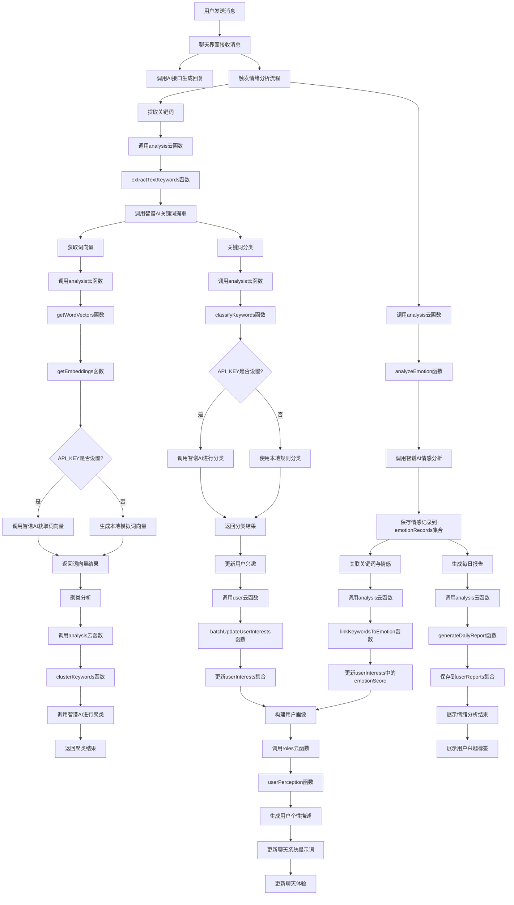

```mermaid
graph TD
    A[用户发送消息] --> B[聊天界面接收消息]
    B --> C[调用AI接口生成回复]
    B --> D[触发情绪分析流程]
    
    %% 情绪分析流程
    D --> E[调用analysis云函数]
    E --> F[analyzeEmotion函数]
    F --> G[调用智谱AI情感分析]
    G --> H[保存情感记录到emotionRecords集合]
    
    %% 关键词提取流程
    D --> I[提取关键词]
    I --> J[调用analysis云函数]
    J --> K[extractTextKeywords函数]
    K --> L[调用智谱AI关键词提取]
    
    %% 关键词分类流程
    L --> M[关键词分类]
    M --> N[调用analysis云函数]
    N --> O[classifyKeywords函数]
    O --> P{API_KEY是否设置?}
    P -->|是| Q[调用智谱AI进行分类]
    P -->|否| R[使用本地规则分类]
    Q --> S[返回分类结果]
    R --> S
    
    %% 词向量获取流程
    L --> T[获取词向量]
    T --> U[调用analysis云函数]
    U --> V[getWordVectors函数]
    V --> W[getEmbeddings函数]
    W --> X{API_KEY是否设置?}
    X -->|是| Y[调用智谱AI获取词向量]
    X -->|否| Z[生成本地模拟词向量]
    Y --> AA[返回词向量结果]
    Z --> AA
    
    %% 聚类分析流程
    AA --> AB[聚类分析]
    AB --> AC[调用analysis云函数]
    AC --> AD[clusterKeywords函数]
    AD --> AE[调用智谱AI进行聚类]
    AE --> AF[返回聚类结果]
    
    %% 兴趣分析流程
    S --> AG[更新用户兴趣]
    AG --> AH[调用user云函数]
    AH --> AI[batchUpdateUserInterests函数]
    AI --> AJ[更新userInterests集合]
    
    %% 情感关联流程
    H --> AK[关联关键词与情感]
    AK --> AL[调用analysis云函数]
    AL --> AM[linkKeywordsToEmotion函数]
    AM --> AN[更新userInterests中的emotionScore]
    
    %% 用户画像构建流程
    AJ --> AO[构建用户画像]
    AN --> AO
    AO --> AP[调用roles云函数]
    AP --> AQ[userPerception函数]
    AQ --> AR[生成用户个性描述]
    AR --> AS[更新聊天系统提示词]
    
    %% 每日报告生成流程
    H --> AT[生成每日报告]
    AT --> AU[调用analysis云函数]
    AU --> AV[generateDailyReport函数]
    AV --> AW[保存到userReports集合]
    
    %% 结果展示
    AS --> AX[更新聊天体验]
    AW --> AY[展示情绪分析结果]
    AY --> AZ[展示用户兴趣标签]
```
