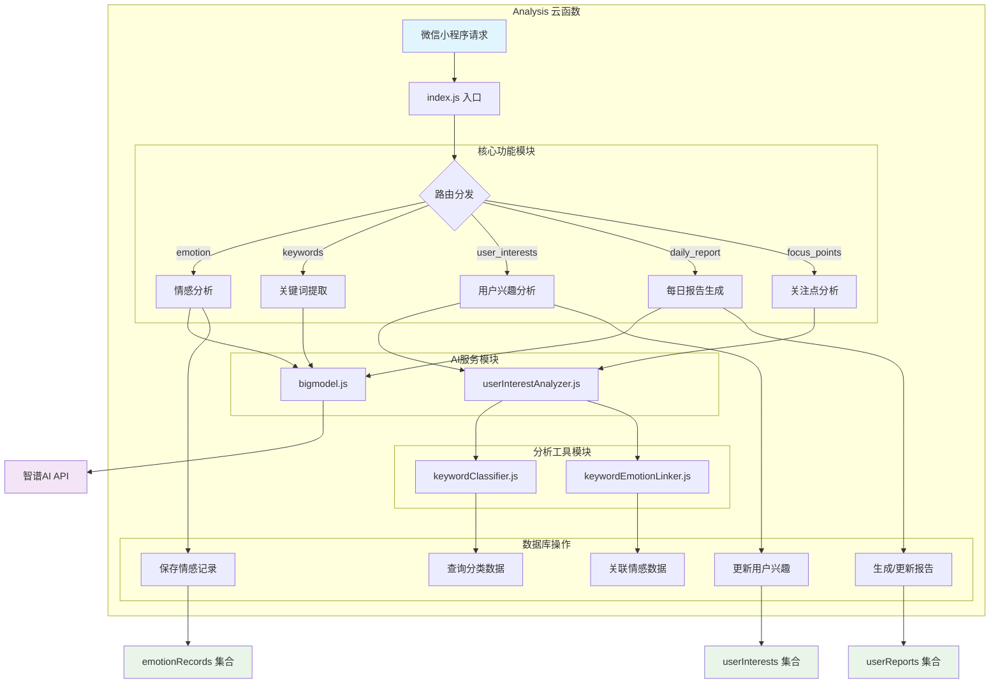
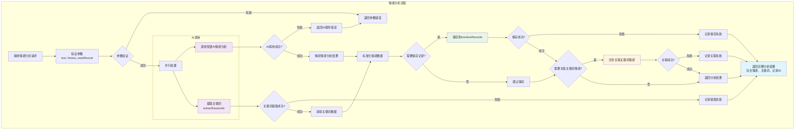
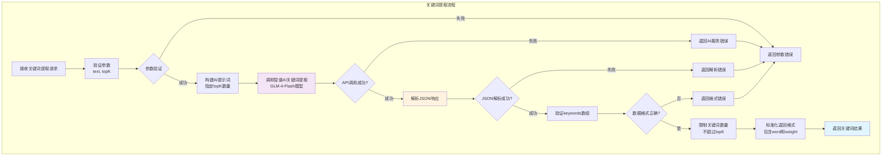
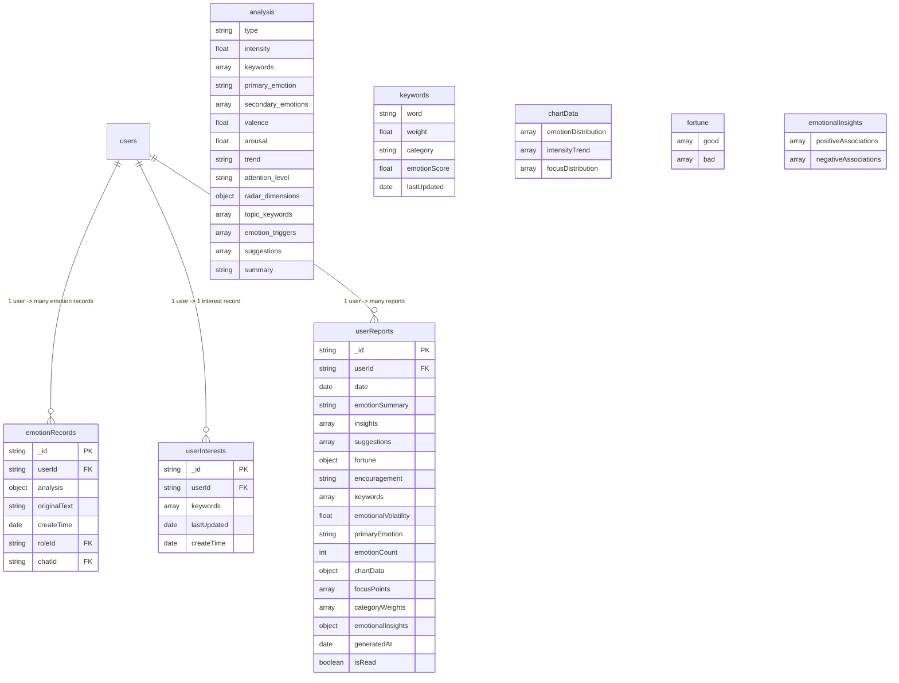

# Analysis 云函数流程图

## 目录
1. [系统架构流程图](#系统架构流程图)
2. [情感分析流程图](#情感分析流程图)
3. [关键词提取流程图](#关键词提取流程图)
4. [用户兴趣分析流程图](#用户兴趣分析流程图)
5. [每日报告生成流程图](#每日报告生成流程图)
6. [数据库设计图](#数据库设计图)

---

## 系统架构流程图



---

## 情感分析流程图



---

## 关键词提取流程图



---

## 用户兴趣分析流程图

```mermaid
graph TD
    subgraph "用户兴趣分析流程"
        A[接收兴趣分析请求] --> B[验证参数<br>keywords, emotionRecords]
        B --> C{参数验证}
        
        C -->|失败| D[返回参数错误]
        
        C -->|成功| E[关键词分类<br>keywordClassifier]
        
        E --> F{分类成功?}
        
        F -->|失败| G[使用默认分类<br>类别设为"其他"]
        F -->|成功| H[获得分类结果]
        
        G --> I[计算类别权重]
        H --> I
        
        I --> J[标准化权重百分比]
        
        J --> K[提取用户关注点<br>取前5个类别]
        
        K --> L[情感关联分析<br>分析关键词与情绪关系]
        
        L --> M[构建分析结果<br>categoryWeights, focusPoints, emotionalInsights]
        
        M --> N[返回完整兴趣分析结果]
        
        D --> O[返回错误信息]
        
        subgraph "关键词分类"
            E --> P[批量分类API调用]
            P --> Q{API可用?}
            Q -->|是| R[调用智谱AI分类]
            Q -->|否| S[本地规则分类<br>SUBCATEGORIES映射]
            R --> T{AI分类成功?}
            T -->|是| U[使用AI分类结果]
            T -->|否| S
            S --> G
            U --> F
        end
    end
    
    style P fill:#f3e5f5
    style S fill:#fff3e0
    style L fill:#e8f5e8
    style N fill:#e1f5fe
```

---

## 每日报告生成流程图

```mermaid
graph TD
    subgraph "每日报告生成流程"
        A[接收报告生成请求] --> B[验证参数<br>userId, date]
        B --> C{参数验证}
        
        C -->|失败| D[返回参数错误]
        
        C -->|成功| E[检查现有报告<br>forceRegenerate标志]
        
        E --> F{报告已存在且<br>不需要重新生成?}
        
        F -->|是| G[返回现有报告<br>isNew: false]
        
        F -->|否| H[查询当天情感记录<br>emotionRecords]
        
        H --> I{找到情感记录?}
        
        I -->|否| J[返回无数据错误]
        
        I -->|是| K[分析情感数据]
        
        K --> L[统计情感分布]
        K --> M[计算主要情感类型]
        K --> N[提取并统计关键词]
        K --> O[计算情绪波动指数]
        
        N --> P[调用关注点分析]
        
        P --> Q{关注点分析成功?}
        Q -->|是| R[获得关注点数据]
        Q -->|否| S[使用空关注点数据]
        
        O --> T[生成图表数据<br>emotionDistribution, intensityTrend]
        
        R --> U
        S --> U
        
        U --> V[调用AI生成报告内容<br>summary, insights, suggestions, fortune]
        
        V --> W{AI生成成功?}
        W -->|是| X[解析AI结果]
        W -->|否| Y[使用默认报告内容]
        
        X --> Z[构建完整报告数据]
        Y --> Z
        
        Z --> AA[保存/更新报告到userReports]
        
        AA --> AB[更新用户兴趣数据]
        
        AB --> AC[返回新生成的报告<br>isNew: true]
        
        G --> AD[结束流程]
        J --> D
        AC --> AD
    end
    
    style H fill:#e8f5e8
    style P fill:#fff3e0
    style V fill:#f3e5f5
    style AA fill:#e8f5e8
    style AC fill:#e1f5fe
```



---

## 数据库设计图



---

## 关键业务流程说明

### 1. 情感分析数据流
- **输入**: 用户对话文本 + 历史消息
- **处理**: 智谱AI分析 + 关键词提取 + 情感关联
- **输出**: 多维度情感分析结果 + 记录ID
- **存储**: emotionRecords集合

### 2. 关键词分类流程
- **本地分类**: 基于26个预定义类别的规则匹配
- **AI分类**: 智谱AI的语义理解分类
- **容错机制**: API失败时自动切换到本地分类

### 3. 兴趣分析数据流
- **输入**: 关键词 + 情感记录
- **处理**: 分类 → 权重计算 → 关注点提取 → 情感关联
- **输出**: 结构化的用户兴趣画像
- **存储**: userInterests集合

### 4. 报告生成流程
- **数据聚合**: 当天所有情感记录的综合分析
- **AI增强**: 智谱AI生成个性化建议和总结
- **可视化**: 生成图表数据支持前端展示
- **定时更新**: 支持强制重新生成机制

### 5. 性能优化策略
- **异步处理**: 关键词情感关联异步执行，不阻塞主流程
- **缓存机制**: 避免重复生成相同日期的报告
- **并行调用**: 情感分析和关键词提取并行执行
- **降级策略**: AI服务失败时使用本地算法替代