# Analysis 云函数模块详细流程图

## 目录
1. [BigModel 模块流程图](#bigmodel-模块流程图)
2. [KeywordClassifier 模块流程图](#keywordclassifier-模块流程图)
3. [UserInterestAnalyzer 模块流程图](#userinterestanalyzer-模块流程图)
4. [KeywordEmotionLinker 模块流程图](#keywordemotionlinker-模块流程图)
5. [错误处理流程图](#错误处理流程图)

---

## BigModel 模块流程图

### 情感分析详细流程
```mermaid
graph TD
    subgraph "BigModel 情感分析详细流程"
        A[analyzeEmotion函数调用] --> B[验证text参数]
        B --> C{参数有效?}
        
        C -->|否| D[返回参数错误]
        C -->|是| E[构建messages数组]
        
        E --> F[添加system提示词<br>详细的情感分析指令]
        E --> G{有历史消息?}
        
        G -->|是| H[添加最多5条历史消息<br>作为上下文]
        G -->|否| I[跳过历史消息]
        
        H --> J[添加当前用户消息]
        I --> J
        
        J --> K[调用智谱AI API<br>GLM-4-Flash模型]
        K --> L{API调用成功?}
        
        L -->|失败| M[返回API错误]
        L -->|成功| N[解析choices[0].message.content]
        
        N --> O{JSON解析成功?}
        
        O -->|失败| P[返回解析错误]
        O -->|成功| Q[标准化返回结果]
        
        Q --> R[兼容旧版字段映射]
        R --> S[添加新字段支持]
        S --> T[返回完整情感分析对象]
        
        M --> U[返回错误对象]
        P --> U
        D --> U
    end
    
    style F fill:#f3e5f5
    style Q fill:#fff3e0
    style T fill:#e1f5fe
```

### 词向量获取流程
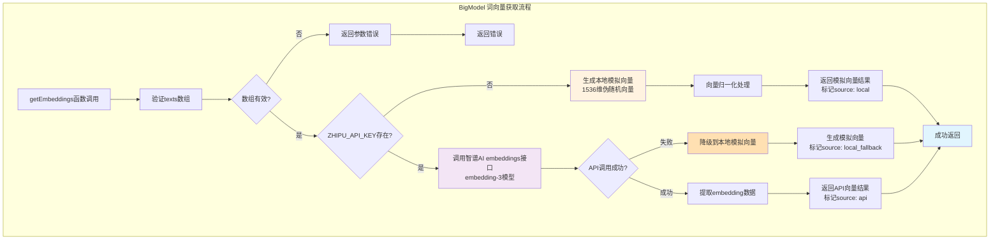

---

## KeywordClassifier 模块流程图

### 批量关键词分类流程
```mermaid
graph TD
    subgraph "KeywordClassifier 批量分类流程"
        A[batchClassifyKeywords调用] --> B[验证keywords数组]
        B --> C{数组有效?}
        
        C -->|否| D[返回空数组]
        C -->|是| E[去重处理]
        
        E --> F{ZHIPU_API_KEY存在?}
        
        F -->|否| G[本地规则分类]
        F -->|是| H[构建分类提示词]
        
        G --> I[遍历每个关键词]
        H --> J[调用智谱AI chatCompletion]
        
        I --> K[检查细分类别映射<br>SUBCATEGORIES]
        K --> L{找到匹配类别?}
        
        L -->|是| M[使用匹配类别]
        L -->|否| N[简单规则匹配]
        
        N --> O{规则匹配成功?}
        
        O -->|是| P[使用规则类别]
        O -->|否| Q[默认类别: 其他]
        
        M --> R[添加到分类结果]
        P --> R
        Q --> R
        
        J --> S{AI调用成功?}
        S -->|失败| T[降级到本地分类]
        S -->|成功| U[解析JSON响应]
        
        U --> V{JSON解析成功?}
        V -->|失败| W[降级到本地分类]
        V -->|成功| X[返回AI分类结果]
        
        T --> G
        W --> G
        
        R --> Y[完成所有关键词分类]
        X --> Z[返回分类结果]
        Y --> AA[返回本地分类结果]
        
        D --> AB[结束]
        Z --> AB
        AA --> AB
    end
    
    style K fill:#e8f5e8
    style J fill:#f3e5f5
    style T fill:#ffe0b2
    style X fill:#e1f5fe
```

### 细分类别映射规则
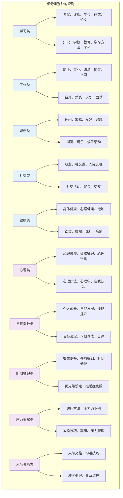

---

## UserInterestAnalyzer 模块流程图

### 兴趣分析主流程
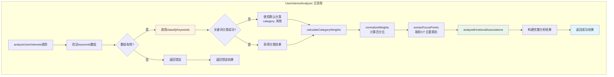

### 情感关联分析流程
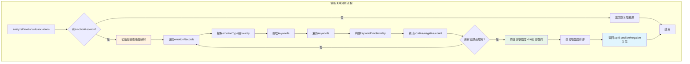

---

## KeywordEmotionLinker 模块流程图

### 关键词情感关联流程
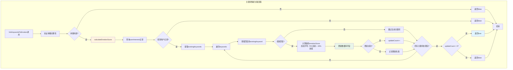

### 情感分数计算流程
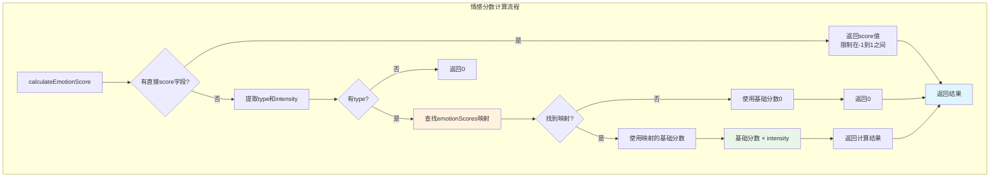

---

## 错误处理流程图

### 统一错误处理流程
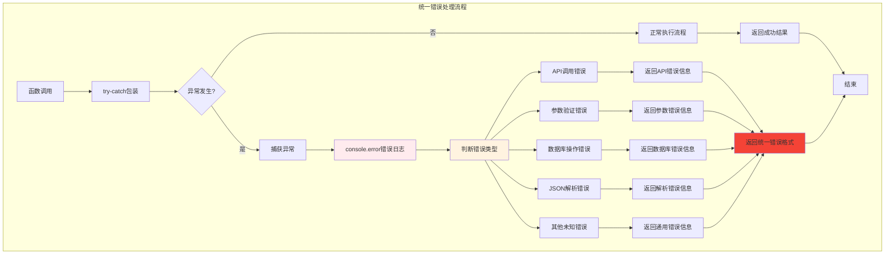

### 降级策略流程
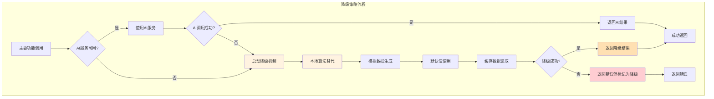

### 数据验证流程
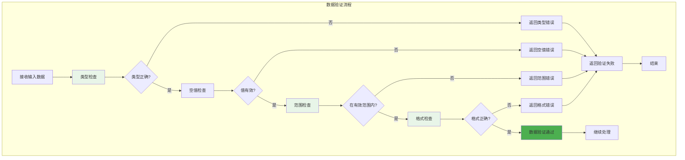

---

## 性能优化流程

### 并行处理流程
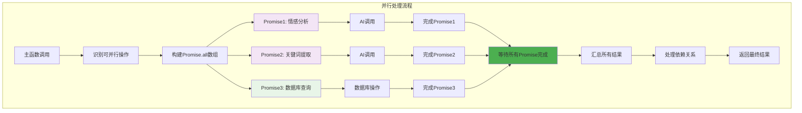

### 缓存策略流程
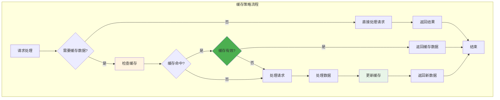

这些流程图详细展示了 analysis 云函数中各个模块的具体处理逻辑，包括错误处理、降级策略、数据验证和性能优化等方面的实现细节。