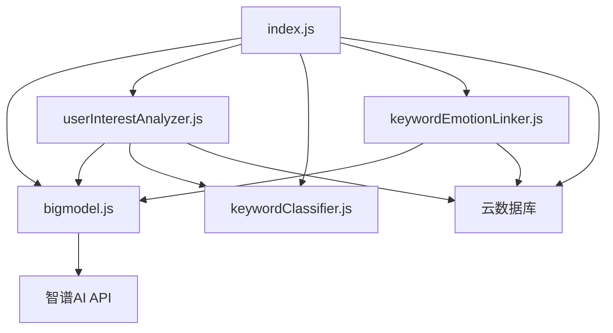
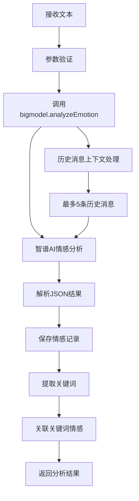
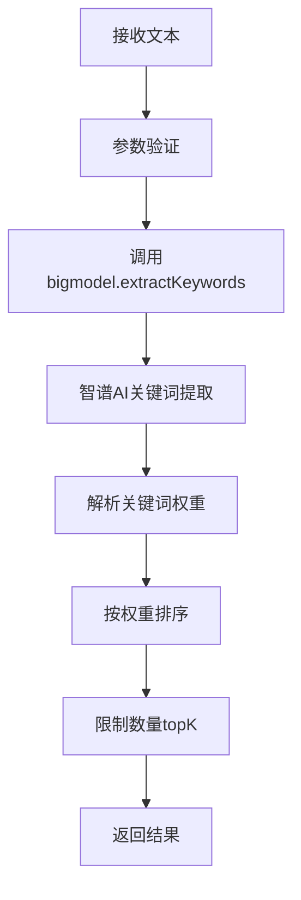
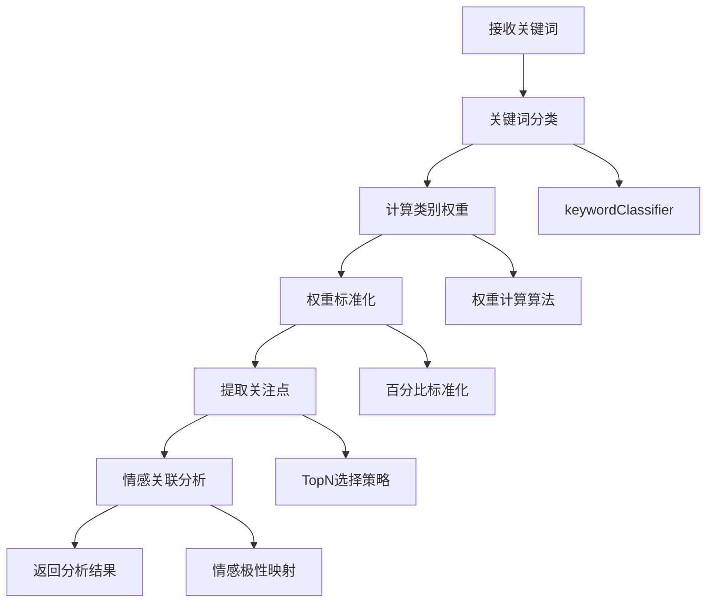
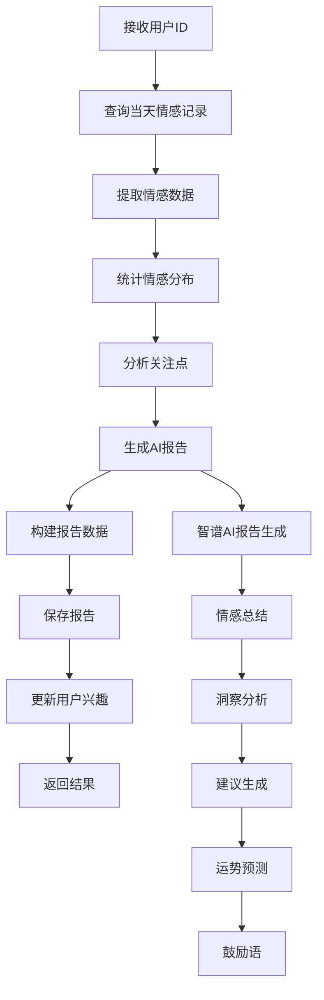

# HeartChat Analysis 云函数实现分析文档

## 📋 文档概述

本文档详细分析了 HeartChat 项目中 `cloudfunctions/analysis` 云函数的实现流程、架构设计和各模块功能。

## 🏗️ 系统架构

### 核心模块组成

```
analysis/
├── index.js                 # 主入口文件 - 业务逻辑协调器
├── bigmodel.js             # 智谱AI API调用模块 - 核心AI能力
├── userInterestAnalyzer.js # 用户兴趣分析器 - 数据分析引擎
├── keywordClassifier.js    # 关键词分类器 - 智能分类系统
├── keywordEmotionLinker.js # 关键词情感关联模块 - 情感数据关联
├── keywords.js             # 关键词处理工具（未使用）
└── test.js                 # 测试文件
```

### 模块依赖关系



## 🔧 核心功能分析

### 1. 情感分析功能

**实现流程：**


**关键特性：**
- 支持历史消息上下文分析
- 多维度情感分析（强度、极性、唤醒度）
- 实时关键词提取和关联
- 异步保存分析记录

### 2. 关键词提取功能

**实现流程：**


### 3. 用户兴趣分析功能

**实现流程：**


### 4. 每日报告生成功能

**实现流程：**


## 📚 模块详细分析

### bigmodel.js - 智谱AI API调用模块

**核心功能：**
- 情感分析：`analyzeEmotion(text, history)`
- 关键词提取：`extractKeywords(text, topK)`
- 词向量获取：`getEmbeddings(texts)`
- 聚类分析：`clusterKeywords(text, threshold, minClusterSize)`
- 用户兴趣分析：`analyzeUserInterests(messages)`
- 报告生成：`generateReportContent(prompt)`

**技术特点：**
- 统一的API调用封装
- 完善的错误处理机制
- 本地模拟词向量降级策略
- JSON格式响应标准化

### userInterestAnalyzer.js - 用户兴趣分析器

**核心算法：**
1. **关键词分类算法**：调用keywordClassifier进行批量分类
2. **权重计算算法**：累加同类别关键词权重
3. **标准化算法**：转换为百分比权重
4. **关注点提取算法**：选择TopN类别及代表性关键词
5. **情感关联算法**：基于历史情感记录分析关联性

**预定义类别：**
```javascript
const INTEREST_CATEGORIES = [
  '学习', '工作', '娱乐', '社交', '健康', '生活', '科技', '艺术', '体育', 
  '旅游', '美食', '时尚', '金融', '宠物', '家庭', '音乐', '电影', '阅读', 
  '游戏', '心理', '自我提升', '时间管理', '压力缓解', '人际关系', '休闲活动'
];
```

### keywordClassifier.js - 关键词分类器

**分类策略：**
1. **AI分类优先**：调用智谱AI进行智能分类
2. **本地规则降级**：基于细分类别映射的规则分类
3. **预定义类别**：26个标准类别体系

**细分类别映射：**
- 学习：['考试', '课程', '学位', '研究', '论文', ...]
- 工作：['职业', '事业', '工作压力', '职场', '同事', ...]
- ...（其他24个类别）

### keywordEmotionLinker.js - 关键词情感关联模块

**核心功能：**
- 关联关键词与情感分数
- 情感分数计算算法
- 关键词情感统计

**情感分数计算：**
```javascript
// 情感类型映射到分数
const emotionScores = {
  'joy': 0.8, 'happiness': 0.9, 'contentment': 0.7,
  'sadness': -0.7, 'anger': -0.8, 'fear': -0.7,
  'neutral': 0, 'anxiety': -0.6, 'stress': -0.5
  // ...更多情感映射
};
```

## 💾 数据库设计

### 主要集合

1. **emotionRecords** - 情感分析记录
   - userId: 用户ID
   - analysis: 分析结果
   - originalText: 原始文本
   - createTime: 创建时间

2. **userInterests** - 用户兴趣数据
   - userId: 用户ID
   - keywords: 关键词数组（含权重、分类、情感分数）
   - lastUpdated: 更新时间

3. **userReports** - 用户每日报告
   - userId: 用户ID
   - date: 报告日期
   - emotionSummary: 情感总结
   - insights: 洞察数组
   - suggestions: 建议数组
   - fortune: 运势数据
   - keywords: 关键词统计
   - emotionalVolatility: 情绪波动指数

## 🔍 API接口分析

### 支持的type参数

| type | 功能 | 主要参数 |
|------|------|----------|
| emotion | 情感分析 | text, history, saveRecord |
| keywords | 关键词提取 | text, topK |
| word_vectors | 词向量获取 | texts |
| cluster | 聚类分析 | text, threshold, minClusterSize |
| user_interests | 用户兴趣分析 | messages |
| focus_points | 关注点分析 | keywords, emotionRecords |
| daily_report | 每日报告 | userId, date, forceRegenerate |
| classify_keywords | 关键词分类 | keywords, batch |
| link_keywords_emotion | 关键词情感关联 | keywords, emotionResult |
| get_keyword_emotion_stats | 获取情感统计 | userId |

### 请求/响应格式

**请求格式：**
```javascript
{
  type: 'emotion',
  text: '用户输入的文本',
  history: [...], // 可选历史消息
  saveRecord: true, // 是否保存记录
  extractKeywords: true, // 是否提取关键词
  linkKeywords: true // 是否关联关键词情感
}
```

**响应格式：**
```javascript
{
  success: true,
  result: {
    // 情感分析结果
    primary_emotion: '焦虑',
    intensity: 0.8,
    valence: -0.6,
    // ...其他字段
  },
  keywords: [...], // 关键词数组
  recordId: '记录ID'
}
```

## 🚀 性能优化策略

### 1. 并行处理优化
- 情感分析和关键词提取并行执行
- 异步保存记录，不阻塞主流程
- 关键词情感关联异步处理

### 2. 缓存策略
- 智谱AI结果本地缓存
- 用户兴趣数据定期更新
- 每日报告去重生成

### 3. 降级策略
- API失败时使用本地模拟词向量
- 分类失败时使用规则引擎
- 报告生成失败时使用默认内容

### 4. 数据处理优化
- 历史消息限制数量（最多5条）
- 关键词数量限制（topK）
- 分页查询大数据集

## 🔐 安全考虑

### 1. API密钥管理
- 从环境变量获取API密钥
- 不在代码中硬编码敏感信息
- 请求头认证机制

### 2. 数据验证
- 输入参数严格验证
- 输出数据格式检查
- 异常情况友好处理

### 3. 权限控制
- 基于用户ID的数据隔离
- 数据库操作权限控制
- 敏感信息脱敏处理

## 📊 监控与日志

### 关键日志点
- API调用成功/失败
- 数据库操作结果
- 错误异常堆栈
- 性能指标记录

### 监控指标
- API响应时间
- 数据库查询性能
- 错误率统计
- 资源使用情况

## 🛠️ 开发与部署

### 本地开发
```bash
# 安装依赖
cd cloudfunctions/analysis
npm install

# 测试运行
node test.js
```

### 云函数部署
1. 在微信开发者工具中选择云开发环境
2. 右键点击analysis目录
3. 选择"云函数：上传并部署"
4. 确保环境变量配置正确

### 环境变量配置
- `ZHIPU_API_KEY`: 智谱AI API密钥
- 云环境ID自动获取

## 🎯 最佳实践

### 1. 代码组织
- 模块化设计，职责分离
- 统一的错误处理机制
- 完善的日志记录
- 清晰的代码注释

### 2. API调用
- 合理的请求超时设置
- 重试机制
- 结果缓存策略
- 降级方案

### 3. 数据处理
- 输入数据验证
- 输出数据标准化
- 大数据集分页处理
- 敏感信息保护

### 4. 性能优化
- 并行处理提升效率
- 异步操作避免阻塞
- 合理使用缓存
- 资源使用监控

## 🔧 故障排查

### 常见问题
1. **API调用失败**
   - 检查API密钥配置
   - 验证网络连接
   - 查看错误日志

2. **数据库操作失败**
   - 检查云环境配置
   - 验证集合权限
   - 查看数据格式

3. **分析结果不准确**
   - 调整提示词设计
   - 优化分类规则
   - 增加训练数据

### 调试方法
- 使用console.log输出调试信息
- 查看云函数日志
- 使用微信开发者工具调试
- 数据库查询验证

## 📈 未来优化方向

### 1. 功能增强
- 支持更多情感类型
- 增加个性化分析
- 改进关键词分类精度
- 增强用户画像能力

### 2. 性能优化
- 引入更高效的缓存机制
- 优化数据库查询
- 改进并发处理能力
- 降低API调用成本

### 3. 扩展性提升
- 支持更多AI模型
- 模块化架构重构
- 插件化功能扩展
- 微服务架构迁移

---

## 📝 总结

HeartChat Analysis 云函数是一个功能完善、架构清晰的情感分析系统。通过模块化设计和智能化分析，为用户提供了专业的情感陪伴服务。系统具有良好的可维护性、扩展性和稳定性，是微信小程序云开发的优秀实践案例。

**核心优势：**
- 🎯 **专业情感分析**：基于智谱AI的多维度情感分析
- 📊 **智能用户画像**：关键词分类和兴趣分析能力
- 🔄 **实时数据处理**：并行处理和异步优化
- 🛡️ **高可用设计**：完善的错误处理和降级策略
- 📈 **持续优化**：性能监控和持续改进机制

**适用场景：**
- 心理健康咨询应用
- 情感陪伴机器人
- 用户行为分析系统
- 智能客服系统
- 教育辅导平台