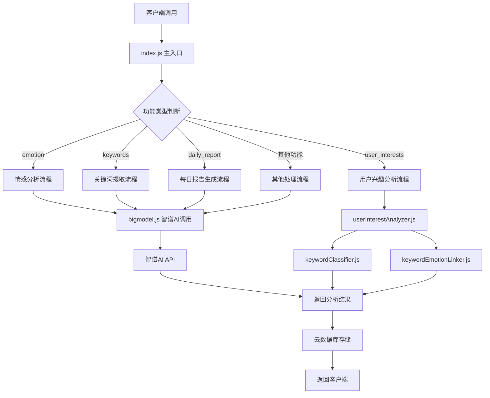
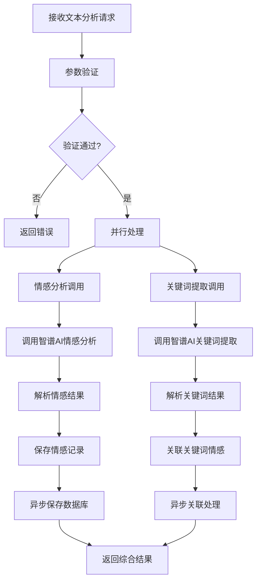
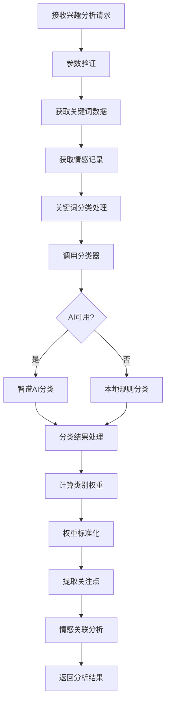
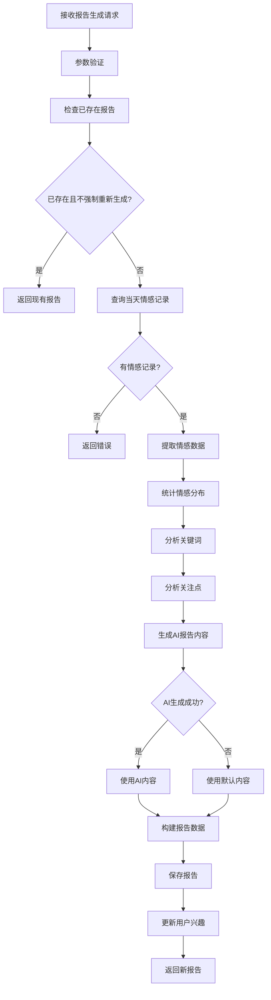
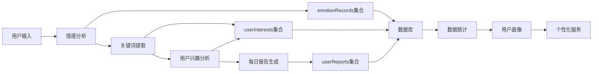
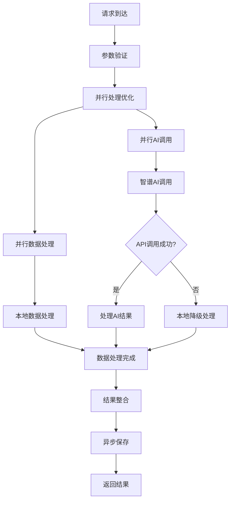
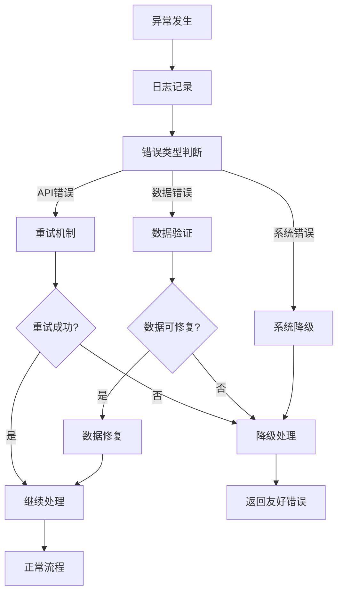
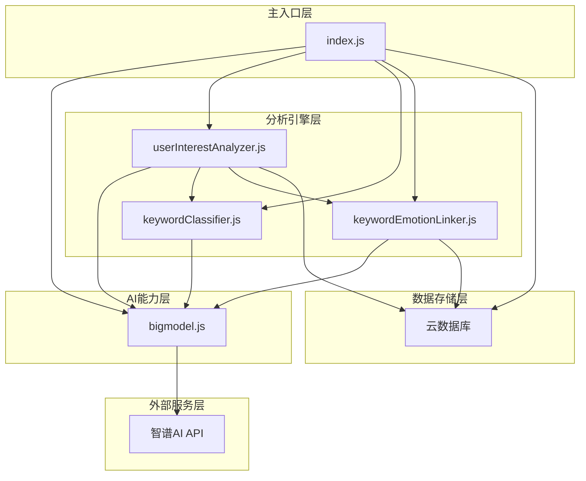
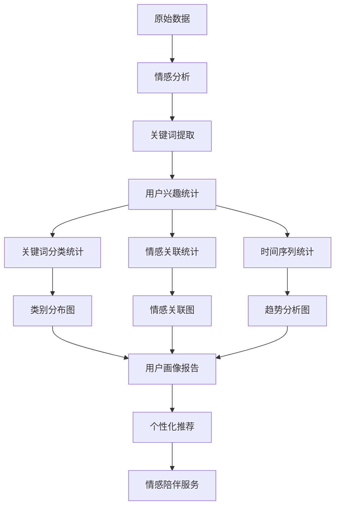

# HeartChat Analysis 云函数流程图概览

## 📋 系统架构流程图

## 🔧 核心模块详细流程

### 1. 情感分析流程

### 2. 用户兴趣分析流程

### 3. 每日报告生成流程

## 🗄️ 数据流程图

## 🚀 性能优化流程

## 📊 错误处理流程

## 🔄 模块间调用关系

## 📈 数据统计流程

---

## 📝 流程特点总结

### 1. **模块化设计**
- 清晰的职责分离
- 松耦合的模块架构
- 易于维护和扩展

### 2. **并行处理**
- 情感分析和关键词提取并行
- 异步数据保存和处理
- 提高响应速度

### 3. **容错机制**
- 多重错误处理策略
- 优雅降级方案
- 系统稳定性保障

### 4. **数据驱动**
- 基于数据的决策流程
- 统计分析和用户画像
- 个性化服务能力

### 5. **性能优化**
- 缓存策略应用
- 资源使用优化
- 响应时间控制

这些流程图展示了 HeartChat Analysis 云函数的完整实现逻辑，为开发团队提供了清晰的技术文档和指导。