# HeartChat Chat 云函数流程图

## 🏗️ 系统架构概览

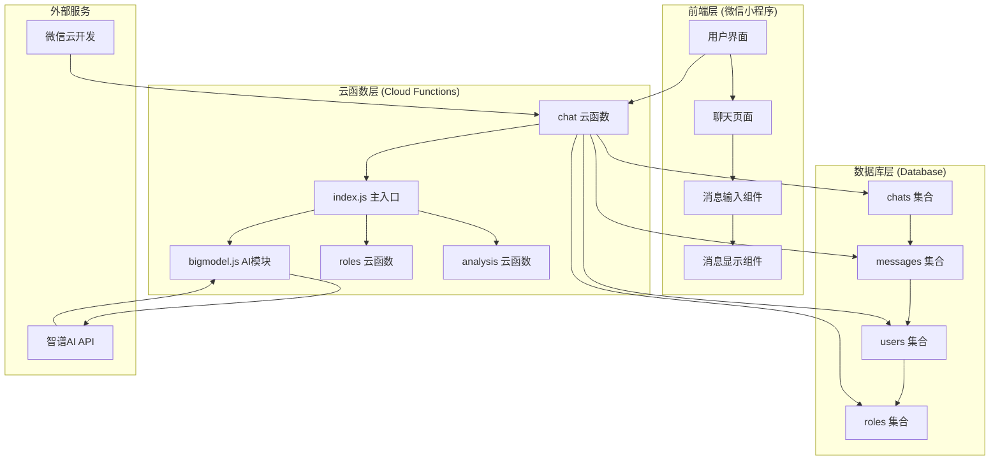

## 🔄 核心功能流程

### 1. 发送消息完整流程

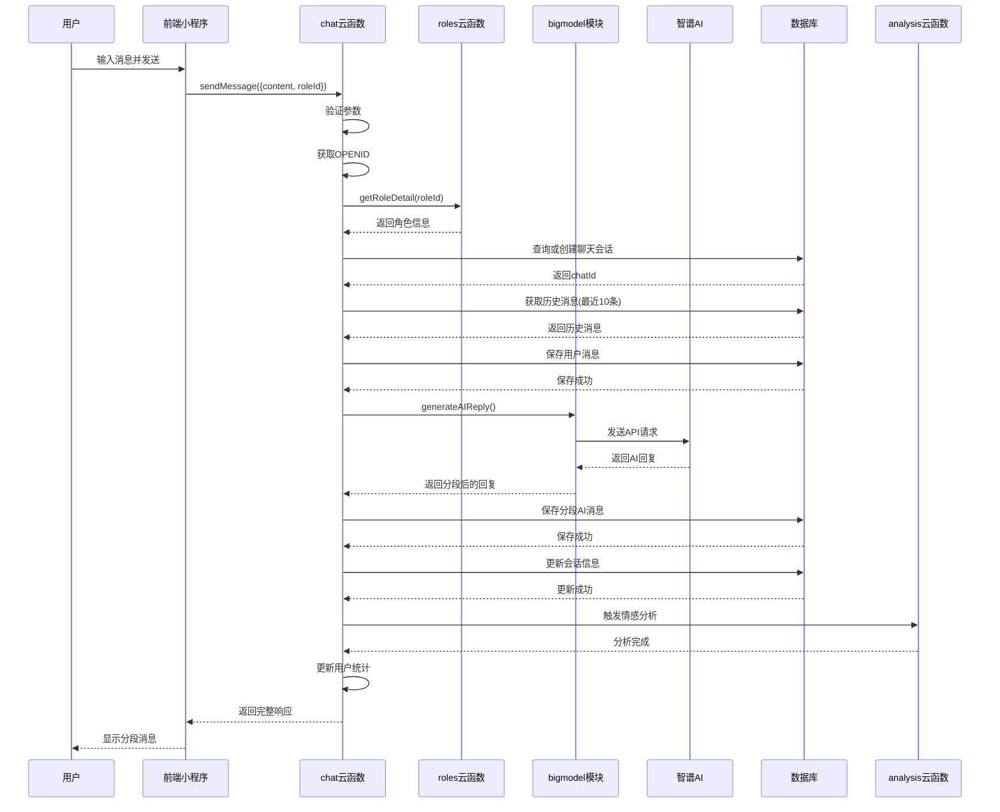

### 2. AI回复生成流程

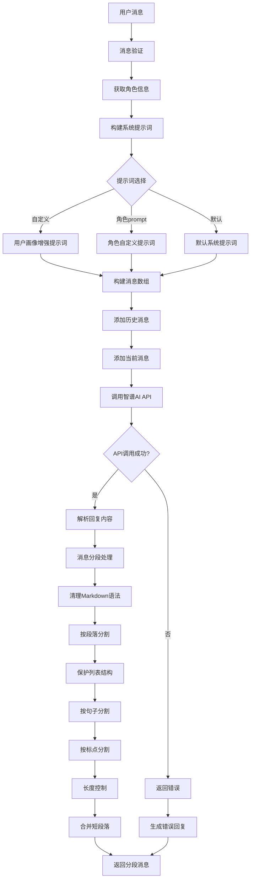

### 3. 消息分段处理流程

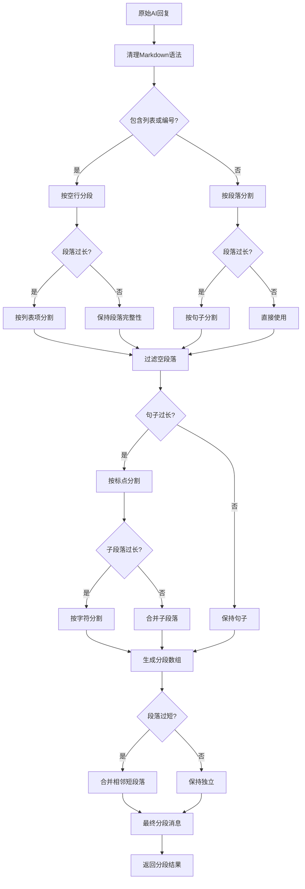

### 4. 提示词选择流程

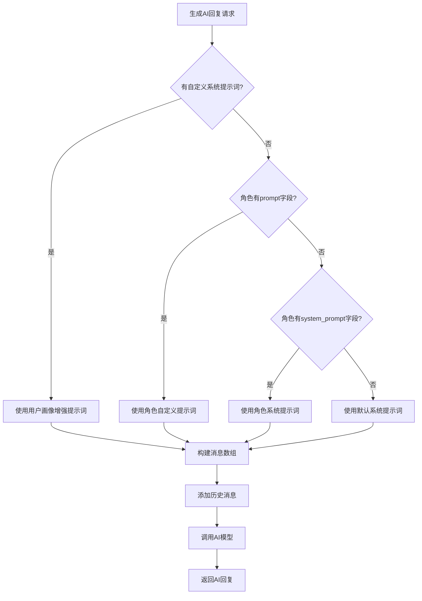

### 5. 数据存储流程

```mermaid
graph LR
    subgraph "聊天会话管理"
        A[用户发送消息] --> B[查询现有会话]
        B --> C{会话存在?}
        C -->|是| D[更新现有会话]
        C -->|否| E[创建新会话]
        
        D --> F[更新会话信息]
        E --> F
        F --> G[记录会话ID]
    end
    
    subgraph "消息存储"
        H[保存用户消息] --> I[生成消息ID]
        I --> J[存储到messages集合]
        
        K[AI回复分段] --> L[遍历分段]
        L --> M[为每段生成消息]
        M --> N[设置分段标记]
        N --> O[存储分段消息]
        O --> P[更新消息关联]
    end
    
    subgraph "用户统计更新"
        Q[新会话?] --> R{是新会话?}
        R -->|是| S[更新用户对话次数]
        R -->|否| T[跳过统计更新]
        
        S --> U[更新角色使用统计]
        T --> V[流程完成]
        U --> V
    end
    
    G --> H
    P --> Q
    J --> K
```

### 6. 历史消息获取流程

```mermaid
sequenceDiagram
    participant F as 前端
    participant C as chat云函数
    participant DB as 数据库
    
    F->>C: getChatHistory({userId, roleId})
    
    C->>C: 构建查询条件
    C->>DB: 查询chats集合
    DB-->>C: 返回聊天记录
    
    C->>C{聊天记录有消息?}
    C-->>C: 无，跳转消息查询
    C->>DB: 查询messages集合
    DB-->>C: 返回消息列表
    
    C->>C: 按时间排序消息
    C->>C: 整理消息格式
    C-->>F: 返回完整聊天历史
```

### 7. 错误处理流程

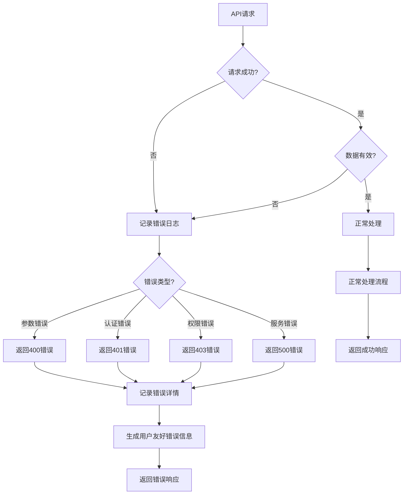

### 8. 情感分析触发流程

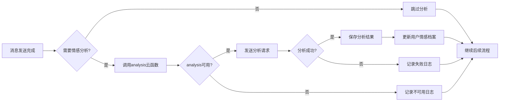

## 📊 性能优化流程

### 缓存策略流程

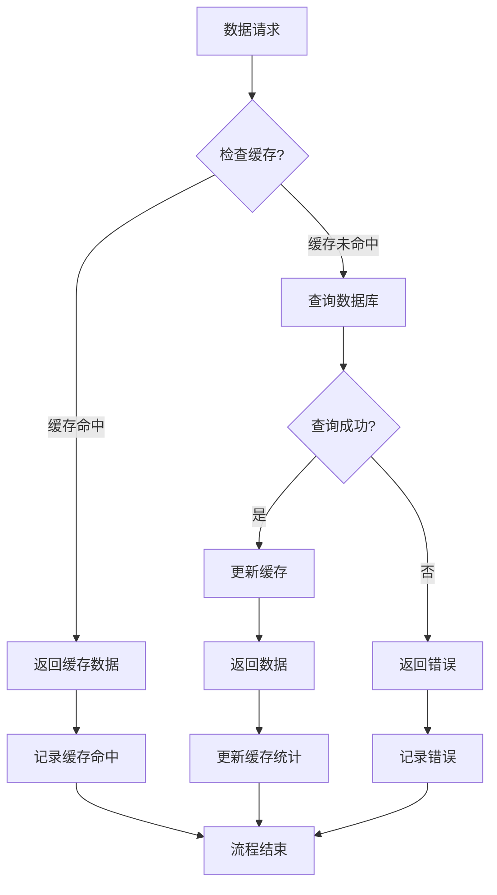

### 并发控制流程

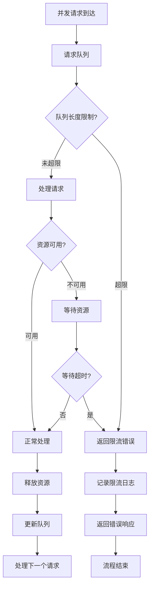

## 🔄 系统状态流转

### 聊天会话状态机

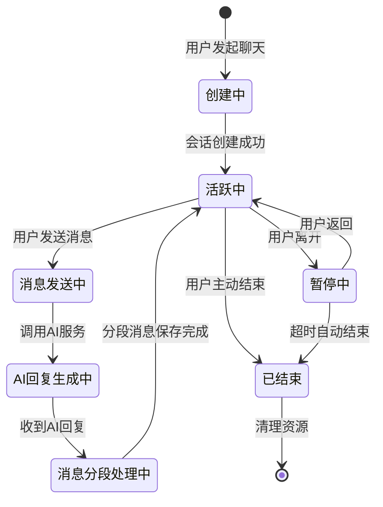

### 消息处理状态机

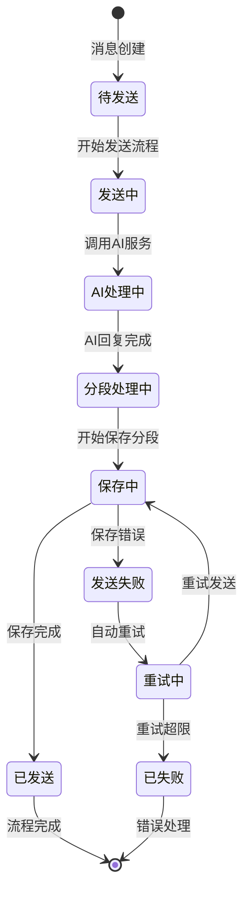

---

**文档版本**: v1.0  
**最后更新**: 2024-01-09  
**维护团队**: HeartChat 开发团队