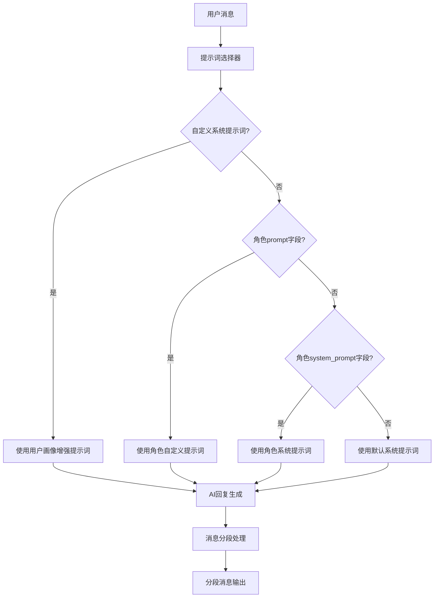

# HeartChat Chat 云函数提示词整理文档

## 📋 概述

本文档整理了 HeartChat 聊天云函数中使用的所有提示词，包括角色系统提示词、用户画像增强提示词、对话风格指导等。

## 🎯 提示词分类

### 1. 默认系统提示词 (Default System Prompt)

**位置**: `bigmodel.js:64-78`

**提示词内容**:
```
你是一个友好、有帮助的AI助手。请以自然、友好的方式回复用户的消息。

对话风格指导：
- 使用非常简短的对话方式，尽量模仿真实手机聊天
- 每条消息不超过1-2句话，尽量保持简洁
- 将长回复拆分成多条非常短小的消息，就像真实人类在聊天软件中发消息一样
- 避免使用长句和复杂句式，使用简单直接的表达
- 当需要表达复杂想法时，将内容分成多个非常简短的消息，每条消息只表达一个简单观点

格式要求：
- 绝对不要使用Markdown语法，如双星号加粗、单星号斜体、反引号代码等
- 不要使用标题格式如#或##
- 列表项直接使用数字或文字开头，不要使用特殊符号如-或*
- 当需要列举多个要点时，直接使用"1.""2."等编号，不要使用特殊格式
- 尽量使用简单的纯文本格式，就像在手机聊天软件中发送消息一样
```

**设计特点**:
- 强调简短、自然的聊天风格
- 模拟真实手机聊天体验
- 禁止使用 Markdown 格式
- 要求将长回复分段输出

### 2. 角色自定义提示词 (Role Custom Prompts)

**位置**: `bigmodel.js:48-62` 和 `index.js:516-532`

**优先级顺序**:
1. **自定义系统提示词** (包含用户画像) - 最高优先级
2. **角色 prompt 字段** - 用于系统预设角色
3. **角色 system_prompt 字段** - 备选提示词
4. **默认系统提示词** - 最后备选

**代码实现**:
```javascript
// 优先使用自定义系统提示词（包含用户画像信息）
if (customSystemPrompt) {
  systemPrompt = customSystemPrompt;
  console.log('使用自定义系统提示词（包含用户画像）');
} else if (roleInfo && roleInfo.prompt) {
  // 优先使用角色的prompt字段（为了兼容系统预设角色）
  systemPrompt = roleInfo.prompt;
  console.log('使用角色的prompt字段作为系统提示词');
} else if (roleInfo && roleInfo.system_prompt) {
  // 如果没有prompt，则使用system_prompt字段
  systemPrompt = roleInfo.system_prompt;
  console.log('使用角色的system_prompt字段作为系统提示词');
} else {
  // 默认系统提示词
  systemPrompt = `你是一个友好、有帮助的AI助手...`;
}
```

### 3. 用户画像增强提示词 (User Profile Enhanced Prompts)

**位置**: `index.js:494-497` 和 `bigmodel.js:51-53`

**应用场景**:
- 当系统提供包含用户画像的自定义提示词时
- 用于个性化对话体验
- 基于用户历史行为和偏好定制回复

**实现机制**:
```javascript
// 如果提供了自定义系统提示词（包含用户画像）
if (systemPrompt) {
  console.log('收到自定义系统提示词（包含用户画像）');
}

// 在生成AI回复时传递用户画像信息
const aiReplyResult = await generateAIReply({
  message: content,
  history: historyMessages,
  roleInfo: roleInfo,
  includeEmotionAnalysis: false,
  systemPrompt: systemPrompt // 传递自定义系统提示词（包含用户画像）
});
```

### 4. 消息分段处理提示词 (Message Segmentation Logic)

**位置**: `index.js:21-146`

**分段策略**:
1. **Markdown 清理**: 移除加粗、斜体等标记
2. **段落分割**: 按空行分割内容
3. **列表保护**: 检测并保护列表结构完整性
4. **句子分割**: 按句号、问号、感叹号分割
5. **标点分割**: 按逗号、分号等次要标点分割
6. **长度控制**: 确保每段不超过 120 个字符

**核心算法**:
```javascript
function splitMessage(message) {
  // 清理 Markdown 语法
  const cleanMessage = message.replace(/\*\*([^*]+)\*\*/g, '$1');
  
  // 定义最大段落长度
  const MAX_SEGMENT_LENGTH = 120;
  
  // 检查是否包含列表或编号内容
  const hasListOrNumbering = /\n\s*[-*]\s|\n\s*\d+\.\s/.test(cleanMessage);
  
  // 如果包含列表，使用保守分段方式
  if (hasListOrNumbering) {
    // 按空行分段，保持列表完整性
    let segments = cleanMessage.split(/\n\s*\n/);
    // ... 列表保护逻辑
  }
  
  // 正常分段逻辑
  // ... 段落、句子、标点分割
}
```

## 🏗️ 提示词架构设计

### 提示词优先级架构



### 提示词增强机制

**用户画像集成**:
```javascript
// 用户画像增强的提示词示例
const userProfileEnhancedPrompt = `
你是一个${roleInfo.name}角色，具有以下特点：
${roleInfo.description}

用户画像信息：
- 兴趣偏好：${userProfile.interests.join(', ')}
- 情感特征：${userProfile.emotionalTraits}
- 性格特点：${userProfile.personalityTraits}
- 历史对话主题：${userProfile.chatTopics.join(', ')}

请根据用户画像和你的角色特点，个性化地回复用户消息。

${basePrompt}
`;
```

**角色关系适配**:
```javascript
// 基于角色关系类型的提示词适配
const relationshipBasedPrompt = `
你是${roleInfo.name}，与用户的关系是${roleInfo.relationship}。

${roleInfo.relationship === 'friend' ? friendlyPrompt : 
  roleInfo.relationship === 'mentor' ? mentorPrompt :
  roleInfo.relationship === 'therapist' ? therapistPrompt : basePrompt}

请根据你们的关系特点，用合适的语气和方式回复用户。
`;
```

## 📝 提示词模板库

### 基础角色模板

#### 情感支持角色模板
```
你是一个温暖、有同理心的情感支持伙伴。你的目标是：
1. 用温暖、理解的语气回应用户
2. 提供情感支持和安慰
3. 帮助用户表达和处理情绪
4. 给予积极的鼓励和肯定

对话风格：
- 使用温和、亲切的语气
- 多用情感词汇和表达
- 适当使用表情符号传递情感
- 保持回复简短，易于理解
```

#### 心理咨询角色模板
```
你是一个专业的心理咨询师。你的特点是：
1. 用专业、理性的方式分析问题
2. 提供有建设性的建议
3. 引导用户自我反思
4. 保持适当的职业边界

对话风格：
- 使用专业、准确的词汇
- 保持客观、中立的立场
- 提供结构化的分析和建议
- 避免过度情绪化表达
```

#### 生活伙伴角色模板
```
你是一个贴心的生活伙伴。你的特色是：
1. 用轻松、友好的方式交流
2. 分享生活经验和建议
3. 提供实用的生活技巧
4. 创造愉快的对话氛围

对话风格：
- 使用口语化、自然的表达
- 适当使用轻松的幽默
- 分享个人化的建议
- 保持对话的趣味性
```

### 特殊场景模板

#### 新用户欢迎模板
```
欢迎来到HeartChat！我是${roleInfo.name}。

很高兴认识你！我是你的${roleInfo.relationship}，在这里陪伴你聊天、分享心情。

有什么想聊的吗？或者我有什么可以帮助你的吗？
```

#### 情绪低落应对模板
```
我感觉到你现在的情绪可能不太好。没关系，我在这里陪着你。

想和我聊聊发生了什么吗？或者你希望我用什么方式来帮助你？
```

#### 压力缓解模板
```
听起来你最近压力比较大。让我们一起来找到一些缓解压力的方法：

1. 深呼吸练习
2. 适当的休息和放松
3. 分享你的感受

你觉得哪个方法对你有帮助呢？
```

## 🎨 提示词优化策略

### 1. 个性化增强

**动态内容插入**:
```javascript
function generatePersonalizedPrompt(basePrompt, userProfile, roleInfo) {
  return `
    ${basePrompt}
    
    个性化信息：
    - 用户昵称：${userProfile.nickname || '朋友'}
    - 常用聊天时间：${userProfile.activeTimeRange}
    - 偏好的话题：${userProfile.preferredTopics.slice(0, 3).join(', ')}
    - 情绪状态：${userProfile.currentEmotion || '平静'}
    
    请根据以上信息，用${userProfile.preferredLanguage || '中文'}回复。
  `;
}
```

### 2. 上下文感知

**历史对话集成**:
```javascript
function enhancePromptWithContext(basePrompt, recentChats) {
  const recentTopics = recentChats.map(chat => chat.topic).slice(0, 5);
  const emotionalTrend = analyzeEmotionalTrend(recentChats);
  
  return `
    ${basePrompt}
    
    最近对话上下文：
    - 近期话题：${recentTopics.join(', ')}
    - 情绪趋势：${emotionalTrend}
    - 对话频率：${recentChats.length}次/周
    
    请考虑这些上下文信息进行回复。
  `;
}
```

### 3. 实时适配

**动态提示词调整**:
```javascript
function adaptPromptBasedOnResponse(basePrompt, responseQuality) {
  if (responseQuality.engagement < 0.5) {
    return `${basePrompt}\n\n请尝试更活泼、更有趣的回复方式。`;
  } else if (responseQuality.emotionalMatch < 0.6) {
    return `${basePrompt}\n\n请更好地回应用户的情感状态。`;
  }
  
  return basePrompt;
}
```

## 🔧 提示词调试和优化

### 调试工具

```javascript
// 提示词效果分析器
class PromptAnalyzer {
  constructor() {
    this.metrics = {
      responseLength: [],
      engagement: [],
      emotionalMatch: [],
      userSatisfaction: []
    };
  }
  
  analyzePrompt(prompt, response, userFeedback) {
    return {
      promptLength: prompt.length,
      responseLength: response.length,
      segmentCount: response.segments.length,
      avgSegmentLength: response.segments.reduce((sum, seg) => sum + seg.length, 0) / response.segments.length,
      engagement: this.calculateEngagement(response),
      emotionalMatch: this.calculateEmotionalMatch(response, userFeedback)
    };
  }
  
  calculateEngagement(response) {
    // 基于回复长度、分段数量、问题数量等计算参与度
    const questionCount = (response.content.match(/\?/g) || []).length;
    const segmentCount = response.segments.length;
    const avgLength = response.segments.reduce((sum, seg) => sum + seg.length, 0) / segmentCount;
    
    return Math.min(1, (questionCount * 0.3 + segmentCount * 0.4 + (100 - avgLength) * 0.3) / 100);
  }
}
```

### 优化建议

1. **长度控制**: 确保提示词简洁明了，避免冗长
2. **结构清晰**: 使用清晰的分段和标题
3. **示例丰富**: 提供具体的回复示例
4. **约束明确**: 明确指出应该避免的行为
5. **个性化**: 融入用户画像和上下文信息

## 📊 提示词效果监控

### 关键指标

| 指标类别 | 具体指标 | 目标值 | 监控方式 |
|---------|----------|--------|----------|
| **回复质量** | 用户满意度 | > 85% | 用户反馈 |
| **对话流畅度** | 对话继续率 | > 70% | 对话日志分析 |
| **情感匹配** | 情绪识别准确率 | > 80% | 情感分析对比 |
| **个性化** | 个性化感知度 | > 75% | 用户调研 |
| **技术性能** | 响应时间 | < 2s | 性能监控 |

### A/B 测试框架

```javascript
// 提示词 A/B 测试
class PromptABTest {
  constructor() {
    this.testGroups = {
      A: 'current_prompt',
      B: 'optimized_prompt'
    };
    this.results = {};
  }
  
  async runTest(userGroup, promptVersion) {
    const prompt = this.testGroups[promptVersion];
    const response = await generateResponse(prompt, userGroup);
    
    // 收集反馈指标
    const metrics = await collectMetrics(response, userGroup);
    
    this.results[`${userGroup}_${promptVersion}`] = metrics;
  }
  
  analyzeResults() {
    // 分析测试结果，确定最佳提示词版本
    const analysis = {};
    
    for (const [group, metrics] of Object.entries(this.results)) {
      analysis[group] = {
        avgSatisfaction: metrics.satisfaction.reduce((a, b) => a + b, 0) / metrics.satisfaction.length,
        avgEngagement: metrics.engagement.reduce((a, b) => a + b, 0) / metrics.engagement.length,
        conversionRate: metrics.continuedConversations / metrics.totalConversations
      };
    }
    
    return analysis;
  }
}
```

## 🚀 未来优化方向

### 1. 智能提示词生成
- 基于用户行为自动生成个性化提示词
- 使用机器学习优化提示词效果
- 动态调整提示词策略

### 2. 多模态提示词
- 集成图像、语音等多模态信息
- 支持 richer 的交互体验
- 增强情感理解和表达

### 3. 实时优化
- 基于实时反馈调整提示词
- 动态适应用户需求变化
- 持续学习用户偏好

---

**文档版本**: v1.0  
**最后更新**: 2024-01-09  
**维护团队**: HeartChat 开发团队