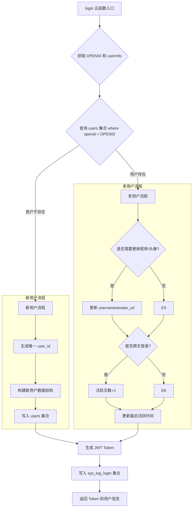

```mermaid
graph TD
    A[login 云函数入口] --> B{获取 OPENID 和 userInfo};
    B --> C{查询 users 集合 where openid = OPENID};
    C -- 用户不存在 --> D[新用户流程];
    C -- 用户存在 --> E[老用户流程];

    subgraph 新用户流程
        D --> D1[生成唯一 user_id];
        D1 --> D2[构建新用户数据结构];
        D2 --> D3[写入 users 集合];
    end

    subgraph 老用户流程
        E --> E1{是否需要更新昵称/头像?};
        E1 -- 是 --> E2[更新 username/avatar_url];
        E1 -- 否 --> E3;
        E2 & E3 --> E4{是否跨天登录?};
        E4 -- 是 --> E5[活跃天数+1];
        E4 -- 否 --> E6;
        E5 & E6 --> E7[更新最后活跃时间];
    end

    D3 & E7 --> F[生成 JWT Token];
    F --> G[写入 sys_log_login 集合];
    G --> H[返回 Token 和用户信息];
```