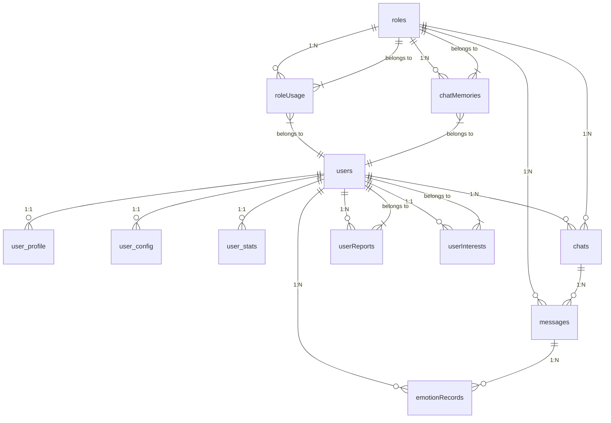

# HeartChat 项目数据库设计文档

## 文档信息

- **项目名称**: HeartChat 微信小程序
- **文档版本**: v1.0
- **最后更新**: 2025-09-10
- **数据库类型**: 微信云开发 - MongoDB 风格数据库

## 项目概述

HeartChat 是一个基于微信小程序云开发的 AI 情感陪伴与情商提升应用。该应用提供与 AI 角色对话、实时情感分析、用户画像分析、每日心情报告生成等功能。

## 数据库架构设计

### 数据库环境配置

- **云开发环境ID**: `cloud1-9gpfk3ie94d8630a`
- **环境名称**: `heartchat-prod`
- **数据库类型**: 微信云开发数据库 (兼容 MongoDB)

### 核心数据集合

#### 1. user_base - 用户基础信息集合

**集合用途**: 存储用户基础信息和认证数据

**字段结构**:
```javascript
{
  _id: ObjectId,                    // 主键ID
  openId: String,                   // 微信用户唯一标识
  userId: String,                  // 用户ID (与openid相同，保持兼容性)
  username: String,                  // 用户昵称
  avatar_url: String,               // 用户头像URL
  user_type: Number,                // 用户类型: 1-普通用户, 2-VIP用户, 3-管理员
  status: Number,                   // 用户状态: 1-正常, 0-禁用
  created_at: Date,                 // 创建时间
  updated_at: Date                  // 更新时间
}
```

**索引配置**:
```javascript
// openId 唯一索引
{ "openId": 1 }
// userId 唯一索引
{ "userId": 1 }
```

#### 2. user_profile - 用户详细信息集合

**集合用途**: 存储用户详细个人信息

**字段结构**:
```javascript
{
  _id: ObjectId,                    // 主键ID
  userId: String,                  // 关联用户ID
  gender: Number,                   // 性别: 0-未知, 1-男, 2-女
  country: String,                  // 国家
  province: String,                 // 省份
  city: String,                     // 城市
  bio: String,                      // 个人简介
  age: Number,                      // 年龄
  birthday: Date,                   // 生日
  created_at: Date,                 // 创建时间
  updated_at: Date                  // 更新时间
}
```

**索引配置**:
```javascript
// userId 唯一索引
{ "userId": 1 }
```

#### 3. user_config - 用户配置集合

**集合用途**: 存储用户个性化配置设置

**字段结构**:
```javascript
{
  _id: ObjectId,                    // 主键ID
  userId: String,                  // 关联用户ID
  dark_mode: Boolean,               // 深色模式: true/false
  notification_enabled: Boolean,     // 通知启用: true/false
  language: String,                 // 语言设置: 'zh-CN'/'en-US'
  theme: String,                    // 主题设置
  font_size: Number,                // 字体大小
  created_at: Date,                 // 创建时间
  updated_at: Date                  // 更新时间
}
```

**索引配置**:
```javascript
// userId 唯一索引
{ "userId": 1 }
```

#### 4. user_stats - 用户统计信息集合

**集合用途**: 存储用户行为统计数据

**字段结构**:
```javascript
{
  _id: ObjectId,                    // 主键ID
  userId: String,                  // 关联用户ID
  openId: String,                   // 微信标识 (兼容性)
  chat_count: Number,               // 对话次数
  solved_count: Number,             // 解决问题次数
  rating_avg: Number,               // 平均评分
  rating_count: Number,             // 评分次数
  active_days: Number,              // 活跃天数
  last_active: Date,                // 最后活跃时间
  created_at: Date,                 // 创建时间
  updated_at: Date                  // 更新时间
}
```

**索引配置**:
```javascript
// userId 唯一索引
{ "userId": 1 }
// openId 唯一索引
{ "openId": 1 }
```

#### 5. roles - 角色信息集合

**集合用途**: 存储AI角色信息，包括系统角色和用户自定义角色

**字段结构**:
```javascript
{
  _id: ObjectId,                    // 主键ID
  name: String,                     // 角色名称
  description: String,              // 角色描述
  category: String,                // 角色分类: '情感支持', '心理咨询', '生活伙伴', '职场导师', '自定义'
  avatar: String,                   // 角色头像URL
  personality: String,              // 性格特征
  background: String,               // 背景故事
  prompt: String,                   // 角色提示词
  system_prompt: String,            // 系统提示词
  creator: String,                  // 创建者: 'system' 或 openId
  userId: String,                  // 用户ID (兼容性)
  tags: [String],                   // 角色标签
  status: Number,                   // 状态: 1-启用, 0-禁用
  is_system: Boolean,               // 是否系统角色
  user_perception: {                // 用户画像数据
    interests: [String],            // 兴趣爱好
    personalityTraits: [           // 性格特征
      {
        trait: String,
        score: Number
      }
    ],
    personalitySummary: String,     // 性格总结
    emotionPatterns: {              // 情绪模式
      emotionPercentages: Object,   // 情绪百分比
      emotionTrends: Object,        // 情绪趋势
      dominantEmotions: [           // 主要情绪
        {
          emotion: String,
          percentage: Number
        }
      ]
    }
  },
  memory_settings: {                 // 记忆设置
    enabled: Boolean,               // 是否启用记忆
    max_memories: Number,           // 最大记忆数量
    retention_days: Number          // 记忆保留天数
  },
  created_at: Date,                  // 创建时间
  updated_at: Date                  // 更新时间
}
```

**索引配置**:
```javascript
// creator 字段索引
{ "creator": 1 }
// category 字段索引
{ "category": 1 }
// 状态字段索引
{ "status": 1 }
// 组合索引：creator + category + status
{ "creator": 1, "category": 1, "status": 1 }
```

#### 6. roleUsage - 角色使用统计集合

**集合用途**: 记录用户对各个角色的使用频率和统计信息

**字段结构**:
```javascript
{
  _id: ObjectId,                    // 主键ID
  roleId: String,                   // 角色ID
  userId: String,                   // 用户ID
  usageCount: Number,               // 使用次数
  lastUsedTime: Date,               // 最后使用时间
  totalTime: Number,                // 总使用时长(秒)
  created_at: Date,                 // 创建时间
  updated_at: Date                  // 更新时间
}
```

**索引配置**:
```javascript
// 复合唯一索引：roleId + userId
{ "roleId": 1, "userId": 1 }
```

#### 7. chats - 聊天会话集合

**集合用途**: 存储聊天会话信息和元数据

**字段结构**:
```javascript
{
  _id: ObjectId,                    // 主键ID
  userId: String,                   // 用户ID
  roleId: String,                   // 角色ID
  sessionId: String,               // 会话ID
  title: String,                    // 会话标题
  messageCount: Number,             // 消息数量
  lastMessage: String,              // 最后一条消息
  lastMessageTime: Date,            // 最后一条消息时间
  isArchived: Boolean,              // 是否已归档
  created_at: Date,                 // 创建时间
  updated_at: Date                  // 更新时间
}
```

**索引配置**:
```javascript
// userId 字段索引
{ "userId": 1 }
// roleId 字段索引
{ "roleId": 1 }
// sessionId 唯一索引
{ "sessionId": 1 }
// 组合索引：userId + roleId
{ "userId": 1, "roleId": 1 }
// 状态字段索引
{ "isArchived": 1 }
```

#### 8. messages - 消息详情集合

**集合用途**: 存储具体的聊天消息内容

**字段结构**:
```javascript
{
  _id: ObjectId,                    // 主键ID
  chatId: String,                   // 关联聊天ID
  sessionId: String,                // 会话ID
  userId: String,                   // 用户ID
  roleId: String,                   // 角色ID
  roleType: String,                  // 角色类型: 'user'/'ai'
  content: String,                   // 消息内容
  messageType: String,              // 消息类型: 'text'/'image'/'emotion'
  emotionData: {                    // 情感分析数据
    emotion: String,                // 主要情绪
    emotions: {                      // 详细情绪分布
      '平静': Number,
      '快乐': Number,
      '焦虑': Number,
      '压力': Number,
      '悲伤': Number
    },
    intensity: Number,               // 情绪强度(0-1)
    confidence: Number,             // 置信度
    keywords: [String]              // 关键词
  },
  isAnalyzed: Boolean,              // 是否已分析
  segmentIndex: Number,             // 分段索引
  created_at: Date,                 // 创建时间
  updated_at: Date                  // 更新时间
}
```

**索引配置**:
```javascript
// chatId 字段索引
{ "chatId": 1 }
// sessionId 字段索引
{ "sessionId": 1 }
// userId 字段索引
{ "userId": 1 }
// roleId 字段索引
{ "roleId": 1 }
// 组合索引：userId + roleId + created_at
{ "userId": 1, "roleId": 1, "created_at": -1 }
// 情感分析状态索引
{ "isAnalyzed": 1 }
```

#### 9. emotionRecords - 情感分析记录集合

**集合用途**: 专门存储情感分析的历史记录

**字段结构**:
```javascript
{
  _id: ObjectId,                    // 主键ID
  userId: String,                   // 用户ID
  chatId: String,                   // 关联聊天ID
  messageId: String,                // 关联消息ID
  emotion: String,                  // 主要情绪
  emotions: {                       // 详细情绪分布
    '平静': Number,
    '快乐': Number,
    '焦虑': Number,
    '压力': Number,
    '悲伤': Number,
    '愤怒': Number,
    '兴奋': Number,
    '困惑': Number
  },
  intensity: Number,                // 情绪强度(0-1)
  confidence: Number,                // 置信度
  keywords: [String],               // 关键词
  sentiment: String,                // 情感倾向: 'positive'/'negative'/'neutral'
  emotional_shift: {                // 情绪变化
    previous_emotion: String,       // 之前情绪
    current_emotion: String,        // 当前情绪
    shift_type: String,             // 变化类型: 'stable'/'improved'/'worsened'
    shift_magnitude: Number         // 变化幅度
  },
  context: String,                  // 上下文信息
  created_at: Date,                 // 创建时间
  updated_at: Date                  // 更新时间
}
```

**索引配置**:
```javascript
// userId 字段索引
{ "userId": 1 }
// chatId 字段索引
{ "chatId": 1 }
// emotion 字段索引
{ "emotion": 1 }
// created_at 字段索引 (降序)
{ "created_at": -1 }
// 组合索引：userId + created_at
{ "userId": 1, "created_at": -1 }
```

#### 10. userReports - 用户每日报告集合

**集合用途**: 存储系统生成的每日用户情感报告

**字段结构**:
```javascript
{
  _id: ObjectId,                    // 主键ID
  userId: String,                   // 用户ID
  date: Date,                       // 报告日期
  report_type: String,              // 报告类型: 'daily'/'weekly'/'monthly'
  mood_summary: {                   // 情绪总结
    dominant_emotion: String,        // 主要情绪
    emotion_distribution: Object,    // 情绪分布
    stability_score: Number,        // 情绪稳定性评分
    trend: String                   // 趋势: 'stable'/'improving'/'declining'
  },
  chat_analysis: {                  // 对话分析
    total_chats: Number,            // 总对话数
    avg_chat_length: Number,         // 平均对话长度
    emotion_changes: Number,        // 情绪变化次数
    topics_discussed: [String]      // 讨论话题
  },
  insights: [String],               // 洞察和建议
  recommendations: [String],         // 个性化建议
  achievements: [String],           // 成就和里程碑
  isRead: Boolean,                  // 是否已读
  generatedAt: Date,                // 生成时间
  created_at: Date,                  // 创建时间
  updated_at: Date                  // 更新时间
}
```

**索引配置**:
```javascript
// 复合唯一索引：userId + date
{ "userId": 1, "date": 1 }
// report_type 字段索引
{ "report_type": 1 }
// created_at 字段索引 (降序)
{ "created_at": -1 }
// isRead 字段索引
{ "isRead": 1 }
```

#### 11. userInterests - 用户兴趣数据集合

**集合用途**: 存储用户兴趣关键词和分类信息

**字段结构**:
```javascript
{
  _id: ObjectId,                    // 主键ID
  userId: String,                   // 用户ID
  keywords: [                       // 兴趣关键词数组
    {
      keyword: String,               // 关键词
      weight: Number,               // 权重(0-1)
      category: String,             // 分类
      emotion_score: Number,        // 情感分数(-1到1)
      frequency: Number,            // 出现频率
      first_seen: Date,             // 首次出现时间
      last_seen: Date,              // 最后出现时间
      contexts: [String]            // 上下文
    }
  ],
  categories: {                     // 分类统计
    '学习': { count: Number, weight: Number },
    '工作': { count: Number, weight: Number },
    '生活': { count: Number, weight: Number },
    '情感': { count: Number, weight: Number },
    '娱乐': { count: Number, weight: Number }
  },
  interest_clusters: [String],       // 兴趣聚类
  dominant_interests: [String],      // 主要兴趣
  lastUpdated: Date,                // 最后更新时间
  created_at: Date,                 // 创建时间
  updated_at: Date                  // 更新时间
}
```

**索引配置**:
```javascript
// userId 唯一索引
{ "userId": 1 }
// keywords.keyword 字段索引
{ "keywords.keyword": 1 }
// keywords.category 字段索引
{ "keywords.category": 1 }
// lastUpdated 字段索引 (降序)
{ "lastUpdated": -1 }
```

#### 12. chatMemories - 聊天记忆集合

**集合用途**: 存储角色的长期记忆和对话上下文

**字段结构**:
```javascript
{
  _id: ObjectId,                    // 主键ID
  roleId: String,                   // 角色ID
  userId: String,                   // 用户ID
  memory_type: String,               // 记忆类型: 'fact'/'preference'/'event'/'emotion'
  content: String,                  // 记忆内容
  context: String,                  // 上下文信息
  importance: Number,                // 重要性(0-1)
  access_count: Number,              // 访问次数
  last_accessed: Date,              // 最后访问时间
  expiration_date: Date,            // 过期日期
  tags: [String],                  // 标签
  created_at: Date,                 // 创建时间
  updated_at: Date                  // 更新时间
}
```

**索引配置**:
```javascript
// roleId 字段索引
{ "roleId": 1 }
// userId 字段索引
{ "userId": 1 }
// memory_type 字段索引
{ "memory_type": 1 }
// importance 字段索引 (降序)
{ "importance": -1 }
// expiration_date 字段索引
{ "expiration_date": 1 }
```

## 数据关系图



## 数据流分析

### 用户数据流
1. **用户注册**: `users` → `user_profile` → `user_config` → `user_stats`
2. **用户更新**: `users` → `user_profile` → `user_config`
3. **用户统计**: `user_stats` 定期更新

### 聊天数据流
1. **开始聊天**: `roles` → `chats` (创建新会话)
2. **发送消息**: `chats` → `messages` (添加消息)
3. **情感分析**: `messages` → `emotionRecords` (分析情绪)
4. **更新统计**: `user_stats` → `roleUsage` (更新使用统计)

### 个性化数据流
1. **兴趣分析**: `messages` → `userInterests` (提取兴趣)
2. **用户画像**: `userInterests` + `emotionRecords` → `roles.user_perception`
3. **生成报告**: `emotionRecords` + `userInterests` → `userReports`

## 数据库设计特点

### 优势
1. **文档型数据库**: 灵活的数据结构，适合快速迭代开发
2. **用户数据分离**: 用户基础信息和详细信息分离，提高查询效率
3. **索引优化**: 合理的索引配置，支持快速查询
4. **数据一致性**: 使用事务和原子操作确保数据一致性
5. **扩展性好**: 支持水平扩展，适合微信小程序场景

### 设计亮点
1. **角色系统**: 支持系统角色和用户自定义角色，灵活性强
2. **情感分析**: 专门的情感记录集合，便于情绪趋势分析
3. **用户画像**: 基于AI的用户画像生成，提供个性化体验
4. **记忆系统**: 角色长期记忆功能，增强对话连贯性
5. **统计机制**: 完善的用户和角色使用统计

## 数据分析与优化建议

### 性能优化建议

#### 1. 查询优化
```javascript
// 当前查询可能存在的问题
// 问题：频繁的聚合查询可能影响性能
const result = await db.collection('messages')
  .aggregate()
  .match({ userId: openId, roleId: roleId })
  .group({
    _id: '$emotion',
    count: $.sum(1)
  })
  .end();

// 优化建议：使用预聚合和缓存
// 1. 在emotionRecords集合中添加预聚合字段
{
  userId: String,
  emotion_stats: {  // 预聚合的情绪统计
    '平静': Number,
    '快乐': Number,
    '焦虑': Number,
    // ...
  },
  last_updated: Date
}
```

#### 2. 数据分片策略
```javascript
// 基于时间的数据分片建议
// 1. 按月分片：将聊天消息按月份分片
// 2. 按用户分片：将用户相关数据按用户ID哈希分片
// 3. 热点数据分离：将活跃用户的独立存储
```

#### 3. 缓存策略
```javascript
// Redis缓存建议
// 1. 用户画像缓存：缓存用户画像数据，TTL: 1小时
// 2. 角色提示词缓存：缓存角色提示词，TTL: 30分钟
// 3. 情感分析结果缓存：缓存最近分析结果，TTL: 15分钟
```

### 数据结构优化建议

#### 1. 消息数据优化
```javascript
// 当前messages集合可能存在冗余
// 优化建议：分离消息内容和元数据
{
  // 基础信息
  _id: ObjectId,
  chatId: String,
  userId: String,
  roleId: String,
  
  // 内容信息
  content: String,
  messageType: String,
  
  // 分析结果（可选字段）
  isAnalyzed: Boolean,
  emotionData: {
    emotion: String,
    intensity: Number,
    keywords: [String]
  }
  
  // 建议将大型分析结果分离到emotionRecords
}
```

#### 2. 用户兴趣优化
```javascript
// 当前userInterests结构复杂
// 优化建议：分离关键词和分类
// keywords集合：
{
  _id: ObjectId,
  userId: String,
  keyword: String,
  weight: Number,
  category: String,
  emotion_score: Number,
  created_at: Date
}

// categories集合：
{
  _id: ObjectId,
  userId: String,
  category: String,
  total_weight: Number,
  keyword_count: Number,
  updated_at: Date
}
```

### 存储优化建议

#### 1. 数据压缩
```javascript
// 大文本字段压缩
// 1. 角色描述、背景等长文本字段使用gzip压缩
// 2. 消息内容超过500字符时自动压缩
// 3. 用户报告使用JSON压缩存储
```

#### 2. 生命周期管理
```javascript
// 数据清理策略
// 1. 消息数据：保留最近6个月，自动归档更早数据
// 2. 情感记录：保留最近12个月，用于趋势分析
// 3. 临时缓存：24小时后自动清理
// 4. 用户报告：永久保留，但可设置归档标记
```

### 数据安全建议

#### 1. 数据加密
```javascript
// 敏感数据加密
// 1. 用户个人信息使用AES-256加密
// 2. 聊天内容可选择性端到端加密
// 3. 用户画像数据脱敏处理
```

#### 2. 访问控制
```javascript
// 数据访问权限
// 1. 用户只能访问自己的数据
// 2. 系统角色数据只读访问
// 3. 管理员拥有完整访问权限
// 4. 数据访问日志记录
```

### 监控与维护建议

#### 1. 性能监控
```javascript
// 关键指标监控
// 1. 查询响应时间：平均<100ms
// 2. 并发连接数：峰值<1000
// 3. 存储使用量：按用户数量监控
// 4. 错误率：<0.1%
```

#### 2. 数据备份
```javascript
// 备份策略
// 1. 每日增量备份
// 2. 每周全量备份
// 3. 异地备份：跨区域备份
// 4. 快照备份：重要操作前快照
```

#### 3. 数据一致性检查
```javascript
// 一致性检查
// 1. 用户数据完整性检查
// 2. 聊天数据关联性检查
// 3. 统计数据准确性验证
// 4. 定期数据清理和修复
```

## 扩展性考虑

### 1. 多租户支持
```javascript
// 多租户数据隔离
// 1. 添加tenantId字段
// 2. 索引包含tenantId
// 3. 查询自动添加tenantId过滤条件
```

### 2. 国际化支持
```javascript
// 多语言数据支持
// 1. 添加language字段
// 2. 多语言文本存储
// 3. 本地化数据展示
```

### 3. 高级分析功能
```javascript
// 机器学习集成
// 1. 用户行为模式分析
// 2. 情绪趋势预测
// 3. 个性化推荐算法
// 4. 异常行为检测
```

## 总结

HeartChat项目的数据库设计整体架构合理，功能完善，具有良好的扩展性和维护性。主要优势包括：

1. **清晰的数据模型**: 用户、角色、消息等实体关系明确
2. **完善的功能覆盖**: 涵盖聊天、情感分析、用户画像等核心功能
3. **良好的扩展性**: 支持功能扩展和数据量增长
4. **性能优化**: 合理的索引和查询设计

建议在后续开发中重点关注性能优化、数据安全和用户体验提升，确保系统的稳定性和可靠性。

---

*本文档基于当前项目代码和数据库结构分析生成，随着项目迭代可能需要更新。*