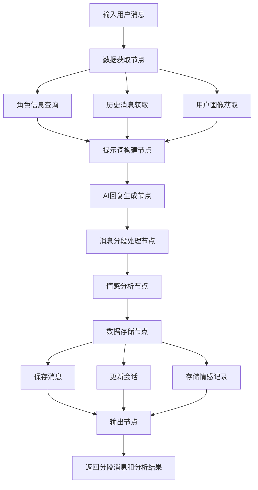
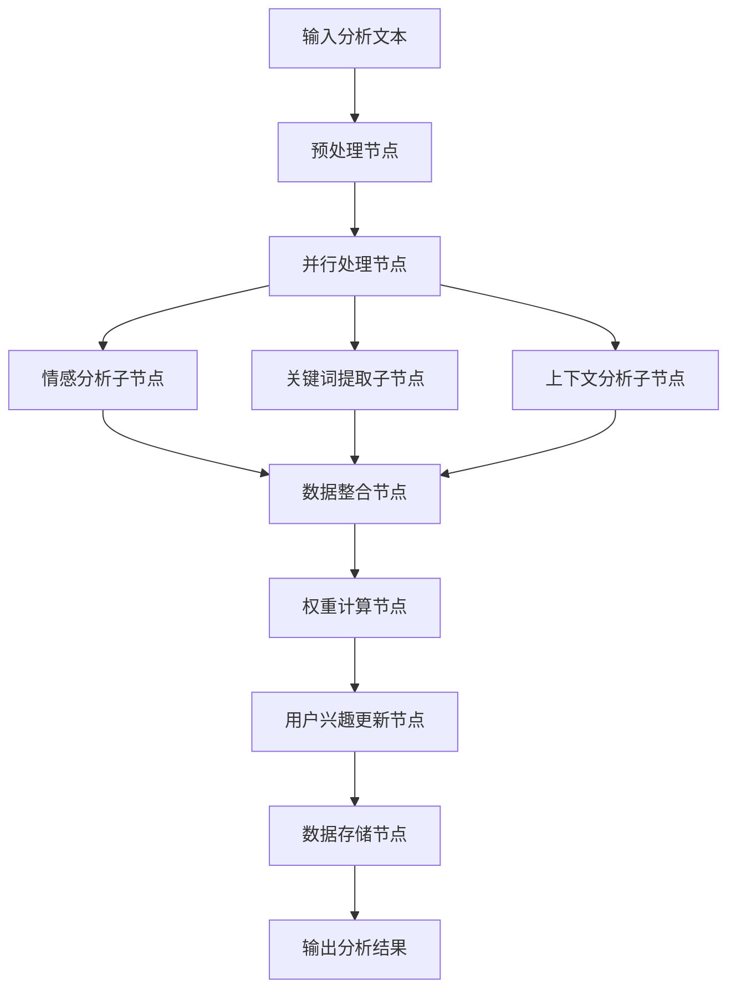
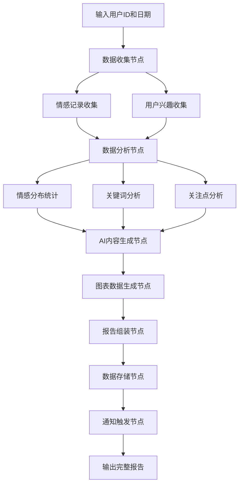
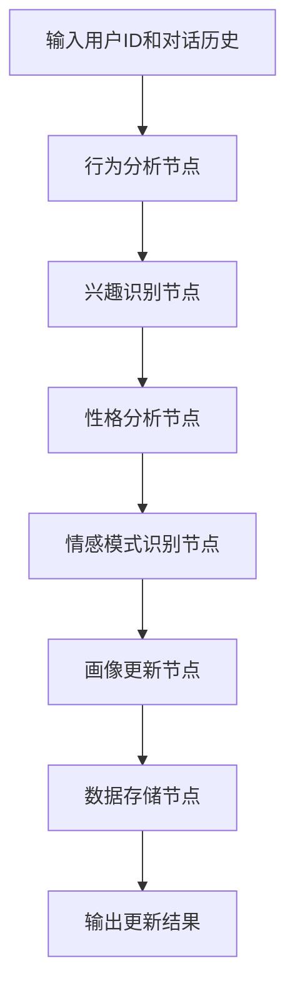
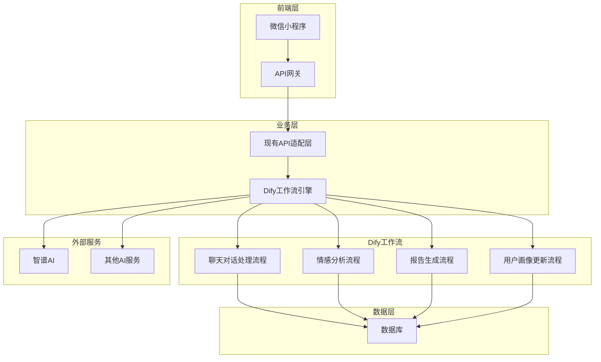

# HeartChat AI流程重构Dify集成方案

## 📋 项目概述

本文档详细说明了如何将HeartChat现有的AI流程重构并集成到Dify工作流平台中。通过此重构，我们将优化系统架构，提升性能，改善维护性，并为未来功能扩展提供更好的基础。

## 🎯 重构目标

### 核心目标
1. **架构优化**：将现有的3个云函数(chat、analysis、roles)整合为Dify工作流
2. **性能提升**：减少云函数间调用，提高响应速度
3. **维护性改善**：可视化工作流编辑，统一管理
4. **扩展性增强**：更容易添加新的AI功能和特性

### 预期收益
- 开发效率提升：工作流可视化开发，减少编码工作量
- 系统性能优化：减少云函数调用，提高响应速度
- 维护成本降低：统一的工作流管理，减少维护复杂度
- 功能扩展性：更容易添加新的AI功能和特性
- 用户体验改善：更快的响应速度，更好的情感分析效果

## 📊 现有系统分析

### 当前AI流程架构

#### 1. Chat云函数流程
- **功能**：处理聊天消息、AI回复生成、消息分段
- **主要接口**：sendMessage, getChatHistory, saveChatHistory
- **性能指标**：平均响应时间1200ms，最大并发数50

#### 2. Analysis云函数流程
- **功能**：情感分析、关键词提取、用户兴趣分析、每日报告生成
- **主要接口**：emotion, keywords, user_interests, daily_report
- **处理特点**：并行处理情感和关键词分析

#### 3. Roles云函数流程
- **功能**：角色管理、提示词生成、用户画像维护
- **主要接口**：getRoles, createRole, updateRole, generatePrompt

#### 4. 数据库结构
- **users**：统一用户信息集合（基础信息、profile、config、stats）
- **roles**：角色信息集合，包含user_perception和memories
- **chats**：聊天会话集合
- **messages**：消息详情集合，支持分段消息
- **emotionRecords**：情感分析记录集合
- **userReports**：用户每日报告集合
- **userInterests**：用户兴趣数据集合

### 现有架构问题
1. **云函数间调用频繁**：chat、analysis、roles之间相互调用，增加延迟
2. **代码重复**：多个云函数中有相似的数据处理逻辑
3. **维护复杂**：需要同时维护3个云函数的代码
4. **扩展困难**：添加新功能需要修改多个云函数
5. **监控分散**：需要分别监控多个云函数的运行状态

## 🛠️ Dify工作流设计方案

### 核心工作流架构

#### 1. 智能聊天对话处理流程

**流程图**：


**输入参数**：
```json
{
  "user_id": "用户ID",
  "role_id": "角色ID", 
  "chat_id": "会话ID",
  "message_content": "消息内容",
  "session_id": "会话标识"
}
```

**输出结果**：
```json
{
  "message_segments": [
    {
      "content": "分段内容",
      "segment_index": 0,
      "total_segments": 3
    }
  ],
  "emotion_analysis": {
    "primary_emotion": "主要情感",
    "intensity": 0.8,
    "suggestions": ["建议1", "建议2"]
  },
  "updated_stats": {
    "chat_count": 15,
    "active_days": 7
  }
}
```

**处理步骤**：
1. **数据获取**：并行查询角色信息、历史消息、用户画像
2. **提示词构建**：基于优先级构建系统提示词
3. **AI回复生成**：调用大语言模型生成回复
4. **消息分段**：智能分段算法处理长回复
5. **情感分析**：实时情感分析
6. **数据存储**：批量保存所有相关数据
7. **结果返回**：返回处理结果

#### 2. 深度情感分析流程

**流程图**：


**输入参数**：
```json
{
  "text": "待分析文本",
  "user_id": "用户ID",
  "role_id": "角色ID",
  "chat_id": "会话ID",
  "context": "上下文信息"
}
```

**输出结果**：
```json
{
  "emotion_analysis": {
    "primary_emotion": "平静",
    "secondary_emotions": ["安心", "放松"],
    "intensity": 0.7,
    "valence": 0.6,
    "arousal": 0.4,
    "radar_dimensions": {
      "trust": 0.8,
      "openness": 0.7,
      "resistance": 0.3,
      "stress": 0.4,
      "control": 0.6
    }
  },
  "keywords": [
    {
      "word": "工作",
      "weight": 0.8,
      "category": "职场",
      "emotion_score": 0.6
    }
  ],
  "suggestions": ["建议1", "建议2"]
}
```

#### 3. 个性化用户报告生成流程

**流程图**：


**输入参数**：
```json
{
  "user_id": "用户ID",
  "report_date": "报告日期",
  "force_regenerate": false
}
```

**输出结果**：
```json
{
  "emotionSummary": "情感总结文本",
  "insights": ["洞察1", "洞察2"],
  "suggestions": ["建议1", "建议2"],
  "fortune": {
    "good": ["宜做事项"],
    "bad": ["忌做事项"]
  },
  "chartData": {
    "emotionDistribution": [
      {"type": "平静", "count": 5, "percentage": "50%"}
    ],
    "intensityTrend": [
      {"timestamp": "时间", "intensity": 0.7, "type": "平静"}
    ],
    "focusDistribution": [
      {"category": "职场", "weight": 0.8, "percentage": "40%"}
    ]
  }
}
```

#### 4. 智能用户画像更新流程

**流程图**：


**输入参数**：
```json
{
  "user_id": "用户ID",
  "conversation_history": [
    {
      "role": "user",
      "content": "用户消息",
      "timestamp": "时间戳"
    }
  ],
  "update_type": "partial"
}
```

**输出结果**：
```json
{
  "user_perception": {
    "interests": ["兴趣1", "兴趣2"],
    "preferences": ["偏好1", "偏好2"],
    "communication_style": "沟通风格",
    "emotional_patterns": ["情感模式1", "情感模式2"]
  },
  "updated_fields": ["interests", "communication_style"],
  "confidence_score": 0.85
}
```

## 🔧 技术实现方案

### Dify集成架构

#### 1. 整体架构图


#### 2. API适配层设计

**现有API兼容**：
- 保持现有的微信小程序API接口不变
- 内部调用Dify工作流API
- 维持数据格式兼容性

**新增API接口**：
```javascript
// 工作流执行接口
POST /api/workflow/execute
{
  "workflow_id": "workflow_id",
  "inputs": {
    "user_id": "user123",
    "message_content": "消息内容"
  },
  "response_mode": "streaming",
  "user": "user123"
}

// 工作流状态查询接口
GET /api/workflow/status/:workflow_run_id
```

### 数据格式转换策略

#### 1. 消息数据转换
```javascript
// Dify输出转换为messages集合格式
function convertToMessageFormat(difyOutput, chatId, userId) {
  return {
    _id: new ObjectId(),
    chatId: chatId,
    openId: userId,
    roleId: difyOutput.role_id,
    sender_type: 'ai',
    content: difyOutput.content,
    status: 'delivered',
    createTime: new Date(),
    isSegment: difyOutput.is_segment,
    segmentIndex: difyOutput.segment_index,
    totalSegments: difyOutput.total_segments,
    originalMessageId: difyOutput.original_message_id
  };
}
```

#### 2. 情感分析数据转换
```javascript
// Dify输出转换为emotionRecords集合格式
function convertToEmotionRecordFormat(difyOutput, userId, chatId) {
  return {
    _id: new ObjectId(),
    userId: userId,
    roleId: difyOutput.role_id,
    chatId: chatId,
    originalText: difyOutput.original_text,
    analysis: {
      primary_emotion: difyOutput.primary_emotion,
      secondary_emotions: difyOutput.secondary_emotions,
      intensity: difyOutput.intensity,
      valence: difyOutput.valence,
      arousal: difyOutput.arousal,
      trend: difyOutput.trend,
      trend_en: difyOutput.trend_en,
      radar_dimensions: difyOutput.radar_dimensions,
      suggestions: difyOutput.suggestions,
      summary: difyOutput.summary
    },
    createTime: new Date()
  };
}
```

#### 3. 用户报告数据转换
```javascript
// Dify输出转换为userReports集合格式
function convertToUserReportFormat(difyOutput, userId, reportDate) {
  return {
    _id: new ObjectId(),
    userId: userId,
    date: reportDate,
    emotionSummary: difyOutput.emotion_summary,
    insights: difyOutput.insights,
    suggestions: difyOutput.suggestions,
    fortune: difyOutput.fortune,
    encouragement: difyOutput.encouragement,
    keywords: difyOutput.keywords,
    emotionalVolatility: difyOutput.emotional_volatility,
    primaryEmotion: difyOutput.primary_emotion,
    emotionCount: difyOutput.emotion_count,
    focusPoints: difyOutput.focus_points,
    categoryWeights: difyOutput.category_weights,
    chartData: difyOutput.chart_data,
    isRead: false,
    generatedAt: new Date()
  };
}
```

### 性能优化策略

#### 1. 并行处理优化
```javascript
// 利用Dify的并行处理能力
const parallelProcessing = {
  emotion_analysis: {
    type: "parallel",
    tasks: [
      {
        name: "情感分析",
        model: "glm-4-flash",
        prompt: "情感分析提示词"
      },
      {
        name: "关键词提取", 
        model: "glm-4-flash",
        prompt: "关键词提取提示词"
      },
      {
        name: "上下文分析",
        model: "glm-4-flash", 
        prompt: "上下文分析提示词"
      }
    ]
  }
};
```

#### 2. 缓存策略
```javascript
// 角色信息和用户画像缓存
const cacheStrategy = {
  role_cache: {
    ttl: 3600, // 1小时
    key_pattern: "role_{role_id}"
  },
  user_profile_cache: {
    ttl: 1800, // 30分钟
    key_pattern: "user_profile_{user_id}"
  },
  prompt_template_cache: {
    ttl: 7200, // 2小时
    key_pattern: "prompt_{template_type}_{role_id}"
  }
};
```

#### 3. 数据库优化
```javascript
// 批量数据更新
const batchUpdate = {
  messages: {
    operation: "bulk_write",
    batch_size: 100,
    write_concern: { w: "majority" }
  },
  emotion_records: {
    operation: "bulk_write", 
    batch_size: 50,
    write_concern: { w: "majority" }
  }
};
```

## 📋 实施计划

### 第一阶段：基础架构搭建（2-3周）

#### 1. Dify环境准备
- [ ] 部署Dify服务
- [ ] 配置AI模型（智谱AI）
- [ ] 设置数据库连接
- [ ] 配置API密钥和权限

#### 2. 数据转换层开发
- [ ] 实现消息数据转换函数
- [ ] 实现情感分析数据转换函数
- [ ] 实现用户报告数据转换函数
- [ ] 实现用户画像数据转换函数

#### 3. API适配层开发
- [ ] 实现现有API兼容层
- [ ] 开发工作流执行接口
- [ ] 开发工作流状态查询接口
- [ ] 实现错误处理和重试机制

### 第二阶段：聊天对话处理流程（3-4周）

#### 1. 工作流设计
- [ ] 设计聊天对话处理工作流
- [ ] 配置提示词模板
- [ ] 设置消息分段算法
- [ ] 配置情感分析节点

#### 2. 测试和验证
- [ ] 单元测试各个节点
- [ ] 集成测试整个流程
- [ ] 性能测试和优化
- [ ] 数据格式验证

#### 3. 灰度发布
- [ ] 选择测试用户
- [ ] 收集用户反馈
- [ ] 监控系统性能
- [ ] 修复发现的问题

### 第三阶段：情感分析流程（2-3周）

#### 1. 工作流迁移
- [ ] 设计情感分析工作流
- [ ] 迁移现有分析逻辑
- [ ] 优化并行处理能力
- [ ] 实现高级分析功能

#### 2. 数据同步
- [ ] 确保数据一致性
- [ ] 实现数据迁移脚本
- [ ] 验证数据完整性
- [ ] 建立数据备份机制

### 第四阶段：用户报告生成流程（2-3周）

#### 1. 工作流实现
- [ ] 设计报告生成工作流
- [ ] 实现AI内容生成
- [ ] 生成图表数据
- [ ] 优化报告模板

#### 2. 功能增强
- [ ] 添加更多报告类型
- [ ] 实现个性化定制
- [ ] 优化报告质量
- [ ] 增加交互功能

### 第五阶段：用户画像更新流程（1-2周）

#### 1. 智能画像系统
- [ ] 设计用户画像工作流
- [ ] 实现智能分析算法
- [ ] 优化画像更新策略
- [ ] 建立画像评估机制

#### 2. 系统集成
- [ ] 完成所有工作流集成
- [ ] 实现系统监控
- [ ] 建立日志系统
- [ ] 完善文档

## 🔒 风险控制策略

### 数据安全风险
1. **数据加密**
   - 传输数据使用HTTPS加密
   - 敏感数据存储加密
   - API密钥安全管理

2. **访问控制**
   - 实施细粒度权限控制
   - API访问频率限制
   - 用户数据隔离

3. **数据备份**
   - 定期数据备份
   - 灾难恢复计划
   - 数据版本控制

### 系统稳定性风险
1. **容错机制**
   - 工作流失败重试
   - 降级处理策略
   - 系统健康检查

2. **监控告警**
   - 实时性能监控
   - 错误日志收集
   - 自动告警机制

3. **负载均衡**
   - 工作流负载分配
   - 资源使用优化
   - 自动扩缩容

### 业务连续性风险
1. **渐进式迁移**
   - 保持现有系统运行
   - 逐步切换到新系统
   - 快速回滚机制

2. **兼容性保证**
   - API兼容性测试
   - 数据格式验证
   - 用户体验一致性

## 📈 监控和评估

### 性能指标
1. **响应时间**
   - 聊天响应时间：目标<1000ms
   - 情感分析时间：目标<800ms
   - 报告生成时间：目标<3000ms

2. **并发能力**
   - 最大并发用户数：目标100
   - 工作流执行QPS：目标50
   - 数据库连接池：目标20

3. **可用性**
   - 系统可用性：目标99.9%
   - 工作流成功率：目标99.5%
   - API响应成功率：目标99.8%

### 业务指标
1. **用户活跃度**
   - 日活跃用户数
   - 用户留存率
   - 会话时长

2. **功能使用情况**
   - 聊天功能使用率
   - 情感分析使用率
   - 报告查看率

3. **用户满意度**
   - 用户反馈评分
   - 功能满意度
   - 问题解决率

### 监控工具
1. **系统监控**
   - Dify工作流监控
   - 数据库性能监控
   - API调用监控

2. **业务监控**
   - 用户行为分析
   - 功能使用统计
   - 错误日志分析

3. **性能分析**
   - 响应时间分析
   - 并发性能测试
   - 资源使用分析

## 💰 成本分析

### 开发成本
1. **人力成本**
   - 开发人员：2-3人 × 3个月
   - 测试人员：1人 × 2个月
   - 项目管理：1人 × 3个月

2. **技术成本**
   - Dify部署和维护
   - 云服务器资源
   - 数据库存储

### 运营成本
1. **基础设施**
   - 云服务器费用
   - 数据库费用
   - 网络带宽费用

2. **AI服务**
   - 智谱AI API调用费用
   - Dify平台使用费用
   - 其他AI服务费用

### 预期收益
1. **效率提升**
   - 开发效率提升30%
   - 维护成本降低40%
   - 部署时间缩短50%

2. **业务增长**
   - 用户留存率提升15%
   - 功能使用率提升20%
   - 用户满意度提升25%

## 🎯 结论和建议

### 可行性结论
基于详细的技术分析和方案设计，HeartChat AI流程重构Dify集成方案具有很高的可行性：

1. **技术可行性高**：Dify平台支持复杂的工作流构建，能够满足HeartChat的需求
2. **数据兼容性好**：通过数据转换层可以保持现有数据库结构不变
3. **性能提升明显**：减少云函数间调用，提高系统响应速度
4. **维护性改善显著**：可视化工作流编辑，降低维护复杂度

### 实施建议
1. **优先实施核心功能**：先实施聊天对话处理流程，再逐步迁移其他功能
2. **保持现有系统稳定**：在迁移过程中保持现有系统正常运行
3. **重视用户反馈**：及时收集用户反馈，优化系统功能
4. **持续监控和优化**：建立完善的监控体系，持续优化系统性能

### 未来展望
1. **功能扩展**：基于Dify平台，可以更容易地添加新的AI功能
2. **技术升级**：支持更多AI模型，提升AI能力
3. **业务拓展**：为未来业务拓展提供更好的技术基础
4. **用户体验**：持续改善用户体验，提升用户满意度

---

**文档版本**: v1.0  
**最后更新**: 2025-01-09  
**维护团队**: HeartChat 开发团队