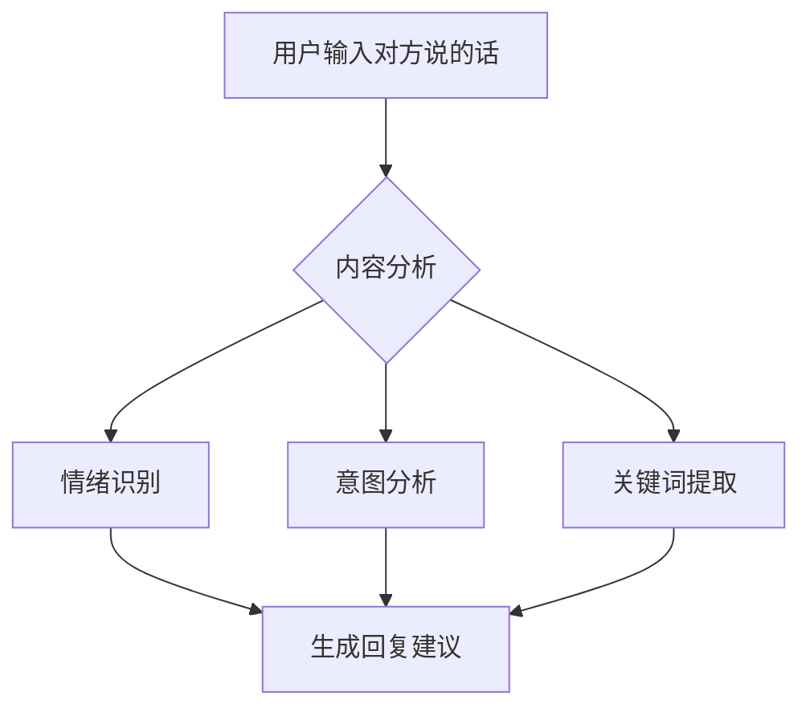

## 一、输入流程

### 1. 输入对方话语



### 2. 输入框设计

- 提示文本:"请输入对方说的话"
- 支持语音输入
- 快速场景选择
- 历史记录调用

## 二、AI分析处理

### 1. 情绪分析

- 识别对方情绪状态
- 判断对话氛围
- 预测可能的期望回应

### 2. 场景理解

- 识别社交场景
- 判断关系属性
- 考虑时间地点因素

### 3. 策略生成

- 根据情绪选择回应策略
- 考虑用户设定的角色特征
- 参考历史成功案例

## 三、回复建议生成

### 1. 多样化建议

- 生成3-5个不同风格建议
- 每个建议标注特点
- 预估回复效果

### 2. 建议类型

- 温和共情型
- 积极引导型
- 幽默活跃型
- 正式稳重型

### 3. 个性化调整

- 根据用户习惯调整
- 考虑用户性格特征
- 适应用户表达风格

## 四、用户操作流程

### 1. 选择建议

- 直接选用建议
- 编辑修改建议
- 保存喜欢的表达

### 2. 效果预测

- 显示可能的情绪影响
- 提示潜在风险
- 建议改进方向

### 3. 记录优化

- 记录用户选择
- 分析效果反馈
- 优化后续建议

## 五、界面展示

### 1. 输入区域

```
┌─────────────────────────┐
│ 请输入对方说的话...    │
│                         │
└─────────────────────────┘
    [语音] [场景] [历史]
```

### 2. 建议展示

```
┌─────────────────────────┐
│ 建议回复 1 [温和共情]  │
│ "我理解你的感受..."    │
├─────────────────────────┤
│ 建议回复 2 [积极引导]  │
│ "要不我们试试..."      │
├─────────────────────────┤
│ 建议回复 3 [幽默活跃]  │
│ "哈哈,说得对..."       │
└─────────────────────────┘
```

### 3. 效果预测

```
┌─────────────────────────┐
│ 预计效果:              │
│ - 情绪提升 +2          │
│ - 关系增进 +1          │
│ - 建议: 可适当展开     │
└─────────────────────────┘
```

这样的设计优势:

1. 更符合用户实际需求
2. 提供针对性的建议
3. 保持对话的自然性
4. 支持个性化调整
5. 有助于学习成长

