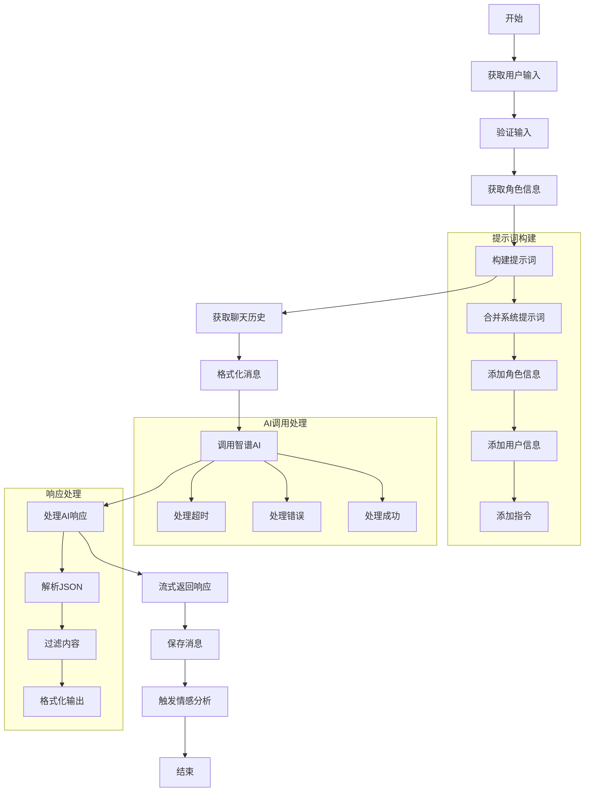
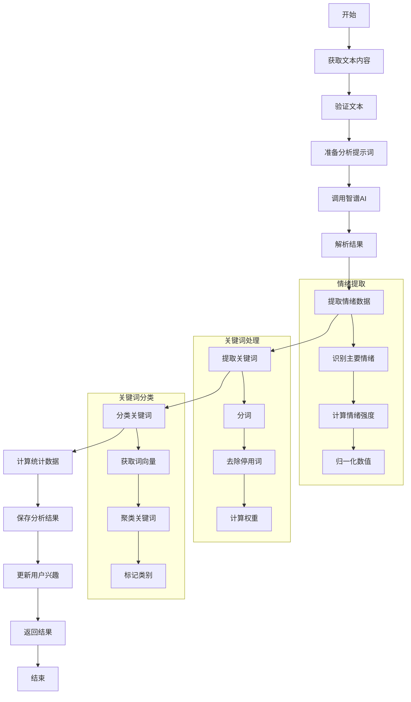
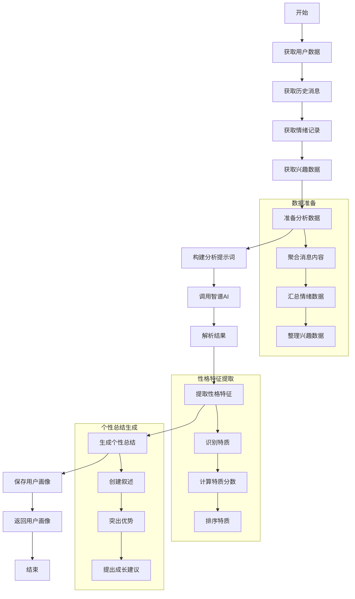
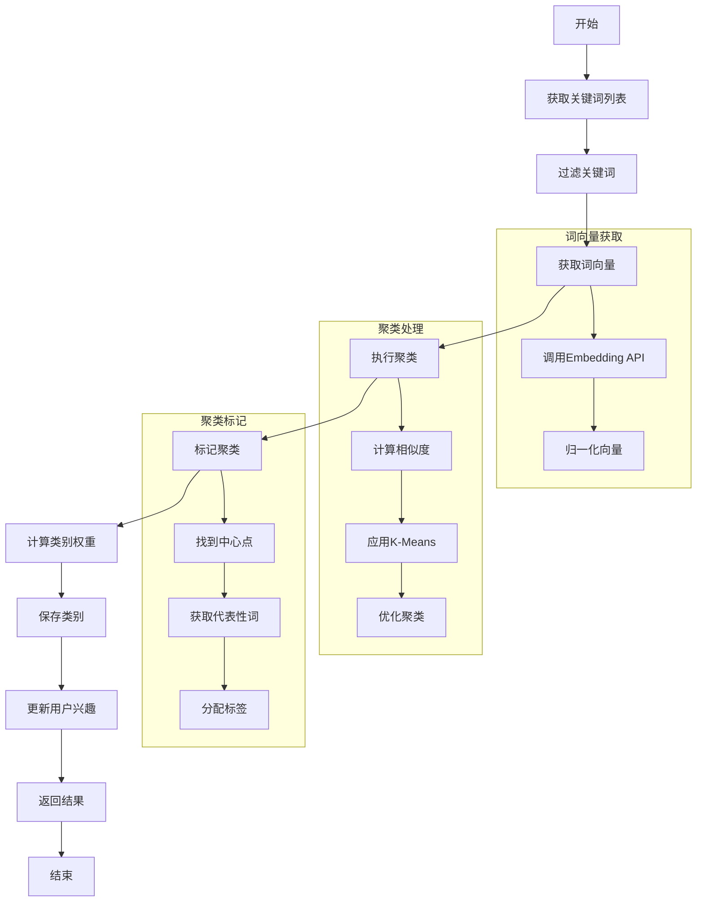
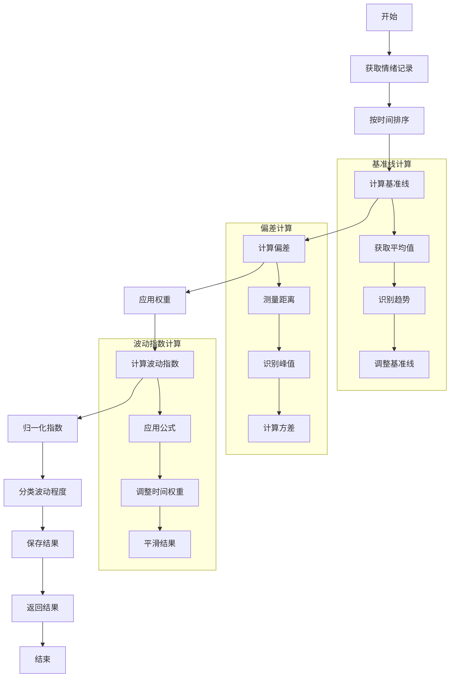
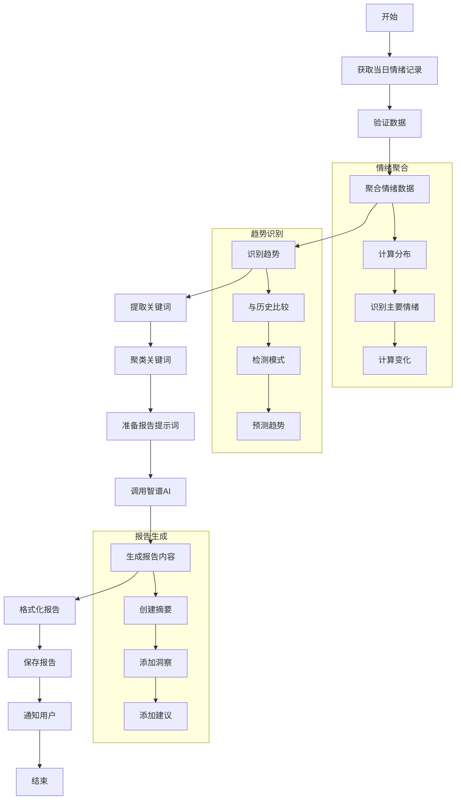
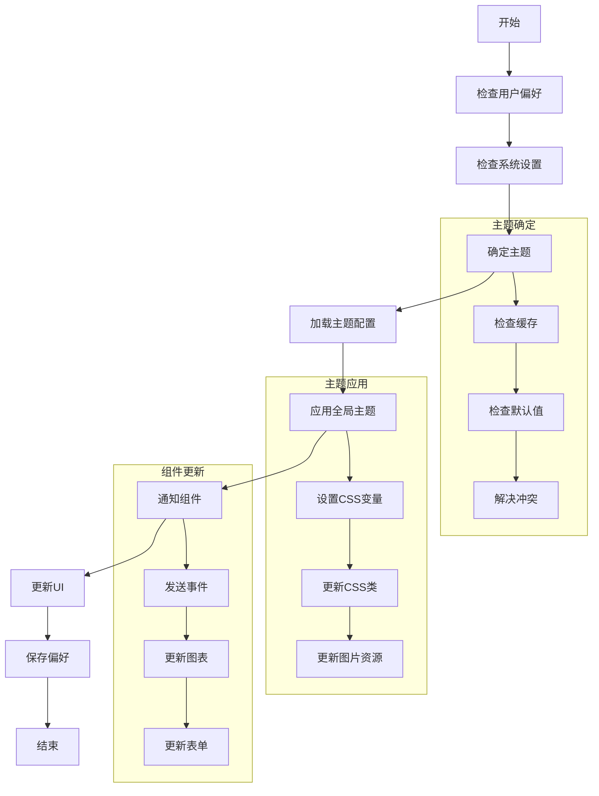
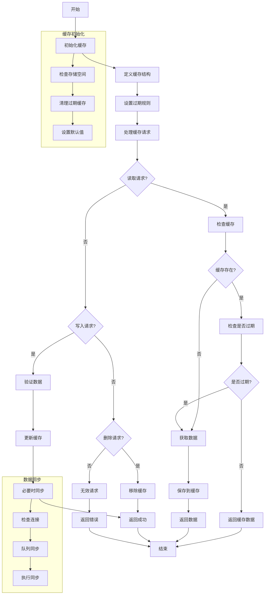
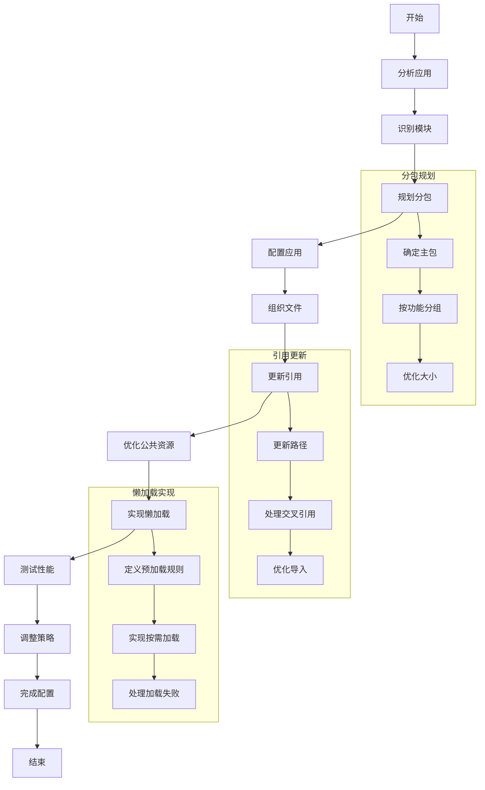

# HeartChat技术实现流程图

本文档展示了HeartChat项目的核心技术实现流程，包括AI调用、情感分析、用户画像生成等关键技术流程。

## 1. AI对话生成流程

## 2. 情感分析实现流程

## 3. 用户画像生成流程

## 4. 关键词分类与聚类流程

## 5. 情绪波动指数计算流程

## 6. 每日情绪报告生成流程

## 7. 暗黑模式实现流程

## 8. 本地缓存管理流程

## 9. 分包加载实现流程

