# HeartChat数据库结构图

本文档展示了HeartChat项目的数据库结构，包括各个集合的字段和关系。

## 数据库集合关系图

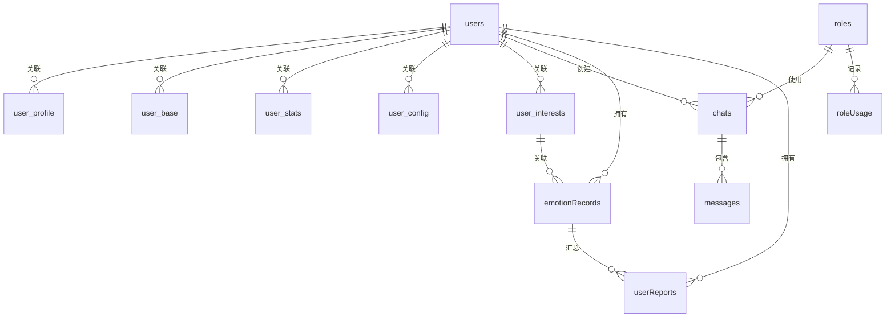

## 数据库集合详细结构

### 1. 用户相关集合

#### 1.1 users 集合

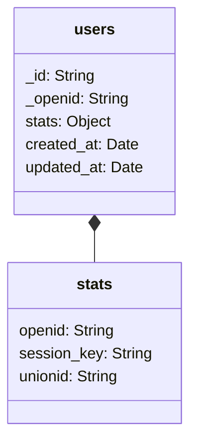

#### 1.2 user_base 集合

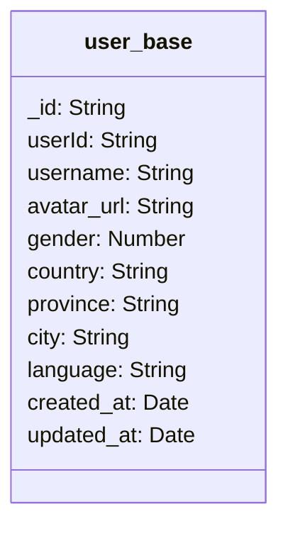

#### 1.3 user_profile 集合

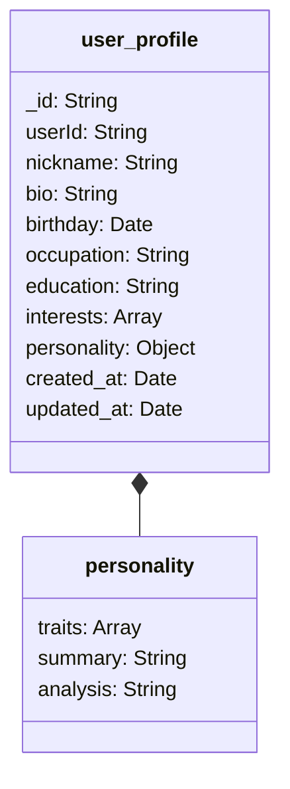

#### 1.4 user_stats 集合

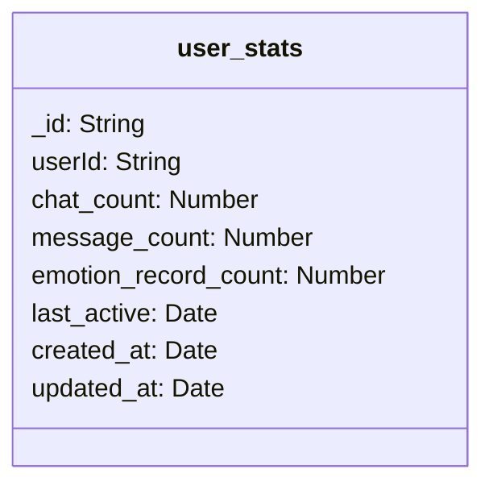

#### 1.5 user_config 集合

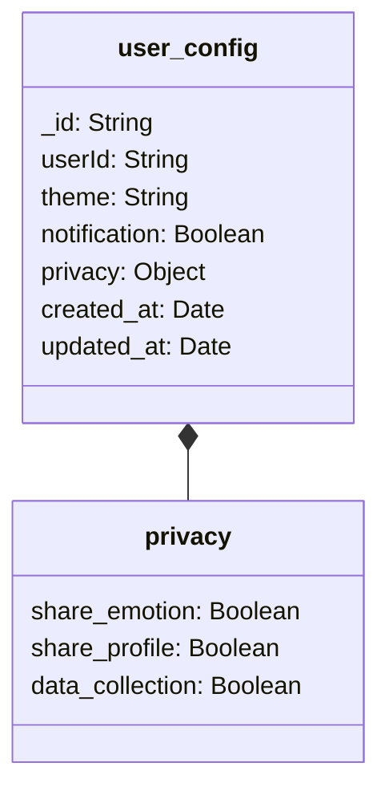

#### 1.6 user_interests 集合

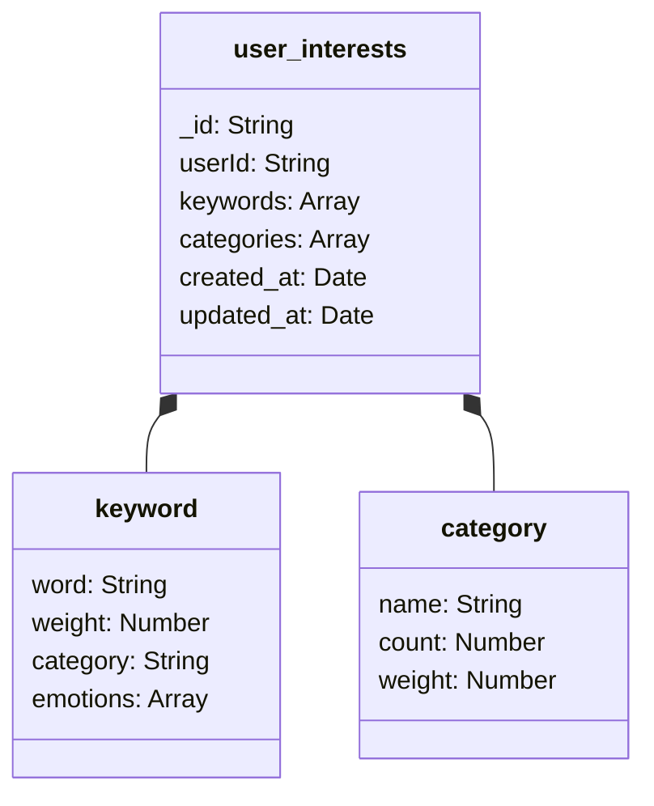

### 2. 角色相关集合

#### 2.1 roles 集合

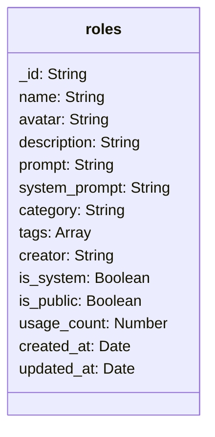

#### 2.2 roleUsage 集合

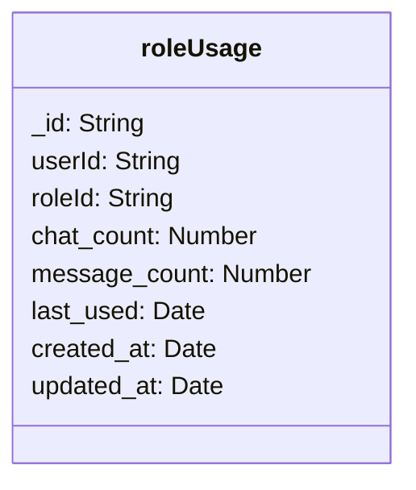

### 3. 聊天相关集合

#### 3.1 chats 集合

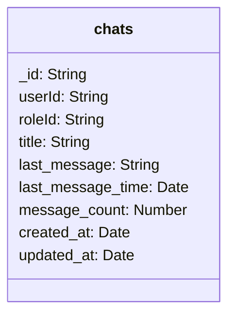

#### 3.2 messages 集合

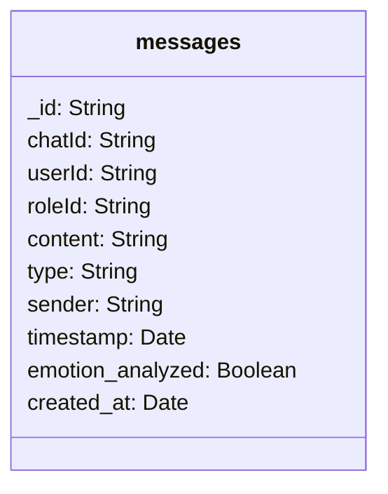

### 4. 情感相关集合

#### 4.1 emotionRecords 集合

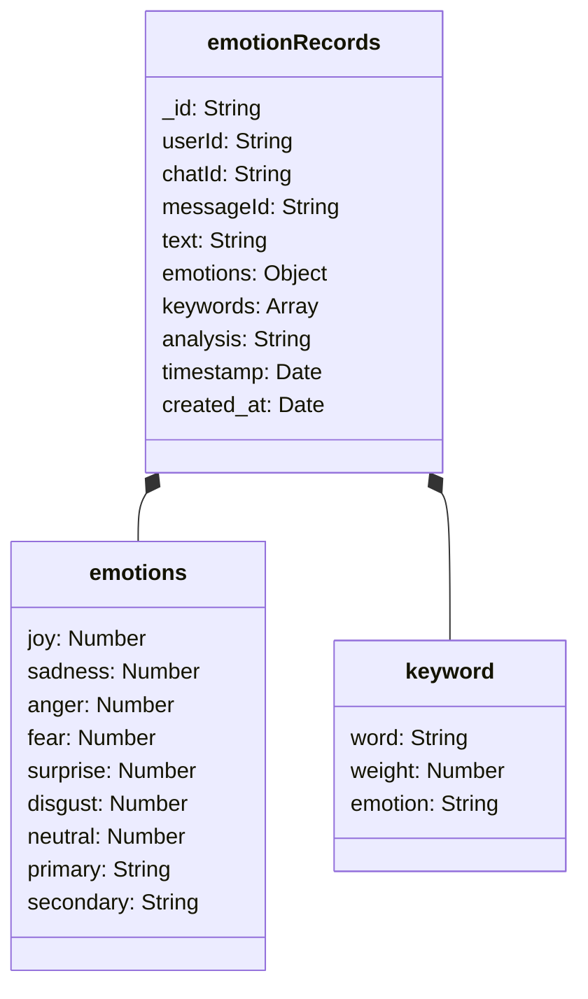

### 5. 报告相关集合

#### 5.1 userReports 集合

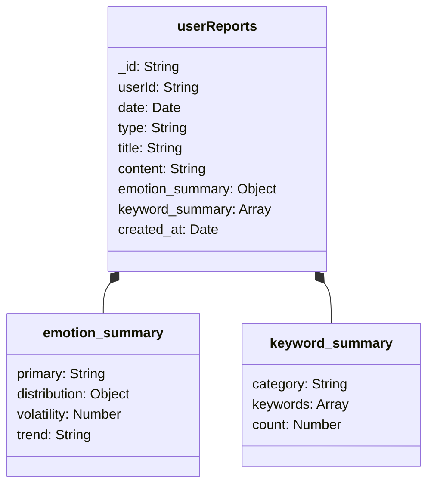

## 数据库索引结构

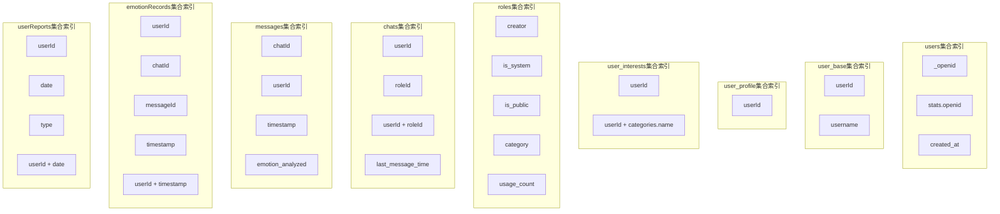
