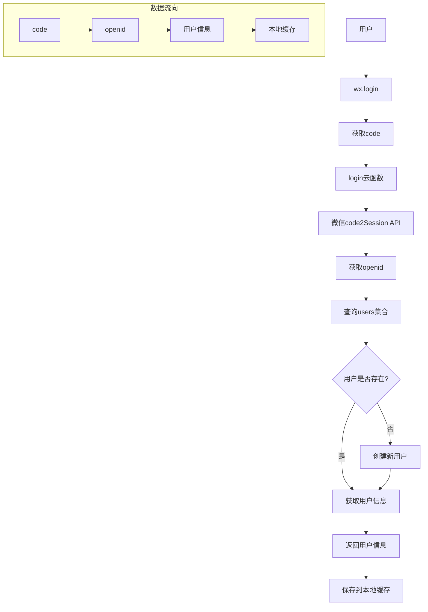
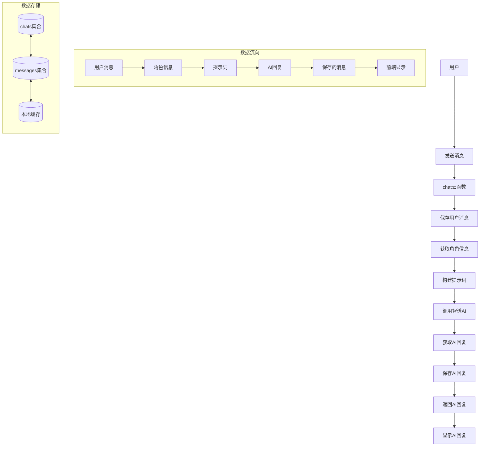
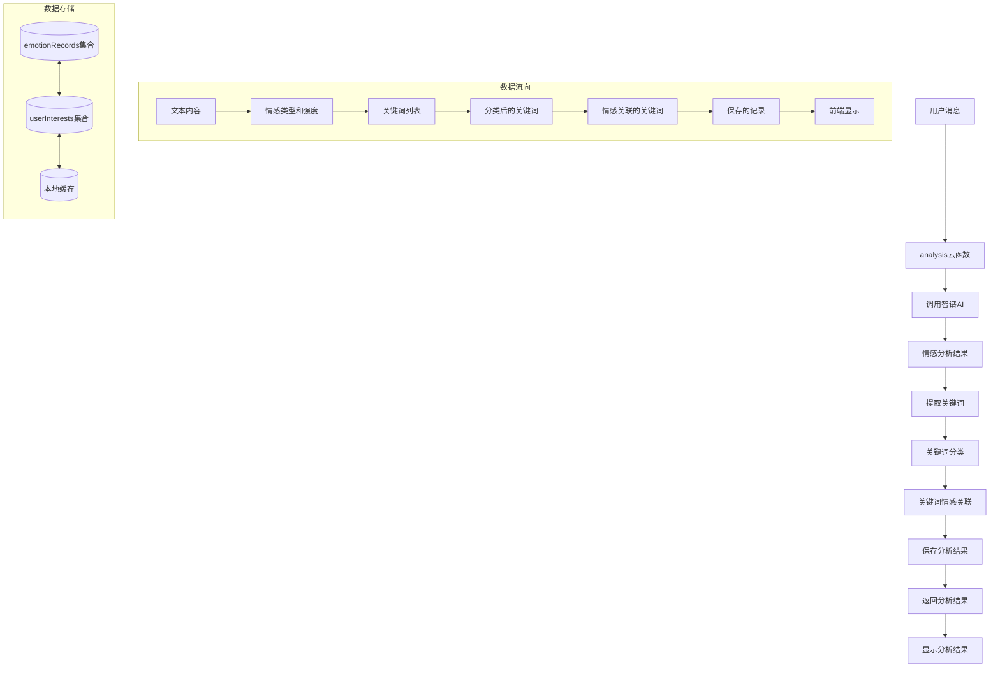
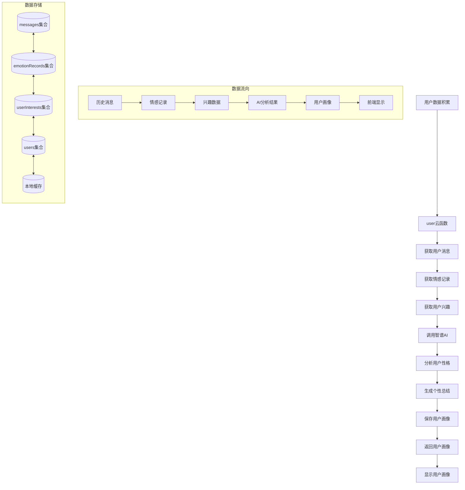
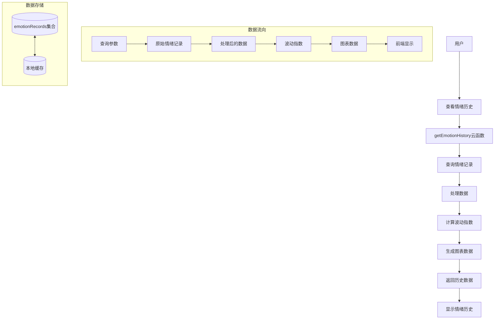
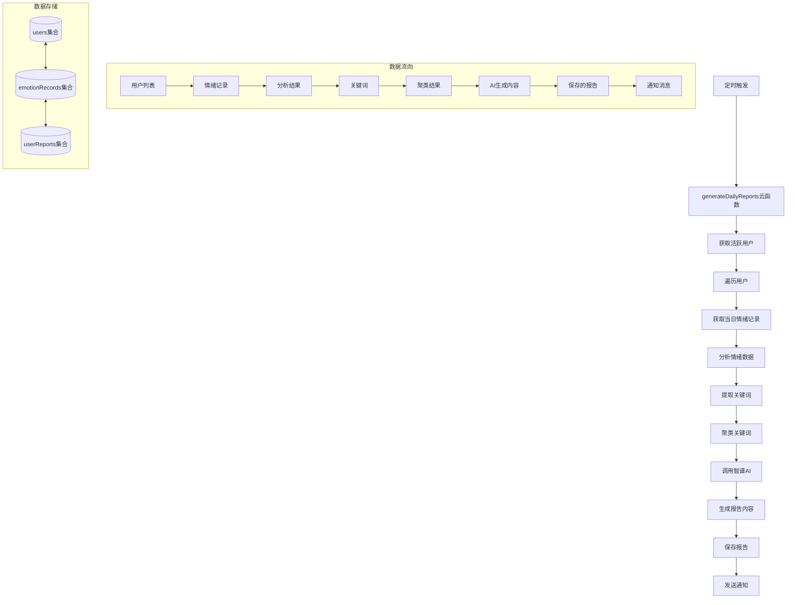

# HeartChat数据流向图

本文档展示了HeartChat项目中各个功能模块之间的数据流向和交互关系。

## 整体数据流向图

```mermaid
flowchart TD
    User[用户] <--> Frontend[前端界面]
    Frontend <--> CloudFunctions[云函数]
    CloudFunctions <--> Database[(云数据库)]
    CloudFunctions <--> ExternalAPI[外部API]
    Frontend <--> LocalStorage[(本地缓存)]
    
    subgraph 前端模块
        Home[首页]
        Chat[聊天页面]
        RoleSelect[角色选择页面]
        EmotionAnalysis[情绪分析页面]
        EmotionHistory[情绪历史页面]
        UserProfile[用户资料页面]
        DailyReport[每日报告页面]
    end
    
    subgraph 云函数模块
        Login[login云函数]
        ChatFunc[chat云函数]
        Analysis[analysis云函数]
        Roles[roles云函数]
        User[user云函数]
        GetEmotionHistory[getEmotionHistory云函数]
        GenerateDailyReports[generateDailyReports云函数]
    end
    
    subgraph 数据库集合
        Users[(users集合)]
        Roles_DB[(roles集合)]
        Chats[(chats集合)]
        Messages[(messages集合)]
        EmotionRecords[(emotionRecords集合)]
        UserInterests[(userInterests集合)]
        UserReports[(userReports集合)]
    end
    
    subgraph 外部API
        ZhipuAI_GLM4[智谱AI GLM-4-Flash]
        ZhipuAI_Embedding[智谱AI Embedding-3]
        WeChatAPI[微信API]
    end
    
    subgraph 本地缓存
        UserInfo_Cache[(用户信息缓存)]
        ChatHistory_Cache[(聊天历史缓存)]
        EmotionData_Cache[(情绪数据缓存)]
        RoleData_Cache[(角色数据缓存)]
    end
    
    %% 前端到云函数的数据流
    Home --> Login
    Home --> GetEmotionHistory
    Chat --> ChatFunc
    Chat --> Analysis
    RoleSelect --> Roles
    EmotionAnalysis --> Analysis
    EmotionHistory --> GetEmotionHistory
    UserProfile --> User
    DailyReport --> GenerateDailyReports
    
    %% 云函数到数据库的数据流
    Login <--> Users
    ChatFunc <--> Chats
    ChatFunc <--> Messages
    ChatFunc <--> Roles_DB
    Analysis <--> EmotionRecords
    Analysis <--> UserInterests
    Roles <--> Roles_DB
    User <--> Users
    User <--> UserInterests
    GetEmotionHistory <--> EmotionRecords
    GenerateDailyReports <--> EmotionRecords
    GenerateDailyReports <--> UserReports
    
    %% 云函数到外部API的数据流
    Login <--> WeChatAPI
    ChatFunc <--> ZhipuAI_GLM4
    Analysis <--> ZhipuAI_GLM4
    Analysis <--> ZhipuAI_Embedding
    Roles <--> ZhipuAI_GLM4
    User <--> ZhipuAI_GLM4
    GenerateDailyReports <--> ZhipuAI_GLM4
    
    %% 前端到本地缓存的数据流
    Home <--> UserInfo_Cache
    Home <--> EmotionData_Cache
    Chat <--> ChatHistory_Cache
    Chat <--> UserInfo_Cache
    RoleSelect <--> RoleData_Cache
    EmotionAnalysis <--> EmotionData_Cache
    EmotionHistory <--> EmotionData_Cache
    UserProfile <--> UserInfo_Cache
    DailyReport <--> EmotionData_Cache
```

## 详细数据流向图

### 1. 用户登录数据流

```mermaid
flowchart TD
    User[用户] --> WxLogin[wx.login]
    WxLogin --> Code[获取code]
    Code --> LoginFunc[login云函数]
    LoginFunc --> WxAPI[微信code2Session API]
    WxAPI --> OpenID[获取openid]
    OpenID --> QueryUser[查询users集合]
    QueryUser --> UserExists{用户是否存在?}
    UserExists -->|是| GetUser[获取用户信息]
    UserExists -->|否| CreateUser[创建新用户]
    CreateUser --> GetUser
    GetUser --> ReturnUser[返回用户信息]
    ReturnUser --> SaveCache[保存到本地缓存]
    
    subgraph 数据流向
        direction LR
        d1[code] --> d2[openid]
        d2 --> d3[用户信息]
        d3 --> d4[本地缓存]
    end
```

### 2. 聊天系统数据流

```mermaid
flowchart TD
    User[用户] --> SendMsg[发送消息]
    SendMsg --> ChatFunc[chat云函数]
    ChatFunc --> SaveUserMsg[保存用户消息]
    SaveUserMsg --> GetRole[获取角色信息]
    GetRole --> BuildPrompt[构建提示词]
    BuildPrompt --> CallAI[调用智谱AI]
    CallAI --> AIReply[获取AI回复]
    AIReply --> SaveAIMsg[保存AI回复]
    SaveAIMsg --> ReturnReply[返回AI回复]
    ReturnReply --> DisplayReply[显示AI回复]
    
    subgraph 数据流向
        direction LR
        d1[用户消息] --> d2[角色信息]
        d2 --> d3[提示词]
        d3 --> d4[AI回复]
        d4 --> d5[保存的消息]
        d5 --> d6[前端显示]
    end
    
    subgraph 数据存储
        direction TB
        s1[(chats集合)] <--> s2[(messages集合)]
        s2 <--> s3[(本地缓存)]
    end
```

### 3. 情感分析数据流

```mermaid
flowchart TD
    UserMsg[用户消息] --> AnalysisFunc[analysis云函数]
    AnalysisFunc --> CallAI[调用智谱AI]
    CallAI --> EmotionResult[情感分析结果]
    EmotionResult --> ExtractKeywords[提取关键词]
    ExtractKeywords --> ClassifyKeywords[关键词分类]
    ClassifyKeywords --> LinkEmotions[关键词情感关联]
    LinkEmotions --> SaveResults[保存分析结果]
    SaveResults --> ReturnResults[返回分析结果]
    ReturnResults --> DisplayResults[显示分析结果]
    
    subgraph 数据流向
        direction LR
        d1[文本内容] --> d2[情感类型和强度]
        d2 --> d3[关键词列表]
        d3 --> d4[分类后的关键词]
        d4 --> d5[情感关联的关键词]
        d5 --> d6[保存的记录]
        d6 --> d7[前端显示]
    end
    
    subgraph 数据存储
        direction TB
        s1[(emotionRecords集合)] <--> s2[(userInterests集合)]
        s2 <--> s3[(本地缓存)]
    end
```

### 4. 用户画像数据流

```mermaid
flowchart TD
    UserData[用户数据积累] --> UserFunc[user云函数]
    UserFunc --> GetMessages[获取用户消息]
    GetMessages --> GetEmotions[获取情感记录]
    GetEmotions --> GetInterests[获取用户兴趣]
    GetInterests --> CallAI[调用智谱AI]
    CallAI --> AnalyzePersonality[分析用户性格]
    AnalyzePersonality --> GenerateSummary[生成个性总结]
    GenerateSummary --> SavePerception[保存用户画像]
    SavePerception --> ReturnPerception[返回用户画像]
    ReturnPerception --> DisplayPerception[显示用户画像]
    
    subgraph 数据流向
        direction LR
        d1[历史消息] --> d2[情感记录]
        d2 --> d3[兴趣数据]
        d3 --> d4[AI分析结果]
        d4 --> d5[用户画像]
        d5 --> d6[前端显示]
    end
    
    subgraph 数据存储
        direction TB
        s1[(messages集合)] <--> s2[(emotionRecords集合)]
        s2 <--> s3[(userInterests集合)]
        s3 <--> s4[(users集合)]
        s4 <--> s5[(本地缓存)]
    end
```

### 5. 情绪历史数据流

```mermaid
flowchart TD
    User[用户] --> ViewHistory[查看情绪历史]
    ViewHistory --> HistoryFunc[getEmotionHistory云函数]
    HistoryFunc --> QueryRecords[查询情绪记录]
    QueryRecords --> ProcessData[处理数据]
    ProcessData --> CalcVolatility[计算波动指数]
    CalcVolatility --> GenerateCharts[生成图表数据]
    GenerateCharts --> ReturnData[返回历史数据]
    ReturnData --> DisplayHistory[显示情绪历史]
    
    subgraph 数据流向
        direction LR
        d1[查询参数] --> d2[原始情绪记录]
        d2 --> d3[处理后的数据]
        d3 --> d4[波动指数]
        d4 --> d5[图表数据]
        d5 --> d6[前端显示]
    end
    
    subgraph 数据存储
        direction TB
        s1[(emotionRecords集合)] <--> s2[(本地缓存)]
    end
```

### 6. 每日报告数据流

```mermaid
flowchart TD
    Trigger[定时触发] --> ReportFunc[generateDailyReports云函数]
    ReportFunc --> GetUsers[获取活跃用户]
    GetUsers --> ForEachUser[遍历用户]
    ForEachUser --> GetRecords[获取当日情绪记录]
    GetRecords --> AnalyzeEmotions[分析情绪数据]
    AnalyzeEmotions --> ExtractKeywords[提取关键词]
    ExtractKeywords --> ClusterKeywords[聚类关键词]
    ClusterKeywords --> CallAI[调用智谱AI]
    CallAI --> GenerateContent[生成报告内容]
    GenerateContent --> SaveReport[保存报告]
    SaveReport --> SendNotification[发送通知]
    
    subgraph 数据流向
        direction LR
        d1[用户列表] --> d2[情绪记录]
        d2 --> d3[分析结果]
        d3 --> d4[关键词]
        d4 --> d5[聚类结果]
        d5 --> d6[AI生成内容]
        d6 --> d7[保存的报告]
        d7 --> d8[通知消息]
    end
    
    subgraph 数据存储
        direction TB
        s1[(users集合)] <--> s2[(emotionRecords集合)]
        s2 <--> s3[(userReports集合)]
    end
```
