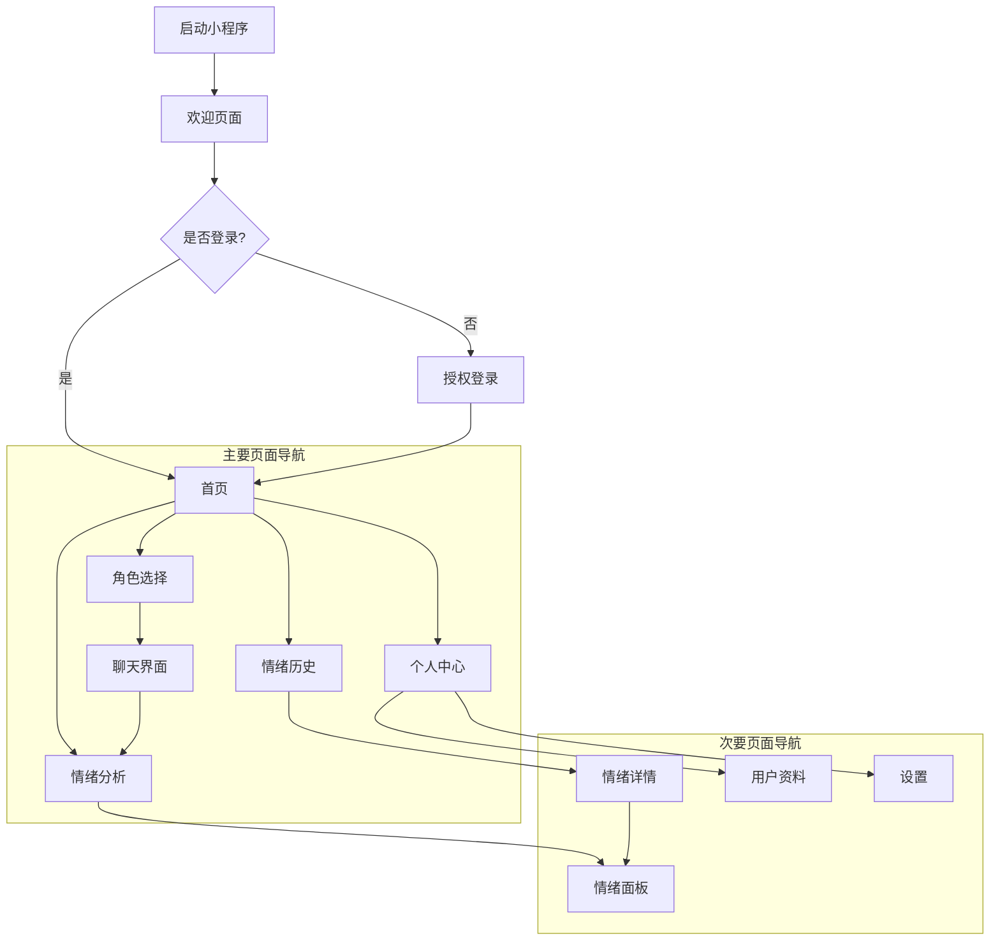
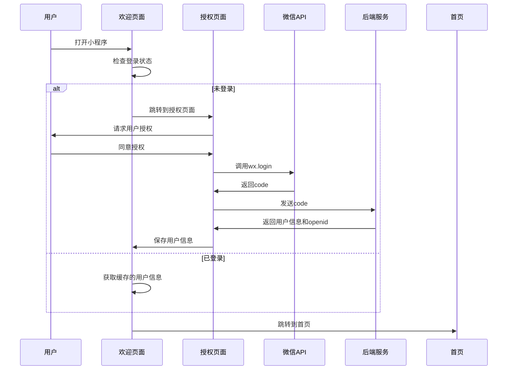
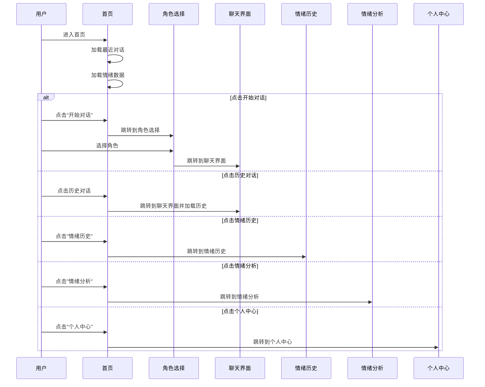
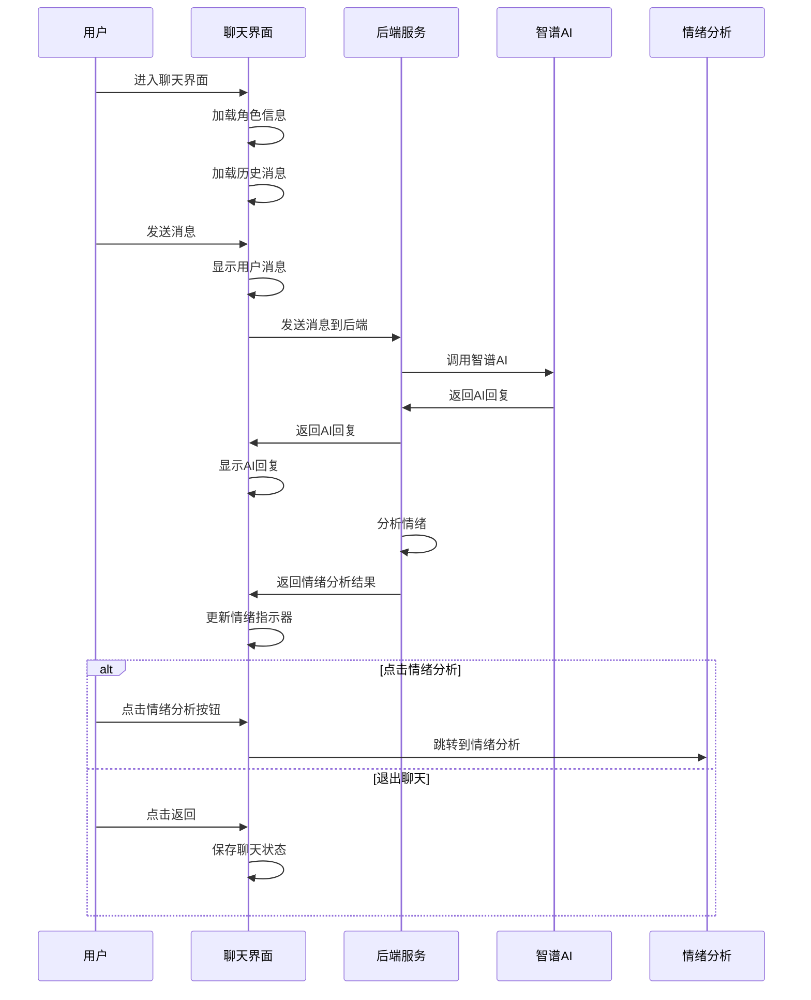
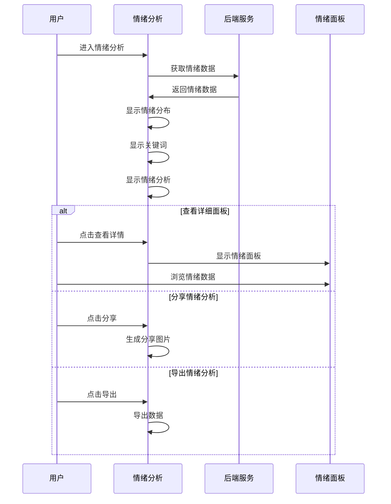
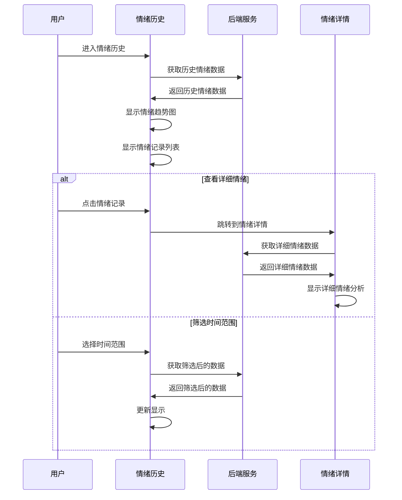
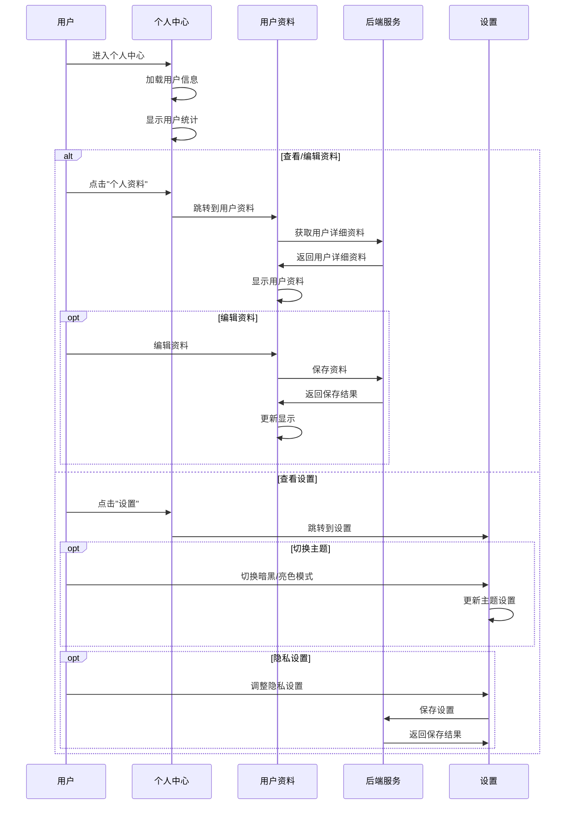
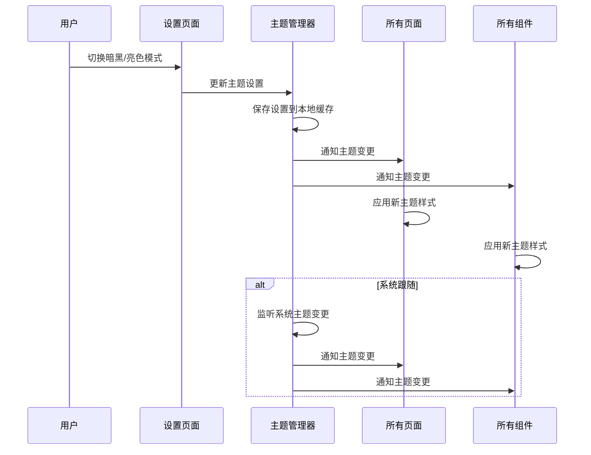
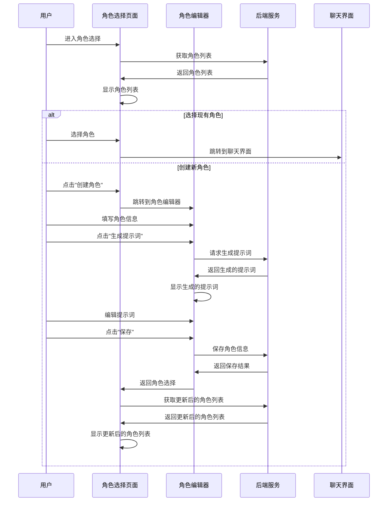

# HeartChat用户界面流程图

本文档展示了HeartChat项目的用户界面流程，包括页面跳转和用户交互流程。

## 整体用户界面流程

## 详细用户界面流程

### 1. 登录与授权流程

### 2. 首页交互流程

### 3. 聊天界面交互流程

### 4. 情绪分析交互流程

### 5. 情绪历史交互流程

### 6. 用户中心交互流程

## 暗黑模式切换流程

## 角色选择与创建流程

