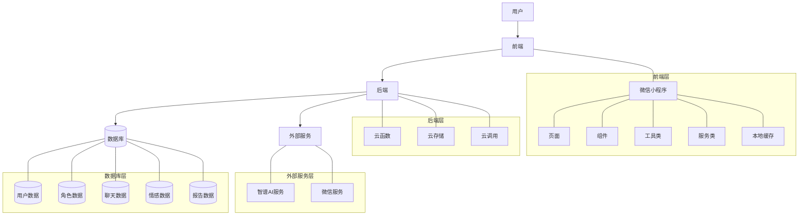
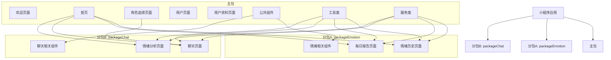

# HeartChat系统架构图

本文档展示了HeartChat项目的系统架构，包括前端、后端、数据库和外部服务的组织结构。

## 整体系统架构

```mermaid
graph TB
    User[用户] --> Frontend[前端]
    Frontend --> Backend[后端]
    Backend --> Database[(数据库)]
    Backend --> ExternalServices[外部服务]
    
    subgraph 前端层
        FE1[微信小程序]
        FE2[页面]
        FE3[组件]
        FE4[工具类]
        FE5[服务类]
        FE6[本地缓存]
    end
    
    subgraph 后端层
        BE1[云函数]
        BE2[云存储]
        BE3[云调用]
    end
    
    subgraph 数据库层
        DB1[(用户数据)]
        DB2[(角色数据)]
        DB3[(聊天数据)]
        DB4[(情感数据)]
        DB5[(报告数据)]
    end
    
    subgraph 外部服务层
        ES1[智谱AI服务]
        ES2[微信服务]
    end
    
    Frontend --- FE1
    FE1 --- FE2
    FE1 --- FE3
    FE1 --- FE4
    FE1 --- FE5
    FE1 --- FE6
    
    Backend --- BE1
    Backend --- BE2
    Backend --- BE3
    
    Database --- DB1
    Database --- DB2
    Database --- DB3
    Database --- DB4
    Database --- DB5
    
    ExternalServices --- ES1
    ExternalServices --- ES2
```

## 详细系统架构

```mermaid
graph TB
    User[用户] --> Frontend[前端]
    Frontend --> Backend[后端]
    Backend --> Database[(数据库)]
    Backend --> ExternalServices[外部服务]
    
    subgraph 前端层
        direction TB
        
        subgraph 页面
            P1[欢迎页面]
            P2[首页]
            P3[角色选择页面]
            P4[聊天页面]
            P5[情绪分析页面]
            P6[情绪历史页面]
            P7[每日报告页面]
            P8[用户资料页面]
        end
        
        subgraph 组件
            C1[聊天气泡组件]
            C2[聊天输入组件]
            C3[情感分析组件]
            C4[情感卡片组件]
            C5[情感历史组件]
            C6[情感面板组件]
            C7[情感饼图组件]
            C8[兴趣标签云组件]
            C9[关键词情感统计组件]
        end
        
        subgraph 工具类
            U1[auth.js]
            U2[date.js]
            U3[emotionAnalyzer.js]
            U4[emotionHelper.js]
            U5[stats.js]
            U6[storage.js]
        end
        
        subgraph 服务类
            S1[emotionService.js]
            S2[personalityService.js]
            S3[userInterestsService.js]
            S4[keywordService.js]
            S5[cloudFuncCaller.js]
            S6[eventBus.js]
        end
        
        subgraph 本地缓存
            L1[用户信息缓存]
            L2[聊天历史缓存]
            L3[情绪数据缓存]
            L4[角色数据缓存]
        end
    end
    
    subgraph 后端层
        direction TB
        
        subgraph 云函数
            CF1[login]
            CF2[chat]
            CF3[analysis]
            CF4[roles]
            CF5[user]
            CF6[getEmotionHistory]
            CF7[generateDailyReports]
        end
        
        subgraph 云存储
            CS1[用户头像]
            CS2[角色头像]
        end
        
        subgraph 云调用
            CC1[订阅消息]
        end
    end
    
    subgraph 数据库层
        direction TB
        
        subgraph 用户数据
            UD1[(users)]
            UD2[(user_base)]
            UD3[(user_profile)]
            UD4[(user_stats)]
            UD5[(user_config)]
            UD6[(user_interests)]
        end
        
        subgraph 角色数据
            RD1[(roles)]
            RD2[(roleUsage)]
        end
        
        subgraph 聊天数据
            CD1[(chats)]
            CD2[(messages)]
        end
        
        subgraph 情感数据
            ED1[(emotionRecords)]
        end
        
        subgraph 报告数据
            RPD1[(userReports)]
        end
    end
    
    subgraph 外部服务层
        direction TB
        
        subgraph 智谱AI服务
            AI1[GLM-4-Flash]
            AI2[Embedding-3]
        end
        
        subgraph 微信服务
            WX1[登录服务]
            WX2[用户信息服务]
            WX3[订阅消息服务]
        end
    end
    
    %% 连接前端组件和页面
    P4 --- C1
    P4 --- C2
    P5 --- C3
    P5 --- C4
    P6 --- C5
    P5 --- C6
    P5 --- C7
    P8 --- C8
    P8 --- C9
    
    %% 连接前端服务和工具
    P4 --- S1
    P8 --- S2
    P8 --- S3
    P5 --- S4
    
    %% 连接前端和后端
    P1 --- CF1
    P4 --- CF2
    P5 --- CF3
    P3 --- CF4
    P8 --- CF5
    P6 --- CF6
    P7 --- CF7
    
    %% 连接后端和数据库
    CF1 --- UD1
    CF1 --- UD2
    CF5 --- UD3
    CF5 --- UD4
    CF5 --- UD5
    CF5 --- UD6
    
    CF4 --- RD1
    CF4 --- RD2
    
    CF2 --- CD1
    CF2 --- CD2
    
    CF3 --- ED1
    
    CF7 --- RPD1
    
    %% 连接后端和外部服务
    CF1 --- WX1
    CF1 --- WX2
    CF7 --- WX3
    
    CF2 --- AI1
    CF3 --- AI1
    CF3 --- AI2
    CF4 --- AI1
    CF5 --- AI1
    CF7 --- AI1
```

## 微信小程序分包结构

```mermaid
graph TB
    App[小程序应用] --> MainPackage[主包]
    App --> SubPackageA[分包A: packageEmotion]
    App --> SubPackageB[分包B: packageChat]
    
    subgraph 主包
        MP1[欢迎页面]
        MP2[首页]
        MP3[角色选择页面]
        MP4[用户页面]
        MP5[用户资料页面]
        MP6[公共组件]
        MP7[工具类]
        MP8[服务类]
    end
    
    subgraph 分包A: packageEmotion
        SPA1[情绪历史页面]
        SPA2[每日报告页面]
        SPA3[情绪相关组件]
    end
    
    subgraph 分包B: packageChat
        SPB1[聊天页面]
        SPB2[情绪分析页面]
        SPB3[聊天相关组件]
    end
    
    %% 连接主包和分包
    MP2 --> SPA1
    MP2 --> SPA2
    MP2 --> SPB1
    MP2 --> SPB2
    
    MP3 --> SPB1
    
    MP6 --> SPA3
    MP6 --> SPB3
    
    MP7 --> SPA1
    MP7 --> SPA2
    MP7 --> SPB1
    MP7 --> SPB2
    
    MP8 --> SPA1
    MP8 --> SPA2
    MP8 --> SPB1
    MP8 --> SPB2
```
