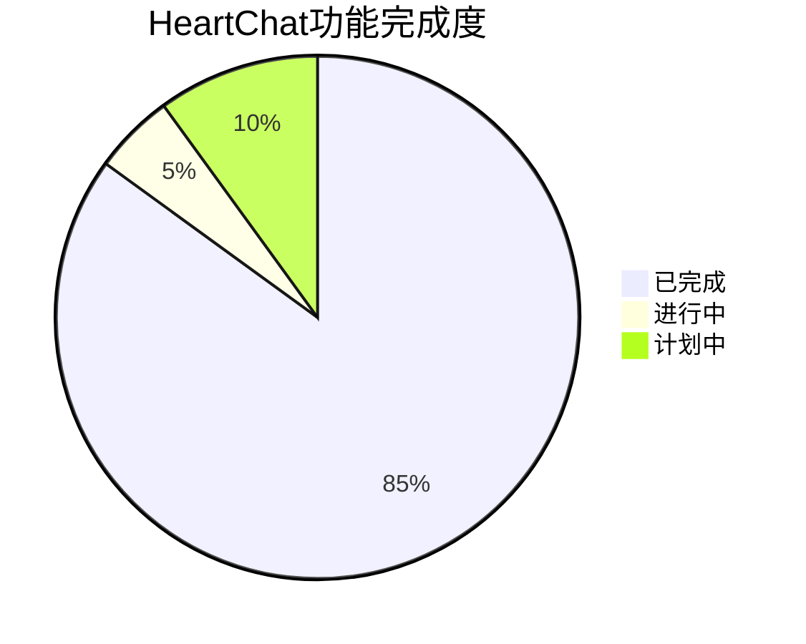
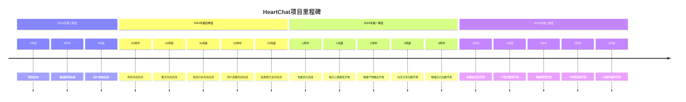
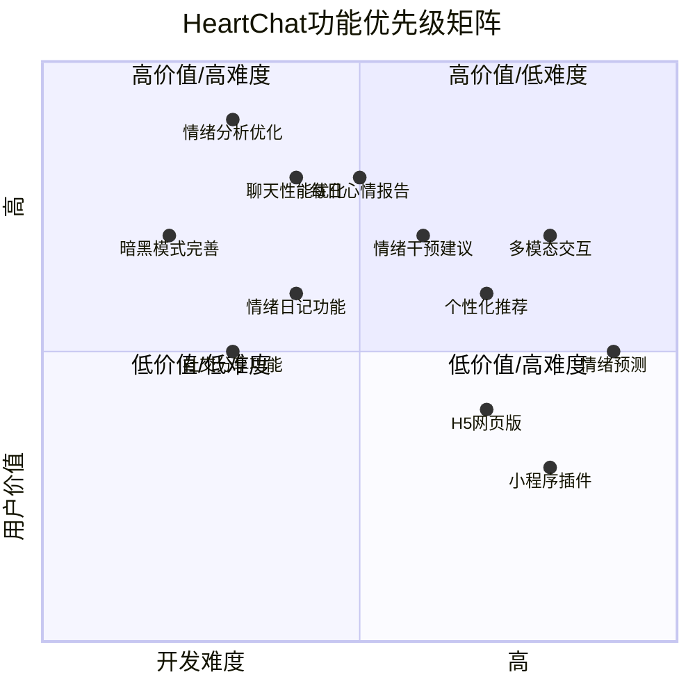
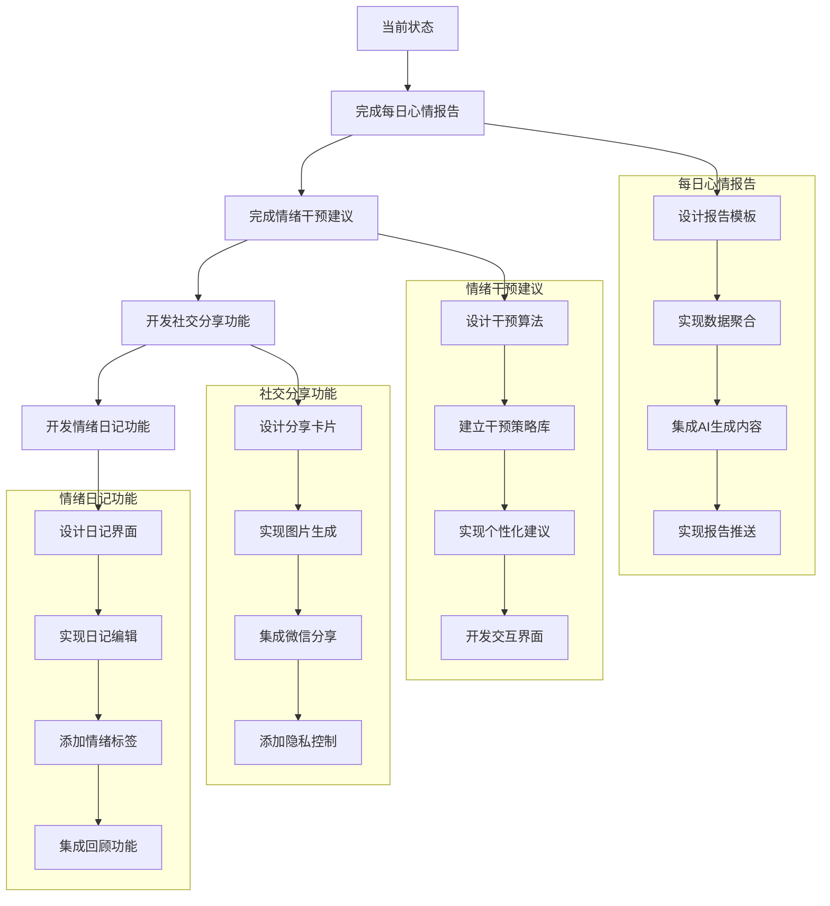
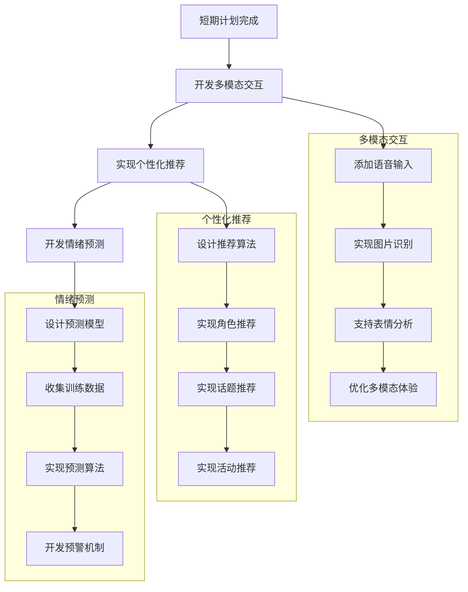
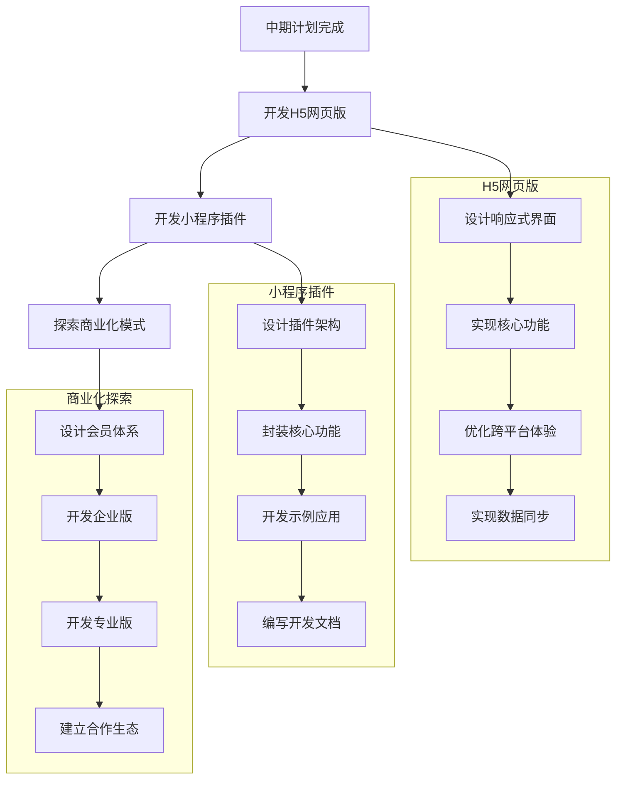

# HeartChat项目开发进度图

本文档展示了HeartChat项目的开发进度和未来规划。

## 项目开发时间线

```mermaid
gantt
    title HeartChat项目开发时间线
    dateFormat  YYYY-MM-DD
    section 基础架构
    项目初始化            :done, init, 2023-09-01, 7d
    云开发环境搭建        :done, cloud, 2023-09-08, 5d
    分包结构设计          :done, subpackage, 2023-09-13, 3d
    组件化架构实现        :done, component, 2023-09-16, 5d
    
    section 用户系统
    用户登录与授权        :done, login, 2023-09-21, 4d
    用户资料管理          :done, profile, 2023-09-25, 5d
    用户中心页面          :done, usercenter, 2023-09-30, 4d
    
    section 角色系统
    角色数据结构设计      :done, roledesign, 2023-10-04, 3d
    角色选择页面          :done, roleselect, 2023-10-07, 4d
    角色创建与编辑        :done, roleedit, 2023-10-11, 5d
    提示词编辑器          :done, prompteditor, 2023-10-16, 6d
    
    section 聊天系统
    聊天界面设计          :done, chatdesign, 2023-10-22, 4d
    消息发送与接收        :done, message, 2023-10-26, 5d
    历史消息加载          :done, history, 2023-10-31, 4d
    聊天记录本地缓存      :done, chatcache, 2023-11-04, 3d
    
    section 情感分析系统
    情感分析算法设计      :done, emotiondesign, 2023-11-07, 5d
    情感分析API集成       :done, emotionapi, 2023-11-12, 4d
    情感可视化组件        :done, emotionvis, 2023-11-16, 6d
    情绪历史记录          :done, emotionhistory, 2023-11-22, 5d
    
    section 用户画像系统
    用户画像设计          :done, perceptiondesign, 2023-11-27, 4d
    关键词提取与分类      :done, keyword, 2023-12-01, 6d
    用户兴趣分析          :done, interest, 2023-12-07, 5d
    个性特征分析          :done, personality, 2023-12-12, 6d
    
    section UI优化
    暗黑模式支持          :done, darkmode, 2023-12-18, 7d
    自定义导航栏          :done, navbar, 2023-12-25, 4d
    UI组件库优化          :done, uikit, 2023-12-29, 5d
    动画与交互优化        :done, animation, 2024-01-03, 6d
    
    section 性能优化
    数据加载优化          :done, dataload, 2024-01-09, 5d
    本地缓存策略          :done, cachestrategy, 2024-01-14, 4d
    网络请求优化          :done, network, 2024-01-18, 3d
    启动性能优化          :done, startup, 2024-01-21, 4d
    
    section 功能扩展
    每日心情报告          :active, dailyreport, 2024-01-25, 7d
    情绪干预建议          :active, intervention, 2024-02-01, 8d
    社交分享功能          :todo, share, 2024-02-09, 6d
    情绪日记功能          :todo, diary, 2024-02-15, 8d
    
    section 未来规划
    多模态交互            :todo, multimodal, 2024-02-23, 10d
    个性化推荐            :todo, recommendation, 2024-03-04, 9d
    情绪预测              :todo, prediction, 2024-03-13, 10d
    H5网页版              :todo, h5, 2024-03-23, 14d
    小程序插件            :todo, plugin, 2024-04-06, 12d
```

## 功能完成度统计



## 各模块完成度

```mermaid
bar
    title HeartChat各模块完成度
    "基础架构" : 100
    "用户系统" : 95
    "角色系统" : 90
    "聊天系统" : 85
    "情感分析" : 80
    "用户画像" : 75
    "UI优化" : 90
    "性能优化" : 70
    "功能扩展" : 30
```

## 项目里程碑



## 开发优先级矩阵



## 未来开发计划

### 短期计划（1-2个月）



### 中期计划（3-6个月）



### 长期计划（6个月以上）


