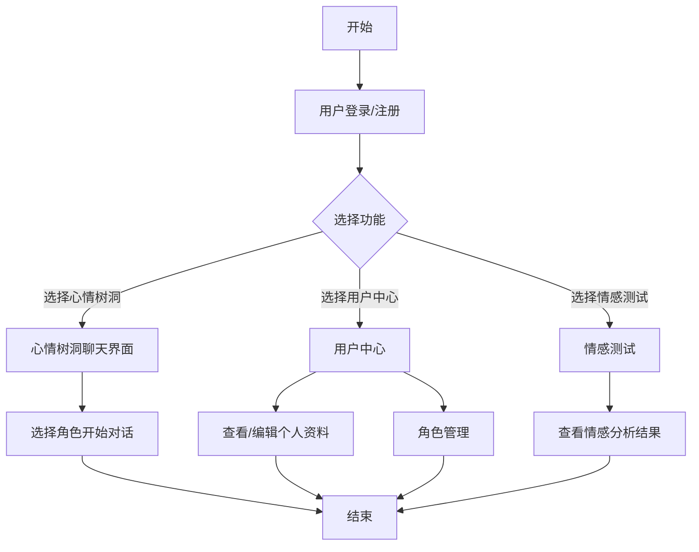
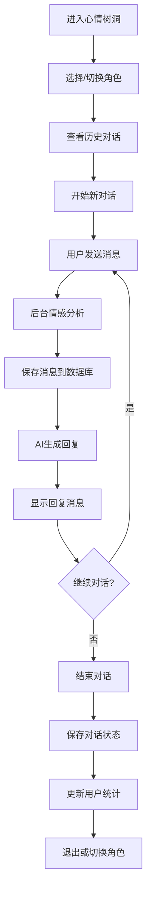
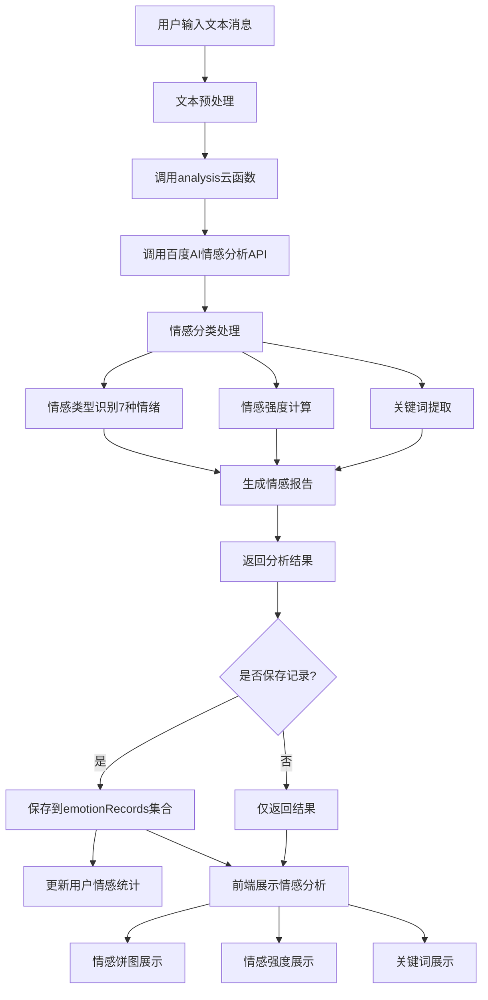
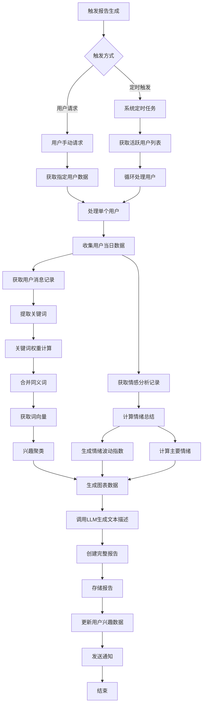
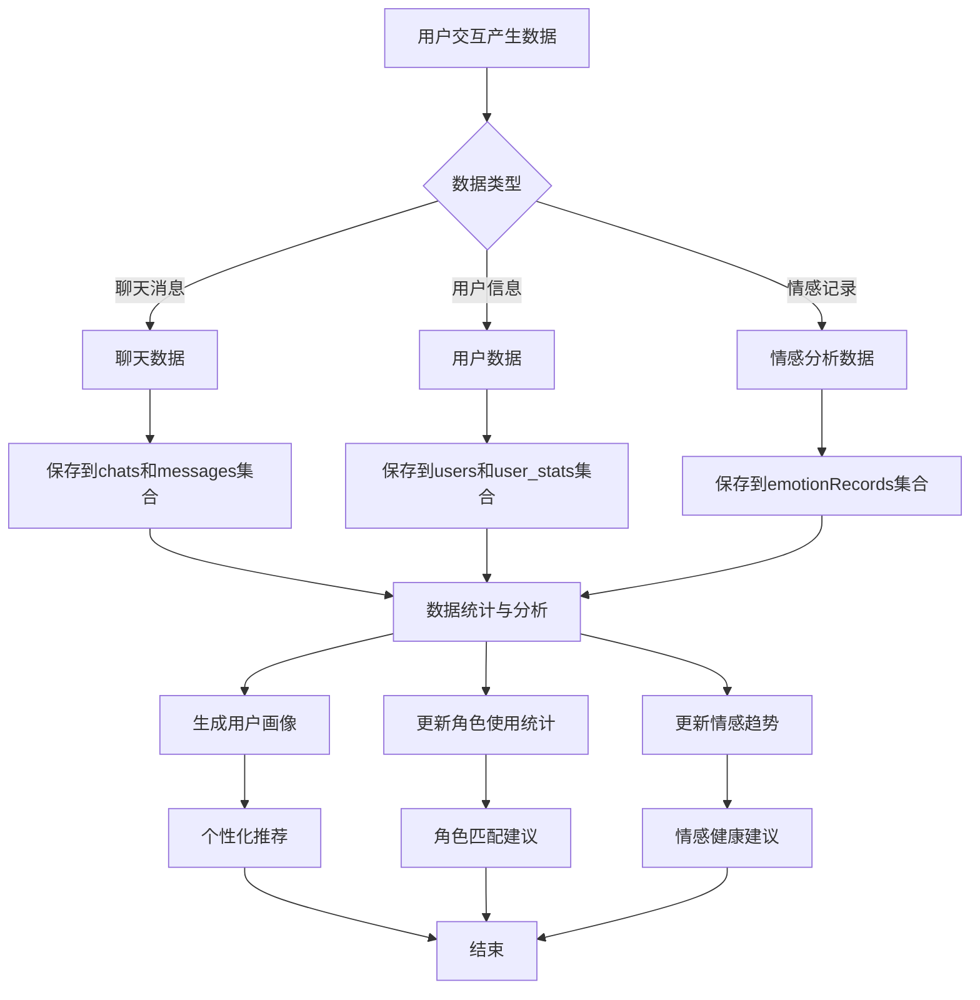
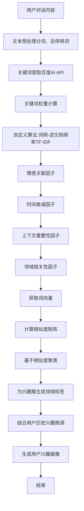
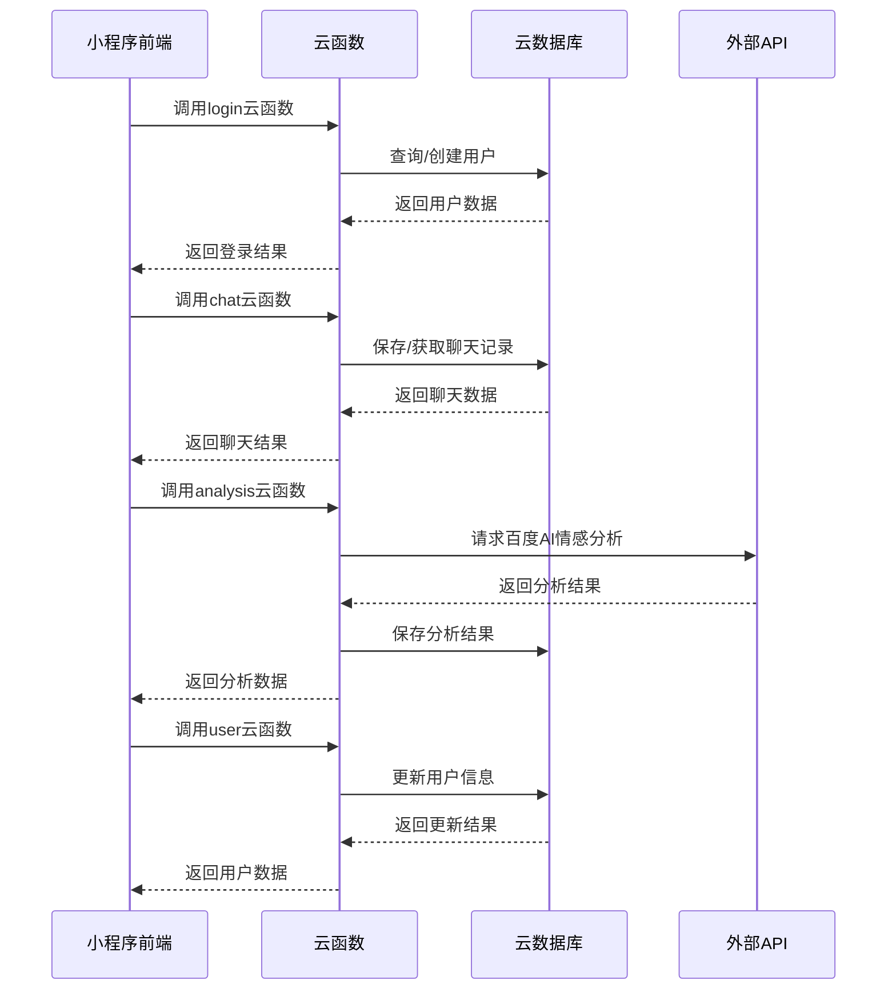
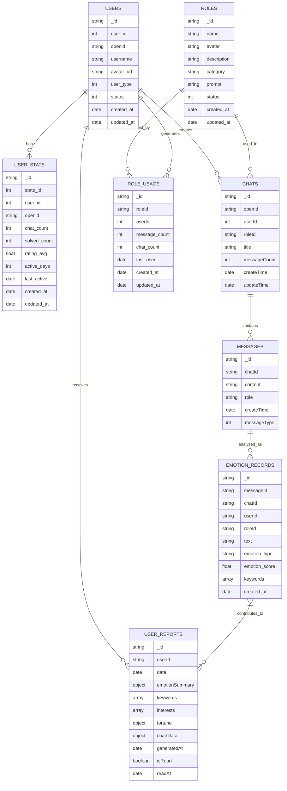

# HeartChat项目流程图（重构版）

本文档使用Mermaid语法绘制HeartChat项目的主要流程图，包括用户交互流程、心情树洞功能流程、情感分析流程、每日心情报告流程以及数据处理流程。

## 1. 用户交互总体流程

## 2. 心情树洞功能流程

## 3. 情感分析流程

## 4. 每日心情报告流程

## 5. 数据处理流程

## 6. 关键词提取与兴趣聚类流程

## 7. 云函数调用流程

## 8. 数据库关系图

