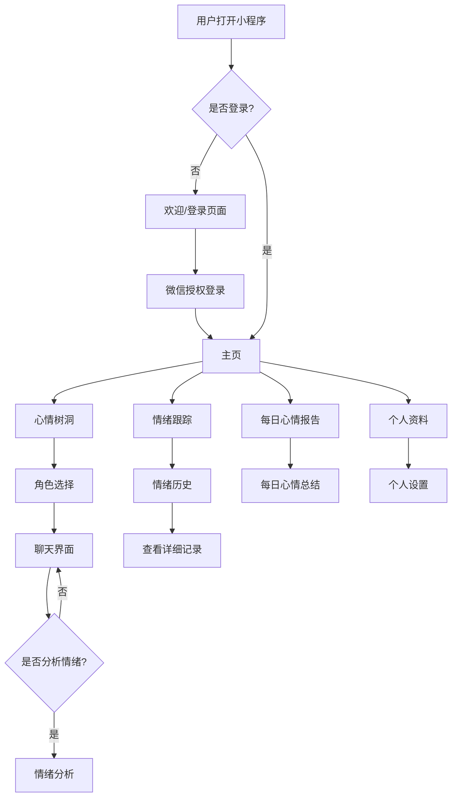
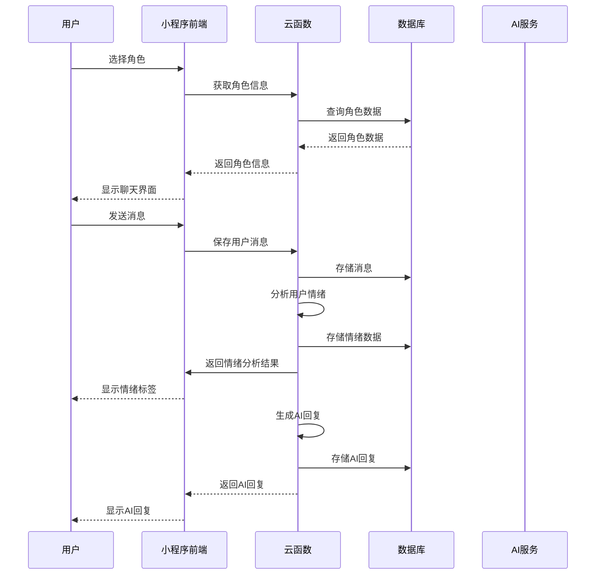
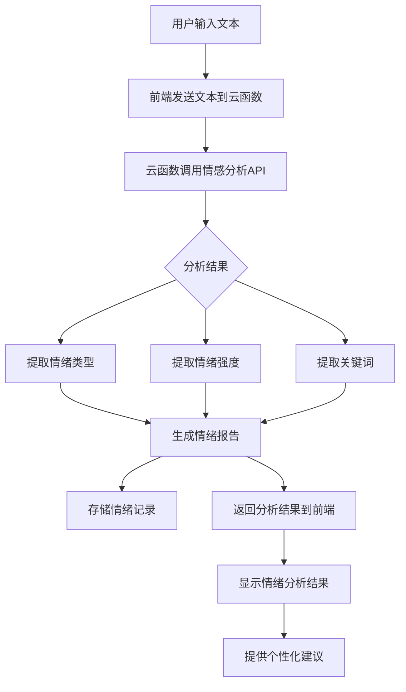
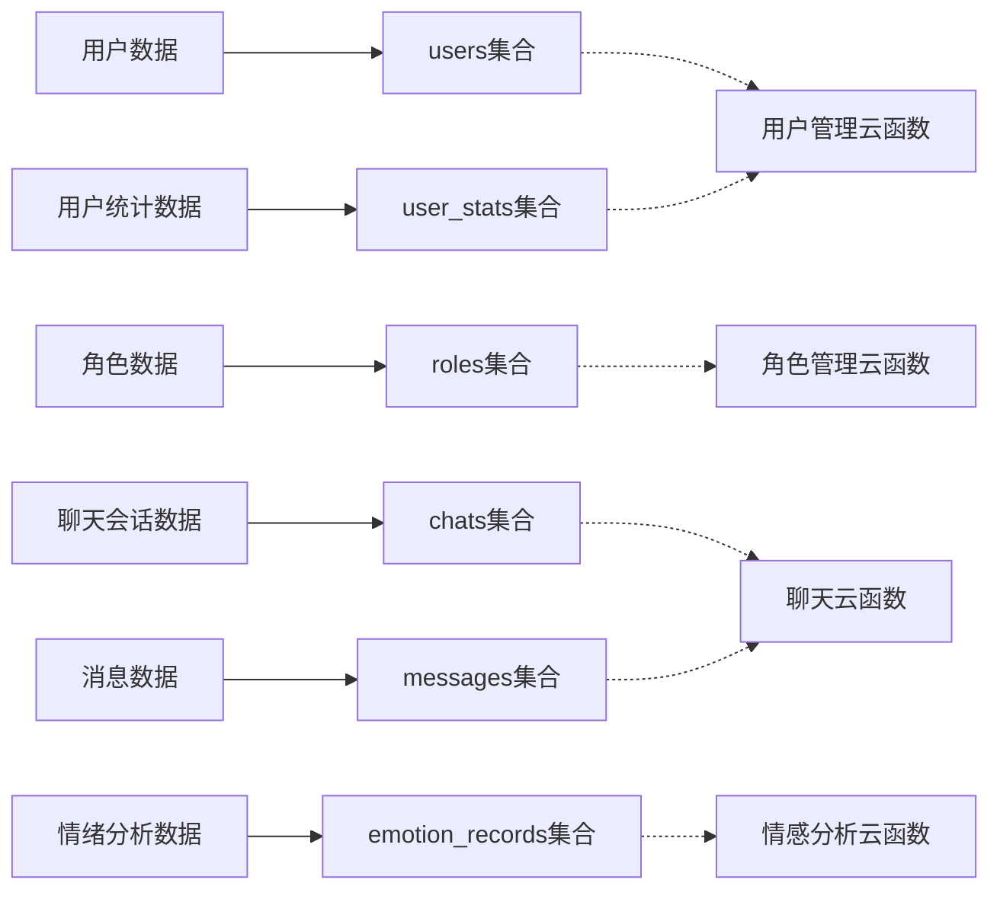
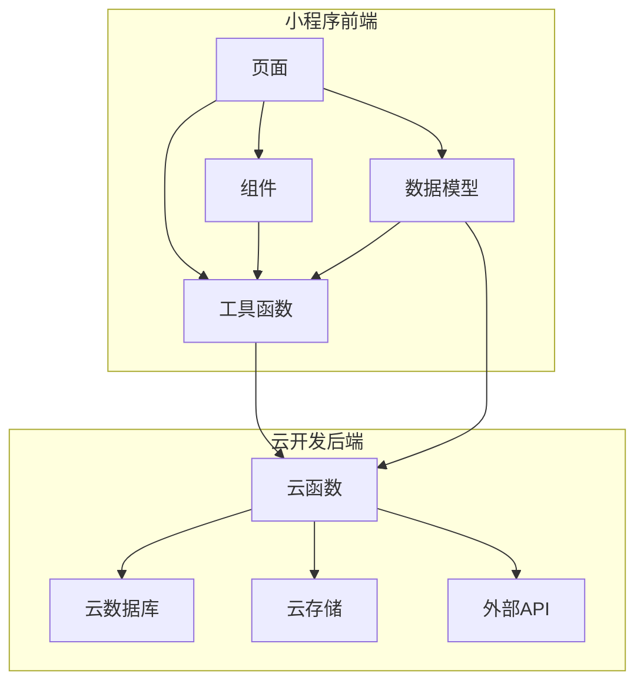
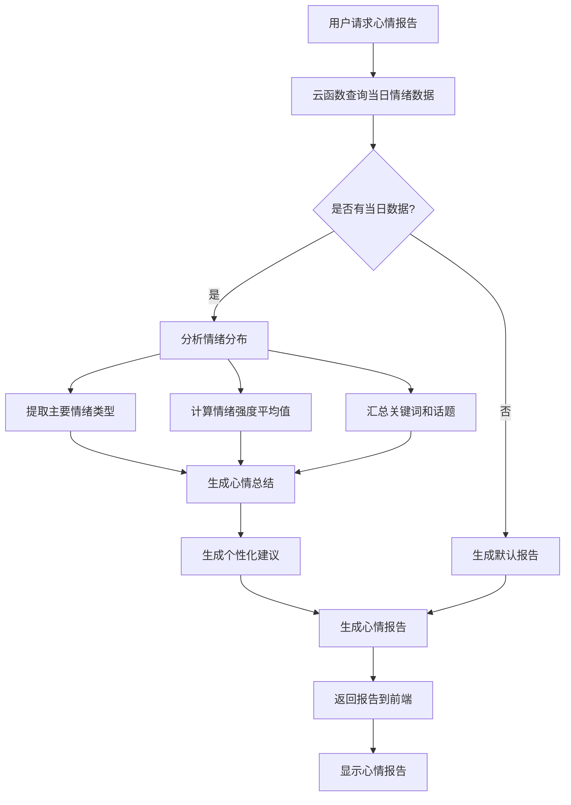
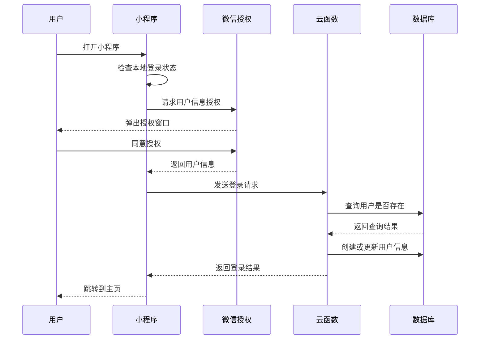
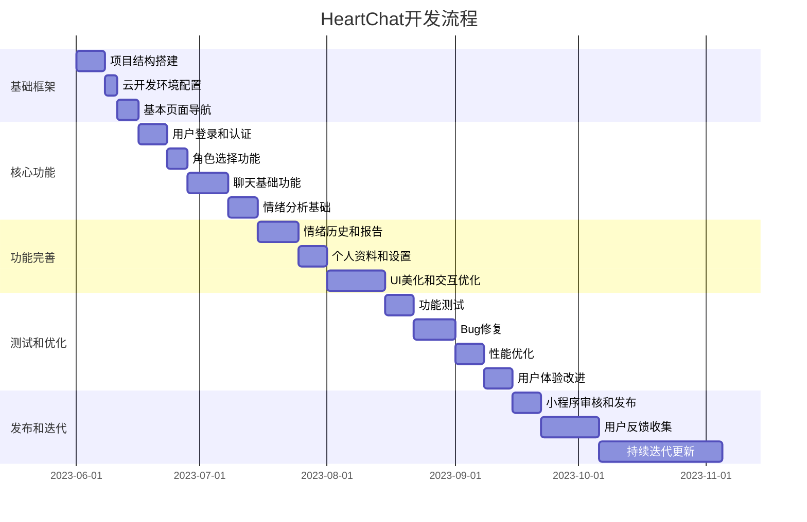

# HeartChat 项目流程图

## 用户流程图

```mermaid
graph TD
    A[用户打开小程序] --> B{是否登录?}
    B -->|否| C[欢迎/登录页面]
    C --> D[微信授权登录]
    D --> E[主页]
    B -->|是| E

    E --> F1[心情树洞]
    E --> F2[情绪跟踪]
    E --> F3[每日心情报告]
    E --> F4[个人资料]

    F1 --> G[角色选择]
    G --> H[聊天界面]
    H --> I{是否分析情绪?}
    I -->|是| J[情绪分析]
    I -->|否| H

    F2 --> K[情绪历史]
    K --> L[查看详细记录]

    F3 --> M[每日心情总结]

    F4 --> N[个人设置]
```

## 聊天功能流程

```mermaid
sequenceDiagram
    participant 用户
    participant 小程序前端
    participant 云函数
    participant 数据库
    participant AI服务

    用户->>小程序前端: 选择角色
    小程序前端->>云函数: 获取角色信息
    云函数->>数据库: 查询角色数据
    数据库-->>云函数: 返回角色数据
    云函数-->>小程序前端: 返回角色信息
    小程序前端-->>用户: 显示聊天界面

    用户->>小程序前端: 发送消息
    小程序前端->>云函数: 保存用户消息
    云函数->>数据库: 存储消息
    云函数->>云函数: 分析用户情绪
    云函数->>数据库: 存储情绪数据
    云函数->>小程序前端: 返回情绪分析结果
    小程序前端-->>用户: 显示情绪标签

    云函数->>云函数: 生成AI回复
    云函数->>数据库: 存储AI回复
    云函数-->>小程序前端: 返回AI回复
    小程序前端-->>用户: 显示AI回复
```

## 情绪分析流程

```mermaid
flowchart TD
    A[用户输入文本] --> B[前端发送文本到云函数]
    B --> C[云函数调用情感分析API]
    C --> D{分析结果}
    D --> E[提取情绪类型]
    D --> F[提取情绪强度]
    D --> G[提取关键词]
    E & F & G --> H[生成情绪报告]
    H --> I[存储情绪记录]
    H --> J[返回分析结果到前端]
    J --> K[显示情绪分析结果]
    K --> L[提供个性化建议]
```

## 数据存储流程

```mermaid
flowchart LR
    A[用户数据] --> B[users集合]
    C[用户统计数据] --> D[user_stats集合]
    E[角色数据] --> F[roles集合]
    G[聊天会话数据] --> H[chats集合]
    I[消息数据] --> J[messages集合]
    K[情绪分析数据] --> L[emotion_records集合]

    B -.-> M[用户管理云函数]
    D -.-> M
    F -.-> N[角色管理云函数]
    H -.-> O[聊天云函数]
    J -.-> O
    L -.-> P[情感分析云函数]
```

## 应用架构图

```mermaid
flowchart TB
    subgraph 小程序前端
        A[页面] --> B[组件]
        A --> C[工具函数]
        A --> D[数据模型]
        B --> C
        D --> C
    end

    subgraph 云开发后端
        E[云函数] --> F[云数据库]
        E --> G[云存储]
        E --> H[外部API]
    end

    C --> E
    D --> E
```

## 每日心情报告生成流程

```mermaid
flowchart TD
    A[用户请求心情报告] --> B[云函数查询当日情绪数据]
    B --> C{是否有当日数据?}
    C -->|是| D[分析情绪分布]
    C -->|否| E[生成默认报告]
    D --> F[提取主要情绪类型]
    D --> G[计算情绪强度平均值]
    D --> H[汇总关键词和话题]
    F & G & H --> I[生成心情总结]
    I --> J[生成个性化建议]
    J --> K[生成心情报告]
    E --> K
    K --> L[返回报告到前端]
    L --> M[显示心情报告]
```

## 用户注册登录流程

```mermaid
sequenceDiagram
    participant 用户
    participant 小程序
    participant 微信授权
    participant 云函数
    participant 数据库

    用户->>小程序: 打开小程序
    小程序->>小程序: 检查本地登录状态
    小程序->>微信授权: 请求用户信息授权
    微信授权-->>用户: 弹出授权窗口
    用户->>微信授权: 同意授权
    微信授权-->>小程序: 返回用户信息
    小程序->>云函数: 发送登录请求
    云函数->>数据库: 查询用户是否存在
    数据库-->>云函数: 返回查询结果
    云函数->>数据库: 创建或更新用户信息
    云函数-->>小程序: 返回登录结果
    小程序-->>用户: 跳转到主页
```

## 开发流程图

```mermaid
gantt
    title HeartChat开发流程
    dateFormat  YYYY-MM-DD
    section 基础框架
    项目结构搭建      :a1, 2023-06-01, 7d
    云开发环境配置    :a2, after a1, 3d
    基本页面导航     :a3, after a2, 5d

    section 核心功能
    用户登录和认证    :b1, after a3, 7d
    角色选择功能     :b2, after b1, 5d
    聊天基础功能     :b3, after b2, 10d
    情绪分析基础     :b4, after b3, 7d

    section 功能完善
    情绪历史和报告    :c1, after b4, 10d
    个人资料和设置    :c2, after c1, 7d
    UI美化和交互优化  :c3, after c2, 14d

    section 测试和优化
    功能测试        :d1, after c3, 7d
    Bug修复        :d2, after d1, 10d
    性能优化        :d3, after d2, 7d
    用户体验改进     :d4, after d3, 7d

    section 发布和迭代
    小程序审核和发布  :e1, after d4, 7d
    用户反馈收集     :e2, after e1, 14d
    持续迭代更新     :e3, after e2, 30d
```