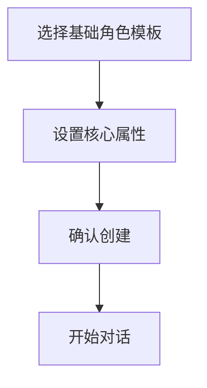

# 角色库系统设计

## 一、角色创建流程

### 1. 快速创建模式



- 基础模板:
  - 家人(父母/子女/配偶)
  - 同事(上级/平级/下级)
  - 朋友(密友/普通/泛泛)
  - 恋人(热恋/稳定/冷淡)

### 2. 详细定制模式

```
┌─────────角色属性定制────────┐
│                            │
│ 1. 基础信息               │
│    - 称谓关系             │
│    - 年龄段               │
│    - 性别                 │
│                           │
│ 2. 社交属性              │
│    - 关系远近             │
│    - 地位高低             │
│    - 正式程度             │
│                           │
│ 3. 性格特征              │
│    - 性格标签             │
│    - 说话风格             │
│    - 兴趣爱好             │
│                           │
│ 4. 互动历史              │
│    - 重要事件             │
│    - 敏感话题             │
│    - 共同记忆             │
└───────────────────────────┘
```

## 二、角色管理系统

### 1. 角色列表

- 分组展示
- 快速切换
- 批量管理
- 角色搜索

### 2. 角色详情

```
┌─────────角色卡片────────┐
│ 👤 张经理               │
│                        │
│ 关系: 直属上级         │
│ 风格: 严谨专业         │
│ 禁忌: 过于随意         │
│                        │
│ [编辑] [删除] [复制]   │
└────────────────────────┘
```

### 3. 智能提醒

- 特殊日期提醒
- 互动频率建议
- 关系维护提示

## 三、对话中的角色应用

### 1. 角色切换栏

```
┌────────当前对话对象───────┐
│ 👤 张经理  [切换▼]       │
│                          │
│ 最近话题: 项目进度       │
│ 情绪状态: 较为严肃       │
│ 建议风格: 专业简洁       │
└──────────────────────────┘
```

### 2. 智能适配

- 自动调整语气
- 选择合适敬语
- 避免禁忌话题

### 3. 连续性维护

- 记录对话历史
- 追踪情感变化
- 更新角色属性

## 四、角色学习系统

### 1. 自动学习

- 记录成功对话
- 总结有效策略
- 更新角色画像

### 2. 用户反馈

- 标记优质回复
- 收藏常用话术
- 提交改进建议

### 3. 角色进化

- 动态更新属性
- 优化回复策略
- 完善性格特征

## 五、实现建议

### 1. 首次使用

- 引导创建常用角色
- 提供快速模板
- 简化必填信息

### 2. 日常使用

- 一键切换角色
- 智能场景识别
- 快速调整属性

### 3. 高级功能

- 角色关系图谱
- 对话策略分析
- 个性化训练

这样的角色库系统优势:

1. 提供更精准的回复建议
2. 保持对话风格一致性
3. 降低使用门槛
4. 支持持续优化

建议:

1. 先实现基础角色系统
2. 逐步添加高级功能
3. 通过用户反馈优化
4. 保持界面简洁易用


