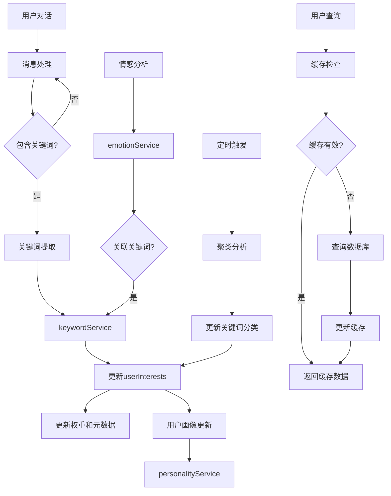

# userInterests 集合优化计划

## 一、当前状况分析

### 现有数据结构
根据 `docs\userInterests.json` 文件，当前 `userInterests` 集合的数据结构如下：

```json
{
    "_id": "5be31a7167ff950a014168d96f3da105",
    "userId": "olbpX7ArSuSuQo4wF2dwTmoyqbog",
    "lastUpdated": {
        "$date": "2025-04-20T05:45:10.791Z"
    },
    "keywords": [
        {
            "word": "目标",
            "weight": 1,
            "lastUpdated": {
                "$date": "2025-04-20T05:45:10.791Z"
            }
        },
        {
            "word": "未来",
            "weight": 1,
            "lastUpdated": {
                "$date": "2025-04-20T05:45:10.791Z"
            }
        },
        {
            "word": "复习",
            "weight": 1,
            "lastUpdated": {
                "$date": "2025-04-20T05:45:10.791Z"
            }
        },
        {
            "word": "考试",
            "weight": 1,
            "lastUpdated": {
                "$date": "2025-04-20T05:45:10.791Z"
            }
        }
    ],
    "createTime": {
        "$date": "2025-04-16T11:31:22.504Z"
    }
}
```

### 现有实现中的问题

1. **字段名称不一致**：
   - 云函数中使用 `user_id` 查询，但实际数据使用 `userId`
   - 云函数中尝试访问 `interests` 字段，但实际数据中是 `keywords` 字段
   - `keywords` 数组中使用 `word` 字段，而不是代码中预期的 `keyword`、`tag` 或 `value`

2. **数据处理不完善**：
   - 没有考虑关键词权重的动态调整机制
   - 没有关键词分类或标签系统
   - 没有考虑关键词的来源追踪

3. **查询效率问题**：
   - 可能没有为 `userId` 字段创建索引
   - 没有针对高频查询场景的优化

4. **功能重复问题**：
   - `analysis` 云函数中已有关键词提取功能
   - `roles` 和 `user` 云函数中的 `userPerception.js` 和 `userPerception_new.js` 有类似的用户画像生成功能
   - 多个模块独立实现相似功能，导致代码重复和维护困难

## 二、优化目标

1. **数据结构优化**：
   - 统一字段命名规范
   - 增强关键词数据结构
   - 添加必要的元数据

2. **功能增强**：
   - 实现关键词权重动态调整
   - 添加关键词分类系统
   - 实现关键词来源追踪
   - 添加关键词情感关联

3. **性能优化**：
   - 创建必要的数据库索引
   - 优化查询逻辑
   - 实现数据缓存机制

4. **代码质量提升**：
   - 重构云函数代码
   - 添加详细的错误处理
   - 完善日志记录

## 三、功能重复分析与解决方案

通过分析现有代码，发现在 `analysis` 云函数、`roles` 和 `user` 云函数中的 `userPerception.js` 和 `userPerception_new.js` 中存在功能重复。为了解决这个问题，我们提出以下解决方案。

### 1. 模块化重构方案

将现有的功能重构为以下模块：

1. **keywordService**: 统一的关键词服务
   - 从 `analysis` 云函数中提取关键词提取逻辑
   - 从 `userPerception_new.js` 中提取兴趣识别逻辑
   - 统一关键词存储和检索逻辑

2. **emotionService**: 统一的情感分析服务
   - 从 `analysis` 云函数中提取情感分析逻辑
   - 从 `userPerception_new.js` 中提取情感处理逻辑
   - 统一情感数据存储和检索逻辑

3. **personalityService**: 统一的用户画像服务
   - 整合 `userPerception.js` 和 `userPerception_new.js` 的功能
   - 使用事件驱动模式响应关键词和情感数据的变化
   - 提供统一的用户画像生成和查询API

### 2. 事件驱动架构

实现事件驱动的数据处理架构：

1. **数据收集事件**
   - `MessageCreated`: 用户发送新消息
   - `EmotionAnalyzed`: 完成情感分析
   - `UserInteracted`: 用户与角色交互

2. **处理流程**
   - 消息创建触发关键词提取
   - 关键词提取完成后更新 `userInterests`
   - 情感分析完成后更新关键词的情感关联
   - 定期触发关键词聚类分析

3. **数据流图**



## 四、具体优化方案

### 1. 数据结构优化

#### 1.1 新的数据结构设计

```json
{
    "_id": "自动生成的文档ID",
    "userId": "用户的openId",
    "lastUpdated": {
        "$date": "时间戳"
    },
    "keywords": [
        {
            "word": "关键词文本",
            "weight": 1.0,
            "category": "学习",
            "source": "chat",
            "emotionScore": 0.8,
            "firstSeen": {
                "$date": "首次出现时间"
            },
            "lastUpdated": {
                "$date": "最后更新时间"
            },
            "occurrences": 5
        }
    ],
    "categories": {
        "学习": 3,
        "工作": 2,
        "娱乐": 1
    },
    "createTime": {
        "$date": "创建时间"
    }
}
```

#### 1.2 字段说明

- **userId**: 用户的唯一标识符（openId）
- **lastUpdated**: 整个文档的最后更新时间
- **keywords**: 关键词数组
  - **word**: 关键词文本
  - **weight**: 关键词权重（0.0-1.0）
  - **category**: 关键词分类
  - **source**: 关键词来源（chat, emotion, manual）
  - **emotionScore**: 关联的情感分数（-1.0到1.0）
  - **firstSeen**: 首次发现时间
  - **lastUpdated**: 最后更新时间
  - **occurrences**: 出现次数
- **categories**: 分类统计
- **createTime**: 文档创建时间

### 2. 云函数代码优化

#### 2.1 修改 userPerception_new.js 中的查询代码

```javascript
// 查询用户兴趣数据
const userInterests = await db.collection('userInterests')
  .where({ userId: userId })
  .get();

console.log(`获取到用户兴趣数据: ${userInterests.data.length}条`);
```

#### 2.2 修改关键词处理代码

```javascript
// 处理用户兴趣数据
let interests = [];

if (userInterests.data && userInterests.data.length > 0) {
  // 处理keywords字段
  if (userInterests.data[0].keywords && Array.isArray(userInterests.data[0].keywords)) {
    interests = userInterests.data[0].keywords.map(item => {
      // 如果有word字段，使用word
      if (item.word) {
        return {
          tag: item.word,
          weight: item.weight || 1.0,
          category: item.category || '未分类',
          source: item.source || 'unknown'
        };
      }
      // 兼容其他可能的字段名
      else if (item.keyword || item.tag || item.value) {
        return {
          tag: item.keyword || item.tag || item.value,
          weight: item.weight || 1.0,
          category: item.category || '未分类',
          source: item.source || 'unknown'
        };
      }
      return null;
    }).filter(item => item !== null);
  }

  console.log('处理后的用户兴趣:', interests);
}
```

### 3. 新增功能实现

#### 3.1 关键词权重动态调整

创建一个新的云函数方法 `updateKeywordWeight`：

```javascript
/**
 * 更新关键词权重
 * @param {string} userId 用户ID
 * @param {string} keyword 关键词
 * @param {number} weightDelta 权重变化值
 * @returns {Promise<Object>} 处理结果
 */
async function updateKeywordWeight(userId, keyword, weightDelta) {
  try {
    const userInterestsRef = db.collection('userInterests');

    // 查找用户记录
    const userRecord = await userInterestsRef.where({ userId }).get();

    if (userRecord.data.length === 0) {
      // 用户记录不存在，创建新记录
      return await createUserInterestRecord(userId, keyword, weightDelta);
    }

    const record = userRecord.data[0];
    const keywords = record.keywords || [];

    // 查找关键词
    const keywordIndex = keywords.findIndex(k => k.word === keyword);

    if (keywordIndex >= 0) {
      // 关键词存在，更新权重
      const newWeight = Math.min(Math.max(keywords[keywordIndex].weight + weightDelta, 0.1), 2.0);

      // 更新数据库
      return await userInterestsRef.doc(record._id).update({
        data: {
          [`keywords.${keywordIndex}.weight`]: newWeight,
          [`keywords.${keywordIndex}.lastUpdated`]: new Date(),
          [`keywords.${keywordIndex}.occurrences`]: (keywords[keywordIndex].occurrences || 0) + 1,
          lastUpdated: new Date()
        }
      });
    } else {
      // 关键词不存在，添加新关键词
      return await userInterestsRef.doc(record._id).update({
        data: {
          keywords: db.command.push({
            word: keyword,
            weight: Math.max(1.0 + weightDelta, 0.1),
            category: '未分类',
            source: 'chat',
            emotionScore: 0,
            firstSeen: new Date(),
            lastUpdated: new Date(),
            occurrences: 1
          }),
          lastUpdated: new Date()
        }
      });
    }
  } catch (error) {
    console.error('更新关键词权重失败:', error);
    throw error;
  }
}
```

#### 3.2 关键词分类系统

创建一个新的云函数方法 `categorizeKeywords`：

```javascript
/**
 * 对关键词进行分类
 * @param {string} userId 用户ID
 * @returns {Promise<Object>} 处理结果
 */
async function categorizeKeywords(userId) {
  try {
    // 获取用户兴趣记录
    const userRecord = await db.collection('userInterests').where({ userId }).get();

    if (userRecord.data.length === 0) {
      return { success: false, message: '用户记录不存在' };
    }

    const record = userRecord.data[0];
    const keywords = record.keywords || [];

    if (keywords.length === 0) {
      return { success: true, message: '没有关键词需要分类' };
    }

    // 调用智谱AI进行分类
    const keywordTexts = keywords.map(k => k.word).join(', ');

    const result = await callZhipuAI({
      model: "glm-4-flash",
      messages: [
        {
          role: "system",
          content: "你是一个关键词分类专家，能够将关键词分类为学习、工作、娱乐、社交、健康等类别。"
        },
        {
          role: "user",
          content: `请将以下关键词分类，返回JSON格式：\n\n${keywordTexts}\n\n格式如下：
          {
            "分类结果": [
              {"keyword": "关键词1", "category": "分类1"},
              {"keyword": "关键词2", "category": "分类2"}
            ]
          }`
        }
      ],
      temperature: 0.3,
      response_format: { type: "json_object" }
    });

    // 解析分类结果
    const responseContent = result.choices[0].message.content;
    const categorization = JSON.parse(responseContent);

    // 更新数据库
    const updates = {};
    const categories = {};

    categorization.分类结果.forEach(item => {
      const keywordIndex = keywords.findIndex(k => k.word === item.keyword);
      if (keywordIndex >= 0) {
        updates[`keywords.${keywordIndex}.category`] = item.category;
        categories[item.category] = (categories[item.category] || 0) + 1;
      }
    });

    // 更新数据库
    await db.collection('userInterests').doc(record._id).update({
      data: {
        ...updates,
        categories,
        lastUpdated: new Date()
      }
    });

    return { success: true, message: '关键词分类完成', categories };
  } catch (error) {
    console.error('关键词分类失败:', error);
    return { success: false, error: error.message };
  }
}
```

### 4. 性能优化

#### 4.1 创建数据库索引

在云开发控制台中为 `userInterests` 集合创建以下索引：

1. `userId` 字段的单字段索引
2. `userId` 和 `lastUpdated` 的复合索引

#### 4.2 实现数据缓存机制

在前端添加缓存服务：

```javascript
// services/userInterestsService.js

const CACHE_KEY = 'user_interests_cache';
const CACHE_EXPIRY = 30 * 60 * 1000; // 30分钟

/**
 * 获取用户兴趣数据
 * @param {string} userId 用户ID
 * @param {boolean} forceRefresh 是否强制刷新
 * @returns {Promise<Object>} 用户兴趣数据
 */
async function getUserInterests(userId, forceRefresh = false) {
  // 检查缓存
  if (!forceRefresh) {
    const cachedData = getCachedInterests(userId);
    if (cachedData) {
      console.log('使用缓存的用户兴趣数据');
      return cachedData;
    }
  }

  // 调用云函数
  try {
    const result = await wx.cloud.callFunction({
      name: 'user',
      data: {
        action: 'getUserInterests',
        userId
      }
    });

    if (result.result && result.result.success) {
      // 更新缓存
      cacheInterests(userId, result.result.data);
      return result.result.data;
    } else {
      console.warn('获取用户兴趣数据失败:', result);
      return null;
    }
  } catch (error) {
    console.error('调用获取用户兴趣云函数失败:', error);
    return null;
  }
}

/**
 * 获取缓存的兴趣数据
 * @param {string} userId 用户ID
 * @returns {Object|null} 缓存的数据或null
 */
function getCachedInterests(userId) {
  const cacheString = wx.getStorageSync(CACHE_KEY);
  if (!cacheString) return null;

  try {
    const cache = JSON.parse(cacheString);

    // 检查是否是当前用户的缓存
    if (cache.userId !== userId) return null;

    // 检查缓存是否过期
    const now = Date.now();
    if (now - cache.timestamp > CACHE_EXPIRY) return null;

    return cache.data;
  } catch (e) {
    console.error('解析缓存数据失败:', e);
    return null;
  }
}

/**
 * 缓存兴趣数据
 * @param {string} userId 用户ID
 * @param {Object} data 要缓存的数据
 */
function cacheInterests(userId, data) {
  const cacheData = {
    userId,
    timestamp: Date.now(),
    data
  };

  wx.setStorageSync(CACHE_KEY, JSON.stringify(cacheData));
}

/**
 * 清除兴趣数据缓存
 */
function clearInterestsCache() {
  wx.removeStorageSync(CACHE_KEY);
}

module.exports = {
  getUserInterests,
  clearInterestsCache
};
```

## 五、实施计划

### 阶段一：模块化重构（2-3天）

1. **分析现有代码和功能**
   - 详细分析 `analysis`、`roles` 和 `user` 云函数中的重复功能
   - 绘制现有功能的依赖关系图
   - 确定需要提取的公共功能

2. **创建核心服务模块**
   - 实现 `keywordService.js` 关键词服务
   - 实现 `emotionService.js` 情感分析服务
   - 实现 `personalityService.js` 用户画像服务

3. **设计事件驱动架构**
   - 实现事件总线机制
   - 定义标准事件格式
   - 实现事件处理器

### 阶段二：数据结构调整（1-2天）

1. **备份现有数据**
   - 导出 `userInterests` 集合的所有数据
   - 保存备份到安全位置

2. **更新数据结构**
   - 根据新设计更新 `userInterests` 集合结构
   - 实现数据迁移脚本
   - 创建必要的数据库索引

3. **更新云函数代码**
   - 修改云函数代码以使用新的服务模块
   - 确保兼容现有数据结构
   - 添加详细的错误处理和日志记录

### 阶段三：功能增强（2-3天）

1. **实现关键词提取和处理**
   - 实现关键词提取算法
   - 实现关键词权重动态调整
   - 实现关键词时间衰减机制

2. **实现关键词分类系统**
   - 实现关键词聚类分析
   - 实现基于智谱AI的关键词分类
   - 创建定时触发器，定期对新关键词进行分类

3. **实现关键词情感关联**
   - 修改情绪分析逻辑，关联情绪和关键词
   - 更新关键词的情感分数
   - 实现情感-关键词分析报告

### 阶段四：前端集成（1-2天）

1. **创建统一的前端服务**
   - 实现 `userInterestsService.js` 前端服务
   - 实现 `emotionService.js` 前端服务
   - 实现 `personalityService.js` 前端服务
   - 添加缓存机制

2. **更新用户页面**
   - 集成用户兴趣展示
   - 添加手动编辑兴趣的功能
   - 实现兴趣标签云展示

3. **更新聊天页面**
   - 在对话中集成兴趣识别
   - 实现基于兴趣的智能提示
   - 添加实时关键词高亮

### 阶段五：测试和优化（1-2天）

1. **功能测试**
   - 测试所有新增功能
   - 验证数据一致性
   - 测试事件驱动机制

2. **性能测试**
   - 测试大数据量下的性能
   - 优化查询逻辑
   - 测试缓存效率

3. **用户体验优化**
   - 完善错误处理
   - 添加加载状态指示
   - 收集用户反馈并进行调整

## 六、预期成果

1. **更丰富的用户画像**
   - 精确的用户兴趣标签
   - 带有权重和分类的关键词系统

2. **更个性化的用户体验**
   - 基于兴趣的角色推荐
   - 更准确的对话理解

3. **更高效的系统性能**
   - 减少数据库查询次数
   - 提高响应速度

4. **更可维护的代码**
   - 统一的数据结构
   - 清晰的功能模块

## 七、风险和缓解措施

1. **数据迁移风险**
   - **风险**：现有数据结构变更可能导致数据丢失
   - **缓解**：备份所有数据，实现兼容性处理逻辑

2. **API调用限制**
   - **风险**：智谱AI API可能有调用频率限制
   - **缓解**：实现请求队列和重试机制

3. **性能问题**
   - **风险**：大量关键词可能导致性能下降
   - **缓解**：实现分页查询和缓存机制

4. **用户隐私问题**
   - **风险**：收集用户兴趣可能涉及隐私问题
   - **缓解**：明确隐私政策，允许用户控制数据收集

## 八、后续发展方向

1. **兴趣推荐系统**
   - 基于用户兴趣推荐角色和话题
   - 实现兴趣相似用户的匹配

2. **兴趣变化追踪**
   - 分析用户兴趣随时间的变化
   - 生成兴趣变化报告

3. **多模态兴趣识别**
   - 从图片和语音中识别兴趣
   - 整合多种数据源的兴趣信息

4. **兴趣社区功能**
   - 基于共同兴趣创建用户社区
   - 实现兴趣话题的讨论功能
